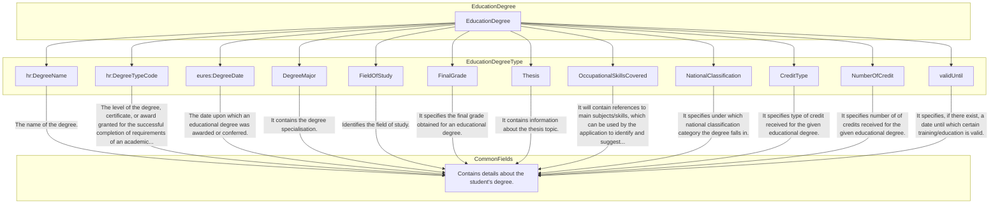

## Page 54

3.11.4 Sub-element:
/CandidateProfile/EducationHistory/EducationOrganizationAttendance/EducationDegree (level 4)

3.11.4.1 EducationDegree Element Description



<footer>DG EMPL 2020</footer>&lt;page_number&gt;Page 54 of 160&lt;/page_number&gt;

---


## Page 55

html
<table>
  <thead>
    <tr>
      <th>Element</th>
      <th>Description</th>
      <th>Cardinality</th>
      <th>Rule</th>
      <th>Examples</th>
    </tr>
  </thead>
  <tbody>
    <tr>
      <td><strong>EducationDegree</strong></td>
      <td>Contains details about the student's degree</td>
      <td>0..1</td>
      <td>N/A</td>
      <td>N/A</td>
    </tr>
    <tr>
      <td colspan="5"><strong>Sub-elements</strong></td>
    </tr>
    <tr>
      <td><strong>DegreeName</strong></td>
      <td>Narrative details of the degree awarded</td>
      <td>1</td>
      <td>N/A</td>
      <td>"B.B.A.", "PhD", etc.</td>
    </tr>
    <tr>
      <td><strong>DegreeTypeCode</strong></td>
      <td>The certificate obtained with the degree, or award granted for the successful completion of requirements of an academic program</td>
      <td>0..1</td>
      <td>BR-COM-17: Compulsory use of the "EURES_DegreeType-CodeList.gc" list defined by EURES. This is based on ESCO Qualifications – version 1.0</td>
      <td>HR-Open/EURES: DegreeType [CL10]</td>
    </tr>
    <tr>
      <td><strong>DegreeDate</strong></td>
      <td>The date in which an educational degree is awarded or conferred</td>
      <td>0..1</td>
      <td>BR-COM-16: At least one of its sub-elements must be provided.</td>
      <td>N/A</td>
    </tr>
    <tr>
      <td></td>
      <td colspan="4">See section /CandidateProfile/EducationHistory/EducationOrganizationAttendance/EducationDegree/DegreeDate for more information</td>
    </tr>
    <tr>
      <td><strong>DegreeMajor</strong></td>
      <td>The degree of specialisation</td>
      <td>0..n</td>
      <td>N/A</td>
      <td>N/A</td>
    </tr>
    <tr>
      <td></td>
      <td colspan="4">See section /CandidateProfile/EducationHistory/EducationOrganizationAttendance/EducationDegree/DegreeMajor for more information</td>
    </tr>
    <tr>
      <td><strong>FieldOfStudy</strong></td>
      <td>Identifies the field of study</td>
      <td>0..n</td>
      <td>isced-f (top level) controlled list/String,</td>
      <td>N/A</td>
    </tr>
    <tr>
      <td></td>
      <td colspan="4">See section /CandidateProfile/EducationHistory/EducationOrganizationAttendance/EducationDegree/FieldOfStudy for more information</td>
    </tr>
    <tr>
      <td><strong>FinalGrade</strong></td>
      <td>Specifies the final grade obtained for an educational degree</td>
      <td>0..1</td>
      <td></td>
      <td></td>
    </tr>
    <tr>
      <td></td>
      <td colspan="4">Same as /CandidateProfile/PersonQualifications/PersonCompetency/ProficiencyLevel</td>
    </tr>
    <tr>
      <td><strong>Thesis</strong></td>
      <td>Information about the thesis topic</td>
      <td>0..1</td>
      <td></td>
      <td></td>
    </tr>
    <tr>
      <td><strong>OccupationalSkillsCovered</strong></td>
      <td>It will contain references to skills, which can be used by the application to identify and suggest relevant ESCO skills.</td>
      <td>0..1</td>
      <td></td>
      <td></td>
    </tr>
    <tr>
      <td><strong>NationalClassification</strong></td>
      <td>It specifies under which category the degree falls in</td>
      <td>0..1</td>
      <td></td>
      <td></td>
    </tr>
    <tr>
      <td><strong>CreditType</strong></td>
      <td>It specifies type of credit received for the given educational degree.</td>
      <td>0..1</td>
      <td></td>
      <td></td>
    </tr>
    <tr>
      <td><strong>NumberOfCredit</strong></td>
      <td>It specifies number of credits received for the given educational degree.</td>
      <td>0..1</td>
      <td></td>
      <td></td>
    </tr>
    <tr>
      <td><strong>validUnti</strong></td>
      <td>It specifies, if there eist, a date until which certain training/education is valid.</td>
      <td>0..1</td>
      <td></td>
      <td></td>
    </tr>
    <tr>
      <td></td>
      <td colspan="4">Sub-elements of validUntil is same as DegreeDate. See section /CandidateProfile/EducationHistory/EducationOrganizationAttendance/EducationDegree/DegreeDate for more information</td>
    </tr>
  </tbody>
</table>
```

3.11.4.2 *EducationDegree Attributes*

<table>
  <thead>
    <tr>
      <th>Attributes</th>
      <th>Description</th>
      <th>Card.</th>
      <th>Rule</th>
    </tr>
  </thead>
  <tbody>
    <tr>
      <td>This element has no attributes.</td>
      <td></td>
      <td></td>
      <td></td>
    </tr>
    <tr>
      <td colspan="4"><strong>DegreeName attributes</strong></td>
    </tr>
    <tr>
      <td><strong>Attributes</strong></td>
      <td><strong>Description</strong></td>
      <td><strong>Card.</strong></td>
      <td><strong>Rule</strong></td>
    </tr>
  </tbody>
</table>

DG EMPL 2020
&lt;page_number&gt;Page 55 of 160&lt;/page_number&gt;

---


