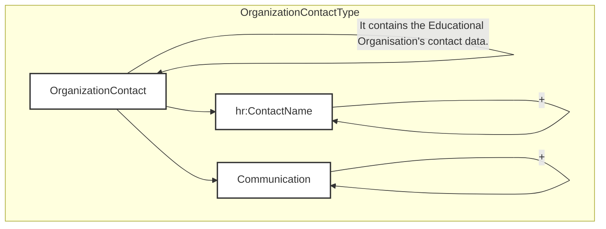
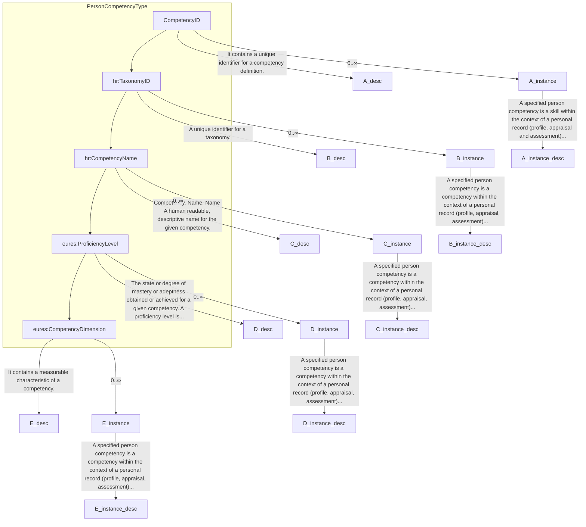
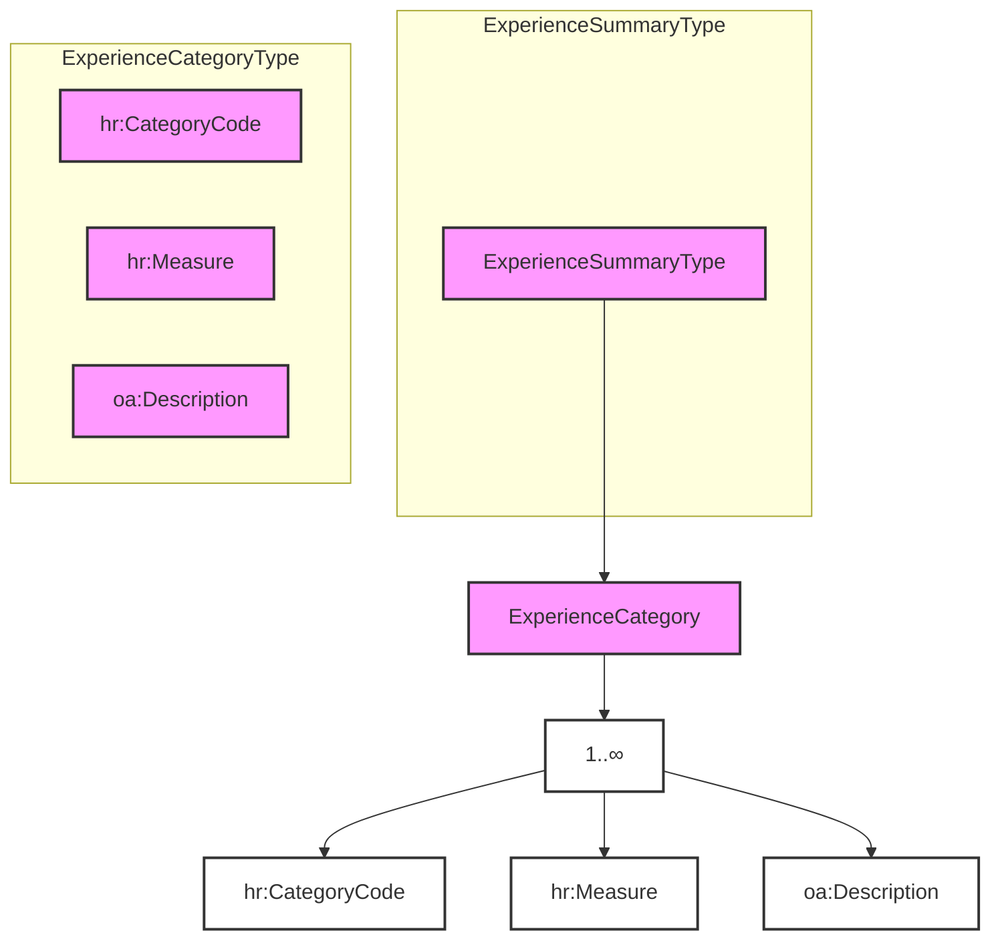
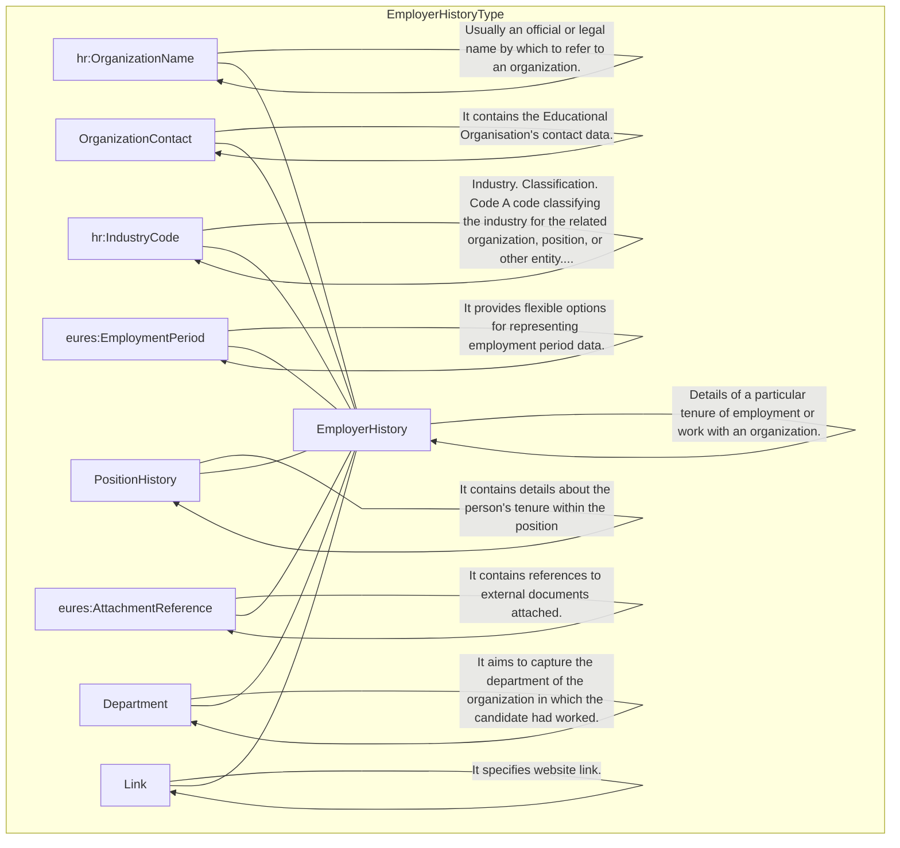

## Page 60

```mermaid
erDiagram
    eures|FreeFormDateTime || hr.FreeFormDateTime (restriction base)
    eures.FreeFormDateTime || FormattedDateTime
    eures.FreeFormDateTime || DateText
```

<table>
  <tr>
    <td><b>Ongoing</b></td>
    <td>It indicates if the attendance period is still ongoing and hence has no end date.</td>
    <td>0..1</td>
    <td></td>
    <td></td>
  </tr>
</table>

3.11.8.2 AttendancePeriod Attributes

<table>
  <thead>
    <tr>
      <th>Attributes</th>
      <th>Description</th>
      <th>Card.</th>
      <th>Rule</th>
    </tr>
  </thead>
  <tbody>
    <tr>
      <td colspan="4">This element has no attributes.</td>
    </tr>
    <tr>
      <td colspan="4"><b>Description attributes</b></td>
    </tr>
    <tr>
      <td><b>Attributes</b></td>
      <td><b>Description</b></td>
      <td><b>Card.</b></td>
      <td><b>Rule</b></td>
    </tr>
    <tr>
      <td colspan="4">Refer to DescriptionType attributes section for additional attributes.</td>
    </tr>
    <tr>
      <td colspan="4"><b>EndDate attributes</b></td>
    </tr>
    <tr>
      <td><b>Attributes</b></td>
      <td><b>Description</b></td>
      <td><b>Card.</b></td>
      <td><b>Rule</b></td>
    </tr>
    <tr>
      <td colspan="4">See section /CandidateProfile/EducationHistory/EducationOrganizationAttendance/AttendancePeriod/EndDate for more information</td>
    </tr>
    <tr>
      <td colspan="4"><b>StartDate attributes</b></td>
    </tr>
    <tr>
      <td><b>Attributes</b></td>
      <td><b>Description</b></td>
      <td><b>Card.</b></td>
      <td><b>Rule</b></td>
    </tr>
    <tr>
      <td colspan="4">See section /CandidateProfile/EducationHistory/EducationOrganizationAttendance/AttendancePeriod/StartDate for more information</td>
    </tr>
    <tr>
      <td colspan="4"><b>Ongoing attributes</b></td>
    </tr>
    <tr>
      <td><b>Attributes</b></td>
      <td><b>Description</b></td>
      <td><b>Card.</b></td>
      <td><b>Rule</b></td>
    </tr>
    <tr>
      <td colspan="4">It has no attributes.</td>
    </tr>
  </tbody>
</table>

3.11.9 Sub-element:
/CandidateProfile/EducationHistory/EducationOrganizationAttendance/AttendancePeriod/StartDate (level 5)

3.11.9.1 StartDate Element Description

<table>
  <thead>
    <tr>
      <th>Element</th>
      <th>Description</th>
      <th>Cardinality</th>
      <th>Rule</th>
      <th>Examples</th>
    </tr>
  </thead>
  <tbody>
    <tr>
      <td><b>StartDate</b></td>
      <td>A timestamp marking the beginning of the attendance period</td>
      <td>0..1</td>
      <td>BR-COM-16: At least one of its sub-elements must be provided.</td>
      <td>N/A</td>
    </tr>
    <tr>
      <td colspan="5"><b>Sub-elements</b></td>
    </tr>
    <tr>
      <td><b>FormattedDateTime</b></td>
      <td>A formatted representation of a date, which may be specified as a date, date/time, year, or year/month</td>
      <td>0..1</td>
      <td>BR-COM-06: Compulsory Date Format is: YYYY-MM-DD, YYYY-MM, YYYY or YYYY-MM-DDThh:mm:ss.</td>
      <td>"2009-01-04", "2009-01", etc.</td>
    </tr>
    <tr>
      <td><b>DateText</b></td>
      <td>A text or formatted representation of a date or date information</td>
      <td>0..1</td>
      <td>N/A</td>
      <td>"January 4, 2009" or "Two Years Ago"</td>
    </tr>
  </tbody>
</table>

DG EMPL 2020
&lt;page_number&gt;Page 60 of 160&lt;/page_number&gt;

---


## Page 61

3.11.9.2 *StartDate Attributes*

<table>
<thead>
<tr>
<th>Attributes</th>
<th>Description</th>
<th>Card.</th>
<th>Rule</th>
</tr>
</thead>
<tbody>
<tr>
<td>This element has no attributes.</td>
<td></td>
<td></td>
<td></td>
</tr>
</tbody>
</table>

**DateText attributes**

<table>
<thead>
<tr>
<th>Attributes</th>
<th>Description</th>
<th>Card.</th>
<th>Rule</th>
</tr>
</thead>
<tbody>
<tr>
<td>Refer to DateText Attributes section for additional attributes.</td>
<td></td>
<td></td>
<td></td>
</tr>
</tbody>
</table>

**FormattedDateTime attributes**

<table>
<thead>
<tr>
<th>Attributes</th>
<th>Description</th>
<th>Card.</th>
<th>Rule</th>
</tr>
</thead>
<tbody>
<tr>
<td>This sub-element has no attributes.</td>
<td></td>
<td></td>
<td></td>
</tr>
</tbody>
</table>

3.11.10 Sub-element:
/CandidateProfile/EducationHistory/EducationOrganizationAttendance/AttendancePeriod/EndDate (level 5)

3.11.10.1 *EndDate Element Description*

```mermaid
graph TD
    A[eures:FreeFormDataType] --> B(hr:FreeFormDateTime(restriction base))
    B --> C[FormattedDateTime]
    B --> D[DateText]
    C --> E[EndDate]
    D --> F[hr:FormattedDateTime]
    F --> G[hr:DateText]
    subgraph "FreeForm Date. Details Provides FreeForm options for representing date information. Recruiting, employment screening,..."
        C
        D
    end
    subgraph "FreeForm Date. Details Provides FreeForm options for representing date information. Recruiting, employment screening,..."
        F
        G
    end
```

<table>
<thead>
<tr>
<th>Element</th>
<th>Description</th>
<th>Cardinality</th>
<th>Rule</th>
<th>Examples</th>
</tr>
</thead>
<tbody>
<tr>
<td>EndDate</td>
<td>A timestamp marking the end of the attendance period</td>
<td>0..1</td>
<td>BR-COM-06: Compulsory Date Format is: YYYY-MM-DD, YYYY-MM, YYYY or YYYY-MM-DDThh:mm:ss.</td>
<td>N/A</td>
</tr>
</tbody>
</table>

**Sub-elements**

The same as /CandidateProfile/EducationHistory/ EducationOrganizationAttendance/AttendancePeriod/StartDate

3.11.10.2 *EndDate Attributes*

<table>
<thead>
<tr>
<th>Attributes</th>
<th>Description</th>
<th>Card.</th>
<th>Rule</th>
</tr>
</thead>
<tbody>
<tr>
<td>The same as /CandidateProfile/EducationHistory/ EducationOrganizationAttendance/AttendancePeriod/StartDate</td>
<td></td>
<td></td>
<td></td>
</tr>
</tbody>
</table>

DG EMPL 2020
&lt;page_number&gt;Page 61 of 160&lt;/page_number&gt;

---


## Page 62

3.11.11 Sub-element:
/CandidateProfile/EducationHistory/EducationOrganizationAttendance/OrganizationContact
(level 4)

3.11.11.1 OrganizationContact Element Description



<table>
<thead>
<tr>
<th>Element</th>
<th>Description</th>
<th>Cardinality</th>
<th>Rule</th>
<th>Examples</th>
</tr>
</thead>
<tbody>
<tr>
<td><strong>OrganizationContact</strong></td>
<td>An Organisation's contact information</td>
<td>0..n</td>
<td>N/A</td>
<td>N/A</td>
</tr>
<tr>
<td colspan="5"><strong>Sub-elements</strong></td>
</tr>
<tr>
<td colspan="5">The same as /CandidateProfile/EmploymentHistory/EmployerHistory/OrganizationContact</td>
</tr>
</tbody>
</table>

3.11.11.2 OrganizationContact Attributes

<table>
<thead>
<tr>
<th>Attributes</th>
<th>Description</th>
<th>Card.</th>
<th>Rule</th>
</tr>
</thead>
<tbody>
<tr>
<td>The same as /CandidateProfile/EmploymentHistory/EmployerHistory/OrganizationContact</td>
<td></td>
<td></td>
<td></td>
</tr>
</tbody>
</table>

3.12 /CandidateProfile/PersonQualifications (level 2)

3.12.1 PersonQualifications Element Description

```mermaid
graph TD
    subgraph PersonQualificationsType
        A[PersonQualifications] --> B[hr:QualificationsSummary]
        A --> C[PersonCompetency]
    end
    A -- "0..∞" --> A
    B -- "+" --> B
    C -- "+" --> C
    style A fill:#fff,stroke:#333,stroke-width:2px,color:#333
    style B fill:#fff,stroke:#333,stroke-width:2px,color:#333
    style C fill:#fff,stroke:#333,stroke-width:2px,color:#333
    A -- "History of a Person's Qualifications" --> A
    B -- "In the context of resumes, a \"qualifications summary\" is a paragraph or listing intended \"showcase\" a candidate's most..." --> B
    C -- "A specified person competency is a skill within the context of a personal record (profile, appraisal and assessment)..." --> C
    A -- "Used in the context of recruiting and staffing as a container of information related to matching knowledge, skills,..." --> A
```

<footer>DG EMPL 2020</footer>
&lt;page_number&gt;Page 62 of 160&lt;/page_number&gt;

---


## Page 63

html
<table>
  <thead>
    <tr>
      <th>Element</th>
      <th>Description</th>
      <th>Cardinality</th>
      <th>Rule</th>
      <th>Examples</th>
    </tr>
  </thead>
  <tbody>
    <tr>
      <td>PersonQualifications</td>
      <td>Information related to matching capacities, knowledge, skills, abilities, awards and other resource deployment-related characteristics (including “competencies”) offered by a candidate</td>
      <td>0..1</td>
      <td>N/A</td>
      <td>N/A</td>
    </tr>
    <tr>
      <td colspan="5"><b>Sub-elements</b></td>
    </tr>
    <tr>
      <td>QualificationsSummary</td>
      <td>In the context of resumes, a "qualifications summary" is a paragraph or listing to "showcase" a candidate's most compelling skills and experience. In this context, the "qualifications summary" may be persuasive or have self-marketing content versus a "formal recognition of achievement or competence". In other words, use of term "qualifications" sometimes encompasses both qualifications asserted or claimed as well as those that have been formally recognised by an "awarding organisation." It is used in the context of recruiting and staffing as a container of information related to matching knowledge, skills, abilities, and other resource deployment-related characteristics (including "competencies") offered by a candidate and/or requested by a potential employer or customer.</td>
      <td>0..1</td>
      <td>N/A</td>
      <td>N/A</td>
    </tr>
    <tr>
      <td>Person Competency</td>
      <td>A specified person competency is a skill within the context of a personal record (profile, appraisal and assessment) that is assessed or asserted at a specified level of proficiency.</td>
      <td>0..n</td>
      <td></td>
      <td>N/A</td>
    </tr>
  </tbody>
</table>

See section /CandidateProfile/PersonQualifications/PersonCompetency for more information
```

3.12.2 PersonQualifications Attributes

&lt;img&gt;Diagram showing PersonQualificationsType with attributes @Attributes, hr:EffectiveDateAttributeGroup, @validFrom, @validTo. A note explains HR-XML's 3.0 architecture makes a distinction between effective-date meta data and effective dating that is an integral part of the model. Another note states it is used in the context of recruiting and staffing as a container of information related to matching knowledge, skills,...&lt;/img&gt;

<table>
  <thead>
    <tr>
      <th>Attributes</th>
      <th>Description</th>
      <th>Card.</th>
      <th>Rule</th>
    </tr>
  </thead>
  <tbody>
    <tr>
      <td>validFrom</td>
      <td>Validity start date for this entity's information</td>
      <td>0..1</td>
      <td>BR-COM-06: Compulsory Date Format is: YYYY-MM-DD, YYYY-MM, YYYY or YYYY-MM-DDThh:mm:ss.</td>
    </tr>
    <tr>
      <td>validTo</td>
      <td>Validity end date for this entity's information</td>
      <td>0..1</td>
      <td>BR-COM-06: Compulsory Date Format is: YYYY-MM-DD, YYYY-MM, YYYY or YYYY-MM-DDThh:mm:ss.</td>
    </tr>
  </tbody>
</table>

QualificationsSummary attributes

<table>
  <thead>
    <tr>
      <th>Attributes</th>
      <th>Description</th>
      <th>Card.</th>
      <th>Rule</th>
    </tr>
  </thead>
  <tbody>
    <tr>
      <td colspan="4">This sub-element has no attributes.</td>
    </tr>
  </tbody>
</table>

PersonCompetency attributes

<table>
  <thead>
    <tr>
      <th>Attributes</th>
      <th>Description</th>
      <th>Card.</th>
      <th>Rule</th>
    </tr>
  </thead>
  <tbody>
    <tr>
      <td colspan="4"></td>
    </tr>
  </tbody>
</table>

DG EMPL 2020
&lt;page_number&gt;Page 63 of 160&lt;/page_number&gt;

---


## Page 64

See section /CandidateProfile/PersonQualifications/PersonCompetency for more information

3.12.3 Sub-element: /CandidateProfile/PersonQualifications/PersonCompetency (level 3)

3.12.3.1 PersonCompetency Element Description



<table>
<thead>
<tr>
<th>Element</th>
<th>Description</th>
<th>Cardinality</th>
<th>Rule</th>
<th>Examples</th>
</tr>
</thead>
<tbody>
<tr>
<td><strong>PersonCompetency</strong></td>
<td>A specified person competency is a skill within the context of a personal record (profile, appraisal and assessment) that is assessed or asserted at specified level of proficiency.</td>
<td>0..n</td>
<td>N/A</td>
<td>N/A</td>
</tr>
<tr>
<td colspan="5"><strong>Sub-elements</strong></td>
</tr>
<tr>
<td><strong>CompetencyID</strong></td>
<td>Unique identifier for a skill or competency that depends on the taxonomy used, in this case CEFR.<br>Taxonomy information is included in the ID attributes<br>“EN”, “FR”, etc.<br>Full code list: “4.28.17 Language Codes [CL24]”<br><br>If Taxonomy information isn't language,<br>text field to be used.<br>“Aircraft Assembly”, “Aircraft Electronics”,<br>etc.</td>
<td>1</td>
<td>Use of ECV06-Languages, if<br>TaxonomyID’s value is<br>“language”. Or<br>NormalizedStringType if<br>TaxonomyID’s value is<br>“other”.</td>
<td>Full code list:<br>Europass2:<br>Languages<br>[ECV06]</td>
</tr>
<tr>
<td><strong>TaxonomyID</strong></td>
<td>Unique identifier for the type of competency.</td>
<td>1</td>
<td>BR-COM-54: TaxonomyID’s value should be “language” if the CompetencyID is a language or “other”, in the other competencies</td>
<td>“language”,<br>“other”</td>
</tr>
<tr>
<td><strong>CompetencyName</strong></td>
<td>A legible, descriptive name for a given competency</td>
<td>0..1</td>
<td>N/A</td>
<td>“English-<br>Language”,<br>“Social skills”,<br>etc.</td>
</tr>
<tr>
<td><strong>ProficiencyLevel</strong></td>
<td>The state or degree of mastery or adeptness obtained or achieved for a given competency. Proficiency levels are expressed as a score, a point scale, or a</td>
<td>0..1</td>
<td>BR-COM-449: If<br>“CompetencyDimension /<br>TypeCode” is specified,</td>
<td>N/A</td>
</tr>
</tbody>
</table>

DG EMPL 2020
&lt;page_number&gt;Page 64 of 160&lt;/page_number&gt;

---


## Page 65

```mermaid
erDiagram
    eures:ProficiencyLevel ||--o{ BaseScoreType : "The state or degree of mastery or adeptness obtained or achieved for a given competency. A proficiency level is..."
    BaseScoreType ||--|{ ScoreNumeric : " "
    BaseScoreType ||--|{ hr:ScoreText : " "
```

mark in a range of values. (In case of CompetencyID=CEFR, ProficiencyLevel could be: “Basic user”, “Independent User” or “Proficient User”.)
See section /Candidate/PersonQualifications/PersonCompetency/ProficiencyLevel for more information

“ProficiencyLevel” is mandatory.

See section /Candidate/PersonQualifications/PersonCompetency/CompetencyDimension for more information

<table>
  <thead>
    <tr>
      <th>Attributes</th>
      <th>Description</th>
      <th>Card.</th>
      <th>Rule</th>
    </tr>
  </thead>
  <tbody>
    <tr>
      <td colspan="4"><b>CompetencyDimension attributes</b></td>
    </tr>
    <tr>
      <td>Attributes</td>
      <td>Description</td>
      <td>Card.</td>
      <td>Rule</td>
    </tr>
    <tr>
      <td>validFrom</td>
      <td>Validity start date for this entity’s information</td>
      <td>0..1</td>
      <td>BR-COM-06: Compulsory Date Format is: YYYY-MM-DD, YYYY-MM, YYYY or YYYY-MM-DDThh:mm:ss.</td>
    </tr>
    <tr>
      <td>validTo</td>
      <td>Validity end date for this entity’s information</td>
      <td>0..1</td>
      <td>BR-COM-06: Compulsory Date Format is: YYYY-MM-DD, YYYY-MM, YYYY or YYYY-MM-DDThh:mm:ss.</td>
    </tr>
    <tr>
      <td colspan="4">Refer to IdentifierType Attributes section for additional attributes.</td>
    </tr>
    <tr>
      <td colspan="4"><b>TaxonomyID attributes</b></td>
    </tr>
    <tr>
      <td>Attributes</td>
      <td>Description</td>
      <td>Card.</td>
      <td>Rule</td>
    </tr>
    <tr>
      <td colspan="4">Refer to IdentifierType Attributes section for additional attributes.</td>
    </tr>
    <tr>
      <td colspan="4"><b>CompetencyName attributes</b></td>
    </tr>
    <tr>
      <td>Attributes</td>
      <td>Description</td>
      <td>Card.</td>
      <td>Rule</td>
    </tr>
    <tr>
      <td colspan="4">Refer to TextType Attributes section for additional attributes.</td>
    </tr>
    <tr>
      <td colspan="4"><b>ProficiencyLevel attributes</b></td>
    </tr>
    <tr>
      <td colspan="4">See section /Candidate/PersonQualifications/PersonCompetency/ProficiencyLevel for more information</td>
    </tr>
    <tr>
      <td colspan="4"><b>CompetencyDimension attributes</b></td>
    </tr>
    <tr>
      <td>Attributes</td>
      <td>Description</td>
      <td>Card.</td>
      <td>Rule</td>
    </tr>
    <tr>
      <td colspan="4">See section /Candidate/PersonQualifications/PersonCompetency/CompetencyDimension for more information</td>
    </tr>
  </tbody>
</table>

3.12.3.2 PersonCompetency Attributes

<table>
  <thead>
    <tr>
      <th>Attributes</th>
      <th>Description</th>
      <th>Card.</th>
      <th>Rule</th>
    </tr>
  </thead>
  <tbody>
    <tr>
      <td colspan="4">This element has no attributes.</td>
    </tr>
    <tr>
      <td colspan="4"><b>CompetencyID attributes</b></td>
    </tr>
    <tr>
      <td>Attributes</td>
      <td>Description</td>
      <td>Card.</td>
      <td>Rule</td>
    </tr>
    <tr>
      <td>validFrom</td>
      <td>Validity start date for this entity’s information</td>
      <td>0..1</td>
      <td>BR-COM-06: Compulsory Date Format is: YYYY-MM-DD, YYYY-MM, YYYY or YYYY-MM-DDThh:mm:ss.</td>
    </tr>
    <tr>
      <td>validTo</td>
      <td>Validity end date for this entity’s information</td>
      <td>0..1</td>
      <td>BR-COM-06: Compulsory Date Format is: YYYY-MM-DD, YYYY-MM, YYYY or YYYY-MM-DDThh:mm:ss.</td>
    </tr>
    <tr>
      <td colspan="4">Refer to IdentifierType Attributes section for additional attributes.</td>
    </tr>
    <tr>
      <td colspan="4"><b>TaxonomyID attributes</b></td>
    </tr>
    <tr>
      <td>Attributes</td>
      <td>Description</td>
      <td>Card.</td>
      <td>Rule</td>
    </tr>
    <tr>
      <td colspan="4">Refer to IdentifierType Attributes section for additional attributes.</td>
    </tr>
    <tr>
      <td colspan="4"><b>CompetencyName attributes</b></td>
    </tr>
    <tr>
      <td>Attributes</td>
      <td>Description</td>
      <td>Card.</td>
      <td>Rule</td>
    </tr>
    <tr>
      <td colspan="4">Refer to TextType Attributes section for additional attributes.</td>
    </tr>
    <tr>
      <td colspan="4"><b>ProficiencyLevel attributes</b></td>
    </tr>
    <tr>
      <td colspan="4">See section /Candidate/PersonQualifications/PersonCompetency/ProficiencyLevel for more information</td>
    </tr>
    <tr>
      <td colspan="4"><b>CompetencyDimension attributes</b></td>
    </tr>
    <tr>
      <td>Attributes</td>
      <td>Description</td>
      <td>Card.</td>
      <td>Rule</td>
    </tr>
    <tr>
      <td colspan="4">See section /Candidate/PersonQualifications/PersonCompetency/CompetencyDimension for more information</td>
    </tr>
  </tbody>
</table>

3.12.4 Sub-element: /CandidateProfile/PersonQualifications/PersonCompetency/ProficiencyLevel (level 4)

3.12.4.1 ProficiencyLevel Element Description

DG EMPL 2020
&lt;page_number&gt;Page 65 of 160&lt;/page_number&gt;

---


## Page 66

html
<table>
  <thead>
    <tr>
      <th>Element</th>
      <th>Description</th>
      <th>Cardinality</th>
      <th>Rule</th>
      <th>Examples</th>
    </tr>
  </thead>
  <tbody>
    <tr>
      <td><strong>ProficiencyLevel</strong></td>
      <td>The state or degree of mastery or adeptness obtained or achieved for a given competency. A proficiency level is expressed as a score a point scale or a mark among range of values.</td>
      <td>0..1</td>
      <td><strong>BR-COM-49:</strong> If "CompetencyDimension / TypeCode" is specified, "ProficiencyLevel" is mandatory.</td>
      <td>N/A</td>
    </tr>
  </tbody>
</table>

Sub-elements

<table>
  <thead>
    <tr>
      <th>Element</th>
      <th>Description</th>
      <th>Cardinality</th>
      <th>Rule</th>
      <th>Examples</th>
    </tr>
  </thead>
  <tbody>
    <tr>
      <td><strong>ScoreNumeric</strong></td>
      <td>A numerical record of the marks allotted to individuals in the measurement of abilities, capacity to learn, personality assessment, or in other measurable characteristics (e.g. credit worthiness), including a set of attributes to identify the scoring scheme and its characteristics</td>
      <td>0..1</td>
      <td>N/A</td>
      <td>"1", "2", "3", etc.</td>
    </tr>
    <tr>
      <td><strong>ScoreText</strong></td>
      <td>A non-numerical or text representation of a score. A record of the marks allotted to an individual in measuring his/her abilities, capacity to learn, personality assessment, or in other measurable characteristics (e.g., credit worthiness). It represents either the total number of points awarded, or a general standard achieved, including a set of attributes to identify the scoring scheme</td>
      <td>0..1</td>
      <td><strong>HR-Open/EURES:</strong> ProficiencyLevel [CL25], if TaxonomyID's value is "language".</td>
      <td>"A1", "A2", "B1", etc.<br>Full code list: "HR-Open/EURES: ProficiencyLevel [CL25]"</td>
    </tr>
  </tbody>
</table>
```

3.12.4.2 *ProficiencyLevel Attributes*

<table>
  <thead>
    <tr>
      <th>Attributes</th>
      <th>Description</th>
      <th>Card.</th>
      <th>Rule</th>
    </tr>
  </thead>
  <tbody>
    <tr>
      <td colspan="4">This element has no attributes.</td>
    </tr>
  </tbody>
</table>

**ScoreText attributes**

<table>
  <thead>
    <tr>
      <th>Attributes</th>
      <th>Description</th>
      <th>Card.</th>
      <th>Rule</th>
    </tr>
  </thead>
  <tbody>
    <tr>
      <td colspan="4">Refer to ScoreText Attributes section for additional attributes.</td>
    </tr>
  </tbody>
</table>

**ScoreNumeric attributes**

<table>
  <thead>
    <tr>
      <th>Attributes</th>
      <th>Description</th>
      <th>Card.</th>
      <th>Rule</th>
    </tr>
  </thead>
  <tbody>
    <tr>
      <td colspan="4">Refer to ScoreNumeric Attributes section for additional attributes.</td>
    </tr>
  </tbody>
</table>

3.12.5 Sub-element:
/CandidateProfile/PersonQualifications/PersonCompetency/CompetencyDimension (level 4)

3.12.5.1 *CompetencyDimension Element Description*

&lt;img&gt;Diagram showing CompetencyDimensionType with hr:CompetencyDimensionTypeCode and Score&lt;/img&gt;

<table>
  <thead>
    <tr>
      <th>Element</th>
      <th>Description</th>
      <th>Cardinality</th>
      <th>Rule</th>
      <th>Examples</th>
    </tr>
  </thead>
  <tbody>
    <tr>
      <td><strong>CompetencyDimension</strong></td>
      <td>A measurable characteristic of a skill or competency</td>
      <td>0..n</td>
      <td>Only used for language skills</td>
      <td>N/A</td>
    </tr>
  </tbody>
</table>

DG EMPL 2020
&lt;page_number&gt;Page 66 of 160&lt;/page_number&gt;

---


## Page 67

| | | | **BR-COM-48:** If "CompetencyDimension" element is specified, "TypeCode" and "Score" are mandatory elements. |
|---|---|---|---|
| | | | **BR-COM-49:** If "CompetencyDimension / TypeCode" is specified, "ProficiencyLevel" is mandatory. |
| **Sub-elements** | | | |
| **CompetencyDimensionTypeCode** | A code classifying the type of competency dimension described | 0..1 | **BR-COM-37:** Compulsory use of the "EURES_Dimension-CodeList.gc" list defined by EURES. This is based on CEFR, if TaxonomyID's value is "language".<br><br>**BR-COM-55:** Compulsory use of the attributes "listVersionID", "listName" and "listURI".<br><br>"CEF-Understanding-Reading", "CEF-Understanding-Listening", etc.<br><br>Full code list: "HR-Open/EURES: Dimension [CL11]" |
| **Score** | Details regarding the student's scores at a specific dimension<br>See section /CandidateProfile/PersonQualifications/PersonCompetency/CompetencyDimension/Score for more information | 0..1 | N/A | N/A |

**3.12.5.2 CompetencyDimension Attributes**

<table>
<thead>
<tr>
<th>Attributes</th>
<th>Description</th>
<th>Card.</th>
<th>Rule</th>
</tr>
</thead>
<tbody>
<tr>
<td colspan="4">This element has no attributes.</td>
</tr>
<tr>
<td colspan="4"><strong>CompetencyDimensionTypeCode attributes</strong></td>
</tr>
<tr>
<td>Attributes</td>
<td>Description</td>
<td>Card.</td>
<td>Rule</td>
</tr>
<tr>
<td colspan="4">Refer to CodeType Attributes section for additional attributes.</td>
</tr>
<tr>
<td colspan="4"><strong>Score attributes</strong></td>
</tr>
<tr>
<td>Attributes</td>
<td>Description</td>
<td>Card.</td>
<td>Rule</td>
</tr>
<tr>
<td colspan="4">See section /CandidateProfile/PersonQualifications/PersonCompetency/CompetencyDimension/Score for more information</td>
</tr>
</tbody>
</table>

**3.12.6 Sub-element:<br>/CandidateProfile/PersonQualifications/PersonCompetency/CompetencyDimension/Score (level 5)**

**3.12.6.1 Score Element Description**

&lt;img&gt;UML Diagram showing ScoreType, BaseScoreType (extension base), ScoreNumeric, hr:ScoreText, and @Attributes&lt;/img&gt;

<table>
<thead>
<tr>
<th>Element</th>
<th>Description</th>
<th>Cardinality</th>
<th>Rule</th>
<th>Examples</th>
</tr>
</thead>
<tbody>
<tr>
<td></td>
<td></td>
<td></td>
<td></td>
<td></td>
</tr>
</tbody>
</table>

DG EMPL 2020
&lt;page_number&gt;Page 67 of 160&lt;/page_number&gt;

---


## Page 68

<table>
  <tr>
    <td><strong>Score</strong></td>
    <td>Details regarding the student's scores at a specific dimension</td>
    <td>0..1</td>
    <td>BR-COM-16: At least one of its sub-elements must be informed.</td>
    <td>N/A</td>
  </tr>
</table>

**Sub-elements**

The same as /CandidateProfile/PersonQualifications/PersonCompetency/ProficiencyLevel

3.12.6.2 Score Attributes

&lt;img&gt;Diagram showing ScoreType, BaseScoreType (extension base), Attributes, hr:EffectiveDateAttributeGroup, @ validFrom, @ validTo with a note "HR-XML's 3.0 architecture makes a distinction between effective-date meta data and effective dating that is an integral..."&lt;/img&gt;

<table>
  <thead>
    <tr>
      <th>Attributes</th>
      <th>Description</th>
      <th>Card.</th>
      <th>Rule</th>
    </tr>
  </thead>
  <tbody>
    <tr>
      <td><strong>validFrom</strong></td>
      <td>Validity start date for this entity's information</td>
      <td>0..1</td>
      <td>BR-COM-06: Compulsory Date Format is: YYYY-MM-DD, YYYY-MM, YYYY or YYYY-MM-DDThh:mm:ss.</td>
    </tr>
    <tr>
      <td><strong>validTo</strong></td>
      <td>Validity end date for this entity's information</td>
      <td>0..1</td>
      <td>BR-COM-06: Compulsory Date Format is: YYYY-MM-DD, YYYY-MM, YYYY or YYYY-MM-DDThh:mm:ss.</td>
    </tr>
  </tbody>
</table>

**Sub-elements**

The same as /CandidateProfile/PersonQualifications/PersonCompetency/ProficiencyLevel

3.13 /CandidateProfile/ExperienceSummary (level 2)

3.13.1 ExperienceSummary Element Description

&lt;img&gt;Diagram showing eures:ExperienceSummary with ExperienceSummaryType, 1..∞ ExperienceCategory, and a note "It contains categorisation of the candidate's experience."&lt;/img&gt;

<table>
  <thead>
    <tr>
      <th>Element</th>
      <th>Description</th>
      <th>Cardinality</th>
      <th>Rule</th>
      <th>Examples</th>
    </tr>
  </thead>
  <tbody>
    <tr>
      <td><strong>ExperienceSummary</strong></td>
      <td>Narrative summary of the person and of his/her competencies, normally used as the CV presentation</td>
      <td>0..1</td>
      <td>N/A</td>
      <td>N/A</td>
    </tr>
  </tbody>
</table>

**Sub-elements**

<table>
  <thead>
    <tr>
      <th>Element</th>
      <th>Description</th>
      <th>Cardinality</th>
      <th>Rule</th>
      <th>Examples</th>
    </tr>
  </thead>
  <tbody>
    <tr>
      <td><strong>ExperienceCategory</strong></td>
      <td>This is intended as a fielded summary of qualifications. It can be used as a "roll-up" of data within the candidate history and experience components.<br>See section CandidateProfile/ExperieceSummary/ExperienceCategory for more information</td>
      <td>1..n</td>
      <td>N/A</td>
      <td>N/A</td>
    </tr>
  </tbody>
</table>

3.13.2 ExperienceSummary Attributes

<table>
  <thead>
    <tr>
      <th>Attributes</th>
      <th>Description</th>
      <th>Card.</th>
      <th>Rule</th>
    </tr>
  </thead>
  <tbody>
    <!-- No specific attributes listed for ExperienceSummary -->
  </tbody>
</table>

DG EMPL 2020
&lt;page_number&gt;Page 68 of 160&lt;/page_number&gt;

---


## Page 69

This element has no attributes.

**ExperienceCategory attributes**

<table>
  <thead>
    <tr>
      <th>Attributes</th>
      <th>Description</th>
      <th>Card.</th>
      <th>Rule</th>
    </tr>
  </thead>
  <tbody>
    <tr>
      <td colspan="4">See section CandidateProfile/ExperieceSummary/ExperienceCategory for more information</td>
    </tr>
  </tbody>
</table>

3.13.3 Sub-element: /CandidateProfile/ExperienceSummary/ExperienceCategory (level 3)

3.13.3.1 *ExperienceCategory Element Description*



This is intended as fielded summary of qualifications. It can be used as a "roll-up" of data within of Candidate...

<table>
  <thead>
    <tr>
      <th>Element</th>
      <th>Description</th>
      <th>Cardinality</th>
      <th>Rule</th>
      <th>Examples</th>
    </tr>
  </thead>
  <tbody>
    <tr>
      <td>ExperienceCategory</td>
      <td>This is intended as a fielded summary of qualifications. It can be used as a "roll-up" of data within the candidate history and experience components.</td>
      <td>1..n</td>
      <td>N/A</td>
      <td>N/A</td>
    </tr>
  </tbody>
</table>

**Sub-elements**

<table>
  <thead>
    <tr>
      <th>Element</th>
      <th>Description</th>
      <th>Cardinality</th>
      <th>Rule</th>
      <th>Examples</th>
    </tr>
  </thead>
  <tbody>
    <tr>
      <td>CategoryCode</td>
      <td>A code classifying the job type or category. This may be used for occupational classification of the job. The JobCategoryCode will usually be repeatable so that a single job can be classified across multiple dimensions. The JobCategoryCode can be used to classify the job by industry, but note that an explicit IndustryCode is available in contexts such as PositionOrganizationDetails<br><br>"1" – Managers,<br>"12" – Administrative, etc.</td>
      <td>0..1</td>
      <td>Use “ISCO2008-CodeList.gc” list defined by EURES and based on ISCO-08. Alternatively, use of ESCO Occupations<br><br>BR-COM-29: Compulsory use of the “ISCO2008-CodeList.gc” list defined by EURES and based on ISCO-08. Alternatively, use of ESCO Occupations – version 1.0.<br><br>BR-COM-55: Compulsory use of the attributes “listVersionID”, “listName” and “listURI”.</td>
      <td>"1" – Managers,<br>"12" – Administrative, etc.<br><br>Full code list: “HR-Open/EURES: ISCO2008 [CL20] HR-Open/EURES: ESCO_Occupations [CL20]”</td>
    </tr>
    <tr>
      <td>Measure</td>
      <td>Code indicating the period of time, measured in years or months of experience</td>
      <td>0..1</td>
      <td>N/A</td>
      <td>N/A</td>
    </tr>
    <tr>
      <td>Description</td>
      <td>Description of the category</td>
      <td>0..1</td>
      <td>N/A</td>
      <td>"Years of Financial Industry Management Experience", etc.</td>
    </tr>
  </tbody>
</table>

3.13.3.2 *ExperienceCategory Attributes*

<table>
  <thead>
    <tr>
      <th>Attributes</th>
      <th>Description</th>
      <th>Card.</th>
      <th>Rule</th>
    </tr>
  </thead>
  <tbody>
    <tr>
      <td colspan="4">This element as no attributes.</td>
    </tr>
  </tbody>
</table>

**CategoryCode attributes**

<table>
  <thead>
    <tr>
      <th>Attributes</th>
      <th>Description</th>
      <th>Card.</th>
      <th>Rule</th>
    </tr>
  </thead>
  <tbody>
    <tr>
      <td colspan="4">Refer to CodeType Attributes section for additional attributes.</td>
    </tr>
  </tbody>
</table>

**Measure attributes**

<table>
  <thead>
    <tr>
      <th>Attributes</th>
      <th>Description</th>
      <th>Card.</th>
      <th>Rule</th>
    </tr>
  </thead>
  <tbody>
    <tr>
      <td colspan="4"></td>
    </tr>
  </tbody>
</table>

DG EMPL 2020
&lt;page_number&gt;Page 69 of 160&lt;/page_number&gt;

---


## Page 70

Refer to MeasureType Attributes section for additional attributes.

**Description attributes**

<table>
<thead>
<tr>
<th>Attributes</th>
<th>Description</th>
<th>Card.</th>
<th>Rule</th>
</tr>
</thead>
<tbody>
<tr>
<td colspan="4">Refer to DescriptionType Attributes section for additional attributes.</td>
</tr>
</tbody>
</table>

## 3.14 /CandidateProfile/EmploymentHistory (level 2)

### 3.14.1 EmploymentHistory Element Description

&lt;img&gt;A diagram showing "EmploymentHistoryType" with an "Attributes" group containing "@ validFrom", "@ validTo", and "hr:EffectiveDateAttributeGroup". It also shows "EmploymentHistory" with a description "Employment History records. Details of a particular tenure of employment or work with an organization." and "EmployerHistory" with a description "Details of a particular tenure of employment or work with an organization." The "EmploymentHistory" element has a cardinality of 0..1.&lt;/img&gt;

<table>
<thead>
<tr>
<th>Element</th>
<th>Description</th>
<th>Cardinality</th>
<th>Rule</th>
<th>Examples</th>
</tr>
</thead>
<tbody>
<tr>
<td><strong>EmploymentHistory</strong></td>
<td>The prior and current details of a person's employment, work, or relevant experience as they would be reported in a professional profile, CV, resume, employment application, or similar document</td>
<td>0..1</td>
<td>N/A</td>
<td>N/A</td>
</tr>
</tbody>
</table>

#### Sub-elements

<table>
<thead>
<tr>
<th></th>
<th></th>
<th></th>
<th></th>
</tr>
</thead>
<tbody>
<tr>
<td><strong>Employer History</strong></td>
<td>Details regarding a person's tenure while working for an employer<br>See section /CandidateProfile/EmploymentHistory/EmployerHistory for more information</td>
<td>0..n</td>
<td>N/A</td>
<td>N/A</td>
</tr>
</tbody>
</table>

### 3.14.2 EmploymentHistory Attributes

&lt;img&gt;A diagram showing "EmploymentHistoryType" with an "Attributes" group containing "@ validFrom", "@ validTo", and "hr:EffectiveDateAttributeGroup". It also shows "EmploymentHistory" with a description "Employment History records. Details of a particular tenure of employment or work with an organization." The "EmploymentHistory" element has a cardinality of 0..1.&lt;/img&gt;

<table>
<thead>
<tr>
<th>Attributes</th>
<th>Description</th>
<th>Card.</th>
<th>Rule</th>
</tr>
</thead>
<tbody>
<tr>
<td><strong>validFrom</strong></td>
<td>Validity start date for this entity's information</td>
<td>0..1</td>
<td>BR-COM-06: Compulsory Date Format is: YYYY-MM-DD, YYYY-MM, YYYY or YYYY-MM-DDThh:mm:ss.</td>
</tr>
<tr>
<td><strong>validTo</strong></td>
<td>Validity end date for this entity's information</td>
<td>0..1</td>
<td>BR-COM-06: Compulsory Date Format is: YYYY-MM-DD, YYYY-MM, YYYY or YYYY-MM-DDThh:mm:ss.</td>
</tr>
</tbody>
</table>

#### EmployerHistory attributes

<table>
<thead>
<tr>
<th>Attributes</th>
<th>Description</th>
<th>Card.</th>
<th>Rule</th>
</tr>
</thead>
<tbody>
<tr>
<td colspan="4">See section “EmployerHistory Attributes” for more information</td>
</tr>
</tbody>
</table>

DG EMPL 2020
&lt;page_number&gt;Page 70 of 160&lt;/page_number&gt;

---


## Page 71

3.14.3 Sub-element: /CandidateProfile/EmploymentHistory/EmployerHistory (level 3)

3.14.3.1 EmployerHistory Element Description



<table>
<thead>
<tr>
<th>Element</th>
<th>Description</th>
<th>Cardinality</th>
<th>Rule</th>
<th>Examples</th>
</tr>
</thead>
<tbody>
<tr>
<td><strong>EmployerHistory</strong></td>
<td>Details about a person's tenure while working for an employer.<br>This element is optional as there could be candidates without work experience.<br>If it is not filled out, it means that the candidate does not have work experience, or he/she does not want to fill it out.</td>
<td>0..n</td>
<td>N/A</td>
<td>N/A</td>
</tr>
<tr>
<td colspan="5"><strong>Sub-elements</strong></td>
</tr>
<tr>
<td><strong>OrganizationName</strong></td>
<td>Usually an official or legal name by which to refer to an organisation</td>
<td>0..1</td>
<td>N/A</td>
<td>"Wellness Healthcare", "Police Department", etc.</td>
</tr>
<tr>
<td><strong>OrganizationContact</strong></td>
<td>An Organisation's contact information<br>See section /CandidateProfile/EmploymentHistory/EmployerHistory/OrganizationContact for more information</td>
<td>0..1</td>
<td>N/A</td>
<td>N/A</td>
</tr>
<tr>
<td><strong>IndustryCode</strong></td>
<td>A code classifying the industry of the related organisation, position, or other entity.</td>
<td>0..1</td>
<td><strong>BR-COM-20:</strong> Compulsory use of the "NACE-CodeList.gc" list defined by EURES. This is based on EU NACE.</td>
<td>"01" = Agriculture,<br>"02" = Forestry,<br>etc.</td>
</tr>
</tbody>
</table>

DG EMPL 2020
&lt;page_number&gt;Page 71 of 160&lt;/page_number&gt;

---


