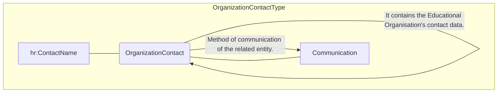
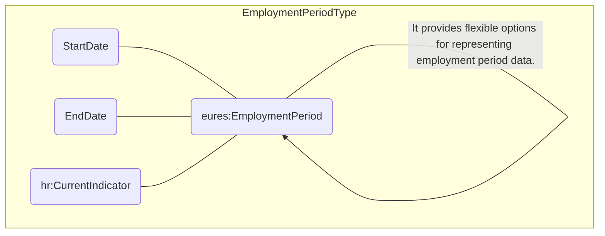

## Page 72

html
<table>
  <thead>
    <tr>
      <th></th>
      <th></th>
      <th></th>
      <th></th>
      <th>Full code list:<br>"Open/EURES:<br>NACE [CL31]"</th>
    </tr>
  </thead>
  <tbody>
    <tr>
      <td>EmploymentPeriod</td>
      <td>Provides flexible options for representing employment period data<br>See section /CandidateProfile/EmploymentHistory/EmployerHistory/EmploymentPeriod for more information</td>
      <td>0..1</td>
      <td>N/A</td>
      <td>N/A</td>
    </tr>
    <tr>
      <td>PositionHistory</td>
      <td>Details about the person's tenure within the position<br>See section /CandidateProfile/EmploymentHistory/EmployerHistory/PositionHistory for more information</td>
      <td>1..n</td>
      <td>N/A</td>
      <td>N/A</td>
    </tr>
    <tr>
      <td>AttachmentReference</td>
      <td>Reference to external documents attached<br>See section /CandidateProfile/EmploymentHistory/EmployerHistory/AttachmentReference for more information</td>
      <td>0..n</td>
      <td>N/A</td>
      <td>N/A</td>
    </tr>
    <tr>
      <td>Department</td>
      <td>It aims to capture the department of the organization in which the candidate had worked.</td>
      <td>0..1</td>
      <td></td>
      <td></td>
    </tr>
    <tr>
      <td>Link</td>
      <td>It specifies website link.</td>
      <td>0..n</td>
      <td></td>
      <td></td>
    </tr>
  </tbody>
</table>
```

3.14.3.2 EmployerHistory Attributes

<table>
  <thead>
    <tr>
      <th>Attributes</th>
      <th>Description</th>
      <th>Card.</th>
      <th>Rule</th>
    </tr>
  </thead>
  <tbody>
    <tr>
      <td colspan="4">This element has no attributes.</td>
    </tr>
    <tr>
      <td colspan="4"><strong>OrganizationName attributes</strong></td>
    </tr>
    <tr>
      <td><strong>Attributes</strong></td>
      <td><strong>Description</strong></td>
      <td><strong>Card.</strong></td>
      <td><strong>Rule</strong></td>
    </tr>
    <tr>
      <td>validFrom</td>
      <td>Validity start date for this entity's information</td>
      <td>0..1</td>
      <td>BR-COM-06: Compulsory Date Format is: YYYY-MM-DD, YYYY-MM, YYYY or YYYY-MM-DDThh:mm:ss.</td>
    </tr>
    <tr>
      <td>validTo</td>
      <td>Validity end date for this entity's information</td>
      <td>0..1</td>
      <td>BR-COM-06: Compulsory Date Format is: YYYY-MM-DD, YYYY-MM, YYYY or YYYY-MM-DDThh:mm:ss.</td>
    </tr>
    <tr>
      <td>languageID</td>
      <td>Identifier of the language used in the organisation name</td>
      <td>0..1</td>
      <td></td>
    </tr>
    <tr>
      <td colspan="4"><strong>OrganizationContact attributes</strong></td>
    </tr>
    <tr>
      <td><strong>Attributes</strong></td>
      <td><strong>Description</strong></td>
      <td><strong>Card.</strong></td>
      <td><strong>Rule</strong></td>
    </tr>
    <tr>
      <td colspan="4">See section /CandidateProfile/EmploymentHistory/EmployerHistory/OrganizationContact for more information</td>
    </tr>
    <tr>
      <td colspan="4"><strong>IndustryCode attributes</strong></td>
    </tr>
    <tr>
      <td><strong>Attributes</strong></td>
      <td><strong>Description</strong></td>
      <td><strong>Card.</strong></td>
      <td><strong>Rule</strong></td>
    </tr>
    <tr>
      <td colspan="4">Refer to CodeType Attributes section for additional attributes.</td>
    </tr>
    <tr>
      <td colspan="4"><strong>EmploymentPeriod attributes</strong></td>
    </tr>
    <tr>
      <td><strong>Attributes</strong></td>
      <td><strong>Description</strong></td>
      <td><strong>Card.</strong></td>
      <td><strong>Rule</strong></td>
    </tr>
    <tr>
      <td colspan="4">See section /CandidateProfile/EmploymentHistory/EmployerHistory/EmploymentPeriod for more information</td>
    </tr>
    <tr>
      <td colspan="4"><strong>PositionHistory attributes</strong></td>
    </tr>
    <tr>
      <td><strong>Attributes</strong></td>
      <td><strong>Description</strong></td>
      <td><strong>Card.</strong></td>
      <td><strong>Rule</strong></td>
    </tr>
    <tr>
      <td colspan="4">See section /CandidateProfile/EmploymentHistory/EmployerHistory/PositionHistory for more information</td>
    </tr>
    <tr>
      <td colspan="4"><strong>AttachmentReference attributes</strong></td>
    </tr>
    <tr>
      <td><strong>Attributes</strong></td>
      <td><strong>Description</strong></td>
      <td><strong>Card.</strong></td>
      <td><strong>Rule</strong></td>
    </tr>
    <tr>
      <td colspan="4">See section /CandidateProfile/EmploymentHistory/EmployerHistory/AttachmentReference for more information</td>
    </tr>
    <tr>
      <td colspan="4"><strong>Department attributes</strong></td>
    </tr>
    <tr>
      <td><strong>Attributes</strong></td>
      <td><strong>Description</strong></td>
      <td><strong>Card.</strong></td>
      <td><strong>Rule</strong></td>
    </tr>
    <tr>
      <td colspan="4">Refer to TextType Attributes section for additional attributes.</td>
    </tr>
    <tr>
      <td colspan="4"><strong>Link attributes</strong></td>
    </tr>
    <tr>
      <td><strong>Attributes</strong></td>
      <td><strong>Description</strong></td>
      <td><strong>Card.</strong></td>
      <td><strong>Rule</strong></td>
    </tr>
    <tr>
      <td colspan="4">It has no attributes.</td>
    </tr>
  </tbody>
</table>

DG EMPL 2020
&lt;page_number&gt;Page 72 of 160&lt;/page_number&gt;

---


## Page 73

3.14.4 Sub-element: /CandidateProfile/EmploymentHistory/EmployerHistory/OrganizationContact (level 4)

3.14.4.1 OrganizationContact Element Description



<table>
<thead>
<tr>
<th>Element</th>
<th>Description</th>
<th>Cardinality</th>
<th>Rule</th>
<th>Examples</th>
</tr>
</thead>
<tbody>
<tr>
<td><strong>OrganizationContact</strong></td>
<td>Contact information for the organization</td>
<td>0..1</td>
<td>N/A</td>
<td>N/A</td>
</tr>
<tr>
<td colspan="5"><strong>Sub-elements</strong></td>
</tr>
<tr>
<td><strong>ContactName</strong></td>
<td>Name of the organization's contact person</td>
<td>1</td>
<td>N/A</td>
<td>"Lidia Smith"</td>
</tr>
<tr>
<td><strong>Communication</strong></td>
<td>Contact data/information of the contact person: ChannelCode, Address, URI –for email, for instance—, etc<br/>See section /CandidatePerson/Communication for more information</td>
<td>0..n</td>
<td>N/A</td>
<td>N/A</td>
</tr>
</tbody>
</table>

3.14.4.2 OrganizationContact Attributes

<table>
<thead>
<tr>
<th>Attributes</th>
<th>Description</th>
<th>Card.</th>
<th>Rule</th>
</tr>
</thead>
<tbody>
<tr>
<td colspan="4">This element has no attributes.</td>
</tr>
<tr>
<td colspan="4"><strong>ContactName attributes</strong></td>
</tr>
<tr>
<td><strong>Attributes</strong></td>
<td><strong>Description</strong></td>
<td><strong>Card.</strong></td>
<td><strong>Rule</strong></td>
</tr>
<tr>
<td colspan="4">Refer to TextType Attributes section for additional attributes.</td>
</tr>
<tr>
<td colspan="4"><strong>Communication attributes</strong></td>
</tr>
<tr>
<td><strong>Attributes</strong></td>
<td><strong>Description</strong></td>
<td><strong>Card.</strong></td>
<td><strong>Rule</strong></td>
</tr>
<tr>
<td colspan="4">See section /CandidatePerson/Communication for more information</td>
</tr>
</tbody>
</table>

3.14.5 Sub-element: /CandidateProfile/EmploymentHistory/EmployerHistory/EmploymentPeriod (level 4)

3.14.5.1 EmploymentPeriod Element Description



<table>
<thead>
<tr>
<th>Element</th>
<th>Description</th>
<th>Cardinality</th>
<th>Rule</th>
<th>Examples</th>
</tr>
</thead>
<tbody>
<tr>
<td><strong>EmploymentPeriod</strong></td>
<td>Provides flexible options for representing employment period data</td>
<td>1</td>
<td>N/A</td>
<td>N/A</td>
</tr>
<tr>
<td colspan="5"><strong>Sub-elements</strong></td>
</tr>
<tr>
<td><strong>StartDate</strong></td>
<td>A timestamp marking the beginning of employment period data</td>
<td>1</td>
<td>N/A</td>
<td>N/A</td>
</tr>
</tbody>
</table>

DG EMPL 2020
&lt;page_number&gt;Page 73 of 160&lt;/page_number&gt;

---


