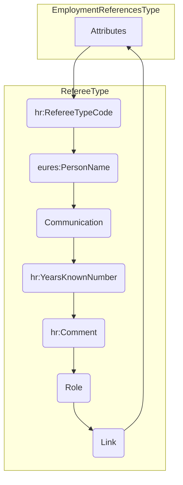
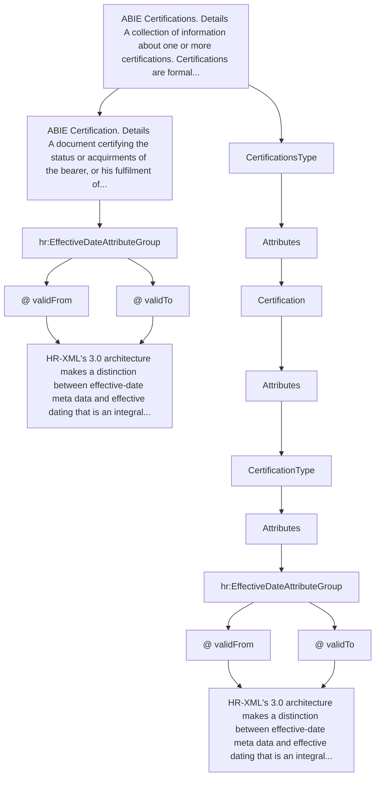
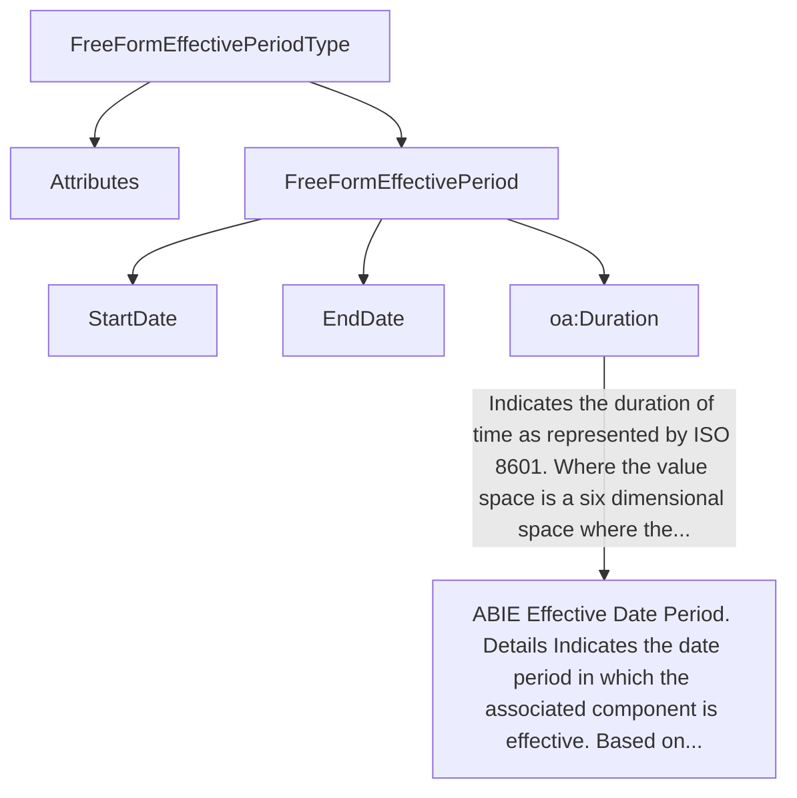
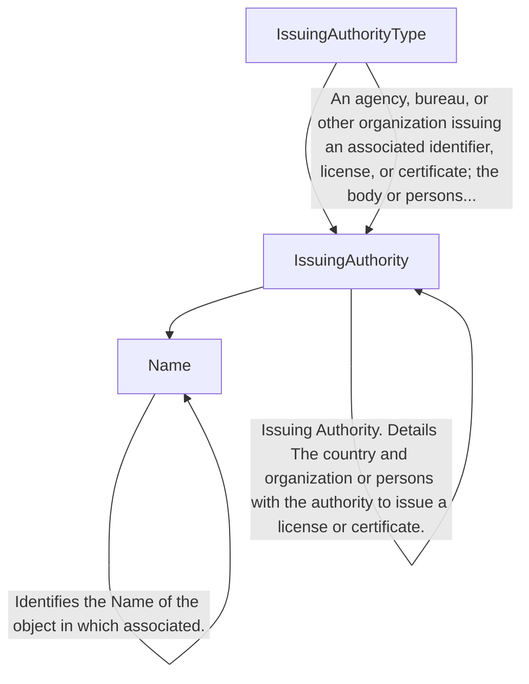

## Page 78

html
<table>
  <thead>
    <tr>
      <th colspan="5">Sub-elements</th>
    </tr>
  </thead>
  <tbody>
    <tr>
      <td><b>XPath</b></td>
      <td>Reference to an embedded document located in another element of the schema</td>
      <td>1..n</td>
      <td>N/A</td>
      <td></td>
    </tr>
    <tr>
      <td><b>Description</b></td>
      <td>Narrative details of the external document attached</td>
      <td>1..n</td>
      <td>N/A</td>
      <td>"Education History"</td>
    </tr>
  </tbody>
</table>

3.14.11.2 AttachmentReference Attributes

<table>
  <thead>
    <tr>
      <th>Attributes</th>
      <th>Description</th>
      <th>Card.</th>
      <th>Rule</th>
    </tr>
  </thead>
  <tbody>
    <tr>
      <td>This element has no attributes.</td>
      <td></td>
      <td></td>
      <td></td>
    </tr>
  </tbody>
</table>

XPath attributes

<table>
  <thead>
    <tr>
      <th>Attributes</th>
      <th>Description</th>
      <th>Card.</th>
      <th>Rule</th>
    </tr>
  </thead>
  <tbody>
    <tr>
      <td>This sub-element has no attributes.</td>
      <td></td>
      <td></td>
      <td></td>
    </tr>
  </tbody>
</table>

Description attributes

<table>
  <thead>
    <tr>
      <th>Attributes</th>
      <th>Description</th>
      <th>Card.</th>
      <th>Rule</th>
    </tr>
  </thead>
  <tbody>
    <tr>
      <td>Refer to DescriptionType Attribute section for additional attributes.</td>
      <td></td>
      <td></td>
      <td></td>
    </tr>
  </tbody>
</table>

3.15 /CandidateProfile/EmploymentReferences (level 2)

3.15.1 EmploymentReferences Element Description

&lt;img&gt;A diagram showing the structure of the EmploymentReferences element. It contains a root element "EmploymentReferences" with a cardinality of 0..1. This element has a child element "@Attributes" with a cardinality of 0..1. The "EmploymentReferences" element also has a child element "Referee" with a cardinality of 0..*.&lt;/img&gt;

<table>
  <thead>
    <tr>
      <th>Element</th>
      <th>Description</th>
      <th>Cardinality</th>
      <th>Rule</th>
      <th>Examples</th>
    </tr>
  </thead>
  <tbody>
    <tr>
      <td>EmploymentReferences</td>
      <td>Contains information on one or more people who are or may be a source of information about a person's skills, prior employment, character, or suitability for employment</td>
      <td>0..1</td>
      <td>N/A</td>
      <td>N/A</td>
    </tr>
  </tbody>
</table>

Sub-elements

<table>
  <thead>
    <tr>
      <th>Element</th>
      <th>Description</th>
      <th>Cardinality</th>
      <th>Rule</th>
      <th>Examples</th>
    </tr>
  </thead>
  <tbody>
    <tr>
      <td>Referee</td>
      <td>A person who may be referred to for information or guidance on a person's character or other qualities, specifically an applicant for employment, for an academic or other award, or the like.<br><br>See section /CandidateProfile/EmploymentReference/Referee for information</td>
      <td>0..n</td>
      <td>N/A</td>
      <td>N/A</td>
    </tr>
  </tbody>
</table>

DG EMPL 2020
&lt;page_number&gt;Page 78 of 160&lt;/page_number&gt;

---


## Page 79

3.15.2 EmploymentReferences Attributes

&lt;img&gt;A diagram showing "EmploymentReferencesType" with attributes "hr:EffectiveDateAttributeGroup", "@ validFrom", "@ validTo". It also shows "EmploymentReferences" which contains information on one or more people who may be a source of information about a person's skills, prior...&lt;/img&gt;

<table>
  <thead>
    <tr>
      <th>Attributes</th>
      <th>Description</th>
      <th>Card.</th>
      <th>Rule</th>
    </tr>
  </thead>
  <tbody>
    <tr>
      <td>validFrom</td>
      <td>Validity start date for this entity's information.</td>
      <td>0..1</td>
      <td>BR-COM-06: Compulsory Date Format is: YYYY-MM-DD, YYYY-MM, YYYY or YYYY-MM-DDThh:mm:ss.</td>
    </tr>
    <tr>
      <td>validTo</td>
      <td>Validity end date for this entity's information.</td>
      <td>0..1</td>
      <td>BR-COM-06: Compulsory Date Format is: YYYY-MM-DD, YYYY-MM, YYYY or YYYY-MM-DDThh:mm:ss.</td>
    </tr>
  </tbody>
</table>

Referee sub-element

<table>
  <thead>
    <tr>
      <th>Attributes</th>
      <th>Description</th>
      <th>Card.</th>
      <th>Rule</th>
    </tr>
  </thead>
  <tbody>
    <tr>
      <td colspan="4">See section /CandidateProfile/EmploymentReference/Referee for information</td>
    </tr>
  </tbody>
</table>

DG EMPL 2020
&lt;page_number&gt;Page 79 of 160&lt;/page_number&gt;

---


## Page 80

3.15.3 Sub-element: /CandidateProfile/EmploymentReferences/Referee (level 3)

3.15.3.1 RefereeElement Description



OED: A person who may be referred to for information or guidance on the character or other qualities of someone, spec...

Contains information on one or more person who is or may be a source of information about a person's skills, prior...

<table>
<thead>
<tr>
<th>Element</th>
<th>Description</th>
<th>Cardinality</th>
<th>Rule</th>
<th>Examples</th>
</tr>
</thead>
<tbody>
<tr>
<td><strong>Referee</strong></td>
<td>A person who may be referred to for information or guidance on a person's character or other qualities, specifically of an applicant for employment, for an academic or other award, or the like.</td>
<td>0..n</td>
<td>N/A</td>
<td>N/A</td>
</tr>
<tr>
<td colspan="5"><strong>Sub-elements</strong></td>
</tr>
<tr>
<td><strong>PersonName</strong></td>
<td>A component for capturing summary or fine-grain data that makes up a person's name</td>
<td>0..1</td>
<td>N/A</td>
<td>"Mr. John L Smith III, Phd", "Dr. Martin White", etc.</td>
</tr>
<tr>
<td colspan="5">The same as section /CandidatePerson/PersonName</td>
</tr>
<tr>
<td><strong>RefereeTypeCode</strong></td>
<td>A code classifying the reference type (e.g. "Professional", "Personal", "Verification")</td>
<td>0..1</td>
<td>BR-CV-22: The HR-Open Standards Code List "RefereeTypeCode".</td>
<td>"Professional", "Personal", "Verification"<br><br>Full code list: "HR-Open/EURES: RefereeTypeCode [CL46]"</td>
</tr>
<tr>
<td><strong>Communication</strong></td>
<td>Communication of the referee</td>
<td>0..n</td>
<td>N/A</td>
<td>N/A</td>
</tr>
<tr>
<td colspan="5">The same as section /CandidateSupplier/PersonContact/Communication</td>
</tr>
<tr>
<td><strong>Years Known Number</strong></td>
<td>Number of years known</td>
<td>0..1</td>
<td>N/A</td>
<td>"1", "2", "3", etc.</td>
</tr>
</tbody>
</table>

DG EMPL 2020
&lt;page_number&gt;Page 80 of 160&lt;/page_number&gt;

---


## Page 81

<table>
  <tr>
    <td><strong>Comment</strong></td>
    <td>Comment given by a Referee.</td>
    <td>0..1</td>
    <td>N/A</td>
    <td>"Comment about the referee"</td>
  </tr>
  <tr>
    <td><strong>Role</strong></td>
    <td>Specifies a role of referee in regards with a candidate.</td>
    <td>0..1</td>
    <td></td>
    <td></td>
  </tr>
  <tr>
    <td><strong>Link</strong></td>
    <td>It specifies url link.</td>
    <td>0..1</td>
    <td></td>
    <td></td>
  </tr>
</table>

3.15.3.2 <em>RefereeAttributes</em>

<table>
  <thead>
    <tr>
      <th>Attributes</th>
      <th>Description</th>
      <th>Card.</th>
      <th>Rule</th>
    </tr>
  </thead>
  <tbody>
    <tr>
      <td colspan="4">This element has no attributes.</td>
    </tr>
    <tr>
      <td colspan="4"><strong>PersonName attributes</strong></td>
    </tr>
    <tr>
      <td>Attributes</td>
      <td>Description</td>
      <td>Card.</td>
      <td>Rule</td>
    </tr>
    <tr>
      <td colspan="4">The same as section /CandidatePerson/PersonName</td>
    </tr>
    <tr>
      <td colspan="4"><strong>RefereeTypeCode attributes</strong></td>
    </tr>
    <tr>
      <td>Attributes</td>
      <td>Description</td>
      <td>Card.</td>
      <td>Rule</td>
    </tr>
    <tr>
      <td colspan="4">It has no attributes.</td>
    </tr>
    <tr>
      <td colspan="4"><strong>Communication attributes</strong></td>
    </tr>
    <tr>
      <td>Attributes</td>
      <td>Description</td>
      <td>Card.</td>
      <td>Rule</td>
    </tr>
    <tr>
      <td colspan="4">The same as section /CandidateSupplier/PersonContact/Communication</td>
    </tr>
    <tr>
      <td colspan="4"><strong>YearsKnownNumber attributes</strong></td>
    </tr>
    <tr>
      <td>Attributes</td>
      <td>Description</td>
      <td>Card.</td>
      <td>Rule</td>
    </tr>
    <tr>
      <td colspan="4">This sub-element has no attributes.</td>
    </tr>
    <tr>
      <td colspan="4"><strong>Comment attributes</strong></td>
    </tr>
    <tr>
      <td>Attributes</td>
      <td>Description</td>
      <td>Card.</td>
      <td>Rule</td>
    </tr>
    <tr>
      <td colspan="4">Refer to NoteType Attributes section for additional attributes.</td>
    </tr>
    <tr>
      <td colspan="4"><strong>Role attributes</strong></td>
    </tr>
    <tr>
      <td>languageID</td>
      <td>Identifier of the language used in the title.</td>
      <td>0..1</td>
      <td></td>
    </tr>
    <tr>
      <td colspan="4"><strong>Link attributes</strong></td>
    </tr>
    <tr>
      <td>Attributes</td>
      <td>Description</td>
      <td>Card.</td>
      <td>Rule</td>
    </tr>
    <tr>
      <td colspan="4">It has no attributes.</td>
    </tr>
  </tbody>
</table>

3.16 /CandidateProfile/Certifications (level 2)

3.16.1 Certifications Element Description

&lt;img&gt;CertificationsType Diagram&lt;/img&gt;

<table>
  <tr>
    <th>Element</th>
    <th>Description</th>
    <th>Cardinality</th>
    <th>Rule</th>
    <th>Examples</th>
  </tr>
  <tr>
    <td>Certifications</td>
    <td>A collection of information about one or more certifications.<br>Certifications are formal statements by an issuing authority that the certification holder has met educational or testing requirements associated with the certification.</td>
    <td>0..1</td>
    <td>N/A</td>
    <td>N/A</td>
  </tr>
  <tr>
    <td colspan="5"><strong>Sub-elements</strong></td>
  </tr>
  <tr>
    <td>Certification</td>
    <td>A document certifying the status or acuirements of the bearer, or his/her fulfilment of conditions authorizing him/her to act or practise in a specified way and which is therefore often equal to a licence.<br>See section /CandidateProfile/Certifications/Certification for more information</td>
    <td>0..n</td>
    <td>N/A</td>
    <td>N/A</td>
  </tr>
</table>

3.16.2 Certifications Attributes

<table>
  <tr>
    <th>Attributes</th>
    <th>Description</th>
    <th>Card.</th>
    <th>Rule</th>
  </tr>
</table>

<footer>DG EMPL 2020</footer>
&lt;page_number&gt;Page 81 of 160&lt;/page_number&gt;

---


## Page 82

<table>
  <tr>
    <td><strong>validFrom</strong></td>
    <td>Validity start date for this entity's information</td>
    <td>0..1</td>
    <td><strong>BR-COM-06:</strong> Compulsory Date Format is: YYYY-MM-DD, YYYY-MM, YYYY or YYYY-MM-DDThh:mm:ss.</td>
  </tr>
  <tr>
    <td><strong>validTo</strong></td>
    <td>Validity enddate for this entity's information</td>
    <td>0..1</td>
    <td><strong>BR-COM-06:</strong> Compulsory Date Format is: YYYY-MM-DD, YYYY-MM, YYYY or YYYY-MM-DDThh:mm:ss.</td>
  </tr>
</table>

<table>
  <thead>
    <tr>
      <th colspan="4">Certification sub-element</th>
    </tr>
    <tr>
      <th>Attributes</th>
      <th>Description</th>
      <th>Card.</th>
      <th>Rule</th>
    </tr>
  </thead>
  <tbody>
    <tr>
      <td colspan="4">See section /CandidateProfile/Certifications/Certification for more information</td>
    </tr>
  </tbody>
</table>

3.16.3 Sub-element: /CandidateProfile/Certifications/Certification (level 3)

3.16.3.1 Certification Element Description

```mermaid
graph TD
    A[CertificationsType] --> B[Attributes]
    B --> C{eures:CertificationType (extension base)}
    C --> D[Attributes]
    D --> E[hr:CertificationTypeCode]
    D --> F[hr:CertificationName]
    D --> G[FirstIssuedDate]
    D --> H[FreeFormEffectivePeriod]
    D --> I[IssuingAuthority]
    D --> J[oa:Description]
    D --> K[AttachmentReference]
    C --> L[Certification]
    L --> M[Link]
    M --> N[It specifies website link]
    E -- "A code classifying the type of credential." --> E
    F -- "Name of the certification" --> F
    G -- "First date issued" --> G
    H -- "Indicates the period in which the associated component is effective. Based on the same TimePeriodType UN/CEFACT ABIE (except that the start date is optional). The xsd:choice" --> H
    I -- "An agency, bureau, or other organization issuing an associated identifier, license, or certificate; the body or persons..." --> I
    J -- "ABIE Certification. Details A document certifying the status or acuirements of the bearer, or his/her fulfilment of..." --> J
    K -- "It specifies website link." --> K
```

<table>
  <thead>
    <tr>
      <th>Element</th>
      <th>Description</th>
      <th>Cardinality</th>
      <th>Rule</th>
      <th>Examples</th>
    </tr>
  </thead>
  <tbody>
    <tr>
      <td><strong>Certification</strong></td>
      <td>A document certifying the status or acuirements of the bearer, or his/her fulfilment of conditions authorizing him/her to act or practise in a specified way and which is therefore often equal to a licence.</td>
      <td>0..n</td>
      <td>N/A</td>
      <td>N/A</td>
    </tr>
  </tbody>
</table>

Sub-elements

<table>
  <thead>
    <tr>
      <th></th>
      <th></th>
      <th></th>
      <th></th>
      <th></th>
    </tr>
  </thead>
  <tbody>
    <tr>
      <td><strong>CertificationTypeCode</strong></td>
      <td>A code classifying the type of credential</td>
      <td>0..1</td>
      <td>N/A</td>
      <td>"Appeal-Standard", "Certification Not Required", etc.</td>
    </tr>
    <tr>
      <td><strong>CertificationName</strong></td>
      <td>Name of the certification</td>
      <td>0..1</td>
      <td>N/A</td>
      <td>"Transmission System Operators", etc.</td>
    </tr>
    <tr>
      <td><strong>FirstIssuedDate</strong></td>
      <td>First date issued<br/>See section /CandidateProfile /Certifications/Certification/FirstIssuedDate for more information</td>
      <td>0..1</td>
      <td>N/A</td>
      <td>N/A</td>
    </tr>
    <tr>
      <td><strong>FreeFormEffectivePeriod</strong></td>
      <td>Indicates the period in which the associated component is effective. Based on the same TimePeriodType UN/CEFACT ABIE (except that the start date is optional). The xsd:choice</td>
      <td>0..1</td>
      <td>N/A</td>
      <td>N/A</td>
    </tr>
  </tbody>
</table>

DG EMPL 2020
&lt;page_number&gt;Page 82 of 160&lt;/page_number&gt;

---


## Page 83

<table>
  <tr>
    <td></td>
    <td>between an EndDate and Duration was also removed for processing simplicity. Generally, an EndDate or Duration would appear, but not both. This usage rule is not enforced by the schema.<br><br>See section /CandidateProfile/Certifications/Certification/FreeFormEffectivePeriod for more information</td>
    <td></td>
    <td></td>
    <td></td>
  </tr>
  <tr>
    <td>IssuingAuthority</td>
    <td>An agency, bureau, or other organization issuing an associated identifier, license, or certificate; the body or people exercising power or command. An issuing authority is often a government agency or official authority, but can sometimes be a private organization.<br><br>See section /CandidateProfile/Certifications/Certification/IssuingAuthority for more information</td>
    <td>0..1</td>
    <td>N/A</td>
    <td>N/A</td>
  </tr>
  <tr>
    <td>Description</td>
    <td>Description of the certification</td>
    <td>0..1</td>
    <td>N/A</td>
    <td>"Certification of Transmission System Operators at EU", etc.</td>
  </tr>
  <tr>
    <td>AttachmenReference</td>
    <td>Reference to the external documents attached<br><br>The same as /EmploymentHistory/EmployerHistory/AttachmentReference section</td>
    <td>0..n</td>
    <td>N/A</td>
    <td>N/A</td>
  </tr>
  <tr>
    <td>Link</td>
    <td>It specifies website link.</td>
    <td>0..n</td>
    <td></td>
    <td></td>
  </tr>
</table>

### 3.16.3.2 Certification Attributes



<table>
  <thead>
    <tr>
      <th>Attributes</th>
      <th>Description</th>
      <th>Card.</th>
      <th>Rule</th>
    </tr>
  </thead>
  <tbody>
    <tr>
      <td>validFrom</td>
      <td>Validity start date for this entity's information.</td>
      <td>0..1</td>
      <td>BR-COM-06: Compulsory Date Format is: YYYY-MM-DD, YYYY-MM, YYYY or YYYY-MM-DDThh:mm:ss.</td>
    </tr>
    <tr>
      <td>validTo</td>
      <td>Validity end date for this entity's information.</td>
      <td>0..1</td>
      <td>BR-COM-06: Compulsory Date Format is: YYYY-MM-DD, YYYY-MM, YYYY or YYYY-MM-DDThh:mm:ss.</td>
    </tr>
  </tbody>
</table>

**CertificationTypeCode attributes**

<table>
  <thead>
    <tr>
      <th>Attributes</th>
      <th>Description</th>
      <th>Card.</th>
      <th>Rule</th>
    </tr>
  </thead>
  <tbody>
    <tr>
      <td colspan="4">Refer to CodeType Attributes section for additional attributes.</td>
    </tr>
  </tbody>
</table>

**CertificationName attributes**

<table>
  <thead>
    <tr>
      <th>Attributes</th>
      <th>Description</th>
      <th>Card.</th>
      <th>Rule</th>
    </tr>
  </thead>
  <tbody>
    <tr>
      <td>languageID</td>
      <td>Identifier of the language used in the CertificationName.</td>
      <td>0..1</td>
      <td></td>
    </tr>
  </tbody>
</table>

**Description attributes**

<table>
  <thead>
    <tr>
      <th>Attributes</th>
      <th>Description</th>
      <th>Card.</th>
      <th>Rule</th>
    </tr>
  </thead>
  <tbody>
    <tr>
      <td colspan="4"></td>
    </tr>
  </tbody>
</table>

<footer>DG EMPL 2020</footer>
&lt;page_number&gt;Page 83 of 160&lt;/page_number&gt;

---


## Page 84

html
<table>
  <thead>
    <tr>
      <th>Attributes</th>
      <th>Description</th>
      <th>Card.</th>
      <th>Rule</th>
    </tr>
  </thead>
  <tbody>
    <tr>
      <td colspan="4">Refer to DescriptionType Attributes section for additional attributes,</td>
    </tr>
    <tr>
      <td colspan="4"><b>FreeFormEffectivePeriod attributes</b></td>
    </tr>
    <tr>
      <td>Attributes</td>
      <td>Description</td>
      <td>Card.</td>
      <td>Rule</td>
    </tr>
    <tr>
      <td colspan="4">See section /CandidateProfile/Certifications/Certification/FreeFormEffectivePeriod for more information</td>
    </tr>
    <tr>
      <td colspan="4"><b>IssuingAuthority attributes</b></td>
    </tr>
    <tr>
      <td>Attributes</td>
      <td>Description</td>
      <td>Card.</td>
      <td>Rule</td>
    </tr>
    <tr>
      <td colspan="4">See section /CandidateProfile/Certifications/Certification/IssuingAuthority for more information</td>
    </tr>
    <tr>
      <td colspan="4"><b>AttachmentReference attributes</b></td>
    </tr>
    <tr>
      <td>Attributes</td>
      <td>Description</td>
      <td>Card.</td>
      <td>Rule</td>
    </tr>
    <tr>
      <td colspan="4">The same as /EmploymentHistory/EmployerHistory/AttachmentReference attributes section</td>
    </tr>
    <tr>
      <td colspan="4"><b>FirstIssuedDate attributes</b></td>
    </tr>
    <tr>
      <td>Attributes</td>
      <td>Description</td>
      <td>Card.</td>
      <td>Rule</td>
    </tr>
    <tr>
      <td colspan="4">See section /CandidateProfile/Certifications/Certification/FirstIssuedDate for more information</td>
    </tr>
    <tr>
      <td colspan="4"><b>Link attributes</b></td>
    </tr>
    <tr>
      <td>Attributes</td>
      <td>Description</td>
      <td>Card.</td>
      <td>Rule</td>
    </tr>
    <tr>
      <td colspan="4">It has no attributes.</td>
    </tr>
  </tbody>
</table>

3.16.4 Sub-element: /CandidateProfile/Certificaitons/Certification/FirstIssuedDate (level 4)

3.16.4.1 FirstIssuedDate Element Description

```mermaid
graph TD
    subgraph " "
        A[FreeFormDateType]
        B(hr:FreeFormDateTimeType (restriction base))
        C[FormattedDateTime]
        D[DateText]
        E(hr:FormattedDateTime)
        F(hr:DateText)
    end

    A --> B
    B --> C
    B --> D
    A --> E
    A --> F
```

```html
<table>
  <thead>
    <tr>
      <th>Element</th>
      <th>Description</th>
      <th>Cardinality</th>
      <th>Rule</th>
      <th>Examples</th>
    </tr>
  </thead>
  <tbody>
    <tr>
      <td>FirstIssuedDate</td>
      <td>First date issued</td>
      <td>0..1</td>
      <td>BR-COM-16: At least one of its sub-elements must be provided.</td>
      <td>N/A</td>
    </tr>
    <tr>
      <td colspan="5"><b>Sub-elements</b></td>
    </tr>
    <tr>
      <td colspan="5">The same as /CandidateProfile/EducationHistory/EdudacationOrganizationAttendance/EducationDegree/DegreeDate</td>
    </tr>
  </tbody>
</table>
```

3.16.4.2 FirstIssuedDate Attributes

<table>
  <thead>
    <tr>
      <th>Attributes</th>
      <th>Description</th>
      <th>Card.</th>
      <th>Rule</th>
    </tr>
  </thead>
  <tbody>
    <tr>
      <td colspan="4">The same as /CandidateProfile/EducationHistory/EdudacationOrganizationAttendance/EducationDegree/DegreeDate Attributes section.</td>
    </tr>
  </tbody>
</table>

DG EMPL 2020
&lt;page_number&gt;Page 84 of 160&lt;/page_number&gt;

---


## Page 85

3.16.5 Sub-element: /CandidateProfile/Certifications/Certification/FreeFormEffectivePeriod (level 4)

3.16.5.1 FreeFormEffectivePeriod Element Description



<table>
<thead>
<tr>
<th>Element</th>
<th>Description</th>
<th>Cardinality</th>
<th>Rule</th>
<th>Examples</th>
</tr>
</thead>
<tbody>
<tr>
<td><strong>FreeFormEffectivePeriod</strong></td>
<td>Indicates the date period in which the associated component is effective, based on the same <br/>TimePeriodType UN/CEFACT ABIE (except that the start date is optional). The xsd:choice between an EndDate <br/>and Duration was also removed for processing simplicity. Generally, an EndDate or Duration would appear, but not both. This usage rule is not enforced by the schema.</td>
<td>0..1</td>
<td>N/A</td>
<td>N/A</td>
</tr>
<tr>
<td colspan="5"><strong>Sub-elements</strong></td>
</tr>
<tr>
<td><strong>Start Date</strong></td>
<td>A timestamp marking the beginning of the attendance period</td>
<td>1</td>
<td>BR-COM-16: At least one of its sub-elements must be provided.</td>
<td>N/A</td>
</tr>
<tr>
<td colspan="5">See section<br/><em>/CandidateProfile/EducationHistory/EducationOrganizationAttendance/AttendancePeriod/StartDate</em> for more information</td>
</tr>
<tr>
<td><strong>End Date</strong></td>
<td>A timestamp marking the end of the attendance period</td>
<td>0..1</td>
<td>BR-COM-16: At least one of its sub-elements must be provided.</td>
<td>N/A</td>
</tr>
<tr>
<td colspan="5">See section <em>/CandidateProfile/EducationHistory/EducationOrganizationAttendance/AttendancePeriod/EndDate</em> for more information</td>
</tr>
<tr>
<td><strong>Duration</strong></td>
<td>Indicates the duration of time as represented by ISO 8601, where the value space is a six-dimensional space in which the coordinates designate the Gregorian year, month, day, hour, minute, and second. The number of seconds can include decimal digits for arbitrary precision.</td>
<td>0..1</td>
<td>N/A</td>
<td>"2010-09-02", "2011-07", etc.</td>
</tr>
</tbody>
</table>

DG EMPL 2020
&lt;page_number&gt;Page 85 of 160&lt;/page_number&gt;

---


## Page 86

3.16.5.2 FreeFormEffectivePeriod Attributes

```mermaid
graph TD
    A[FreeFormEffectivePeriodType] --> B[Attributes]
    B --> C[hr:EffectiveDateAttributeGroup]
    C --> D[@ validFrom]
    C --> E[@ validTo]
    A --> F[FreeFormEffectivePeriod]
    F --> G[ABIE Effective Date Period. Details Indicates the date period in which the associated component is effective. Based on...]
```

<table>
  <thead>
    <tr>
      <th>Attributes</th>
      <th>Description</th>
      <th>Card.</th>
      <th>Rule</th>
    </tr>
  </thead>
  <tbody>
    <tr>
      <td>validFrom</td>
      <td>Validity start date for this entity's information</td>
      <td>0..1</td>
      <td>BR-COM-06: Compulsory Date Format is: YYYY-MM-DD, YYYY-MM, YYYY or YYYY-MM-DDThh:mm:ss.</td>
    </tr>
    <tr>
      <td>validTo</td>
      <td>Validity end date for this entity's information</td>
      <td>0..1</td>
      <td>BR-COM-06: Compulsory Date Format is: YYYY-MM-DD, YYYY-MM, YYYY or YYYY-MM-DDThh:mm:ss.</td>
    </tr>
  </tbody>
</table>

**StartDate sub-element**

<table>
  <thead>
    <tr>
      <th>Attributes</th>
      <th>Description</th>
      <th>Card.</th>
      <th>Rule</th>
    </tr>
  </thead>
  <tbody>
    <tr>
      <td colspan="4">See section /CandidateProfile/EducationHistory/EducationOrganizationAttendance/AttendancePeriod/StartDate for more information</td>
    </tr>
  </tbody>
</table>

**EndDate sub-element**

<table>
  <thead>
    <tr>
      <th>Attributes</th>
      <th>Description</th>
      <th>Card.</th>
      <th>Rule</th>
    </tr>
  </thead>
  <tbody>
    <tr>
      <td colspan="4">See section /CandidateProfile/EducationHistory/EducationOrganizationAttendance/AttendancePeriod/EndDate for more information</td>
    </tr>
  </tbody>
</table>

**DurationMeasure sub-element**

<table>
  <thead>
    <tr>
      <th>Attributes</th>
      <th>Description</th>
      <th>Card.</th>
      <th>Rule</th>
    </tr>
  </thead>
  <tbody>
    <tr>
      <td colspan="4">This sub-element has no attributes.</td>
    </tr>
  </tbody>
</table>

3.16.6 Sub-element: /CandidateProfile/Certifications/Certification/IssuingAuthority (level 4)

3.16.6.1 IssuingAuthority Element Description



<table>
  <thead>
    <tr>
      <th>Element</th>
      <th>Description</th>
      <th>Cardinality</th>
      <th>Rule</th>
      <th>Examples</th>
    </tr>
  </thead>
  <tbody>
    <tr>
      <td>Issuing Authority</td>
      <td>An agency, bureau, or other organization issuing an associated identifier, license, or certificate; the body or people exercising power or command. An issuing authority is often a government agency or official authority but can sometimes be a private organization.</td>
      <td>0..1</td>
      <td>N/A</td>
      <td>N/A</td>
    </tr>
    <tr>
      <td colspan="5"><b>Sub-elements</b></td>
    </tr>
    <tr>
      <td>Name</td>
      <td>Identifies the Name of the associated object</td>
      <td>0..1</td>
      <td>N/A</td>
      <td>"Organization", etc.</td>
    </tr>
  </tbody>
</table>

DG EMPL 2020
&lt;page_number&gt;Page 86 of 160&lt;/page_number&gt;

---


