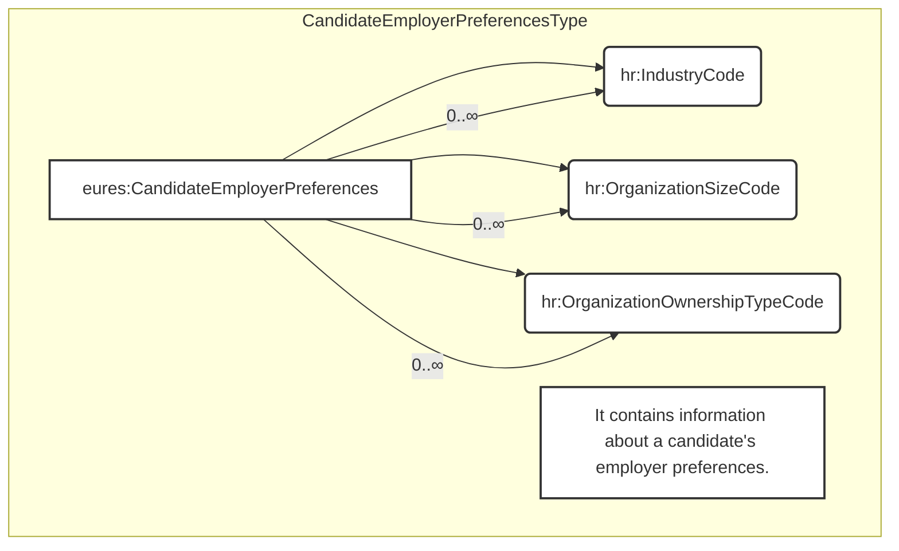

## Page 87

3.16.6.2 IssuingAuthority Attributes

<table>
<thead>
<tr>
<th>Attributes</th>
<th>Description</th>
<th>Card.</th>
<th>Rule</th>
</tr>
</thead>
<tbody>
<tr>
<td colspan="4">This element has no attributes.</td>
</tr>
<tr>
<td colspan="4"><strong>Name attributes</strong></td>
</tr>
<tr>
<td>Attributes</td>
<td>Description</td>
<td>Card.</td>
<td>Rule</td>
</tr>
<tr>
<td colspan="4">Refer to NameType Attributes section for additional attributes.</td>
</tr>
</tbody>
</table>

3.16.7 Sub-element: /CandidateProfile/Certifications/Certification/AttachmentReference (level 4)

3.16.7.1 AttachmentReference Element Description

<table>
<thead>
<tr>
<th>Element</th>
<th>Description</th>
<th>Cardinality</th>
<th>Rule</th>
<th>Examples</th>
</tr>
</thead>
<tbody>
<tr>
<td>AttachmentReference</td>
<td>Reference to external documents attached</td>
<td>0..n</td>
<td>N/A</td>
<td>N/A</td>
</tr>
<tr>
<td colspan="5"><strong>Sub-elements</strong></td>
</tr>
<tr>
<td colspan="5">The same as /CandidateProfile/EmploymentHistory/EmployerHistory/AttachmentReference section</td>
</tr>
</tbody>
</table>

3.16.7.2 AttachmentReference Attributes

<table>
<thead>
<tr>
<th>Attributes</th>
<th>Description</th>
<th>Card.</th>
<th>Rule</th>
</tr>
</thead>
<tbody>
<tr>
<td colspan="4">The same as /CandidateProfile/EmploymentHistory/EmployerHistory/AttachmentReference section</td>
</tr>
</tbody>
</table>

3.17 /CandidateProfile/CandidateEmployerPreferences (level 2)

3.17.1 CandidateEmployerPreferences Element Description

<table>
<thead>
<tr>
<th>Element</th>
<th>Description</th>
<th>Cardinality</th>
<th>Rule</th>
<th>Examples</th>
</tr>
</thead>
<tbody>
<tr>
<td>CandidateEmployerPreferences</td>
<td>Information about a candidate's preferences in an employer</td>
<td>0..1</td>
<td>N/A</td>
<td>N/A</td>
</tr>
<tr>
<td colspan="5"><strong>Sub-elements</strong></td>
</tr>
<tr>
<td>IndustryCode</td>
<td>A code classifying the industry of the related organization, position, or other entity</td>
<td>0..n</td>
<td>
BR-COM-20: Compulsory use of the “NACE-CodeList.gc” list defined by EURES. This is based on EU NACE.  
BR-COM-43: Multiple entries of this code list are allowed.
</td>
<td>
“01” = Agriculture, 
“02” = Forestry, etc.  
Full code list: “HR-Open/EURES: NACE [CL31]”
</td>
</tr>
<tr>
<td>OrganizationSizeCode</td>
<td>Contains a code classifying an organization’s size or</td>
<td>0..n</td>
<td>
BR-COM-26: Compulsory use of the “EURES_OrganizationSize-CodeList.gc” list defined by EURES. This is based on EU – C (2003) 1422, including Large enterprises.
</td>
<td>
“MicroEnterprise”, 
“SmallEnterprise”, 
etc.
</td>
</tr>
</tbody>
</table>

<footer>DG EMPL 2020</footer>
&lt;page_number&gt;Page 87 of 160&lt;/page_number&gt;

---

