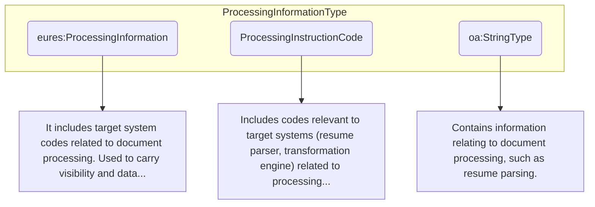

## Page 16

<table>
  <tr>
    <td>listName</td>
    <td>The code list name</td>
    <td>0..1</td>
    <td>N/A</td>
    <td>N/A</td>
  </tr>
  <tr>
    <td>listVersionID</td>
    <td>The code list identification</td>
    <td>0..1</td>
    <td>N/A</td>
    <td>N/A</td>
  </tr>
  <tr>
    <td>name</td>
    <td>The text equivalent of the code content component</td>
    <td>0..1</td>
    <td>N/A</td>
    <td>N/A</td>
  </tr>
  <tr>
    <td>listURI</td>
    <td>The Uniform Resource Identifier that identifies where the code list is located.</td>
    <td>0..1</td>
    <td>N/A</td>
    <td>N/A</td>
  </tr>
  <tr>
    <td>listSchemeURI</td>
    <td>The Uniform Resource Identifier that identifies where the code list scheme is located.</td>
    <td>0..1</td>
    <td>N/A</td>
    <td>N/A</td>
  </tr>
</table>

DocumentID attributes

<table>
  <tr>
    <td>Attributes</td>
    <td>Description</td>
    <td>Card.</td>
    <td>Rule</td>
  </tr>
  <tr>
    <td colspan="4">Refer to IdentifierType Attributes for additional attributes.</td>
  </tr>
</table>

AlternateDocumentID attributes

<table>
  <tr>
    <td>Attributes</td>
    <td>Description</td>
    <td>Card.</td>
    <td>Rule</td>
  </tr>
  <tr>
    <td colspan="4">It is the same as the “DocumentID” attributes.</td>
  </tr>
</table>

3.2 /Processing Information (level 1)

3.2.1 Processing Information Element Description

<table>
  <tr>
    <td>Element</td>
    <td>Description</td>
    <td>Cardinality</td>
    <td>Rule</td>
    <td>Examples</td>
  </tr>
  <tr>
    <td>Processing Information</td>
    <td>Includes codes relevant to a target system related to document processing.  In EURES, this element is used to provide "visibility" and "data</td>
    <td>0..1</td>
    <td>If the /Candidate /Processing Information element is not present in a Candidate's XML document instance, no visibility restrictions concerning this CV will be applied (i.e., all fields will be visible)</td>
    <td>N/A</td>
  </tr>
</table>

DG EMPL 2020
&lt;page_number&gt;Page 16 of 160&lt;/page_number&gt;

---

## Page 17

protection” instructions to the Interoperability Portal.

See the description of this element for more details.

<table>
  <thead>
    <tr>
      <th colspan="4">Sub-elements</th>
    </tr>
  </thead>
  <tbody>
    <tr>
      <td>Processing Instructions</td>
      <td>Codes relevant to a target system (such as a resume parser or transformation engine) related to document processing. The Interoperability Portal uses this element to hide certain CV data, such as the Candidate’s name, phone number, etc., and to define which the data protection information is. (e.g. hideCandidateName)</td>
      <td>0..n</td>
      <td>Information If the /Candidate /Processing Information element is not present in a Candidate’s XML document instance, no visibility restrictions concerning this CV will be applied (i.e., all fields will be visible)  BR-CV-32: The Xpath must be valid</td>
      <td>N/A</td>
    </tr>
    <tr>
      <td colspan="5">A hidden element cannot be searched on the platform.</td>
    </tr>
  </tbody>
</table>

DG EMPL 2020
&lt;page_number&gt;Page 17 of 160&lt;/page_number&gt;

---

