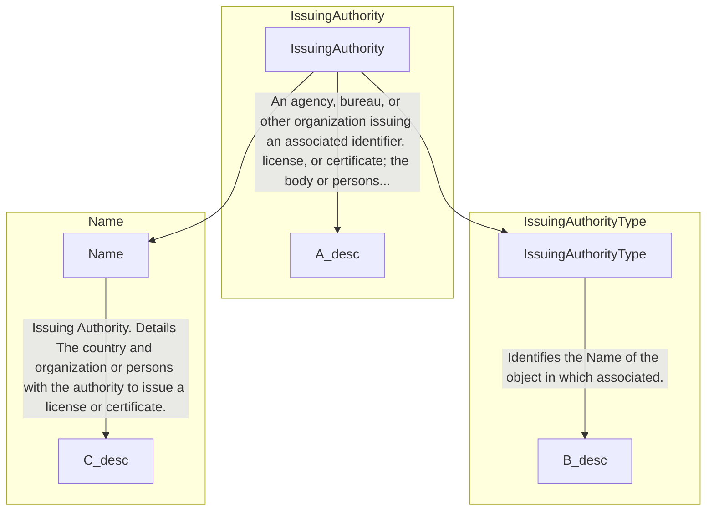

## Page 111

3.21.4 Sub-element: /CandidateProfile/PatentHistory/Patent/IssuingAuthority (level 4)

3.21.4.1 IssuingAuthority Element Description



<table>
<thead>
<tr>
<th>Element</th>
<th>Description</th>
<th>Cardinality</th>
<th>Rule</th>
<th>Examples</th>
</tr>
</thead>
<tbody>
<tr>
<td><strong>IssuingAuthority</strong></td>
<td>An agency, bureau, or other organization issuing an associated identifier, license, or certificate; the body or people exercising power or command. An issuing authority is often a government agency or official authority, but sometimes might be a private organization.</td>
<td>0..1</td>
<td>N/A</td>
<td>N/A</td>
</tr>
<tr>
<td colspan="5"><strong>Sub-elements</strong></td>
</tr>
<tr>
<td><strong>Name</strong></td>
<td>Identifies the Name of the associated object</td>
<td>0..1</td>
<td>N/A</td>
<td>"Organization", etc.</td>
</tr>
</tbody>
</table>

3.21.4.2 IssuingAuthority Attributes

<table>
<thead>
<tr>
<th>Attributes</th>
<th>Description</th>
<th>Card.</th>
<th>Rule</th>
</tr>
</thead>
<tbody>
<tr>
<td colspan="4">This element has no attributes.</td>
</tr>
<tr>
<td colspan="4"><strong>Name attributes</strong></td>
</tr>
<tr>
<td><strong>Attributes</strong></td>
<td><strong>Description</strong></td>
<td><strong>Card.</strong></td>
<td><strong>Rule</strong></td>
</tr>
<tr>
<td colspan="4">Refer to NameType Attribute section for additional attributes.</td>
</tr>
</tbody>
</table>

3.21.5 Sub-element: /CandidateProfile/PatentHistory/Patent/PatentStatus (level 4)

3.21.5.1 PatentStatus Element Description

```mermaid
graph TD
    A[PatentStatus] --> B[PatentStatusID]
    A --> C[PatentStatusCode]
    subgraph PatentStatus
        direction LR
        A -- "The status of the patent. These stages or steps would generally be set by the government agency administering patent applications, for example, \"patent pending\"." --> A_desc
    end
    subgraph PatentStatusID
        direction LR
        B -- "The identifier of the patent status." --> B_desc
    end
    subgraph PatentStatusCode
        direction LR
        C -- "A code classifying the current or reported status of the associated patent. This is an HR-XML Open List." --> C_desc
    end
```

<table>
<thead>
<tr>
<th>Element</th>
<th>Description</th>
<th>Cardinality</th>
<th>Rule</th>
<th>Examples</th>
</tr>
</thead>
<tbody>
<tr>
<td><strong>PatentStatus</strong></td>
<td>The status of the patent. These stages or steps would generally be set by the government agency administering patent applications, for example, "patent pending".</td>
<td>0..n</td>
<td>N/A</td>
<td>N/A</td>
</tr>
<tr>
<td colspan="5"><strong>Sub-elements</strong></td>
</tr>
<tr>
<td><strong>PatentStatusID</strong></td>
<td>The identifier of the patent status</td>
<td>0..1</td>
<td>N/A</td>
<td>"PS-1234", "344", etc.</td>
</tr>
</tbody>
</table>

DG EMPL 2020
&lt;page_number&gt;Page 111 of 160&lt;/page_number&gt;

---


