## Page 114

3.22.3 Sub-element: /CandidateProfile/PublicationHistory/Publication (level 3)

3.22.3.1 Publication Element Description

```mermaid
graph TD
    A[PublicationHistoryType] --> B[Attributes]
    B --> C[PublicationType]
    C --> D[eures:PublicationType (extension base)]
    D --> E[hr:FormattedPublicationDescription]
    E --> F[Title]
    E --> G[Year]
    E --> H[Reference]
    E --> I[Link]
    E --> J[DOI]

    subgraph PublicationType
        direction LR
        D -- "ABIE Publication. Details A book, map, engraving, photograph, piece of music, or other work." --> E
        E --> F
        E --> G
        E --> H
        E --> I
        E --> J
    end

    style A fill:#fff,stroke:#333,stroke-width:2px
    style B fill:#fff,stroke:#333,stroke-width:2px
    style C fill:#fff,stroke:#333,stroke-width:2px
    style D fill:#fff,stroke:#333,stroke-width:2px
    style E fill:#fff,stroke:#333,stroke-width:2px
    style F fill:#fff,stroke:#333,stroke-width:2px
    style G fill:#fff,stroke:#333,stroke-width:2px
    style H fill:#fff,stroke:#333,stroke-width:2px
    style I fill:#fff,stroke:#333,stroke-width:2px
    style J fill:#fff,stroke:#333,stroke-width:2px
```

<table>
<thead>
<tr>
<th>Element</th>
<th>Description</th>
<th>Cardinality</th>
<th>Rule</th>
<th>Examples</th>
</tr>
</thead>
<tbody>
<tr>
<td><strong>Publication</strong></td>
<td>A book, map, engraving, photograph, piece of music, or other work</td>
<td>0..n</td>
<td>N/A</td>
<td>N/A</td>
</tr>
<tr>
<td colspan="5"><strong>Sub-elements</strong></td>
</tr>
<tr>
<td><strong>FormattedPublicationDescription</strong></td>
<td>An unfiled or formatted description of a publication</td>
<td>0..n</td>
<td>N/A</td>
<td>“Article about Machine Learning in the Weekend Magazine”</td>
</tr>
<tr>
<td><strong>Title</strong></td>
<td>Specifies Title of the publication.</td>
<td>0..1</td>
<td></td>
<td></td>
</tr>
<tr>
<td><strong>Year</strong></td>
<td>Specifies the year of publication.</td>
<td>0..1</td>
<td></td>
<td></td>
</tr>
<tr>
<td><strong>Reference</strong></td>
<td>Specifies reference used in the publication.</td>
<td>0..1</td>
<td></td>
<td></td>
</tr>
<tr>
<td><strong>Link</strong></td>
<td>Specifies website link for the publication.</td>
<td>0..n</td>
<td></td>
<td></td>
</tr>
<tr>
<td><strong>DOI</strong></td>
<td>A Digital Object Identifier (DOI), a unique alphanumeric string to permanently identify a publication.<br>Refer to section /CandidateProfile/PublicationHistory/Publication/DOIChoice for more information</td>
<td>0..1</td>
<td></td>
<td></td>
</tr>
</tbody>
</table>

3.22.3.2 Publication Attributes

<table>
<thead>
<tr>
<th>Attributes</th>
<th>Description</th>
<th>Card.</th>
<th>Rule</th>
</tr>
</thead>
<tbody>
<tr>
<td>This element has no attributes.</td>
<td></td>
<td></td>
<td></td>
</tr>
<tr>
<td colspan="4"><strong>FormattedPublicationDescription attributes</strong></td>
</tr>
</tbody>
</table>

DG EMPL 2020
&lt;page_number&gt;Page 114 of 160&lt;/page_number&gt;

---


## Page 115

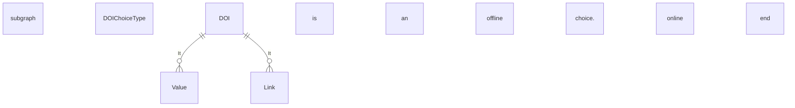

3.22.4 Sub-element: /CandidateProfile/PublicationHistory/Publication/DOIChoice

<table>
  <thead>
    <tr>
      <th>Element</th>
      <th>Description</th>
      <th>Cardinality</th>
      <th>Rule</th>
      <th>Examples</th>
    </tr>
  </thead>
  <tbody>
    <tr>
      <td>DOI Choice</td>
      <td>A Digital Object Identifier (DOI), a unique alphanumeric string to permanently identify a publication.</td>
      <td>0..1</td>
      <td>N/A</td>
      <td>N/A</td>
    </tr>
    <tr>
      <td colspan="5"><b>Sub-elements</b></td>
    </tr>
    <tr>
      <td colspan="5"><b>Choice 1</b></td>
    </tr>
    <tr>
      <td>Value</td>
      <td>Offline DOI: alphanumeric string to identify the publication offline ().</td>
      <td>1</td>
      <td>N/A</td>
      <td>"Article about Machine Learning in the Weekend Magazine"</td>
    </tr>
    <tr>
      <td colspan="5"><b>Choice 2</b></td>
    </tr>
    <tr>
      <td>Link</td>
      <td>Online DOI: Link to identify the publication online</td>
      <td>1</td>
      <td></td>
      <td>N/A</td>
    </tr>
  </tbody>
</table>

DG EMPL 2020
&lt;page_number&gt;Page 115 of 160&lt;/page_number&gt;

---


## Page 116

3.23 /CandidateProfile/OrganizationAffiliations (level 2)

3.23.1 OrganizationAffiliations Element Description

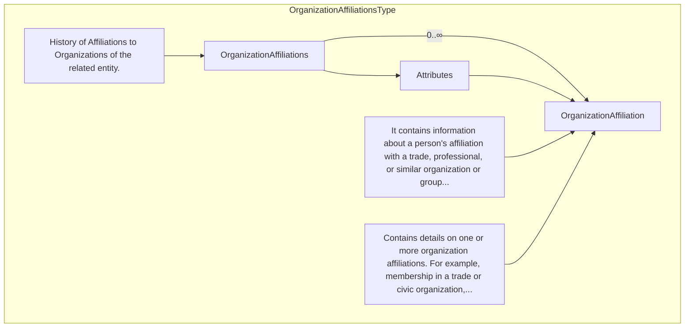

<table>
<thead>
<tr>
<th>Element</th>
<th>Description</th>
<th>Cardinality</th>
<th>Rule</th>
<th>Examples</th>
</tr>
</thead>
<tbody>
<tr>
<td><strong>OrganizationAffiliations</strong></td>
<td>Contains details on one or more organization affiliations. For example, membership in a trade or civic organization, seat on an organization’s board of directors, membership in a union, etc.</td>
<td>0..1</td>
<td>N/A</td>
<td>N/A</td>
</tr>
</tbody>
</table>

Sub-elements

<table>
<thead>
<tr>
<th>OrganizationAffiliation</th>
<th>Description</th>
<th>Card.</th>
<th>Rule</th>
<th>Examples</th>
</tr>
</thead>
<tbody>
<tr>
<td></td>
<td>Contains information about a person's affiliation with a trade, professional, or similar organization or group formed around a common purpose or cause<br>See section /CandidateProfile/OrganizationAffiliations/OrganizationAffiliation for more information</td>
<td>0..n</td>
<td>N/A</td>
<td>N/A</td>
</tr>
</tbody>
</table>

3.23.2 OrganizationAffiliations Attributes

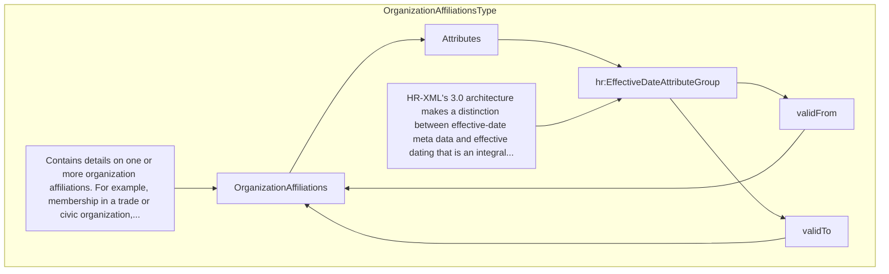

<table>
<thead>
<tr>
<th>Attributes</th>
<th>Description</th>
<th>Card.</th>
<th>Rule</th>
</tr>
</thead>
<tbody>
<tr>
<td><strong>validFrom</strong></td>
<td>Validity start date for this entity's information</td>
<td>0..1</td>
<td>BR-COM-06: Compulsory Date Format is: YYYY-MM-DD, YYYY-MM, YYYY or YYYY-MM-DDThh:mm:ss.</td>
</tr>
<tr>
<td><strong>validTo</strong></td>
<td>Validity end date for this entity's information</td>
<td>0..1</td>
<td>BR-COM-06: Compulsory Date Format is: YYYY-MM-DD, YYYY-MM, YYYY or YYYY-MM-DDThh:mm:ss.</td>
</tr>
</tbody>
</table>

OrganizationAffiliations attributes

<table>
<thead>
<tr>
<th>Attributes</th>
<th>Description</th>
<th>Card.</th>
<th>Rule</th>
</tr>
</thead>
<tbody>
<tr>
<td colspan="4 more information</td>
<td>See section /CandidateProfile/OrganizationAffiliations/OrganizationAffiliation for more information</td>
<td></td>
<td></td>
</tr>
</tbody>
</table>

DG EMPL 2020
&lt;page_number&gt;Page 116 of 160&lt;/page_number&gt;

---


## Page 117

3.23.3 Sub-element: /CandidateProfile/OrganizationAffiliations/OrganizationAffiliation (level 3)

3.23.3.1 OrganizationAffiliation Element Description

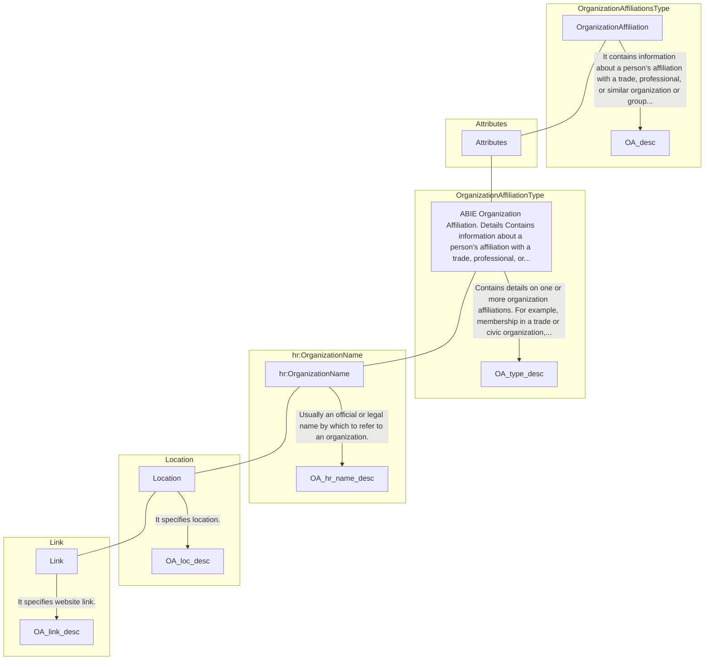

<table>
<thead>
<tr>
<th>Element</th>
<th>Description</th>
<th>Cardinality</th>
<th>Rule</th>
<th>Examples</th>
</tr>
</thead>
<tbody>
<tr>
<td><strong>OrganizationAffiliation</strong></td>
<td>Contains information about a person's affiliation with a trade, professional, or similar organization or group formed around a common purpose or cause</td>
<td>0..n</td>
<td>N/A</td>
<td>N/A</td>
</tr>
</tbody>
</table>

Sub-elements

<table>
<thead>
<tr>
<th></th>
<th></th>
<th></th>
<th></th>
</tr>
</thead>
<tbody>
<tr>
<td><strong>OrganizationName</strong></td>
<td>Usually an official or legal name by which to refer to an organization</td>
<td>0..1</td>
<td>N/A</td>
<td>"Name", etc.</td>
</tr>
<tr>
<td><strong>Location</strong></td>
<td>Location of the Organisation</td>
<td>0..1</td>
<td></td>
<td>N/A</td>
</tr>
<tr>
<td><strong>Link</strong></td>
<td>Link to the organisation's related websites.</td>
<td>0..n</td>
<td></td>
<td>N/A</td>
</tr>
</tbody>
</table>

3.23.3.2 OrganizationAffiliation Attributes

<table>
<thead>
<tr>
<th>Attributes</th>
<th>Description</th>
<th>Card.</th>
<th>Rule</th>
</tr>
</thead>
<tbody>
<tr>
<td colspan="4">This element has no attributes.</td>
</tr>
</tbody>
</table>

OrganizationName attributes

<table>
<thead>
<tr>
<th>Attributes</th>
<th>Description</th>
<th>Card.</th>
<th>Rule</th>
</tr>
</thead>
<tbody>
<tr>
<td><strong>validFrom</strong></td>
<td>Validity start date for this entity's information</td>
<td>0..1</td>
<td>BR-COM-06: Compulsory Date Format is: YYYY-MM-DD, YYYY-MM, YYYY or YYYY-MM-DDThh:mm:ss.</td>
</tr>
<tr>
<td><strong>validTo</strong></td>
<td>Validity end date for this entity's information</td>
<td>0..1</td>
<td>BR-COM-06: Compulsory Date Format is: YYYY-MM-DD, YYYY-MM, YYYY or YYYY-MM-DDThh:mm:ss.</td>
</tr>
<tr>
<td><strong>languageID</strong></td>
<td>Identifier of the language used in the organisation name</td>
<td>0..1</td>
<td></td>
</tr>
</tbody>
</table>

Location attributes

<table>
<thead>
<tr>
<th>languageID</th>
<th>Identifier of the language used in the location name</th>
<th>0..1</th>
<th></th>
</tr>
</thead>
<tbody>
<tr>
<td></td>
<td></td>
<td></td>
<td></td>
</tr>
</tbody>
</table>

Link attributes

<table>
<thead>
<tr>
<th></th>
<th></th>
<th></th>
<th></th>
</tr>
</thead>
<tbody>
<tr>
<td colspan="4">This element has no attributes.</td>
<td></td>
<td></td>
<td></td>
</tr>
</tbody>
</table>

DG EMPL 2020
&lt;page_number&gt;Page 117 of 160&lt;/page_number&gt;

---


## Page 118

3.24 /CandidateProfile/SpeakingHistory (level 2)

3.24.1 SpeakingHistory Element Description

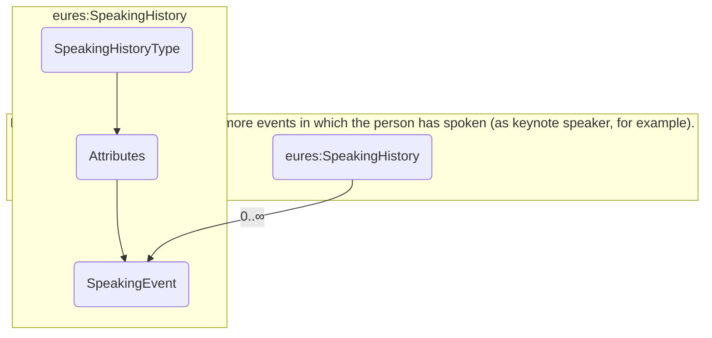

<table>
<thead>
<tr>
<th>Element</th>
<th>Description</th>
<th>Cardinality</th>
<th>Rule</th>
<th>Examples</th>
</tr>
</thead>
<tbody>
<tr>
<td><strong>SpeakingHistory</strong></td>
<td>A collection of information about one or more speaking events (as keynotes, for example) given by the person</td>
<td>0..1</td>
<td>N/A</td>
<td>N/A</td>
</tr>
<tr>
<td colspan="5"><strong>Sub-elements</strong></td>
</tr>
<tr>
<td><strong>SpeakingEvent</strong></td>
<td>Contains a set of details about an event in which the person was a lecturer or presenter<br>See section /CandidateProfile/SpeakingHistory/SpeakingEvent for more information</td>
<td>0..n</td>
<td>N/A</td>
<td>N/A</td>
</tr>
</tbody>
</table>

3.24.2 SpeakingHistory Attributes

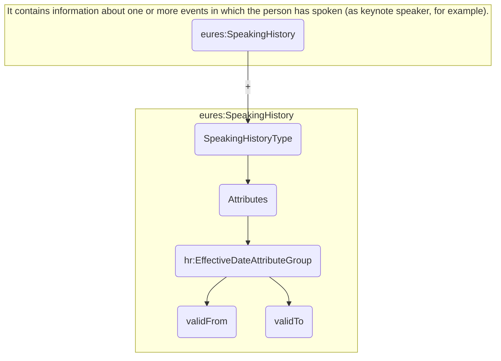

<table>
<thead>
<tr>
<th>Attributes</th>
<th>Description</th>
<th>Card.</th>
<th>Rule</th>
</tr>
</thead>
<tbody>
<tr>
<td><strong>validFrom</strong></td>
<td>Validity start date for this entity's information</td>
<td>0..1</td>
<td>BR-COM-06: Compulsory Date Format is: YYYY-MM-DD, YYYY-MM, YYYY or YYYY-MM-DDThh:mm:ss.</td>
</tr>
<tr>
<td><strong>validTo</strong></td>
<td>Validity end date for this entity's information</td>
<td>0..1</td>
<td>BR-COM-06: Compulsory Date Format is: YYYY-MM-DD, YYYY-MM, YYYY or YYYY-MM-DDThh:mm:ss.</td>
</tr>
<tr>
<td colspan="4"><strong>SpeakingEvent attributes</strong></td>
</tr>
<tr>
<td><strong>Attributes</strong></td>
<td><strong>Description</strong></td>
<td><strong>Card.</strong></td>
<td><strong>Rule</strong></td>
</tr>
<tr>
<td colspan="4">See section /CandidateProfile/SpeakingHistory/SpeakingEvent for more information</td>
</tr>
</tbody>
</table>

DG EMPL 2020
&lt;page_number&gt;Page 118 of 160&lt;/page_number&gt;

---


## Page 119

3.24.3 Sub-element: /CandidateProfile/SpeakingHistory/SpeakingEvent (level 3)

3.24.3.1 SpeakingEvent Element Description

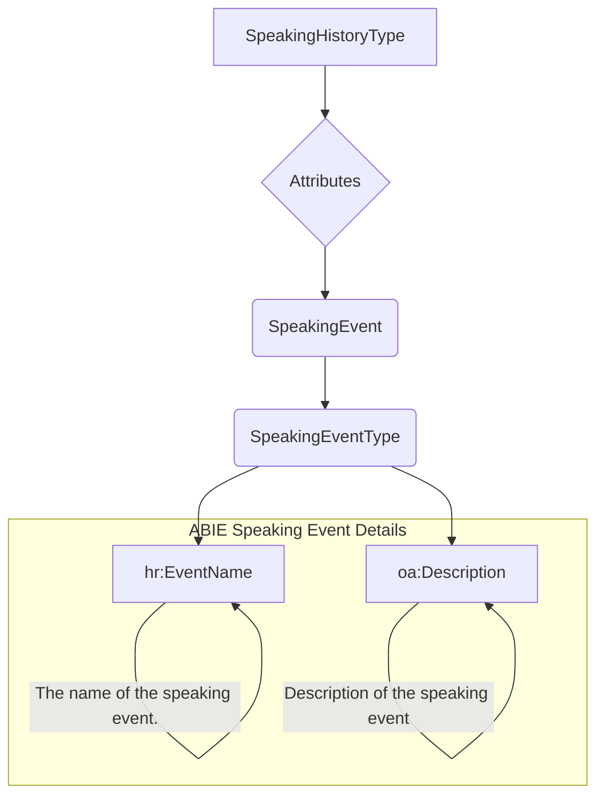

<table>
<thead>
<tr>
<th>Element</th>
<th>Description</th>
<th>Cardinality</th>
<th>Rule</th>
<th>Examples</th>
</tr>
</thead>
<tbody>
<tr>
<td><strong>SpeakingEvent</strong></td>
<td>Contains a set of details about an event in which the associated person was a lecturer or presenter.</td>
<td>0..n</td>
<td>N/A</td>
<td>N/A</td>
</tr>
<tr>
<td colspan="5"><strong>Sub-elements</strong></td>
</tr>
<tr>
<td><strong>EventName</strong></td>
<td>The name of the speaking event</td>
<td>1</td>
<td>N/A</td>
<td>N/A</td>
</tr>
<tr>
<td><strong>Description</strong></td>
<td>Description of the speaking event</td>
<td>0..1</td>
<td>N/A</td>
<td>N/A</td>
</tr>
</tbody>
</table>

3.24.3.2 SpeakingEvent Attributes

<table>
<thead>
<tr>
<th>Attributes</th>
<th>Description</th>
<th>Card.</th>
<th>Rule</th>
</tr>
</thead>
<tbody>
<tr>
<td colspan="4">This element has no attributes.</td>
</tr>
<tr>
<td colspan="4"><strong>Description attributes</strong></td>
</tr>
<tr>
<td><strong>Attributes</strong></td>
<td><strong>Description</strong></td>
<td><strong>Card.</strong></td>
<td><strong>Rule</strong></td>
</tr>
<tr>
<td colspan="4">Refer to DescriptionType Attributes section for additional attributes.</td>
</tr>
<tr>
<td colspan="4"><strong>EventName attributes</strong></td>
</tr>
<tr>
<td><strong>Attributes</strong></td>
<td><strong>Description</strong></td>
<td><strong>Card.</strong></td>
<td><strong>Rule</strong></td>
</tr>
<tr>
<td>languageID</td>
<td>Identifier of the language used in the code name</td>
<td>0..1</td>
<td></td>
</tr>
</tbody>
</table>

DG EMPL 2020
&lt;page_number&gt;Page 119 of 160&lt;/page_number&gt;

---


## Page 120

3.25 /CandidateProfile/Attachment (level 2)

3.25.1 Attachment Element Description

```mermaid
graph TD
    subgraph "AttachmentType"
        A[Attributes]
        B(eures:Attachment)
    end
    A --> C[oa:EmbeddedData]
    A --> D[hr:EmbeddedText]
    A --> E[oa:URI]
    A --> F[oa:FileName]
    A --> G[hr:DocumentDateTime]
    A --> H[oa:Description]
    A --> I[oa:FileType]
    A --> J[hr:DocumentTitle]
    A --> K[hr:AttachmentXPath]
    A --> L[hr:Instructions]

    B -- "0..∞" --> C
    B -- "0..∞" --> D
    B -- "0..∞" --> E
    B -- "0..∞" --> F
    B -- "0..∞" --> G
    B -- "0..∞" --> H
    B -- "0..∞" --> I
    B -- "0..∞" --> J
    B -- "0..∞" --> K
    B -- "0..∞" --> L

    style A fill:#fff,stroke:#333,stroke-width:2px
    style B fill:#fff,stroke:#333,stroke-width:2px
    style C fill:#fff,stroke:#333,stroke-width:2px
    style D fill:#fff,stroke:#333,stroke-width:2px
    style E fill:#fff,stroke:#333,stroke-width:2px
    style F fill:#fff,stroke:#333,stroke-width:2px
    style G fill:#fff,stroke:#333,stroke-width:2px
    style H fill:#fff,stroke:#333,stroke-width:2px
    style I fill:#fff,stroke:#333,stroke-width:2px
    style J fill:#fff,stroke:#333,stroke-width:2px
    style K fill:#fff,stroke:#333,stroke-width:2px
    style L fill:#fff,stroke:#333,stroke-width:2px
```

<table>
<thead>
<tr>
<th>Element</th>
<th>Description</th>
<th>Cardinality</th>
<th>Rule</th>
<th>Examples</th>
</tr>
</thead>
<tbody>
<tr>
<td><strong>Attachment</strong></td>
<td>Allows for embedding or referencing external documents or digital objects</td>
<td>0..n</td>
<td>BR-COM-42: An Attachment shall not embed and simultaneously refer to an URI that contains the same document. External references to documents, using the URI element, are the recommended method (when possible) for attaching documents.</td>
<td>N/A</td>
</tr>
<tr>
<td colspan="5"><strong>Sub-elements</strong></td>
</tr>
<tr>
<td><strong>EmbeddedData</strong></td>
<td>Allows the data to be embedded directly into the BOD instance</td>
<td>0..1</td>
<td>N/A</td>
<td>-</td>
</tr>
<tr>
<td><strong>EmbeddedText</strong></td>
<td>Embedded text</td>
<td>0..1</td>
<td>N/A</td>
<td>"Embedded text"</td>
</tr>
<tr>
<td><strong>URI</strong></td>
<td>Represents a Uniform Resource Identifier Reference (URI). An URI value can be absolute or relative, and may have an optional</td>
<td>0..1</td>
<td>N/A</td>
<td>"http://uri.org", etc.</td>
</tr>
</tbody>
</table>

DG EMPL 2020
&lt;page_number&gt;Page 120 of 160&lt;/page_number&gt;

---


## Page 121

html
<table>
  <thead>
    <tr>
      <td></td>
      <td></td>
      <td></td>
      <td></td>
      <td></td>
    </tr>
  </thead>
  <tbody>
    <tr>
      <td>fragment identifier (i.e., it may be a URI Reference). This type should be used to specify the intention that the value fulfils the role of a URI, as defined by [RFC 2396] and as amended by [RFC 2732].</td>
      <td></td>
      <td></td>
      <td></td>
      <td></td>
    </tr>
    <tr>
      <td><b>FileName</b></td>
      <td>Indicates the name of the File being referenced</td>
      <td>0..1</td>
      <td>N/A</td>
      <td>"File Name"</td>
    </tr>
    <tr>
      <td><b>DocumentDateTime</b></td>
      <td>The date and/or time associated with the current or referenced version of a document</td>
      <td>0..1</td>
      <td>N/A</td>
      <td>"2012/12/23", etc.</td>
    </tr>
    <tr>
      <td><b>Description</b></td>
      <td>Description of the attachment</td>
      <td>0..1</td>
      <td>N/A</td>
      <td>"Description of the attachment"</td>
    </tr>
    <tr>
      <td><b>FileType</b></td>
      <td>Identifies the type of the file type of the attachment</td>
      <td>1</td>
      <td>BR-COM-35: Compulsory use of the "EURES_FileTypeCode-CodeList.gc" list defined by EURES.</td>
      <td>"PDF", "DOC", etc.<br>Full code list: "HR-Open/EURES: FileTypeCode [CL17]"</td>
    </tr>
    <tr>
      <td><b>DocumentTitle</b></td>
      <td>The name of the associated document</td>
      <td>0..1</td>
      <td>N/A</td>
      <td>"Photo", "Europass CV", etc.</td>
    </tr>
    <tr>
      <td><b>AttachmentPath</b></td>
      <td>Path to the external documents attached</td>
      <td>0..n</td>
      <td>N/A</td>
      <td>"/Candidate/CandidatePerson", etc.</td>
    </tr>
    <tr>
      <td><b>Instructions</b></td>
      <td>Identifies the type of attachment uploaded</td>
      <td>1</td>
      <td>BR-CV-29: Compulsory use of the "EURES_AttachmentInstructionCVCode" list defined by EURES.</td>
      <td>"CV", "ProfilePicture", "Other", etc.<br>Full code list: "HR-Open/EURES: AttachmentInstructionCVCode [CL61]"</td>
    </tr>
  </tbody>
</table>
```
DG EMPL 2020
&lt;page_number&gt;Page 121 of 160&lt;/page_number&gt;

---


## Page 122

3.25.2 Attachment Attributes

&lt;img&gt;Diagram showing AttachmentType with attributes validFrom, validTo, eures:Attachment, and a note about effective-date meta data and effective dating.&lt;/img&gt;

<table>
  <thead>
    <tr>
      <th>Attributes</th>
      <th>Description</th>
      <th>Card.</th>
      <th>Rule</th>
    </tr>
  </thead>
  <tbody>
    <tr>
      <td>validFrom</td>
      <td>Validity start date for this entity's information</td>
      <td>0..1</td>
      <td>BR-COM-06: Compulsory Date Format is: YYYY-MM-DD, YYYY-MM, YYYY or YYYY-MM-DDThh:mm:ss.</td>
    </tr>
    <tr>
      <td>validTo</td>
      <td>Validity end date for this entity's information</td>
      <td>0..1</td>
      <td>BR-COM-06: Compulsory Date Format is: YYYY-MM-DD, YYYY-MM, YYYY or YYYY-MM-DDThh:mm:ss.</td>
    </tr>
  </tbody>
</table>

### EmbeddedData attributes

<table>
  <thead>
    <tr>
      <th>Attributes</th>
      <th>Description</th>
      <th>Card.</th>
      <th>Rule</th>
    </tr>
  </thead>
  <tbody>
    <tr>
      <td>mimeCode</td>
      <td>Codes that specify the data MIME code.</td>
      <td>1</td>
      <td>BR-COM-50: Compulsory use of Mime Codes [CL56]. HR-Open/EURES: MimeCodes [CL56]</td>
    </tr>
    <tr>
      <td>encodingCode</td>
      <td>The data encoding type</td>
      <td>1</td>
      <td>BR-COM-51: Only ‘base64Binary’ is allowed. If not present it is considered as encoded in base64Binary.</td>
    </tr>
    <tr>
      <td>uri</td>
      <td>The URI of the file.</td>
      <td>0..1</td>
      <td>N/A</td>
    </tr>
    <tr>
      <td>filename</td>
      <td>The name of the file.</td>
      <td>0..1</td>
      <td>N/A</td>
    </tr>
    <tr>
      <td>format</td>
      <td>The format of the binary content</td>
      <td>0..1</td>
      <td></td>
    </tr>
    <tr>
      <td>characterSetCode</td>
      <td>The character set of the binary object if the mime type is text</td>
      <td>0..1</td>
      <td></td>
    </tr>
  </tbody>
</table>

### URI attributes

<table>
  <thead>
    <tr>
      <th>Attributes</th>
      <th>Description</th>
      <th>Card.</th>
      <th>Rule</th>
    </tr>
  </thead>
  <tbody>
    <tr>
      <td colspan="4">This sub-element has no attributes.</td>
    </tr>
  </tbody>
</table>

### FileName attributes

<table>
  <thead>
    <tr>
      <th>Attributes</th>
      <th>Description</th>
      <th>Card.</th>
      <th>Rule</th>
    </tr>
  </thead>
  <tbody>
    <tr>
      <td colspan="4">Refer to NameType Attributes section for additional attributes</td>
    </tr>
  </tbody>
</table>

### DocumentDateTime attributes

<table>
  <thead>
    <tr>
      <th>Attributes</th>
      <th>Description</th>
      <th>Card.</th>
      <th>Rule</th>
    </tr>
  </thead>
  <tbody>
    <tr>
      <td colspan="4">This sub-element has no attributes.</td>
    </tr>
  </tbody>
</table>

### Description attributes

<table>
  <thead>
    <tr>
      <th>Attributes</th>
      <th>Description</th>
      <th>Card.</th>
      <th>Rule</th>
    </tr>
  </thead>
  <tbody>
    <tr>
      <td colspan="4">Refer to DescriptionType Attributes section for additional attributes</td>
    </tr>
  </tbody>
</table>

### FileType attributes

<table>
  <thead>
    <tr>
      <th>Attributes</th>
      <th>Description</th>
      <th>Card.</th>
      <th>Rule</th>
    </tr>
  </thead>
  <tbody>
    <tr>
      <td colspan="4">Refer to CodeType Attributes section for additional attributes</td>
    </tr>
  </tbody>
</table>

### Instructions attributes

<table>
  <thead>
    <tr>
      <th>Attributes</th>
      <th>Description</th>
      <th>Card.</th>
      <th>Rule</th>
    </tr>
  </thead>
  <tbody>
    <tr>
      <td colspan="4">Refer to DescriptionType Attributes section for additional attributes</td>
    </tr>
  </tbody>
</table>

DG EMPL 2020
&lt;page_number&gt;Page 122 of 160&lt;/page_number&gt;

---


## Page 123

3.26 /CandidateProfile/HobbiesAndInterests

3.26.1 HobbiesAndInterests Element Description

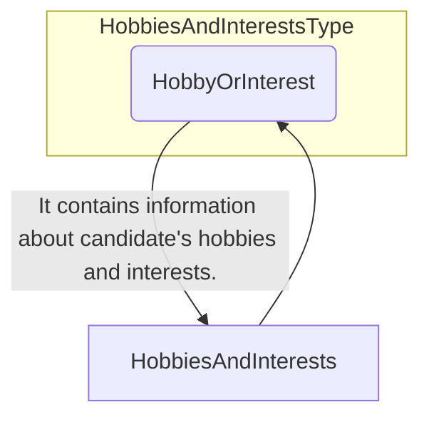

<table>
  <thead>
    <tr>
      <th>Element</th>
      <th>Description</th>
      <th>Cardinality</th>
      <th>Rule</th>
      <th>Examples</th>
    </tr>
  </thead>
  <tbody>
    <tr>
      <td>HobbiesAndInterests</td>
      <td>Information about candidate's Hobbies & Interests</td>
      <td>0..1</td>
      <td>N/A</td>
      <td>N/A</td>
    </tr>
    <tr>
      <td colspan="5"><b>Sub-elements</b></td>
    </tr>
    <tr>
      <td>HobbyOrInterest</td>
      <td>Information about candidate's Hobbies & Interests</td>
      <td>0..n</td>
      <td>N/A</td>
      <td>N/A</td>
    </tr>
    <tr>
      <td></td>
      <td>Refer to ActivityType Elements for sub-elements</td>
      <td></td>
      <td></td>
      <td></td>
    </tr>
  </tbody>
</table>

3.26.2 HobbiesAndInterests Attributes

<table>
  <thead>
    <tr>
      <th>Attributes</th>
      <th>Description</th>
      <th>Card.</th>
      <th>Rule</th>
    </tr>
  </thead>
  <tbody>
    <tr>
      <td colspan="4">This element has no attributes.</td>
    </tr>
    <tr>
      <td colspan="4"><b>HobbyOrInterest attributes</b></td>
    </tr>
    <tr>
      <td>Attributes</td>
      <td>Description</td>
      <td>Card.</td>
      <td>Rule</td>
    </tr>
    <tr>
      <td colspan="4">Refer to ActivityType Attributes for attributes</td>
    </tr>
  </tbody>
</table>

3.27 /CandidateProfile/CreativeWorks

3.27.1 CreativeWorks Element Description

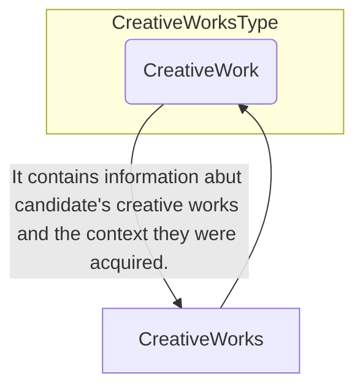

<table>
  <thead>
    <tr>
      <th>Element</th>
      <th>Description</th>
      <th>Cardinality</th>
      <th>Rule</th>
      <th>Examples</th>
    </tr>
  </thead>
  <tbody>
    <tr>
      <td>CreativeWorks</td>
      <td>Information about candidate's creative works and the context they were acquired.</td>
      <td>0..1</td>
      <td>N/A</td>
      <td>N/A</td>
    </tr>
    <tr>
      <td colspan="5"><b>Sub-elements</b></td>
    </tr>
    <tr>
      <td>CreativeWork</td>
      <td>Information about candidate's creative works.</td>
      <td>0..n</td>
      <td>N/A</td>
      <td>N/A</td>
    </tr>
    <tr>
      <td></td>
      <td>Refer to ActivityType Elements for sub-elements</td>
      <td></td>
      <td></td>
      <td></td>
    </tr>
  </tbody>
</table>

3.27.2 CreativeWorks Attributes

<table>
  <thead>
    <tr>
      <th>Attributes</th>
      <th>Description</th>
      <th>Card.</th>
      <th>Rule</th>
    </tr>
  </thead>
  <tbody>
    <tr>
      <td colspan="4">This element has no attributes.</td>
    </tr>
    <tr>
      <td colspan="4"><b>CreativeWork attributes</b></td>
    </tr>
    <tr>
      <td>Attributes</td>
      <td>Description</td>
      <td>Card.</td>
      <td>Rule</td>
    </tr>
    <tr>
      <td colspan="4">Refer to ActivityType Attributes for attributes</td>
    </tr>
  </tbody>
</table>

DG EMPL 2020
&lt;page_number&gt;Page 123 of 160&lt;/page_number&gt;

---


## Page 124

3.28 /CandidateProfile/Projects

3.28.1 Projects Element Description

&lt;img&gt;UML Diagram showing a class "CreativeWorksType" with a multiplicty of 0..∞, connected to a class "Projects" which has a multiplicty of 0..1.&lt;/img&gt;

It contains information about candidate's creative works and the context they were acquired.

<table>
<thead>
<tr>
<th>Element</th>
<th>Description</th>
<th>Cardinality</th>
<th>Rule</th>
<th>Examples</th>
</tr>
</thead>
<tbody>
<tr>
<td><strong>Projects</strong></td>
<td>Information about candidate's projects.</td>
<td>0..1</td>
<td>N/A</td>
<td>N/A</td>
</tr>
<tr>
<td colspan="5"><strong>Sub-elements</strong></td>
</tr>
<tr>
<td><strong>Project</strong></td>
<td>Information about candidate's project.<br/>Refer to ActivityType Elements for sub-elements</td>
<td>0..n</td>
<td>N/A</td>
<td>N/A</td>
</tr>
</tbody>
</table>

3.28.2 Projects Attributes

<table>
<thead>
<tr>
<th>Attributes</th>
<th>Description</th>
<th>Card.</th>
<th>Rule</th>
</tr>
</thead>
<tbody>
<tr>
<td colspan="4">This element has no attributes.</td>
</tr>
<tr>
<td colspan="4"><strong>Project attributes</strong></td>
</tr>
</tbody>
</table>

<table>
<thead>
<tr>
<th>Attributes</th>
<th>Description</th>
<th>Card.</th>
<th>Rule</th>
</tr>
</thead>
<tbody>
<tr>
<td colspan="4">Refer to ActivityType Attributes for attributes</td>
</tr>
</tbody>
</table>

3.29 /CandidateProfile/CommunicationAndInterpersonalSkills

3.29.1 CommunicationAndInterpersonalSkills Element Description

&lt;img&gt;UML Diagram showing a class "CommunicationAndInterpersonalSkillsType" with a multiplicty of 0..∞, connected to a class "CommunicationAndInterpersonalSkills" which has a multiplicty of 0..1.&lt;/img&gt;

It contains information about communication and interpersonal skills. It also specifies in what context they were...

<table>
<thead>
<tr>
<th>Element</th>
<th>Description</th>
<th>Cardinality</th>
<th>Rule</th>
<th>Examples</th>
</tr>
</thead>
<tbody>
<tr>
<td><strong>CommunicationAndInterpersonalSkills</strong></td>
<td>Information about communication and Interpersonal skills. Specify in what context they were acquired.</td>
<td>0..1</td>
<td>N/A</td>
<td>good communication skills gained through my experience as sales manager</td>
</tr>
<tr>
<td colspan="5"><strong>Sub-elements</strong></td>
</tr>
<tr>
<td><strong>CommunicationAndInterpersonalSkill</strong></td>
<td>Information about a communication and interpersonal skills<br/>Refer to SkillsType Elements for sub-elements</td>
<td>0..n</td>
<td>N/A</td>
<td>N/A</td>
</tr>
</tbody>
</table>

3.29.2 CommunicationAndInterpersonalSkills Attributes

<table>
<thead>
<tr>
<th>Attributes</th>
<th>Description</th>
<th>Card.</th>
<th>Rule</th>
</tr>
</thead>
<tbody>
<tr>
<td colspan="4">This element has no attributes.</td>
</tr>
<tr>
<td colspan="4"><strong>CommunicationAndInterpersonalSkill attributes</strong></td>
</tr>
<tr>
<td>Attributes</td>
<td>Description</td>
<td>Card.</td>
<td>Rule</td>
</tr>
<tr>
<td colspan="4">Refer to SkillsType Attributes for attributes</td>
</tr>
</tbody>
</table>

DG EMPL 2020
&lt;page_number&gt;Page 124 of 160&lt;/page_number&gt;

---


## Page 125

3.30 /CandidateProfile/ManagementAndLeadershipSkills

3.30.1 ManagementAndLeadershipSkills Element Description

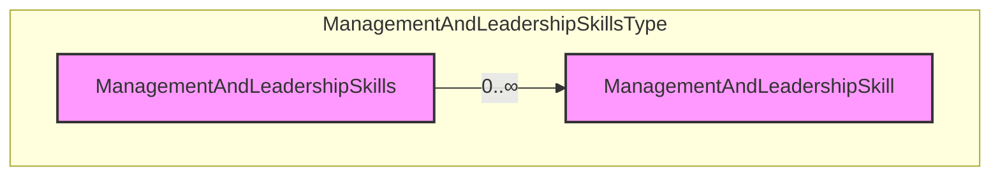

It contains information about candidate's management and leadership skills and the context they were acquired.

<table>
<thead>
<tr>
<th>Element</th>
<th>Description</th>
<th>Cardinality</th>
<th>Rule</th>
<th>Examples</th>
</tr>
</thead>
<tbody>
<tr>
<td>ManagementAndLeadershipSkills</td>
<td>Information about candidate's management/leadership skills and the context they were acquired</td>
<td>0..1</td>
<td>N/A</td>
<td>N/A</td>
</tr>
</tbody>
</table>

Sub-elements

<table>
<thead>
<tr>
<th>ManagementAndLeadershipSkill</th>
<th>Description</th>
<th>Card.</th>
<th>Rule</th>
<th>Examples</th>
</tr>
</thead>
<tbody>
<tr>
<td></td>
<td>Information about candidate's management/leadership skills.<br>Refer to SkillsType Elements for sub-elements</td>
<td>0..n</td>
<td>N/A</td>
<td>N/A</td>
</tr>
</tbody>
</table>

3.30.2 ManagementAndLeadershipSkills Attributes

<table>
<thead>
<tr>
<th>Attributes</th>
<th>Description</th>
<th>Card.</th>
<th>Rule</th>
</tr>
</thead>
<tbody>
<tr>
<td colspan="4">This element has no attributes.</td>
</tr>
</tbody>
</table>

ManagementAndLeadershipSkill attributes

<table>
<thead>
<tr>
<th>Attributes</th>
<th>Description</th>
<th>Card.</th>
<th>Rule</th>
</tr>
</thead>
<tbody>
<tr>
<td colspan="4">Refer to SkillsType Attributes for attributes</td>
</tr>
</tbody>
</table>

3.31 /CandidateProfile/OrganisationalSkills

3.31.1 OrganisationalSkills Element Description

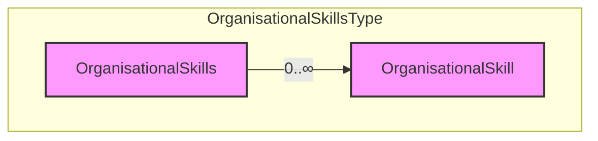

It contains information about candidate's organisational skills and the context they were acquired.

<table>
<thead>
<tr>
<th>Element</th>
<th>Description</th>
<th>Cardinality</th>
<th>Rule</th>
<th>Examples</th>
</tr>
</thead>
<tbody>
<tr>
<td>OrganisationalSkills</td>
<td>Information about candidate's organisational skills and the context they were acquired</td>
<td>0..1</td>
<td>N/A</td>
<td>N/A</td>
</tr>
</tbody>
</table>

Sub-elements

<table>
<thead>
<tr>
<th>OrganisationalSkill</th>
<th>Description</th>
<th>Card.</th>
<th>Rule</th>
<th>Examples</th>
</tr>
</thead>
<tbody>
<tr>
<td></td>
<td>Information about organisational skills acquired by a candidate.<br>Refer to SkillsType Elements for sub-elements</td>
<td>0..n</td>
<td>N/A</td>
<td>N/A</td>
</tr>
</tbody>
</table>

3.31.2 OrganisationalSkills Attributes

<table>
<thead>
<tr>
<th>Attributes</th>
<th>Description</th>
<th>Card.</th>
<th>Rule</th>
</tr>
</thead>
<tbody>
<tr>
<td colspan="4">This element has no attributes.</td>
</tr>
</tbody>
</table>

OrganisationalSkill attributes

<table>
<thead>
<tr>
<th>Attributes</th>
<th>Description</th>
<th>Card.</th>
<th>Rule</th>
</tr>
</thead>
<tbody>
<tr>
<td colspan="4">Refer to SkillsType Attributes for attributes</td>
</tr>
</tbody>
</table>

DG EMPL 2020
&lt;page_number&gt;Page 125 of 160&lt;/page_number&gt;

---


## Page 126

3.32 /CandidateProfile/DigitalSkills

3.32.1 DigitalSkills Element Description

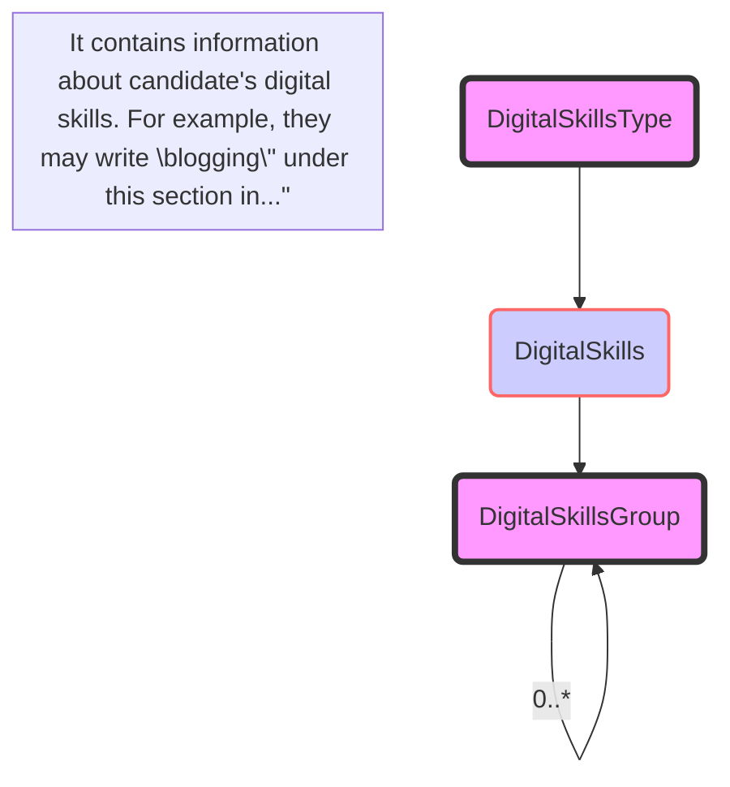

<table>
  <thead>
    <tr>
      <th>Element</th>
      <th>Description</th>
      <th>Cardinality</th>
      <th>Rule</th>
      <th>Examples</th>
    </tr>
  </thead>
  <tbody>
    <tr>
      <td>DigitalSkills</td>
      <td>Digitall skills acquired by a candidate.<br>Provided as free text.</td>
      <td>0..1</td>
      <td>N/A</td>
      <td>N/A</td>
    </tr>
  </tbody>
</table>

Sub-elements

<table>
  <thead>
    <tr>
      <th>Element</th>
      <th>Description</th>
      <th>Cardinality</th>
      <th>Rule</th>
      <th>Examples</th>
    </tr>
  </thead>
  <tbody>
    <tr>
      <td>DigitalSkillsGroup</td>
      <td>Digitall skills acquired by a candidate.</td>
      <td>0..n</td>
      <td>N/A</td>
      <td>Candidate may write “blogging” under this section in their profile. This can be used to suggest relevant ESCO skills such as “WordPress” or “create online news content”</td>
    </tr>
  </tbody>
</table>

Refer to DigitalSkillsGroupType Elements for sub-elements

3.32.2 DigitalSkills Attributes

<table>
  <thead>
    <tr>
      <th>Attributes</th>
      <th>Description</th>
      <th>Card.</th>
      <th>Rule</th>
    </tr>
  </thead>
  <tbody>
    <tr>
      <td colspan="4">This element has no attributes.</td>
    </tr>
  </tbody>
</table>

DigitalSkill attributes

<table>
  <thead>
    <tr>
      <th>Attributes</th>
      <th>Description</th>
      <th>Card.</th>
      <th>Rule</th>
    </tr>
  </thead>
  <tbody>
    <tr>
      <td colspan="4">Refer to DigitalSkillsGroupType Attributes for attributes</td>
    </tr>
  </tbody>
</table>

3.33 /CandidateProfile/NetworksAndMemberships

3.33.1 NetworksAndMemberships Element Description

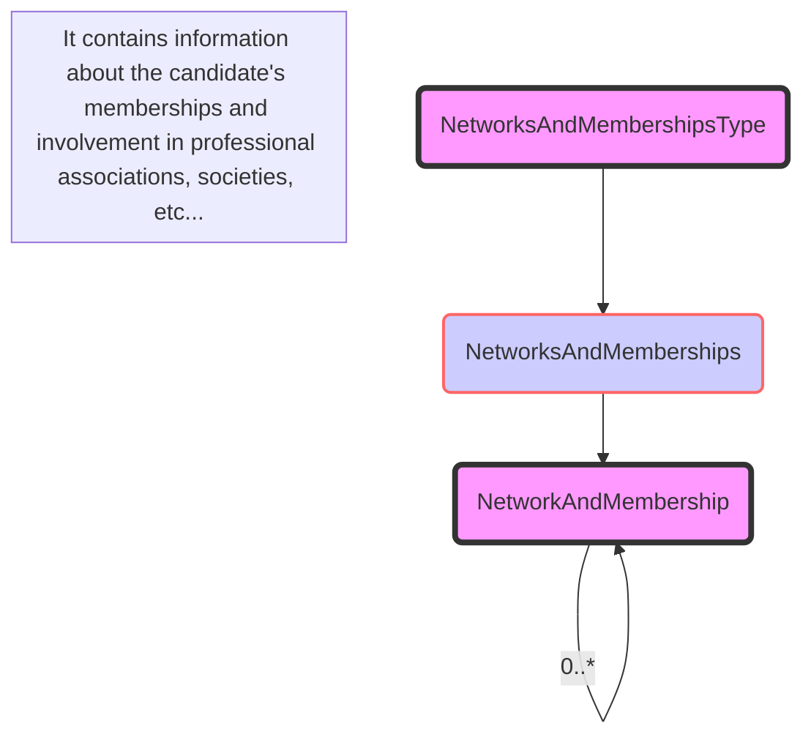

<table>
  <thead>
    <tr>
      <th>Element</th>
      <th>Description</th>
      <th>Cardinality</th>
      <th>Rule</th>
      <th>Examples</th>
    </tr>
  </thead>
  <tbody>
    <tr>
      <td>NetworksAndMemberships</td>
      <td>Specify candidate’s memberships/involvement in professional associations, societies, political parties, sports clubs, etc.</td>
      <td>0..1</td>
      <td>N/A</td>
      <td>N/A</td>
    </tr>
  </tbody>
</table>

Sub-elements

<table>
  <thead>
    <tr>
      <th>Element</th>
      <th>Description</th>
      <th>Cardinality</th>
      <th>Rule</th>
      <th>Examples</th>
    </tr>
  </thead>
  <tbody>
    <tr>
      <td>NetworkAndMembership</td>
      <td>candidate’s memberships/involvement in professional associations, societies, political parties, sports clubs, etc.</td>
      <td>0..n</td>
      <td>N/A</td>
      <td>N/A</td>
    </tr>
  </tbody>
</table>

<footer>DG EMPL 2020</footer>&lt;page_number&gt;Page 126 of 160&lt;/page_number&gt;

---


## Page 127

Refer to SocialAndNetworkingActivityType for more information about the sub-elements of sub-element NetworkAndMembership.

### 3.33.2 NetworksAndMemberships Attributes

<table>
<thead>
<tr>
<th>Attributes</th>
<th>Description</th>
<th>Card.</th>
<th>Rule</th>
</tr>
</thead>
<tbody>
<tr>
<td colspan="4">This element has no attributes.</td>
</tr>
<tr>
<td colspan="4"><strong>NetworkAndMembership attributes</strong></td>
</tr>
</tbody>
</table>

<table>
<thead>
<tr>
<th>Attributes</th>
<th>Description</th>
<th>Card.</th>
<th>Rule</th>
</tr>
</thead>
<tbody>
<tr>
<td colspan="4">Refer to SocialAndNetworkingActivityType for more information</td>
</tr>
</tbody>
</table>

### 3.34 /CandidateProfile/ConferencesAndSeminars

#### 3.34.1 ConferencesAndSeminars Element Description

&lt;img&gt;Diagram showing "ConferencesAndSeminars" with cardinality 0..n and "ConferencesAndSeminar" with cardinality 0..∞&lt;/img&gt;

It contains information about any conferences and seminars that the candidate may have participated in.
For example,...

<table>
<thead>
<tr>
<th>Element</th>
<th>Description</th>
<th>Cardinality</th>
<th>Rule</th>
<th>Examples</th>
</tr>
</thead>
<tbody>
<tr>
<td><strong>ConferencesAndSeminars</strong></td>
<td>Describe any conferences and seminars that they may have participated in. For example, they may have presented their own work or projects, facilitated a workshop, been a panellist or an event organiser yourself, or been a member of a scientific committee, etc.</td>
<td>0..1</td>
<td>N/A</td>
<td>N/A</td>
</tr>
</tbody>
</table>

**Sub-elements**

<table>
<thead>
<tr>
<th></th>
<th></th>
<th></th>
<th></th>
</tr>
</thead>
<tbody>
<tr>
<td><strong>ConferenceAndSeminar</strong></td>
<td>Describe any conferences and seminars that they may have participated in. For example, they may have presented their own work or projects, facilitated a workshop, been a panellist or an event organiser yourself, or been a member of a scientific committee, etc.</td>
<td>0..n</td>
<td>N/A</td>
<td>N/A</td>
</tr>
<tr>
<td></td>
<td>Refer to EventType Elements for sub-elements</td>
<td></td>
<td></td>
<td></td>
</tr>
</tbody>
</table>

#### 3.34.2 ConferencesAndSeminars Attributes

<table>
<thead>
<tr>
<th>Attributes</th>
<th>Description</th>
<th>Card.</th>
<th>Rule</th>
</tr>
</thead>
<tbody>
<tr>
<td colspan="4">This element has no attributes.</td>
</tr>
<tr>
<td colspan="4"><strong>ConferenceAndSeminar attributes</strong></td>
</tr>
<tr>
<td colspan="4"></td>
</tr>
</tbody>
</table>

<table>
<thead>
<tr>
<th>Attributes</th>
<th>Description</th>
<th>Card.</th>
<th>Rule</th>
</tr>
</thead>
<tbody>
<tr>
<td colspan="4">Refer to EventType Attributes for attributes</td>
</tr>
</tbody>
</table>

### 3.35 /CandidateProfile/SocialAndPoliticalActivities

#### 3.35.1 SocialAndPoliticalActivities Element Description

&lt;img&gt;Diagram showing "SocialAndPoliticalActivities" with cardinality 0..n and "SocialAndPoliticalActivity" with cardinality 0..∞&lt;/img&gt;

It contains information about participation in social and political activities.

&lt;page_number&gt;DG EMPL 2020&lt;/page_number&gt; &lt;page_number&gt;Page 127 of 160&lt;/page_number&gt;

---


## Page 128

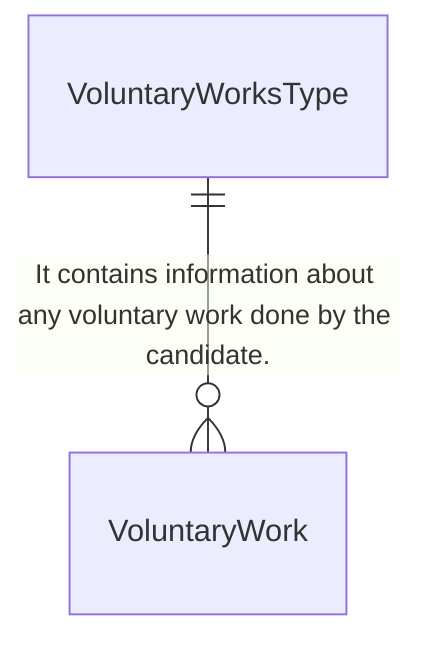

<table>
  <thead>
    <tr>
      <th>Element</th>
      <th>Description</th>
      <th>Cardinality</th>
      <th>Rule</th>
      <th>Examples</th>
    </tr>
  </thead>
  <tbody>
    <tr>
      <td>SocialAndPoliticalActivities</td>
      <td>Information about participation in Social and political activities.</td>
      <td>0..1</td>
      <td>N/A</td>
      <td>N/A</td>
    </tr>
    <tr>
      <td colspan="5"><b>Sub-elements</b></td>
    </tr>
    <tr>
      <td>SocialAndPoliticalActivity</td>
      <td>Information about participation in Social and political activities.<br>Refer to SocialAndNetworkingActivityType for more information about the sub-elements of sub-element SocialAndPoliticalActivity.</td>
      <td>0..n</td>
      <td>N/A</td>
      <td>N/A</td>
    </tr>
  </tbody>
</table>

### 3.35.2 SocialAndPoliticalActivities Attributes

<table>
  <thead>
    <tr>
      <th>Attributes</th>
      <th>Description</th>
      <th>Card.</th>
      <th>Rule</th>
    </tr>
  </thead>
  <tbody>
    <tr>
      <td colspan="4">This element has no attributes.</td>
    </tr>
    <tr>
      <td colspan="4"><b>ConferenceAndSeminar attributes</b></td>
    </tr>
    <tr>
      <td colspan="4">Refer to SocialAndNetworkingActivityType for more information.</td>
    </tr>
  </tbody>
</table>

## 3.36 /CandidateProfile/VoluntaryWorks

### 3.36.1 VoluntaryWorks Element Description

&lt;img&gt;Diagram showing VoluntaryWorksType with elements VoluntaryWorks and VoluntaryWork, and a note that it contains information about any voluntary work done by the candidate.&lt;/img&gt;

<table>
  <thead>
    <tr>
      <th>Element</th>
      <th>Description</th>
      <th>Cardinality</th>
      <th>Rule</th>
      <th>Examples</th>
    </tr>
  </thead>
  <tbody>
    <tr>
      <td>VoluntaryWorks</td>
      <td>Contains information about any voluntary work done by the candidate.</td>
      <td>0..1</td>
      <td>N/A</td>
      <td>N/A</td>
    </tr>
    <tr>
      <td colspan="5"><b>Sub-elements</b></td>
    </tr>
    <tr>
      <td>VoluntaryWork</td>
      <td>Contains information about any voluntary work done by the candidate.<br>Refer to EventType Elements for sub-elements.</td>
      <td>0..n</td>
      <td>N/A</td>
      <td>N/A</td>
    </tr>
  </tbody>
</table>

### 3.36.2 VoluntaryWorks Attributes

<table>
  <thead>
    <tr>
      <th>Attributes</th>
      <th>Description</th>
      <th>Card.</th>
      <th>Rule</th>
    </tr>
  </thead>
  <tbody>
    <tr>
      <td colspan="4">This element has no attributes.</td>
    </tr>
    <tr>
      <td colspan="4"><b>VoluntaryWork attributes</b></td>
    </tr>
    <tr>
      <td colspan="4">Refer to EventType Attributes for attributes.</td>
    </tr>
  </tbody>
</table>

## 3.37 /CandidateProfile/Others

### 3.37.1 Others Element Description

&lt;img&gt;Diagram showing OthersType with elements Title and Other, and a note that it specifies the title of the Others section, and another note that it contains additional information that has not been captured anywhere else.&lt;/img&gt;

<table>
  <thead>
    <tr>
      <th>Element</th>
      <th>Description</th>
      <th>Cardinality</th>
      <th>Rule</th>
      <th>Examples</th>
    </tr>
  </thead>
  <tbody>
    <tr>
      <td>Others</td>
      <td>It specifies the title of the Others section.<br>It contains additional information that has not been captured anywhere else.</td>
      <td>0..∞</td>
      <td>N/A</td>
      <td>N/A</td>
    </tr>
  </tbody>
</table>

<footer>DG EMPL 2020</footer>
&lt;page_number&gt;Page 128 of 160&lt;/page_number&gt;

---


## Page 129

html
<table>
  <thead>
    <tr>
      <th>Element</th>
      <th>Description</th>
      <th>Cardinality</th>
      <th>Rule</th>
      <th>Examples</th>
    </tr>
  </thead>
  <tbody>
    <tr>
      <td><strong>Others</strong></td>
      <td>Additional information about the candidate that has not been captured anywhere in the provided sections.</td>
      <td>0..1</td>
      <td>N/A</td>
      <td>N/A</td>
    </tr>
    <tr>
      <td colspan="5"><strong>Sub-elements</strong></td>
    </tr>
    <tr>
      <td>Title</td>
      <td>It specifies the title of the Others section.</td>
      <td>1</td>
      <td>N/A</td>
      <td>N/A</td>
    </tr>
    <tr>
      <td>Other</td>
      <td>Title and description of the additional information.<br/>Refer to OtherType Elements for sub-elements.</td>
      <td>0..1</td>
      <td>N/A</td>
      <td>N/A</td>
    </tr>
  </tbody>
</table>

3.37.2 <span style="color:#8B4513;">Others Attributes</span>

<table>
  <thead>
    <tr>
      <th>Attributes</th>
      <th>Description</th>
      <th>Card.</th>
      <th>Rule</th>
    </tr>
  </thead>
  <tbody>
    <tr>
      <td colspan="4">This element has no attributes.</td>
    </tr>
    <tr>
      <td colspan="4"><strong>Title attributes</strong></td>
    </tr>
    <tr>
      <td>languageID</td>
      <td>Identifier of the language used in the title</td>
      <td>0..1</td>
      <td></td>
    </tr>
    <tr>
      <td colspan="4"><strong>Other attributes</strong></td>
    </tr>
    <tr>
      <td colspan="4">Refer to OtherType for attributes.</td>
    </tr>
  </tbody>
</table>

3.38 <span style="color:#8B4513;">Common DataType Elements with Attributes</span>

3.38.1 <span style="color:#8B4513;">ActivityType</span>

3.38.1.1 <span style="color:#8B4513;">ActivityType Elements</span>

&lt;img&gt;Diagram showing ActivityType with Title, Date, Description, Link elements&lt;/img&gt;

<table>
  <thead>
    <tr>
      <th>Element</th>
      <th>Description</th>
      <th>Cardinality</th>
      <th>Rule</th>
      <th>Examples</th>
    </tr>
  </thead>
  <tbody>
    <tr>
      <td colspan="5"><strong>Sub-elements</strong></td>
    </tr>
    <tr>
      <td>Title</td>
      <td>Specifies title of the the activity.</td>
      <td>1</td>
      <td>N/A</td>
      <td>N/A</td>
    </tr>
    <tr>
      <td>Date</td>
      <td>Specifies a time period when an activity took place.</td>
      <td>0..n</td>
      <td>N/A</td>
      <td>N/A</td>
    </tr>
    <tr>
      <td>Description</td>
      <td>Specifies description of the activity.</td>
      <td>0..1</td>
      <td>N/A</td>
      <td>N/A</td>
    </tr>
    <tr>
      <td>Link</td>
      <td>Specifies URI link related to the activity.</td>
      <td>0..n</td>
      <td>N/A</td>
      <td>N/A</td>
    </tr>
  </tbody>
</table>

3.38.1.2 <span style="color:#8B4513;">ActivityType Attributes</span>

DG EMPL 2020
&lt;page_number&gt;Page 129 of 160&lt;/page_number&gt;

---


