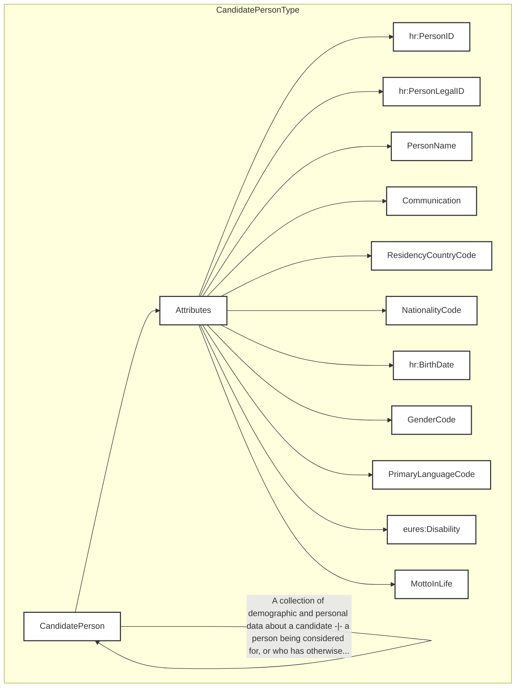

## Page 28

3.5 /CandidatePerson (level 1)

3.5.1 CandidatePerson Element Description



<table>
<thead>
<tr>
<th>Element</th>
<th>Description</th>
<th>Cardinality</th>
<th>Rule</th>
<th>Examples</th>
</tr>
</thead>
<tbody>
<tr>
<td>CandidatePerson</td>
<td>Personal details of the person seeking a job, such as the name,</td>
<td>1</td>
<td>N/A</td>
<td>N/A</td>
</tr>
</tbody>
</table>

DG EMPL 2020
&lt;page_number&gt;Page 28 of 160&lt;/page_number&gt;

---


## Page 29

html
<table>
  <thead>
    <tr>
      <th></th>
      <th>age, gender, and so on.</th>
      <th></th>
      <th></th>
      <th></th>
    </tr>
  </thead>
  <tbody>
    <tr>
      <td colspan="5"><b>Sub-elements</b></td>
    </tr>
    <tr>
      <td><b>PersonID</b></td>
      <td>Systemic identifiers only for this person “Usually fed by the document sender, the recipient also may (and usually does) add his/her own ID, in order to build complex transaction paths”.</td>
      <td>0..n</td>
      <td>N/A</td>
      <td>N/A</td>
    </tr>
    <tr>
      <td><b>PersonLegalID</b></td>
      <td>An identifier issued to a person by a governmental organisation, like a social security or driver’s license number.</td>
      <td>0..n</td>
      <td>N/A</td>
      <td>N/A</td>
    </tr>
    <tr>
      <td><b>PersonName</b></td>
      <td>A detailed set of data about the candidate’s names, such as his/her GivenName, FamilyName, MiddleName, Former Family Name, etc.</td>
      <td>1</td>
      <td>N/A</td>
      <td>N/A</td>
    </tr>
    <tr>
      <td colspan="5">See section /CandidatePerson/PersonName for more information</td>
    </tr>
    <tr>
      <td><b>Communication</b></td>
      <td>The candidate’s contact information. ChannelCode, Address, URI –for email, for instance—, etc.</td>
      <td>0..n</td>
      <td>BR-COM-10: If the Communication element is filled in, at least one of its sub elements should be filled in too.<br><br>See section /CandidatePerson/Communication for more information</td>
      <td>N/A</td>
    </tr>
    <tr>
      <td><b>ResidencyCountryCode</b></td>
      <td>Code specifying the country where the Candidate usually lives</td>
      <td>0..1</td>
      <td>CountriesAndNationalities [ECV02], AuxCountriesAndNationalities [ECV10] code list must be used.</td>
      <td>Europass2:<br>CountriesAndNationalities [ECV02],<br>Europass2:<br>AuxCountriesAndNationalities [ECV10]</td>
    </tr>
    <tr>
      <td><b>NationalityCode</b></td>
      <td>Code specifying the candidate’s nationality</td>
      <td>0..n</td>
      <td>CountriesAndNationalities [ECV02], AuxCountriesAndNationalities [ECV10] code list must be used.<br><br>BR-COM-43: Multiple entries of this code list are allowed.</td>
      <td>Europass2:<br>CountriesAndNationalities [ECV02],<br>Europass2:<br>AuxCountriesAndNationalities [ECV10]</td>
    </tr>
    <tr>
      <td><b>BirthDate</b></td>
      <td>The person’s date of birth</td>
      <td>0..1</td>
      <td>BR-COM-06: Compulsory Date Format: YYYY-MM-DD, YYYY-MM, YYYY or YYYY-MM-DDThh:mm:ss.</td>
      <td>1987-08-05</td>
    </tr>
    <tr>
      <td><b>GenderCode</b></td>
      <td>Code indicating the candidate’s gender (“NotKnown”,</td>
      <td>0..1</td>
      <td>Compulsory use of ECV01-GenderType lists.</td>
      <td>Europass2: GenderType [ECV01]</td>
    </tr>
  </tbody>
</table>
```
DG EMPL 2020
&lt;page_number&gt;Page 29 of 160&lt;/page_number&gt;

---


## Page 30

<table>
  <tr>
    <td></td>
    <td>“Male”, “Female”, “NotSpecified”)</td>
    <td></td>
    <td></td>
    <td></td>
  </tr>
  <tr>
    <td><strong>PrimaryLanguageCode</strong></td>
    <td>The candidate’s primary or preferred language or languages</td>
    <td>0..n</td>
    <td><strong>ECV08:</strong> Languages<br><strong>BR-COM-43:</strong> Multiple entries of this code list are allowed.</td>
    <td>Europass2: Languages [ECV06]</td>
  </tr>
  <tr>
    <td><strong>Disability</strong></td>
    <td>Describes a disability associated with a specific person.</td>
    <td>0..n</td>
    <td>The absence of a Disability element for a candidate will mean “No disabilities”.</td>
    <td>N/A</td>
  </tr>
  <tr>
    <td colspan="5">See section /CandidatePerson/Disability for more information</td>
  </tr>
  <tr>
    <td><strong>MottoInLife</strong></td>
    <td>Aims to capture, in a short sentence, a personal belief, a saying or a purpose (e.g. “Keep calm, take photos”)</td>
    <td>0..1</td>
    <td>limited to 99 characters</td>
    <td>“Keep calm, take photos”</td>
  </tr>
</table>

## 3.5.2 CandidatePerson Attributes

```mermaid
graph TD
    subgraph CandidatePersonType
        A[CandidatePerson]
        B[Attributes]
        C[hr:EffectiveDateAttributeGroup]
        D[@ validFrom]
        E[@ validTo]
        F[HR-XML's 3.0 architecture makes a distinction between effective-date meta data and effective dating that is an integral...]
        G[A collection of demographic and personal data about a candidate -+ a person being considered for, or who has otherwise...]

        A --> B
        A -- "It contains personal details of the person seeking a job, such as his/her name, age, gender, and so on." --> A
        B --> C
        C --> D
        C --> E
        D -- "+" --> D
        E -- "+" --> E
        F --> C
        G --> A
    end
```

<table>
  <thead>
    <tr>
      <th>Attributes</th>
      <th>Description</th>
      <th>Card.</th>
      <th>Rule</th>
    </tr>
  </thead>
  <tbody>
    <tr>
      <td><strong>validFrom</strong></td>
      <td>Validity start date for this entity's information</td>
      <td>0..1</td>
      <td><strong>BR-COM-05:</strong> If not specified, the “validFrom” date will default to “assigned by EURES on reception”.<br><strong>BR-COM-06:</strong> Compulsory Date Format is: YYYY-MM-DD, YYYY-MM, YYYY or YYYY-MM-DDThh:mm:ss.</td>
    </tr>
    <tr>
      <td><strong>validTo</strong></td>
      <td>Validity end date for this entity's information</td>
      <td>0..1</td>
      <td><strong>BR-COM-06:</strong> Compulsory Date Format is: YYYY-MM-DD, YYYY-MM, YYYY or YYYY-MM-DDThh:mm:ss.</td>
    </tr>
  </tbody>
</table>

**PersonID attributes**

<table>
  <thead>
    <tr>
      <th>Attributes</th>
      <th>Description</th>
      <th>Card.</th>
      <th>Rule</th>
    </tr>
  </thead>
  <tbody>
    <tr>
      <td colspan="4">Refer to IdentifierType Attributes for additional attributes.</td>
    </tr>
  </tbody>
</table>

**PersonLegalID attributes**

<table>
  <thead>
    <tr>
      <th>Attributes</th>
      <th>Description</th>
      <th>Card.</th>
      <th>Rule</th>
    </tr>
  </thead>
  <tbody>
    <tr>
      <td colspan="4">Refer to IdentifierType Attributes for additional attributes.</td>
    </tr>
  </tbody>
</table>

**PersonName attributes**

<table>
  <thead>
    <tr>
      <th>Attributes</th>
      <th>Description</th>
      <th>Card.</th>
      <th>Rule</th>
    </tr>
  </thead>
  <tbody>
    <tr>
      <td colspan="4"></td>
    </tr>
  </tbody>
</table>

<footer>DG EMPL 2020</footer>
&lt;page_number&gt;Page 30 of 160&lt;/page_number&gt;

---


## Page 31

See section /CandidatePerson/PersonName for more information

<table>
<thead>
<tr>
<th colspan="4">Communication attributes</th>
</tr>
<tr>
<th>Attributes</th>
<th>Description</th>
<th>Card.</th>
<th>Rule</th>
</tr>
</thead>
<tbody>
<tr>
<td colspan="4">See section /CandidatePerson/Communication for more information</td>
</tr>
</tbody>
</table>

<table>
<thead>
<tr>
<th colspan="4">ResidencyCountryCode attributes</th>
</tr>
<tr>
<th>Attributes</th>
<th>Description</th>
<th>Card.</th>
<th>Rule</th>
</tr>
</thead>
<tbody>
<tr>
<td>validFrom</td>
<td>Validity start date as a resident of the country</td>
<td>0..1</td>
<td>BR-COM-06: Compulsory Date Format is: YYYY-MM-DD, YYYY-MM, YYYY or YYYY-MM-DDThh:mm:ss.</td>
</tr>
<tr>
<td>validTo</td>
<td>Validity end date as a resident of the country</td>
<td>0..1</td>
<td>BR-COM-06: Compulsory Date Format is: YYYY-MM-DD, YYYY-MM, YYYY or YYYY-MM-DDThh:mm:ss.</td>
</tr>
</tbody>
</table>

Refer to CodeListAttributeGroup Attributes for additional attributes.

<table>
<thead>
<tr>
<th colspan="4">NationalityCode attributes</th>
</tr>
<tr>
<th>Attributes</th>
<th>Description</th>
<th>Card.</th>
<th>Rule</th>
</tr>
</thead>
<tbody>
<tr>
<td colspan="4">The same as ResidencyCountryCode attributes</td>
</tr>
</tbody>
</table>

<table>
<thead>
<tr>
<th colspan="4">BirthDate attributes</th>
</tr>
<tr>
<th>Attributes</th>
<th>Description</th>
<th>Card.</th>
<th>Rule</th>
</tr>
</thead>
<tbody>
<tr>
<td colspan="4">This sub-element has no attributes.</td>
</tr>
</tbody>
</table>

<table>
<thead>
<tr>
<th colspan="4">GenderCode attributes</th>
</tr>
<tr>
<th>Attributes</th>
<th>Description</th>
<th>Card.</th>
<th>Rule</th>
</tr>
</thead>
<tbody>
<tr>
<td colspan="4">Refer to CodeListAttributeGroup attributes for additional attributes.</td>
</tr>
</tbody>
</table>

<table>
<thead>
<tr>
<th colspan="4">PrimaryLanguageCode attributes</th>
</tr>
<tr>
<th>Attributes</th>
<th>Description</th>
<th>Card.</th>
<th>Rule</th>
</tr>
</thead>
<tbody>
<tr>
<td>typeCode</td>
<td>It specifies type of the selected language: NORMAL, SIGN, CLASSSIC or FREETEXT.</td>
<td>0..1</td>
<td>The values must be: NORMAL, SIGN, CLASSSIC or FREETEXT.</td>
</tr>
</tbody>
</table>

Refer to CodeListAttributeGroup attributes for additional attributes.

<table>
<thead>
<tr>
<th colspan="4">Disability attributes</th>
</tr>
<tr>
<th>Attributes</th>
<th>Description</th>
<th>Card.</th>
<th>Rule</th>
</tr>
</thead>
<tbody>
<tr>
<td colspan="4">See section /CandidatePerson/Disability for more information</td>
</tr>
</tbody>
</table>

<table>
<thead>
<tr>
<th colspan="4">MottoInLife attributes</th>
</tr>
<tr>
<th>Attributes</th>
<th>Description</th>
<th>Card.</th>
<th>Rule</th>
</tr>
</thead>
<tbody>
<tr>
<td>languageID</td>
<td>The language in which the name of the Party is mentioned.</td>
<td>0..1</td>
<td></td>
</tr>
</tbody>
</table>

DG EMPL 2020
&lt;page_number&gt;Page 31 of 160&lt;/page_number&gt;

---


