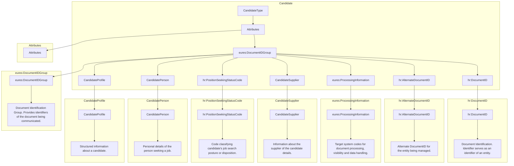

## Page 12

# 3 Europass XML Document elements, their structure and datatypes

The Europass schema uses the following namespace definitions:

*   `xmlns="http://www.europass.eu/1.0"`
*   `xmlns:hr=http://www.hr-xml.org/3`
*   `xmlns:oa="http://www.openapplications.org/oagis/9"`
*   `xmlns:xsi=http://www.w3.org/2001/XMLSchema-instance`
*   `xmlns:eures="http://www.europass_eures.eu/1.0"`

## 3.1 /Candidate (level 0)

Candidate is the root element of Europass2 XML document. This element defines a candidate, i.e. jobseeker or Job changer’s CV that is exchanged between an Employment Services (ES) and Interoperability Platform and that is to be matched with open Job Vacancies.

### 3.1.1 Candidate Element Description



<footer>DG EMPL 2020</footer>&lt;page_number&gt;Page 12 of 160&lt;/page_number&gt;

---


## Page 13

<table>
  <thead>
    <tr>
      <th>Element</th>
      <th>Description</th>
      <th>Cardinality</th>
      <th>Rule</th>
      <th>Examples</th>
    </tr>
  </thead>
  <tbody>
    <tr>
      <td><strong>Candidate</strong></td>
      <td>The root element containing the definition of a candidate, i.e. jobseeker or Job changer’s CV that is exchanged between an ES and Interoperability Platform and that is to be matched with open Job Vacancies.<br><br>Only one candidate element is allowed.</td>
      <td>1</td>
      <td>BR-CV-02: Only One Candidate (CV) per XML document instance is allowed.</td>
      <td>N/A</td>
    </tr>
    <tr>
      <td colspan="5"><strong>Sub-elements</strong></td>
    </tr>
    <tr>
      <td><strong>DocumentID</strong></td>
      <td>Original document identifier (id within document supplier system). Provided by first sender of the document! ID issued by first publishing system. (Originator).</td>
      <td>1</td>
      <td>BR-COM-4: The Document ID identifier must be a UUID and it must be provided by the first sender of the document.<br><br>schemeVersionID attribute should use of ECV09-VersionCodes list.</td>
      <td>N/A</td>
    </tr>
    <tr>
      <td><strong>AlternateDocumentID</strong></td>
      <td>Alternate/Additional document identifier (e.g. id within eures information system). (Republishers)<br><br>Additional identifiers for this document. If EURES has to exchange this document with third parties, a EURES alternate ID (only an identifier within the EURES information system) is added. This construct is designed to allow for these different identifications.</td>
      <td>0..n</td>
      <td>N/A</td>
      <td>N/A</td>
    </tr>
    <tr>
      <td><strong>ProcessingInformation</strong></td>
      <td>Includes the target system codes that are related to document processing.<br><br>In EURES, this element is used to carry “visibility” and “data protection” instructions to the Interoperability Portal.<br><br>See the description of this element for more details.</td>
      <td>0..1</td>
      <td><strong>Information:</strong> If the /Candidate /Processing Information element is not present in a Candidate’s XML document instance, no visibility restrictions concerning this CV will be applied (i.e., all fields will be visible)</td>
      <td>N/A</td>
    </tr>
  </tbody>
</table>

See section /ProcessingInformation for more information.

DG EMPL 2020
&lt;page_number&gt;Page 13 of 160&lt;/page_number&gt;

---


## Page 14

html
<table>
  <thead>
    <tr>
      <th></th>
      <th></th>
      <th></th>
      <th></th>
      <th></th>
    </tr>
  </thead>
  <tbody>
    <tr>
      <td><strong>CandidateSupplier</strong></td>
      <td>Information about the supplier of the candidate details. This can be the candidate him/herself through the EURES Portal, or a third party (a PES, for instance).</td>
      <td>1..n</td>
      <td>N/A</td>
      <td>N/A</td>
    </tr>
    <tr>
      <td></td>
      <td colspan="4">See section /CandidateSupplier for more information.</td>
    </tr>
    <tr>
      <td><strong>PositionSeekingStatus</strong></td>
      <td>A code classifying the candidate's job search pattern or disposition. (e.g. "Active", "Passive", "NotConsideringPositions").</td>
      <td>0..1</td>
      <td>BR-CV-4: The "PositionSeekingCodeContentType" HR-Open Standards Code List must be used to codify the /Candidate /Position Seeking Status.</td>
      <td>"Active", "Passive", "NotConsideringPositions"<br><br>HR-Open:<br>PositionSeekingStatusEnumType<br>[CL39]</td>
    </tr>
    <tr>
      <td><strong>CandidatePerson</strong></td>
      <td>Personal details of the person seeking a job, such as his/her name, age, gender, and so on.</td>
      <td>1</td>
      <td>N/A</td>
      <td>N/A</td>
    </tr>
    <tr>
      <td></td>
      <td colspan="4">See section /CandidatePerson for more information.</td>
    </tr>
    <tr>
      <td><strong>CandidateProfile</strong></td>
      <td>The candidate's structured set of characteristics, such as his/her Qualifications, Work Experience, and so on.<br><br>More than one profile is allowed in order to provide the information in different languages. Thus the need for cardinality 1..n.<br><br>It is the responsibility of the person who builds up the CV to make sure that a profile is expressed in the same language and those different profile language versions contain exactly the same information.</td>
      <td>1..n</td>
      <td>BR-COM-01: If not otherwise specified, "English" is used as the default language.<br><br>BR-COM-02: Multiple profiles are allowed, but it must be expressed in different languages.</td>
      <td>N/A</td>
    </tr>
    <tr>
      <td></td>
      <td colspan="4">See section /CandidateProfile for more information.</td>
    </tr>
  </tbody>
</table>
```

DG EMPL 2020
&lt;page_number&gt;Page 14 of 160&lt;/page_number&gt;

---


## Page 15

*Error processing this page: cannot access local variable 'e' where it is not associated with a value*


