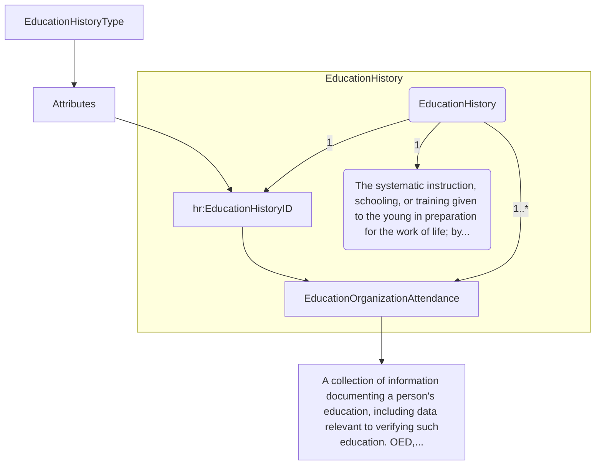
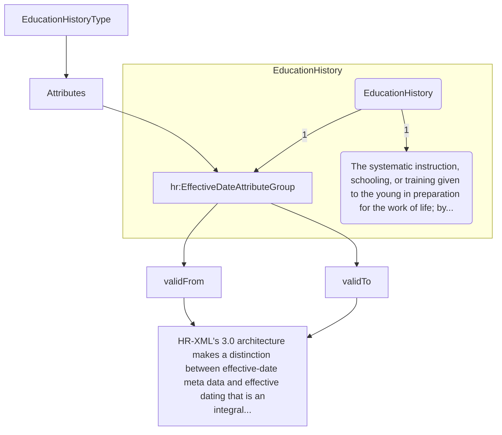
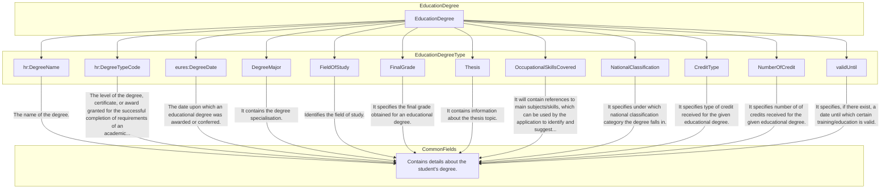
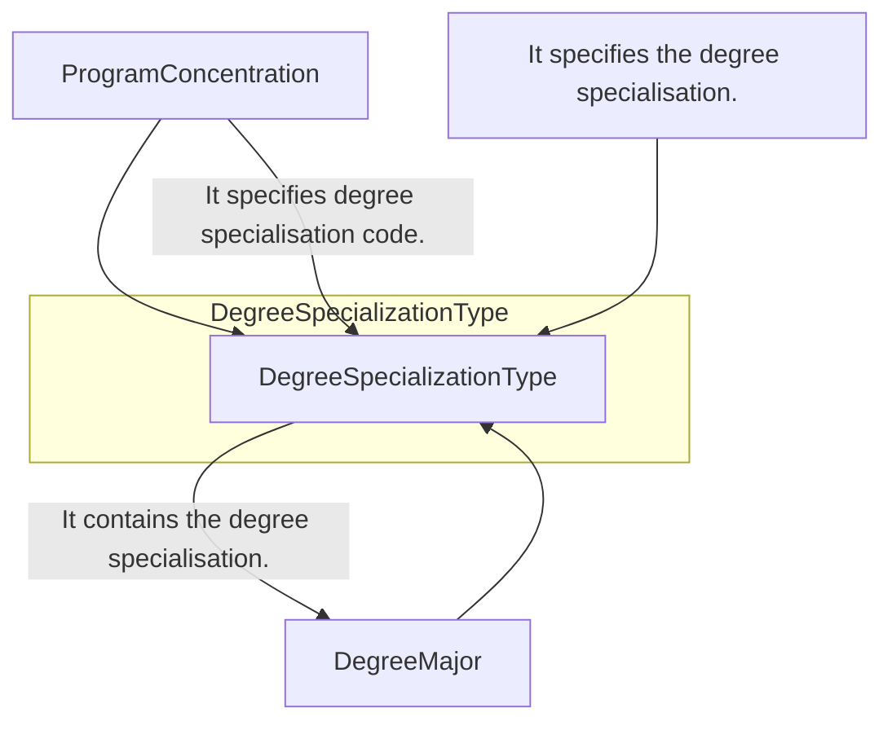
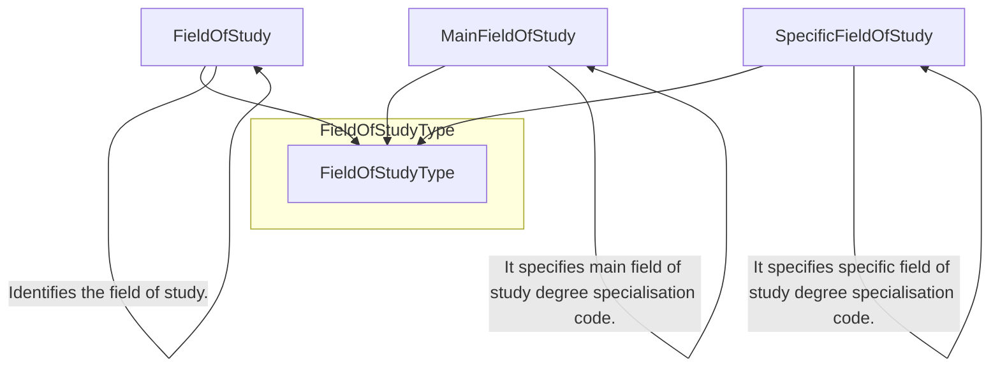
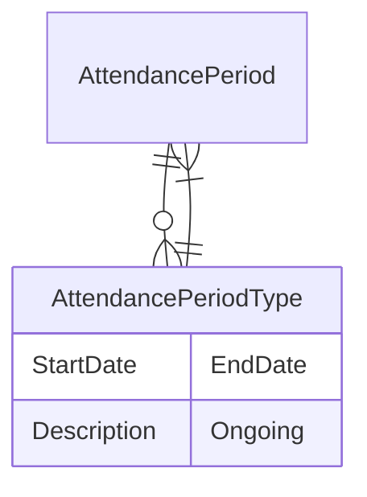
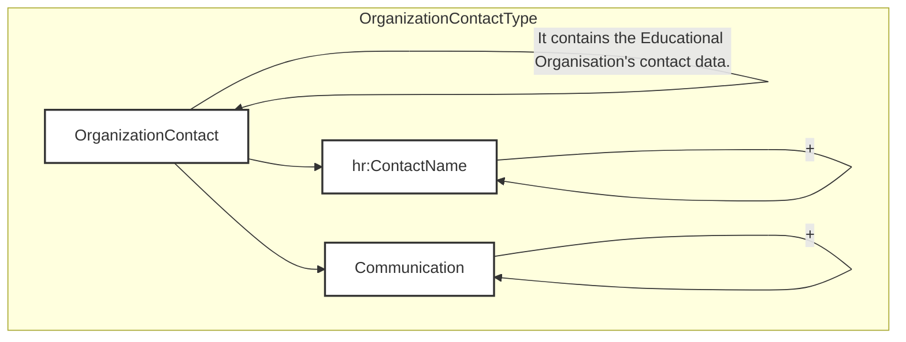
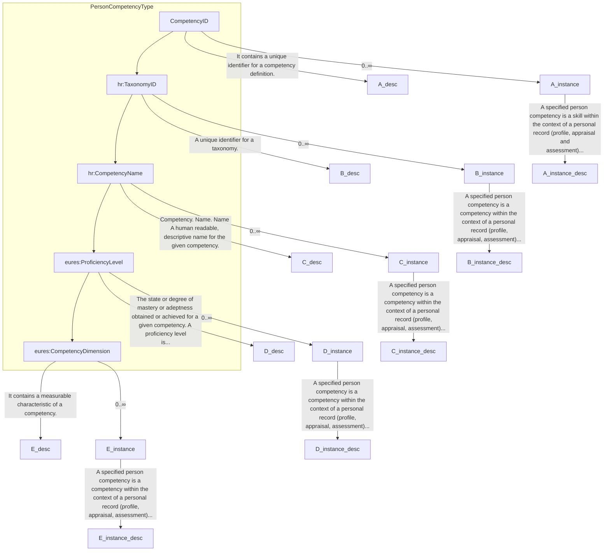

## 3.11 /CandidateProfile/EducationHistory (level 2)

### 3.11.1 EducationHistory Element Description



<table>
  <thead>
    <tr>
      <th>Element</th>
      <th>Description</th>
      <th>Cardinality</th>
      <th>Rule</th>
      <th>Examples</th>
    </tr>
  </thead>
  <tbody>
    <tr>
      <td><strong>EducationHistory</strong></td>
      <td>A collection of information documenting a person's education, including data relevant to verifying such
        education, continuous education, schooling or training in preparation for work life; by extension, similar
        instruction or training obtained as an adult.</td>
      <td>1</td>
      <td>N/A</td>
      <td>N/A</td>
    </tr>
    <tr>
      <td colspan="5"><strong>Sub-elements</strong></td>
    </tr>
    <tr>
      <td><strong>EducationHistoryID</strong></td>
      <td>A key by which to distinguish or refer to information about a person's education.</td>
      <td>0..1</td>
      <td>N/A</td>
      <td>N/A</td>
    </tr>
    <tr>
      <td><strong>EducationOrganizationAttendance</strong></td>
      <td>A detailed set of data with details regarding a person's attendance at an educational institution<br>See
        section /CandidateProfile/EducationHistory /EducationOrganizationAttendance for more information</td>
      <td>1..n</td>
      <td>N/A</td>
      <td>N/A</td>
    </tr>
  </tbody>
</table>

### 3.11.2 EducationHistory Attributes



<table>
  <thead>
    <tr>
      <th>Attributes</th>
      <th>Description</th>
      <th>Card.</th>
      <th>Rule</th>
    </tr>
  </thead>
  <tbody>
    <tr>
      <td><strong>validFrom</strong></td>
      <td>Validity start date for this entity's information</td>
      <td>0..1</td>
      <td>BR-COM-06: Compulsory Date Format: YYYY-MM-DD, YYYY-MM, YYYY or YYYY-MM-DDThh:mm:ss.</td>
    </tr>
  </tbody>
</table>


<table>
  <tr>
    <td><strong>validTo</strong></td>
    <td>Validity end date for this entity's information</td>
    <td>0..1</td>
    <td>BR-COM-06: Compulsory Date Format: YYYY-MM-DD, YYYY-MM, YYYY-MM-DDThh:mm:ss.</td>
  </tr>
</table>

**EducationHistoryID attributes**

<table>
  <thead>
    <tr>
      <th>Attributes</th>
      <th>Description</th>
      <th>Card.</th>
      <th>Rule</th>
    </tr>
  </thead>
  <tbody>
    <tr>
      <td colspan="4">Refer to IdentifierType Attributes for additional attributes.</td>
    </tr>
  </tbody>
</table>

**EducationOrganizationAttendance attributes**

<table>
  <thead>
    <tr>
      <th>Attributes</th>
      <th>Description</th>
      <th>Card.</th>
      <th>Rule</th>
    </tr>
  </thead>
  <tbody>
    <tr>
      <td colspan="4">See section /CandidateProfile/EducationHistory /EducationOrganizationAttendance for more
        information</td>
    </tr>
  </tbody>
</table>

### 3.11.3 Sub-element: /CandidateProfile/EducationHistory/EducationOrganizationAttendance (level 3)

#### 3.11.3.1 EducationOrganizationAttendance Element Description

```mermaid
graph TD
subgraph EducationOrganizationAttendanceType
A[hr:EducationalOrganizationID] --> B{It contains identifier of the Educational Organisation.}
C[hr:OrganizationName] --> D{Usually an official or legal name by which to refer to an organization.}
E[OrganizationContact] --> F{It contains the Educational Organisation's contact data.}
G[hr:ProgramName] --> H{It contains title of the qualification.}
I[EducationalLevelCode] --> J{"A code classifying the level of educational organisation."}
K[AttendancePeriod] --> L{It contains free form options for representing attendance period data.}
M[EducationalDegree] --> N{It contains details about the student's degree.}
O[Link] --> P{It specifies website link.}
end

subgraph EducationOrganizationAttendanceBaseType (extension base)
A --> A
C --> C
E --> E
G --> G
I --> I
K --> K
M --> M
O --> O
end

subgraph EducationOrganizationAttendance
A -- 0..∞ --> A
C -- 0..∞ --> C
E -- 0..∞ --> E
G -- 0..∞ --> G
I -- 0..∞ --> I
K -- 0..∞ --> K
M -- 0..∞ --> M
O -- 1..∞ --> O
end

subgraph EducationOrganizationAttendance
A -- 1..∞ --> A
C -- 0..∞ --> C
E -- 0..∞ --> E
G -- 0..∞ --> G
I -- 0..∞ --> I
K -- 0..∞ --> K
M -- 0..∞ --> M
O -- 1..∞ --> O
end

subgraph EducationOrganizationAttendance
A -- 1..∞ --> A
C -- 0..∞ --> C
E -- 0..∞ --> E
G -- 0..∞ --> G
I -- 0..∞ --> I
K -- 0..∞ --> K
M -- 0..∞ --> M
O -- 1..∞ --> O
end

subgraph EducationOrganizationAttendance
A -- 1..∞ --> A
C -- 0..∞ --> C
E -- 0..∞ --> E
G -- 0..∞ --> G
I -- 0..∞ --> I
K -- 0..∞ --> K
M -- 0..∞ --> M
O -- 1..∞ --> O
end

subgraph EducationOrganizationAttendance
A -- 1..∞ --> A
C -- 0..∞ --> C
E -- 0..∞ --> E
G -- 0..∞ --> G
I -- 0..∞ --> I
K -- 0..∞ --> K
M -- 0..∞ --> M
O -- 1..∞ --> O
end

subgraph EducationOrganizationAttendance
A -- 1..∞ --> A
C -- 0..∞ --> C
E -- 0..∞ --> E
G -- 0..∞ --> G
I -- 0..∞ --> I
K -- 0..∞ --> K
M -- 0..∞ --> M
O -- 1..∞ --> O
end

subgraph EducationOrganizationAttendance
A -- 1..∞ --> A
C -- 0..∞ --> C
E -- 0..∞ --> E
G -- 0..∞ --> G
I -- 0..∞ --> I
K -- 0..∞ --> K
M -- 0..∞ --> M
O -- 1..∞ --> O
end

subgraph EducationOrganizationAttendance
A -- 1..∞ --> A
C -- 0..∞ --> C
E -- 0..∞ --> E
G -- 0..∞ --> G
I -- 0..∞ --> I
K -- 0..∞ --> K
M -- 0..∞ --> M
O -- 1..∞ --> O
end

subgraph EducationOrganizationAttendance
A -- 1..∞ --> A
C -- 0..∞ --> C
E -- 0..∞ --> E
G -- 0..∞ --> G
I -- 0..∞ --> I
K -- 0..∞ --> K
M -- 0..∞ --> M
O -- 1..∞ --> O
end

subgraph EducationOrganizationAttendance
A -- 1..∞ --> A
C -- 0..∞ --> C
E -- 0..∞ --> E
G -- 0..∞ --> G
I -- 0..∞ --> I
K -- 0..∞ --> K
M -- 0..∞ --> M
O -- 1..∞ --> O
end

subgraph EducationOrganizationAttendance
A -- 1..∞ --> A
C -- 0..∞ --> C
E -- 0..∞ --> E
G -- 0..∞ --> G
I -- 0..∞ --> I
K -- 0..∞ --> K
M -- 0..∞ --> M
O -- 1..∞ --> O
end

subgraph EducationOrganizationAttendance
A -- 1..∞ --> A
C -- 0..∞ --> C
E -- 0..∞ --> E
G -- 0..∞ --> G
I -- 0..∞ --> I
K -- 0..∞ --> K
M -- 0..∞ --> M
O -- 1..∞ --> O
end

subgraph EducationOrganizationAttendance
A -- 1..∞ --> A
C -- 0..∞ --> C
E -- 0..∞ --> E
G -- 0..∞ --> G
I -- 0..∞ --> I
K -- 0..∞ --> K
M -- 0..∞ --> M
O -- 1..∞ --> O
end

subgraph EducationOrganizationAttendance
A -- 1..∞ --> A
C -- 0..∞ --> C
E -- 0..∞ --> E
G -- 0..∞ --> G
I -- 0..∞ --> I
K -- 0..∞ --> K
M -- 0..∞ --> M
O -- 1..∞ --> O
end

subgraph EducationOrganizationAttendance
A -- 1..∞ --> A
C -- 0..∞ --> C
E -- 0..∞ --> E
G -- 0..∞ --> G
I -- 0..∞ --> I
K -- 0..∞ --> K
M -- 0..∞ --> M
O -- 1..∞ --> O
end

subgraph EducationOrganizationAttendance
A -- 1..∞ --> A
C -- 0..∞ --> C
E -- 0..∞ --> E
G -- 0..∞ --> G
I -- 0..∞ --> I
K -- 0..∞ --> K
M -- 0..∞ --> M
O -- 1..∞ --> O
end

subgraph EducationOrganizationAttendance
A -- 1..∞ --> A
C -- 0..∞ --> C
E -- 0..∞ --> E
G -- 0..∞ --> G
I -- 0..∞ --> I
K -- 0..∞ --> K
M -- 0..∞ --> M
O -- 1..∞ --> O
end

subgraph EducationOrganizationAttendance
A -- 1..∞ --> A
C -- 0..∞ --> C
E -- 0..∞ --> E
G -- 0..∞ --> G
I -- 0..∞ --> I
K -- 0..∞ --> K
M -- 0..∞ --> M
O -- 1..∞ --> O
end

subgraph EducationOrganizationAttendance
A -- 1..∞ --> A
C -- 0..∞ --> C
E -- 0..∞ --> E
G -- 0..∞ --> G
I -- 0..∞ --> I
K -- 0..∞ --> K
M -- 0..∞ --> M
O -- 1..∞ --> O
end

subgraph EducationOrganizationAttendance
A -- 1..∞ --> A
C -- 0..∞ --> C
E -- 0..∞ --> E
G -- 0..∞ --> G
I -- 0..∞ --> I
K -- 0..∞ --> K
M -- 0..∞ --> M
O -- 1..∞ --> O
end

subgraph EducationOrganizationAttendance
A -- 1..∞ --> A
C -- 0..∞ --> C
E -- 0..∞ --> E
G -- 0..∞ --> G
I -- 0..∞ --> I
K -- 0..∞ --> K
M -- 0..∞ --> M
O -- 1..∞ --> O
end

subgraph EducationOrganizationAttendance
A -- 1..∞ --> A
C -- 0..∞ --> C
E -- 0..∞ --> E
G -- 0..∞ --> G
I -- 0..∞ --> I
K -- 0..∞ --> K
M -- 0..∞ --> M
O -- 1..∞ --> O
end

subgraph EducationOrganizationAttendance
A -- 1..∞ --> A
C -- 0..∞ --> C
E -- 0..∞ --> E
G -- 0..∞ --> G
I -- 0..∞ --> I
K -- 0..∞ --> K
M -- 0..∞ --> M
O -- 1..∞ --> O
end

subgraph EducationOrganizationAttendance
A -- 1..∞ --> A
C -- 0..∞ --> C
E -- 0..∞ --> E
G -- 0..∞ --> G
I -- 0..∞ --> I
K -- 0..∞ --> K
M -- 0..∞ --> M
O -- 1..∞ --> O
end

subgraph EducationOrganizationAttendance
A -- 1..∞ --> A
C -- 0..∞ --> C
E -- 0..∞ --> E
G -- 0..∞ --> G
I -- 0..∞ --> I
K -- 0..∞ --> K
M -- 0..∞ --> M
O -- 1..∞ --> O
end

subgraph EducationOrganizationAttendance
A -- 1..∞ --> A
C -- 0..∞ --> C
E -- 0..∞ --> E
G -- 0..∞ --> G
I -- 0..∞ --> I
K -- 0..∞ --> K
M -- 0..∞ --> M
O -- 1..∞ --> O
end

subgraph EducationOrganizationAttendance
A -- 1..∞ --> A
C -- 0..∞ --> C
E -- 0..∞ --> E
G -- 0..∞ --> G
I -- 0..∞ --> I
K -- 0..∞ --> K
M -- 0..∞ --> M
O -- 1..∞ --> O
end

subgraph EducationOrganizationAttendance
A -- 1..∞ --> A
C -- 0..∞ --> C
E -- 0..∞ --> E
G -- 0..∞ --> G
I -- 0..∞ --> I
K -- 0..∞ --> K
M -- 0..∞ --> M
O -- 1..∞ --> O
end

subgraph EducationOrganizationAttendance
A -- 1..∞ --> A
C -- 0..∞ --> C
E -- 0..∞ --> E
G -- 0..∞ --> G
I -- 0..∞ --> I
K -- 0..∞ --> K
M -- 0..∞ --> M
O -- 1..∞ --> O
end

subgraph EducationOrganizationAttendance
A -- 1..∞ --> A
C -- 0..∞ --> C
E -- 0..∞ --> E
G -- 0..∞ --> G
I -- 0..∞ --> I
K -- 0..∞ --> K
M -- 0..∞ --> M
O -- 1..∞ --> O
end

subgraph EducationOrganizationAttendance
A -- 1..∞ --> A
C -- 0..∞ --> C
E -- 0..∞ --> E
G -- 0..∞ --> G
I -- 0..∞ --> I
K -- 0..∞ --> K
M -- 0..∞ --> M
O -- 1..∞ --> O
end

subgraph EducationOrganizationAttendance
A -- 1..∞ --> A
C -- 0..∞ --> C
E -- 0..∞ --> E
G -- 0..∞ --> G
I -- 0..∞ --> I
K -- 0..∞ --> K
M -- 0..∞ --> M
O -- 1..∞ --> O
end

subgraph EducationOrganizationAttendance
A -- 1..∞ --> A
C -- 0..∞ --> C
E -- 0..∞ --> E
G -- 0..∞ --> G
I -- 0..∞ --> I
K -- 0..∞ --> K
M -- 0..∞ --> M
O -- 1..∞ --> O
end

subgraph EducationOrganizationAttendance
A -- 1..∞ --> A
C -- 0..∞ --> C
E -- 0..∞ --> E
G -- 0..∞ --> G
I -- 0..∞ --> I
K -- 0..∞ --> K
M -- 0..∞ --> M
O -- 1..∞ --> O
end

subgraph EducationOrganizationAttendance
A -- 1..∞ --> A
C -- 0..∞ --> C
E -- 0..∞ --> E
G -- 0..∞ --> G
I -- 0..∞ --> I
K -- 0..∞ --> K
M -- 0..∞ --> M
O -- 1..∞ --> O
end

subgraph EducationOrganizationAttendance
A -- 1..∞ --> A
C -- 0..∞ --> C
E -- 0..∞ --> E
G -- 0..∞ --> G
I -- 0..∞ --> I
K -- 0..∞ --> K
M -- 0..∞ --> M
O -- 1..∞ --> O
end

subgraph EducationOrganizationAttendance
A -- 1..∞ --> A
C -- 0..∞ --> C
E -- 0..∞ --> E
G -- 0..∞ --> G
I -- 0..∞ --> I
K -- 0..∞ --> K
M -- 0..∞ --> M
O -- 1..∞ --> O
end

subgraph EducationOrganizationAttendance
A -- 1..∞ --> A
C -- 0..∞ --> C
E -- 0..∞ --> E
G -- 0..∞ --> G
I -- 0..∞ --> I
K -- 0..∞ --> K
M -- 0..∞ --> M
O -- 1..∞ --> O
end

subgraph EducationOrganizationAttendance
A -- 1..∞ --> A
C -- 0..∞ --> C
E -- 0..∞ --> E
G -- 0..∞ --> G
I -- 0..∞ --> I
K -- 0..∞ --> K
M -- 0..∞ --> M
O -- 1..∞ --> O
end

subgraph EducationOrganizationAttendance
A -- 1..∞ --> A
C -- 0..∞ --> C
E -- 0..∞ --> E
G -- 0..∞ --> G
I -- 0..∞ --> I
K -- 0..∞ --> K
M -- 0..∞ --> M
O -- 1..∞ --> O
end

subgraph EducationOrganizationAttendance
A -- 1..∞ --> A
C -- 0..∞ --> C
E -- 0..∞ --> E
G -- 0..∞ --> G
I -- 0..∞ --> I
K -- 0..∞ --> K
M -- 0..∞ --> M
O -- 1..∞ --> O
end

subgraph EducationOrganizationAttendance
A -- 1..∞ --> A
C -- 0..∞ --> C
E -- 0..∞ --> E
G -- 0..∞ --> G
I -- 0..∞ --> I
K -- 0..∞ --> K
M -- 0..∞ --> M
O -- 1..∞ --> O
end

subgraph EducationOrganizationAttendance
A -- 1..∞ --> A
C -- 0..∞ --> C
E -- 0..∞ --> E
G -- 0..∞ --> G
I -- 0..∞ --> I
K -- 0..∞ --> K
M -- 0..∞ --> M
O -- 1..∞ --> O
end

subgraph EducationOrganizationAttendance
A -- 1..∞ --> A
C -- 0..∞ --> C
E -- 0..∞ --> E
G -- 0..∞ --> G
I -- 0..∞ --> I
K -- 0..∞ --> K
M -- 0..∞ --> M
O -- 1..∞ --> O
end

subgraph EducationOrganizationAttendance
A -- 1..∞ --> A
C -- 0..∞ --> C
E -- 0..∞ --> E
G -- 0..∞ --> G
I -- 0..∞ --> I
K -- 0..∞ --> K
M -- 0..∞ --> M
O -- 1..∞ --> O
end

subgraph EducationOrganizationAttendance
A -- 1..∞ --> A
C -- 0..∞ --> C
E -- 0..∞ --> E
G -- 0..∞ --> G
I -- 0..∞ --> I
K -- 0..∞ --> K
M -- 0..∞ --> M
O -- 1..∞ --> O
end

subgraph EducationOrganizationAttendance
A -- 1..∞ --> A
C -- 0..∞ --> C
E -- 0..∞ --> E
G -- 0..∞ --> G
I -- 0..∞ --> I
K -- 0..∞ --> K
M -- 0..∞ --> M
O -- 1..∞ --> O
end

subgraph EducationOrganizationAttendance
A -- 1..∞ --> A
C -- 0..∞ --> C
E -- 0..∞ --> E
G -- 0..∞ --> G
I -- 0..∞ --> I
K -- 0..∞ --> K
M -- 0..∞ --> M
O -- 1..∞ --> O
end

subgraph EducationOrganizationAttendance
A -- 1..∞ --> A
C -- 0..∞ --> C
E -- 0..∞ --> E
G -- 0..∞ --> G
I -- 0..∞ --> I
K -- 0..∞ --> K
M -- 0..∞ --> M
O -- 1..∞ --> O
end

subgraph EducationOrganizationAttendance
A -- 1..∞ --> A
C -- 0..∞ --> C
E -- 0..∞ --> E
G -- 0..∞ --> G
I -- 0..∞ --> I
K -- 0..∞ --> K
M -- 0..∞ --> M
O -- 1..∞ --> O
end

subgraph EducationOrganizationAttendance
A -- 1..∞ --> A
C -- 0..∞ --> C
E -- 0..∞ --> E
G -- 0..∞ --> G
I -- 0..∞ --> I
K -- 0..∞ --> K
M -- 0..∞ --> M
O -- 1..∞ --> O
end

subgraph EducationOrganizationAttendance
A -- 1..∞ --> A
C -- 0..∞ --> C
E -- 0..∞ --> E
G -- 0..∞ --> G
I -- 0..∞ --> I
K -- 0..∞ --> K
M -- 0..∞ --> M
O -- 1..∞ --> O
end

subgraph EducationOrganizationAttendance
A -- 1..∞ --> A
C -- 0..∞ --> C
E -- 0..∞ --> E
G -- 0..∞ --> G
I -- 0..∞ --> I
K -- 0..∞ --> K
M -- 0..∞ --> M
O -- 1..∞ --> O
end

subgraph EducationOrganizationAttendance
A -- 1..∞ --> A
C -- 0..∞ --> C
E -- 0..∞ --> E
G -- 0..∞ --> G
I -- 0..∞ --> I
K -- 0..∞ --> K
M -- 0..∞ --> M
O -- 1..∞ --> O
end

subgraph EducationOrganizationAttendance
A -- 1..∞ --> A
C -- 0..∞ --> C
E -- 0..∞ --> E
G -- 0..∞ --> G
I -- 0..∞ --> I
K -- 0..∞ --> K
M -- 0..∞ --> M
O -- 1..∞ --> O
end

subgraph EducationOrganizationAttendance
A -- 1..∞ --> A
C -- 0..∞ --> C
E -- 0..∞ --> E
G -- 0..∞ --> G
I -- 0..∞ --> I
K -- 0..∞ --> K
M -- 0..∞ --> M
O -- 1..∞ --> O
end

subgraph EducationOrganizationAttendance
A -- 1..∞ --> A
C -- 0..∞ --> C
E -- 0..∞ --> E
G -- 0..∞ --> G
I -- 0..∞ --> I
K -- 0..∞ --> K
M -- 0..∞ --> M
O -- 1..∞ --> O
end

subgraph EducationOrganizationAttendance
A -- 1..∞ --> A
C -- 0..∞ --> C
E -- 0..∞ --> E
G -- 0..∞ --> G
I -- 0..∞ --> I
K -- 0..∞ --> K
M -- 0..∞ --> M
O -- 1..∞ --> O
end

subgraph EducationOrganizationAttendance
A -- 1..∞ --> A
C -- 0..∞ --> C
E -- 0..∞ --> E
G -- 0..∞ --> G
I -- 0..∞ --> I
K -- 0..∞ --> K
M -- 0..∞ --> M
O -- 1..∞ --> O
end

subgraph EducationOrganizationAttendance
A -- 1..∞ --> A
C -- 0..∞ --> C
E -- 0..∞ --> E
G -- 0..∞ --> G
I -- 0..∞ --> I
K -- 0..∞ --> K
M -- 0..∞ --> M
O -- 1..∞ --> O
end

subgraph EducationOrganizationAttendance
A -- 1..∞ --> A
C -- 0..∞ --> C
E -- 0..∞ --> E
G -- 0..∞ --> G
I -- 0..∞ --> I
K -- 0..∞ --> K
M -- 0..∞ --> M
O -- 1..∞ --> O
end

subgraph EducationOrganizationAttendance
A -- 1..∞ --> A
C -- 0..∞ --> C
E -- 0..∞ --> E
G -- 0..∞ --> G
I -- 0..∞ --> I
K -- 0..∞ --> K
M -- 0..∞ --> M
O -- 1..∞ --> O
end

subgraph EducationOrganizationAttendance
A -- 1..∞ --> A
C -- 0..∞ --> C
E -- 0..∞ --> E
G -- 0..∞ --> G
I -- 0..∞ --> I
K -- 0..∞ --> K
M -- 0..∞ --> M
O -- 1..∞ --> O
end

subgraph EducationOrganizationAttendance
A -- 1..∞ --> A
C -- 0..∞ --> C
E -- 0..∞ --> E
G -- 0..∞ --> G
I -- 0..∞ --> I
K -- 0..∞ --> K
M -- 0..∞ --> M
O -- 1..∞ --> O
end

subgraph EducationOrganizationAttendance
A -- 1..∞ --> A
C -- 0..∞ --> C
E -- 0..∞ --> E
G -- 0..∞ --> G
I -- 0..∞ --> I
K -- 0..∞ --> K
M -- 0..∞ --> M
O -- 1..∞ --> O
end

subgraph EducationOrganizationAttendance
A -- 1..∞ --> A
C -- 0..∞ --> C
E -- 0..∞ --> E
G -- 0..∞ --> G
I -- 0..∞ --> I
K -- 0..∞ --> K
M -- 0..∞ --> M
O -- 1..∞ --> O
end

subgraph EducationOrganizationAttendance
A -- 1..∞ --> A
C -- 0..∞ --> C
E -- 0..∞ --> E
G -- 0..∞ --> G
I -- 0..∞ --> I
K -- 0..∞ --> K
M -- 0..∞ --> M
O -- 1..∞ --> O
end

subgraph EducationOrganizationAttendance
A -- 1..∞ --> A
C -- 0..∞ --> C
E -- 0..∞ --> E
G -- 0..∞ --> G
I -- 0..∞ --> I
K -- 0..∞ --> K
M -- 0..∞ --> M
O -- 1..∞ --> O
end

subgraph EducationOrganizationAttendance
A -- 1..∞ --> A
C -- 0..∞ --> C
E -- 0..∞ --> E
G -- 0..∞ --> G
I -- 0..∞ --> I
K -- 0..∞ --> K
M -- 0..∞ --> M
O -- 1..∞ --> O
end

subgraph EducationOrganizationAttendance
A -- 1..∞ --> A
C -- 0..∞ --> C
E -- 0..∞ --> E
G -- 0..∞ --> G
I -- 0..∞ --> I
K -- 0..∞ --> K
M -- 0..∞ --> M
O -- 1..∞ --> O
end

subgraph EducationOrganizationAttendance
A -- 1..∞ --> A
C -- 0..∞ --> C
E -- 0..∞ --> E
G -- 0..∞ --> G
I -- 0..∞ --> I
K -- 0..∞ --> K
M -- 0..∞ --> M
O -- 1..∞ --> O
end

subgraph EducationOrganizationAttendance
A -- 1..∞ --> A
C -- 0..∞ --> C
E -- 0..∞ --> E
G -- 0..∞ --> G
I -- 0..∞ --> I
K -- 0..∞ --> K
M -- 0..∞ --> M
O -- 1..∞ --> O
end

subgraph EducationOrganizationAttendance
A -- 1..∞ --> A
C -- 0..∞ --> C
E -- 0..∞ --> E
G -- 0..∞ --> G
I -- 0..∞ --> I
K -- 0..∞ --> K
M -- 0..∞ --> M
O -- 1..∞ --> O
end

subgraph EducationOrganizationAttendance
A -- 1..∞ --> A
C -- 0..∞ --> C
E -- 0..∞ --> E
G -- 0..∞ --> G
I -- 0..∞ --> I
K -- 0..∞ --> K
M -- 0..∞ --> M
O -- 1..∞ --> O
end

subgraph EducationOrganizationAttendance
A -- 1..∞ --> A
C -- 0..∞ --> C
E -- 0..∞ --> E
G -- 0..∞ --> G
I -- 0..∞ --> I
K -- 0..∞ --> K
M -- 0..∞ --> M
O -- 1..∞ --> O
end

subgraph EducationOrganizationAttendance
A -- 1..∞ --> A
C -- 0..∞ --> C
E -- 0..∞ --> E
G -- 0..∞ --> G
I -- 0..∞ --> I
K -- 0..∞ --> K
M -- 0..∞ --> M
O -- 1..∞ --> O
end

subgraph EducationOrganizationAttendance
A -- 1..∞ --> A
C -- 0..∞ --> C
E -- 0..∞ --> E
G -- 0..∞ --> G
I -- 0..∞ --> I
K -- 0..∞ --> K
M -- 0..∞ --> M
O -- 1..∞ --> O
end

subgraph EducationOrganizationAttendance
A -- 1..∞ --> A
C -- 0..∞ --> C
E -- 0..∞ --> E
G -- 0..∞ --> G
I -- 0..∞ --> I
K -- 0..∞ --> K
M -- 0..∞ --> M
O -- 1..∞ --> O
end

subgraph EducationOrganizationAttendance
A -- 1..∞ --> A
C -- 0..∞ --> C
E -- 0..∞ --> E
G -- 0..∞ --> G
I -- 0..∞ --> I
K -- 0..∞ --> K
M -- 0..∞ --> M
O -- 1..∞ --> O
end

subgraph EducationOrganizationAttendance
A -- 1..∞ --> A
C -- 0..∞ --> C
E -- 0..∞ --> E
G -- 0..∞ --> G
I -- 0..∞ --> I
K -- 0..∞ --> K
M -- 0..∞ --> M
O -- 1..∞ --> O
end

subgraph EducationOrganizationAttendance
A -- 1..∞ --> A
C -- 0..∞ --> C
E -- 0..∞ --> E
G -- 0..∞ --> G
I -- 0..∞ --> I
K -- 0..∞ --> K
M -- 0..∞ --> M
O -- 1..∞ --> O
end

subgraph EducationOrganizationAttendance
A -- 1..∞ --> A
C -- 0..∞ --> C
E -- 0..∞ --> E
G -- 0..∞ --> G
I -- 0..∞ --> I
K -- 0..∞ --> K
M -- 0..∞ --> M
O -- 1..∞ --> O
end

subgraph EducationOrganizationAttendance
A -- 1..∞ --> A
C -- 0..∞ --> C
E -- 0..∞ --> E
G -- 0..∞ --> G
I -- 0..∞ --> I
K -- 0..∞ --> K
M -- 0..∞ --> M
O -- 1..∞ --> O
end

subgraph EducationOrganizationAttendance
A -- 1..∞ --> A
C -- 0..∞ --> C
E -- 0..∞ --> E
G -- 0..∞ --> G
I -- 0..∞ --> I
K -- 0..∞ --> K
M -- 0..∞ --> M
O -- 1..∞ --> O
end

subgraph EducationOrganizationAttendance
A -- 1..∞ --> A
C -- 0..∞ --> C
E -- 0..∞ --> E
G -- 0..∞ --> G
I -- 0..∞ --> I
K -- 0..∞ --> K
M -- 0..∞ --> M
O -- 1..∞ --> O
end

subgraph EducationOrganizationAttendance
A -- 1..∞ --> A
C -- 0..∞ --> C
E -- 0..∞ --> E
G -- 0..∞ --> G
I -- 0..∞ --> I
K -- 0..∞ --> K
M -- 0..∞ --> M
O -- 1..∞ --> O
end

subgraph EducationOrganizationAttendance
A -- 1..∞ --> A
C -- 0..∞ --> C
E -- 0..∞ --> E
G -- 0..∞ --> G
I -- 0..∞ --> I
K -- 0..∞ --> K
M -- 0..∞ --> M
O -- 1..∞ --> O
end

subgraph EducationOrganizationAttendance
A -- 1..∞ --> A
C -- 0..∞ --> C
E -- 0..∞ --> E
G -- 0..∞ --> G
I -- 0..∞ --> I
K -- 0..∞ --> K
M -- 0..∞ --> M
O -- 1..∞ --> O
end

subgraph EducationOrganizationAttendance
A -- 1..∞ --> A
C -- 0..∞ --> C
E -- 0..∞ --> E
G -- 0..∞ --> G
I -- 0..∞ --> I
K -- 0..∞ --> K
M -- 0..∞ --> M
O -- 1..∞ --> O
end

subgraph EducationOrganizationAttendance
A -- 1..∞ --> A
C -- 0..∞ --> C
E -- 0..∞ --> E
G -- 0..∞ --> G
I -- 0..∞ --> I
K -- 0..∞ --> K
M -- 0..∞ --> M
O -- 1..∞ --> O
end

subgraph EducationOrganizationAttendance
A -- 1..∞ --> A
C -- 0..∞ --> C
E -- 0..∞ --> E
G -- 0..∞ --> G
I -- 0..∞ --> I
K -- 0..∞ --> K
M -- 0..∞ --> M
O -- 1..∞ --> O
end

subgraph EducationOrganizationAttendance
A -- 1..∞ --> A
C -- 0..∞ --> C
E -- 0..∞ --> E
G -- 0..∞ --> G
I -- 0..∞ --> I
K -- 0..∞ --> K
M -- 0..∞ --> M
O -- 1..∞ --> O
end

subgraph EducationOrganizationAttendance
A -- 1..∞ --> A
C -- 0..∞ --> C
E -- 0..∞ --> E
G -- 0..∞ --> G
I -- 0..∞ --> I
K -- 0..∞ --> K
M -- 0..∞ --> M
O -- 1..∞ --> O
end

subgraph EducationOrganizationAttendance
A -- 1..∞ --> A
C -- 0..∞ --> C
E -- 0..∞ --> E
G -- 0..∞ --> G
I -- 0..∞ --> I
K -- 0..∞ --> K
M -- 0..∞ --> M
O -- 1..∞ --> O
end

subgraph EducationOrganizationAttendance
A -- 1..∞ --> A
C -- 0..∞ --> C
E -- 0..∞ --> E
G -- 0..∞ --> G
I -- 0..∞ --> I
K -- 0..∞ --> K
M -- 0..∞ --> M
O -- 1..∞ --> O
end

subgraph EducationOrganizationAttendance
A -- 1..∞ --> A
C -- 0..∞ --> C
E -- 0..∞ --> E
G -- 0..∞ --> G
I -- 0..∞ --> I
K -- 0..∞ --> K
M -- 0..∞ --> M
O -- 1..∞ --> O
end

subgraph EducationOrganizationAttendance
A -- 1..∞ --> A
C -- 0..∞ --> C
E -- 0..∞ --> E
G -- 0..∞ --> G
I -- 0..∞ --> I
K -- 0..∞ --> K
M -- 0..∞ --> M
O -- 1..∞ --> O
end

subgraph EducationOrganizationAttendance
A -- 1..∞ --> A
C -- 0..∞ --> C
E -- 0..∞ --> E
G -- 0..∞ --> G
I -- 0..∞ --> I
K -- 0..∞ --> K
M -- 0..∞ --> M
O -- 1..∞ --> O
end

subgraph EducationOrganizationAttendance
A -- 1..∞ --> A
C -- 0..∞ --> C
E -- 0..∞ --> E
G -- 0..∞ --> G
I -- 0..∞ --> I
K -- 0..∞ --> K
M -- 0..∞ --> M
O -- 1..∞ --> O
end

subgraph EducationOrganizationAttendance
A -- 1..∞ --> A
C -- 0..∞ --> C
E -- 0..∞ --> E
G -- 0..∞ --> G
I -- 0..∞ --> I
K -- 0..∞ --> K
M -- 0..∞ --> M
O -- 1..∞ --> O
end

subgraph EducationOrganizationAttendance
A -- 1..∞ --> A
C -- 0..∞ --> C
E -- 0..∞ --> E
G -- 0..∞ --> G
I -- 0..∞ --> I
K -- 0..∞ --> K
M -- 0..∞ --> M
O -- 1..∞ --> O
end

subgraph EducationOrganizationAttendance
A -- 1..∞ --> A
C -- 0..∞ --> C
E -- 0..∞ --> E
G -- 0..∞ --> G
I -- 0..∞ --> I
K -- 0..∞ --> K
M -- 0..∞ --> M
O -- 1..∞ --> O
end

subgraph EducationOrganizationAttendance
A -- 1..∞ --> A
C -- 0..∞ --> C
E -- 0..∞ --> E
G -- 0..∞ --> G
I -- 0..∞ --> I
K -- 0..∞ --> K
M -- 0..∞ --> M
O -- 1..∞ --> O
end

subgraph EducationOrganizationAttendance
A -- 1..∞ --> A
C -- 0..∞ --> C
E -- 0..∞ --> E
G -- 0..∞ --> G
I -- 0..∞ --> I
K -- 0..∞ --> K
M -- 0..∞ --> M
O -- 1..∞ --> O
end

subgraph EducationOrganizationAttendance
A -- 1..∞ --> A
C -- 0..∞ --> C
E -- 0..∞ --> E
G -- 0..∞ --> G
I -- 0..∞ --> I
K -- 0..∞ --> K
M -- 0..∞ --> M
O -- 1..∞ --> O
end

subgraph EducationOrganizationAttendance
A -- 1..∞ --> A
C -- 0..∞ --> C
E -- 0..∞ --> E
G -- 0..∞ --> G
I -- 0..∞ --> I
K -- 0..∞ --> K
M -- 0..∞ --> M
O -- 1..∞ --> O
end

subgraph EducationOrganizationAttendance
A -- 1..∞ --> A
C -- 0..∞ --> C
E -- 0..∞ --> E
G -- 0..∞ --> G
I -- 0..∞ --> I
K -- 0..∞ --> K
M -- 0..∞ --> M
O -- 1..∞ --> O
end

subgraph EducationOrganizationAttendance
A -- 1..∞ --> A
C -- 0..∞ --> C
E -- 0..∞ --> E
G -- 0..∞ --> G
I -- 0..∞ --> I
K -- 0..∞ --> K
M -- 0..∞ --> M
O -- 1..∞ --> O
end

subgraph EducationOrganizationAttendance
A -- 1..∞ --> A
C -- 0..∞ --> C
E -- 0..∞ --> E
G -- 0..∞ --> G
I -- 0..∞ --> I
K -- 0..∞ --> K
M -- 0..∞ --> M
O -- 1..∞ --> O
end

subgraph EducationOrganizationAttendance
A -- 1..∞ --> A
C -- 0..∞ --> C
E -- 0..∞ --> E
G -- 0..∞ --> G
I -- 0..∞ --> I
K -- 0..∞ --> K
M -- 0..∞ --> M
O -- 1..∞ --> O
end

subgraph EducationOrganizationAttendance
A -- 1..∞ --> A
C -- 0..∞ --> C
E -- 0..∞ --> E
G -- 0..∞ --> G
I -- 0..∞ --> I
K -- 0..∞ --> K
M -- 0..∞ --> M
O -- 1..∞ --> O
end

subgraph EducationOrganizationAttendance
A -- 1..∞ --> A
C -- 0..∞ --> C
E -- 0..∞ --> E
G -- 0..∞ --> G
I -- 0..∞ --> I
K -- 0..∞ --> K
M -- 0..∞ --> M
O -- 1..∞ --> O
end

subgraph EducationOrganizationAttendance
A -- 1..∞ --> A
C -- 0..∞ --> C
E -- 0..∞ --> E
G -- 0..∞ --> G
I -- 0..∞ --> I
K -- 0..∞ --> K
M -- 0..∞ --> M
O -- 1..∞ --> O
end

subgraph EducationOrganizationAttendance
A -- 1..∞ --> A
C -- 0..∞ --> C
E -- 0..∞ --> E
G -- 0..∞ --> G
I -- 0..∞ --> I
K -- 0..∞ --> K
M -- 0..∞ --> M
O -- 1..∞ --> O
end

subgraph EducationOrganizationAttendance
A -- 1..∞ --> A
C -- 0..∞ --> C
E -- 0..∞ --> E
G -- 0..∞ --> G
I -- 0..∞ --> I
K -- 0..∞ --> K
M -- 0..∞ --> M
O -- 1..∞ --> O
end

subgraph EducationOrganizationAttendance
A -- 1..∞ --> A
C -- 0..∞ --> C
E -- 0..∞ --> E
G -- 0..∞ --> G
I -- 0..∞ --> I
K -- 0..∞ --> K
M -- 0..∞ --> M
O -- 1..∞ --> O
end

subgraph EducationOrganizationAttendance
A -- 1..∞ --> A
C -- 0..∞ --> C
E -- 0..∞ --> E
G -- 0..∞ --> G
I -- 0..∞ --> I
K -- 0..∞ --> K
M -- 0..∞ --> M
O -- 1..∞ --> O
end

subgraph EducationOrganizationAttendance
A -- 1..∞ --> A
C -- 0..∞ --> C
E -- 0..∞ --> E
G -- 0..∞ --> G
I -- 0..∞ --> I
K -- 0..∞ --> K
M -- 0..∞ --> M
O -- 1..∞ --> O
end

subgraph EducationOrganizationAttendance
A -- 1..∞ --> A
C -- 0..∞ --> C
E -- 0..∞ --> E
G -- 0..∞ --> G
I -- 0..∞ --> I
K -- 0..∞ --> K
M -- 0..∞ --> M
O -- 1..∞ --> O
end

subgraph EducationOrganizationAttendance
A -- 1..∞ --> A
C -- 0..∞ --> C
E -- 0..∞ --> E
G -- 0..∞ --> G
I -- 0..∞ --> I
K -- 0..∞ --> K
M -- 0..∞ --> M
O -- 1..∞ --> O
end

subgraph EducationOrganizationAttendance
A -- 1..∞ --> A
C -- 0..∞ --> C
E -- 0..∞ --> E
G -- 0..∞ --> G
I -- 0..∞ --> I
K -- 0..∞ --> K
M -- 0..∞ --> M
O -- 1..∞ --> O
end

subgraph EducationOrganizationAttendance
A -- 1..∞ --> A
C -- 0..∞ --> C
E -- 0..∞ --> E
G -- 0..∞ --> G
I -- 0..∞ --> I
K -- 0..∞ --> K
M -- 0..∞ --> M
O -- 1..∞ --> O
end

subgraph EducationOrganizationAttendance
A -- 1..∞ --> A
C -- 0..∞ --> C
E -- 0..∞ --> E
G -- 0..∞ --> G
I -- 0..∞ --> I
K -- 0..∞ --> K
M -- 0..∞ --> M
O -- 1..∞ --> O
end

subgraph EducationOrganizationAttendance
A -- 1..∞ --> A
C -- 0..∞ --> C
E -- 0..∞ --> E
G -- 0..∞ --> G
I -- 0..∞ --> I
K -- 0..∞ --> K
M -- 0..∞ --> M
O -- 1..∞ --> O
end

subgraph EducationOrganizationAttendance
A -- 1..∞ --> A
C -- 0..∞ --> C
E -- 0..∞ --> E
G -- 0..∞ --> G
I -- 0..∞ --> I
K -- 0..∞ --> K
M -- 0..∞ --> M
O -- 1..∞ --> O
end

subgraph EducationOrganizationAttendance
A -- 1..∞ --> A
C -- 0..∞ --> C
E -- 0..∞ --> E
G -- 0..∞ --> G
I -- 0..∞ --> I
K -- 0..∞ --> K
M -- 0..∞ --> M
O -- 1..∞ --> O
end

subgraph EducationOrganizationAttendance
A -- 1..∞ --> A
C -- 0..∞ --> C
E -- 0..∞ --> E
G -- 0..∞ --> G
I -- 0..∞ --> I
K -- 0..∞ --> K
M -- 0..∞ --> M
O -- 1..∞ --> O
end

subgraph EducationOrganizationAttendance
A -- 1..∞ --> A
C -- 0..∞ --> C
E -- 0..∞ --> E
G -- 0..∞ --> G
I -- 0..∞ --> I
K -- 0..∞ --> K
M -- 0..∞ --> M
O -- 1..∞ --> O
end

subgraph EducationOrganizationAttendance
A -- 1..∞ --> A
C -- 0..∞ --> C
E -- 0..∞ --> E
G -- 0..∞ --> G
I -- 0..∞ --> I
K -- 0..∞ --> K
M -- 0..∞ --> M
O -- 1..∞ --> O
end

subgraph EducationOrganizationAttendance
A -- 1..∞ --> A
C -- 0..∞ --> C
E -- 0..∞ --> E
G -- 0..∞ --> G
I -- 0..∞ --> I
K -- 0..∞ --> K
M -- 0..∞ --> M
O -- 1..∞ --> O
end

subgraph EducationOrganizationAttendance
A -- 1..∞ --> A
C -- 0..∞ --> C
E -- 0..∞ --> E
G -- 0..∞ --> G
I -- 0..∞ --> I
K -- 0..∞ --> K
M -- 0..
```

---


<table>
  <thead>
    <tr>
      <th>Attributes</th>
      <th>Description</th>
      <th>Card.</th>
      <th>Rule</th>
    </tr>
  </thead>
  <tbody>
    <tr>
      <td>OrganizationContact</td>
      <td>The Educational Organisation's contact data</td>
      <td>0..n</td>
      <td>N/A</td>
    </tr>
    <tr>
      <td></td>
      <td>See section /CandidateProfile/EducationHistory/EducationOrganizationAttendance/OrganizationContact for more
        information</td>
      <td></td>
      <td></td>
    </tr>
    <tr>
      <td>ProgramName</td>
      <td>The title of the qualification</td>
      <td>1</td>
      <td>N/A</td>
    </tr>
    <tr>
      <td></td>
      <td>"Education Leadership Program", "Biomedical engineering", etc.</td>
      <td></td>
      <td></td>
    </tr>
    <tr>
      <td>Educational LevelCode</td>
      <td>A code classifying the level of educational organisation. In this case, the standard used could be EQF or
        ISCED.</td>
      <td>0..n</td>
      <td>HR-Open/EURES: EQF [CL15]<br><br>BR-COM-44: One value for each code list is allowed.<br><br>BR-COM-55:
        Compulsory use of the attributes "listVersionID", "listName" and "listURI".</td>
    </tr>
    <tr>
      <td>AttendancePeriod</td>
      <td>Free form options for representing attendance period data.</td>
      <td>0..1</td>
      <td>If the End Date sub-element is not filled, it means that the candidate is currently studying</td>
    </tr>
    <tr>
      <td>EducationalDegree</td>
      <td>Details about the student's degree<br>See section
        /CandidateProfile/EducationHistory/EducationOrganizationAttendance/EducationDegree for more information</td>
      <td>0..1</td>
      <td>N/A</td>
    </tr>
    <tr>
      <td>Link</td>
      <td>It specifies url link.</td>
      <td>0..1</td>
      <td>N/A</td>
    </tr>
  </tbody>
</table>

#### 3.11.3.2 *EducationOrganizationAttendance Attributes*

<table>
  <thead>
    <tr>
      <th>Attributes</th>
      <th>Description</th>
      <th>Card.</th>
      <th>Rule</th>
    </tr>
  </thead>
  <tbody>
    <tr>
      <td colspan="4">This element has no attributes.</td>
    </tr>
    <tr>
      <td colspan="4"><b>EducationalOrganizationID attributes</b></td>
    </tr>
    <tr>
      <td colspan="4"><b>Attributes</b></td>
    </tr>
    <tr>
      <td colspan="4">Refer to IdentifierType Attributes for additional attributes.</td>
    </tr>
    <tr>
      <td colspan="4"><b>OrganizationContact attributes</b></td>
    </tr>
    <tr>
      <td colspan="4"><b>Attributes</b></td>
    </tr>
    <tr>
      <td colspan="4">See section /CandidateProfile/EducationHistory/EducationOrganizationAttendance/OrganizationContact
        for more information</td>
    </tr>
    <tr>
      <td colspan="4"><b>ProgramName attributes</b></td>
    </tr>
    <tr>
      <td colspan="4"><b>Attributes</b></td>
    </tr>
    <tr>
      <td>languageID</td>
      <td>Identifier of the language used in the program name</td>
      <td>0..1</td>
      <td></td>
    </tr>
    <tr>
      <td colspan="4"><b>EducationalDegree attributes</b></td>
    </tr>
    <tr>
      <td colspan="4"><b>Attributes</b></td>
    </tr>
    <tr>
      <td colspan="4">See section /CandidateProfile/EducationHistory/EducationOrganizationAttendance/EducationDegree for
        more information</td>
    </tr>
    <tr>
      <td colspan="4"><b>OrganizationName attributes</b></td>
    </tr>
    <tr>
      <td colspan="4"><b>Attributes</b></td>
    </tr>
    <tr>
      <td>validFrom</td>
      <td>Validity start date for this entity's information</td>
      <td>0..1</td>
      <td>BR-COM-06: Compulsory Date Format is: YYYY-MM-DD, YYYY-MM, YYYY or YYYY-MM-DDThh:mm:ss.</td>
    </tr>
    <tr>
      <td>validTo</td>
      <td>Validity end date for this entity's information</td>
      <td>0..1</td>
      <td>BR-COM-06: Compulsory Date Format is: YYYY-MM-DD, YYYY-MM, YYYY or YYYY-MM-DDThh:mm:ss.</td>
    </tr>
    <tr>
      <td>languageID</td>
      <td>Identifier of the language used in the organisation name</td>
      <td>0..1</td>
      <td></td>
    </tr>
    <tr>
      <td colspan="4"><b>AttendancePeriod attributes</b></td>
    </tr>
    <tr>
      <td colspan="4"><b>Attributes</b></td>
    </tr>
    <tr>
      <td colspan="4">See section /CandidateProfile/EducationHistory/EducationOrganizationAttendance/AttendancePeriod
        for more information</td>
    </tr>
    <tr>
      <td colspan="4"><b>EducationalLevelCode attributes</b></td>
    </tr>
    <tr>
      <td colspan="4"><b>Attributes</b></td>
    </tr>
    <tr>
      <td colspan="4">Refer to CodeListAttributeGroup Attributes section for additional attributes.</td>
    </tr>
    <tr>
      <td colspan="4"><b>Link attributes</b></td>
    </tr>
    <tr>
      <td colspan="4"><b>Attributes</b></td>
    </tr>
    <tr>
      <td colspan="4">It has no attributes.</td>
    </tr>
  </tbody>
</table>


### 3.11.4 Sub-element: /CandidateProfile/EducationHistory/EducationOrganizationAttendance/EducationDegree (level 4)

#### 3.11.4.1 EducationDegree Element Description



<table>
  <thead>
    <tr>
      <th>Element</th>
      <th>Description</th>
      <th>Cardinality</th>
      <th>Rule</th>
      <th>Examples</th>
    </tr>
  </thead>
  <tbody>
    <tr>
      <td><strong>EducationDegree</strong></td>
      <td>Contains details about the student's degree</td>
      <td>0..1</td>
      <td>N/A</td>
      <td>N/A</td>
    </tr>
    <tr>
      <td colspan="5"><strong>Sub-elements</strong></td>
    </tr>
    <tr>
      <td><strong>DegreeName</strong></td>
      <td>Narrative details of the degree awarded</td>
      <td>1</td>
      <td>N/A</td>
      <td>"B.B.A.", "PhD", etc.</td>
    </tr>
    <tr>
      <td><strong>DegreeTypeCode</strong></td>
      <td>The certificate obtained with the degree, or award granted for the successful completion of requirements of an
        academic program</td>
      <td>0..1</td>
      <td>BR-COM-17: Compulsory use of the "EURES_DegreeType-CodeList.gc" list defined by EURES. This is based on ESCO
        Qualifications – version 1.0</td>
      <td>HR-Open/EURES: DegreeType [CL10]</td>
    </tr>
    <tr>
      <td><strong>DegreeDate</strong></td>
      <td>The date in which an educational degree is awarded or conferred</td>
      <td>0..1</td>
      <td>BR-COM-16: At least one of its sub-elements must be provided.</td>
      <td>N/A</td>
    </tr>
    <tr>
      <td></td>
      <td colspan="4">See section
        /CandidateProfile/EducationHistory/EducationOrganizationAttendance/EducationDegree/DegreeDate for more
        information</td>
    </tr>
    <tr>
      <td><strong>DegreeMajor</strong></td>
      <td>The degree of specialisation</td>
      <td>0..n</td>
      <td>N/A</td>
      <td>N/A</td>
    </tr>
    <tr>
      <td></td>
      <td colspan="4">See section
        /CandidateProfile/EducationHistory/EducationOrganizationAttendance/EducationDegree/DegreeMajor for more
        information</td>
    </tr>
    <tr>
      <td><strong>FieldOfStudy</strong></td>
      <td>Identifies the field of study</td>
      <td>0..n</td>
      <td>isced-f (top level) controlled list/String,</td>
      <td>N/A</td>
    </tr>
    <tr>
      <td></td>
      <td colspan="4">See section
        /CandidateProfile/EducationHistory/EducationOrganizationAttendance/EducationDegree/FieldOfStudy for more
        information</td>
    </tr>
    <tr>
      <td><strong>FinalGrade</strong></td>
      <td>Specifies the final grade obtained for an educational degree</td>
      <td>0..1</td>
      <td></td>
      <td></td>
    </tr>
    <tr>
      <td></td>
      <td colspan="4">Same as /CandidateProfile/PersonQualifications/PersonCompetency/ProficiencyLevel</td>
    </tr>
    <tr>
      <td><strong>Thesis</strong></td>
      <td>Information about the thesis topic</td>
      <td>0..1</td>
      <td></td>
      <td></td>
    </tr>
    <tr>
      <td><strong>OccupationalSkillsCovered</strong></td>
      <td>It will contain references to skills, which can be used by the application to identify and suggest relevant
        ESCO skills.</td>
      <td>0..1</td>
      <td></td>
      <td></td>
    </tr>
    <tr>
      <td><strong>NationalClassification</strong></td>
      <td>It specifies under which category the degree falls in</td>
      <td>0..1</td>
      <td></td>
      <td></td>
    </tr>
    <tr>
      <td><strong>CreditType</strong></td>
      <td>It specifies type of credit received for the given educational degree.</td>
      <td>0..1</td>
      <td></td>
      <td></td>
    </tr>
    <tr>
      <td><strong>NumberOfCredit</strong></td>
      <td>It specifies number of credits received for the given educational degree.</td>
      <td>0..1</td>
      <td></td>
      <td></td>
    </tr>
    <tr>
      <td><strong>validUnti</strong></td>
      <td>It specifies, if there eist, a date until which certain training/education is valid.</td>
      <td>0..1</td>
      <td></td>
      <td></td>
    </tr>
    <tr>
      <td></td>
      <td colspan="4">Sub-elements of validUntil is same as DegreeDate. See section
        /CandidateProfile/EducationHistory/EducationOrganizationAttendance/EducationDegree/DegreeDate for more
        information</td>
    </tr>
  </tbody>
</table>


#### 3.11.4.2 *EducationDegree Attributes*

<table>
  <thead>
    <tr>
      <th>Attributes</th>
      <th>Description</th>
      <th>Card.</th>
      <th>Rule</th>
    </tr>
  </thead>
  <tbody>
    <tr>
      <td>This element has no attributes.</td>
      <td></td>
      <td></td>
      <td></td>
    </tr>
    <tr>
      <td colspan="4"><strong>DegreeName attributes</strong></td>
    </tr>
    <tr>
      <td><strong>Attributes</strong></td>
      <td><strong>Description</strong></td>
      <td><strong>Card.</strong></td>
      <td><strong>Rule</strong></td>
    </tr>
  </tbody>
</table>


<table>
  <thead>
    <tr>
      <th>languageID</th>
      <th>Description</th>
      <th>Card.</th>
      <th>Rule</th>
    </tr>
  </thead>
  <tbody>
    <tr>
      <td></td>
      <td>Identifier of the language used in the Degree name</td>
      <td>0..1</td>
      <td></td>
    </tr>
  </tbody>
</table>

<table>
  <thead>
    <tr>
      <th colspan="4">DegreeTypeCode attributes</th>
    </tr>
    <tr>
      <th>Attributes</th>
      <th>Description</th>
      <th>Card.</th>
      <th>Rule</th>
    </tr>
  </thead>
  <tbody>
    <tr>
      <td colspan="4">Refer to CodeType Attributes section for additional attributes.</td>
    </tr>
  </tbody>
</table>

<table>
  <thead>
    <tr>
      <th colspan="4">DegreeDate attributes</th>
    </tr>
    <tr>
      <th>Attributes</th>
      <th>Description</th>
      <th>Card.</th>
      <th>Rule</th>
    </tr>
  </thead>
  <tbody>
    <tr>
      <td colspan="4">See section
        /CandidateProfile/EducationHistory/EducationOrganizationAttendance/EducationDegree/DegreeDate for more
        information</td>
    </tr>
  </tbody>
</table>

<table>
  <thead>
    <tr>
      <th colspan="4">DegreeMajor attributes</th>
    </tr>
    <tr>
      <th>Attributes</th>
      <th>Description</th>
      <th>Card.</th>
      <th>Rule</th>
    </tr>
  </thead>
  <tbody>
    <tr>
      <td colspan="4">See section
        /CandidateProfile/EducationHistory/EducationOrganizationAttendance/EducationDegree/DegreeMajor for more
        information</td>
    </tr>
  </tbody>
</table>

<table>
  <thead>
    <tr>
      <th colspan="4">FieldOfStudy attributes</th>
    </tr>
    <tr>
      <th>Attributes</th>
      <th>Description</th>
      <th>Card.</th>
      <th>Rule</th>
    </tr>
  </thead>
  <tbody>
    <tr>
      <td colspan="4">See section
        /CandidateProfile/EducationHistory/EducationOrganizationAttendance/EducationDegree/FieldOfStudy for more
        information</td>
    </tr>
  </tbody>
</table>

<table>
  <thead>
    <tr>
      <th colspan="4">FinalGrade attributes</th>
    </tr>
    <tr>
      <th>Attributes</th>
      <th>Description</th>
      <th>Card.</th>
      <th>Rule</th>
    </tr>
  </thead>
  <tbody>
    <tr>
      <td colspan="4">Same as /CandidateProfile/PersonQualifications/PersonCompetency/ProficiencyLevel</td>
    </tr>
  </tbody>
</table>

<table>
  <thead>
    <tr>
      <th colspan="4">Thesis attributes</th>
    </tr>
    <tr>
      <th>Attributes</th>
      <th>Description</th>
      <th>Card.</th>
      <th>Rule</th>
    </tr>
  </thead>
  <tbody>
    <tr>
      <td colspan="4">Refer to DescriptionType Attributes section for additional attributes.</td>
    </tr>
  </tbody>
</table>

<table>
  <thead>
    <tr>
      <th colspan="4">OccupationalSkillsCovered attributes</th>
    </tr>
    <tr>
      <th>Attributes</th>
      <th>Description</th>
      <th>Card.</th>
      <th>Rule</th>
    </tr>
  </thead>
  <tbody>
    <tr>
      <td colspan="4">It has no attributes.</td>
    </tr>
  </tbody>
</table>

<table>
  <thead>
    <tr>
      <th colspan="4">NationalClassification attributes</th>
    </tr>
    <tr>
      <th>Attributes</th>
      <th>Description</th>
      <th>Card.</th>
      <th>Rule</th>
    </tr>
  </thead>
  <tbody>
    <tr>
      <td colspan="4">It has no attributes.</td>
    </tr>
  </tbody>
</table>

<table>
  <thead>
    <tr>
      <th colspan="4">CreditType attributes</th>
    </tr>
    <tr>
      <th>Attributes</th>
      <th>Description</th>
      <th>Card.</th>
      <th>Rule</th>
    </tr>
  </thead>
  <tbody>
    <tr>
      <td colspan="4">It has no attributes.</td>
    </tr>
  </tbody>
</table>

<table>
  <thead>
    <tr>
      <th colspan="4">NumberOfCredit attributes</th>
    </tr>
    <tr>
      <th>Attributes</th>
      <th>Description</th>
      <th>Card.</th>
      <th>Rule</th>
    </tr>
  </thead>
  <tbody>
    <tr>
      <td colspan="4">It has no attributes.</td>
    </tr>
  </tbody>
</table>

<table>
  <thead>
    <tr>
      <th colspan="4">validUntil attributes</th>
    </tr>
    <tr>
      <th>Attributes</th>
      <th>Description</th>
      <th>Card.</th>
      <th>Rule</th>
    </tr>
  </thead>
  <tbody>
    <tr>
      <td colspan="4">Same as
        /CandidateProfile/EducationHistory/EducationOrganizationAttendance/EducationDegree/DegreeDate.</td>
    </tr>
  </tbody>
</table>


### 3.11.5 Sub-element: /CandidateProfile/EducationHistory/EducationOrganizationAttendance/EducationDegree/DegreeDate (level 5)

#### 3.11.5.1 DegreeDate Element Description

```mermaid
graph TD
subgraph "eures:DegreeDate"
A[eures:DegreeDate]
B[The date upon which an educational degree was awarded or conferred.]
end

subgraph "hr:FreeFormDateTime"
C[hr:FreeFormDateTime (restriction base)]
D[FormattedDateTime]
E[DateText]
end

subgraph "hr:FreeFormDateTime"
F[hr:FreeFormDateTime]
G[FormattedDateTime]
H[DateText]
end

A --> B
A -- "0..*" --> C
A -- "0..*" --> F
C --> D
C --> E
F --> G
F --> H
D --> I[FreeForm Date. Details Provides FreeForm options for representing date information. Recruiting, employment
screening,...]
H --> J[FreeForm Date. Details Provides FreeForm options for representing date information. Recruiting, employment
screening,...]
```

<table>
  <thead>
    <tr>
      <th>Element</th>
      <th>Description</th>
      <th>Cardinality</th>
      <th>Rule</th>
      <th>Examples</th>
    </tr>
  </thead>
  <tbody>
    <tr>
      <td>DegreeDate</td>
      <td>The date in which an educational degree was awarded or conferred</td>
      <td>0..1</td>
      <td>BR-COM-16: At least one of its sub-elements must be provided.</td>
      <td>N/A</td>
    </tr>
  </tbody>
</table>

Sub-elements

<table>
  <thead>
    <tr>
      <th></th>
      <th></th>
      <th></th>
      <th></th>
    </tr>
  </thead>
  <tbody>
    <tr>
      <td>FormattedDateTime</td>
      <td>A formatted representation of a date, which may be specified as a date, date/time, year, or year/month</td>
      <td>0..1</td>
      <td>BR-COM-06: Compulsory Date Format is: YYYY-MM-DD, YYYY-MM, YYYY or YYYY-MM-DDThh:mm:ss.</td>
      <td>"2009-04-01" or "2009-04", etc.</td>
    </tr>
    <tr>
      <td>DateText</td>
      <td>A text or formatted representation of a date or date information</td>
      <td>0..1</td>
      <td>N/A</td>
      <td>"January 4, 2009" or "Two Years Ago"</td>
    </tr>
  </tbody>
</table>

#### 3.11.5.2 DegreeDate Attributes

<table>
  <thead>
    <tr>
      <th>Attributes</th>
      <th>Description</th>
      <th>Card.</th>
      <th>Rule</th>
    </tr>
  </thead>
  <tbody>
    <tr>
      <td colspan="4">This element has no attributes.</td>
    </tr>
  </tbody>
</table>

DateText attributes

<table>
  <thead>
    <tr>
      <th>Attributes</th>
      <th>Description</th>
      <th>Card.</th>
      <th>Rule</th>
    </tr>
  </thead>
  <tbody>
    <tr>
      <td colspan="4">Refer to DateText Attributes section for additional attributes.</td>
    </tr>
  </tbody>
</table>

FormattedDateTime attributes

<table>
  <thead>
    <tr>
      <th>Attributes</th>
      <th>Description</th>
      <th>Card.</th>
      <th>Rule</th>
    </tr>
  </thead>
  <tbody>
    <tr>
      <td colspan="4">This sub-element has no attributes.</td>
    </tr>
  </tbody>
</table>


### 3.11.6 Sub-element: /CandidateProfile/EducationHistory/EducationOrganizationAttendance/EducationDegree/DegreeMajor (level 5)

#### 3.11.6.1 DegreeMajor Element Description



<table>
  <thead>
    <tr>
      <th>Element</th>
      <th>Description</th>
      <th>Cardinality</th>
      <th>Rule</th>
      <th>Examples</th>
    </tr>
  </thead>
  <tbody>
    <tr>
      <td>DegreeMajor</td>
      <td>The degree specialisation</td>
      <td>0..n</td>
      <td>N/A</td>
      <td>N/A</td>
    </tr>
    <tr>
      <td colspan="5"><strong>Sub-elements</strong></td>
    </tr>
    <tr>
      <td>ProgramConcentration</td>
      <td>Degree specialisation</td>
      <td>1</td>
      <td>Compulsory use of Europass2: FieldOfStudy [ECV05]</td>
      <td>"001", "002", "003" etc.</td>
    </tr>
  </tbody>
</table>

#### 3.11.6.2 DegreeMajor Attributes

<table>
  <thead>
    <tr>
      <th>Attributes</th>
      <th>Description</th>
      <th>Card.</th>
      <th>Rule</th>
    </tr>
  </thead>
  <tbody>
    <tr>
      <td colspan="4">Refer to CodeListAttributeGroup Attributes section for additional attributes.</td>
    </tr>
    <tr>
      <td colspan="4"><strong>ProgramConcentration attributes</strong></td>
    </tr>
    <tr>
      <td>Attributes</td>
      <td>Description</td>
      <td>Card.</td>
      <td>Rule</td>
    </tr>
    <tr>
      <td colspan="4">This sub-element has no attributes.</td>
    </tr>
  </tbody>
</table>

### 3.11.7 Sub-element: /CandidateProfile/EducationHistory/EducationOrganizationAttendance/EducationDegree/FieldOfStudy (level 5)

#### 3.11.7.1 FieldOfStudy Element Description



<table>
  <thead>
    <tr>
      <th>Element</th>
      <th>Description</th>
      <th>Cardinality</th>
      <th>Rule</th>
      <th>Examples</th>
    </tr>
  </thead>
  <tbody>
    <tr>
      <td>FieldOfStudy</td>
      <td>It identifies field of study.</td>
      <td>0..n</td>
      <td>N/A</td>
      <td>N/A</td>
    </tr>
    <tr>
      <td colspan="5"><strong>Sub-elements</strong></td>
    </tr>
    <tr>
      <td>MainFieldOfStudy</td>
      <td>It specifies main field of study degree</td>
      <td>1</td>
      <td></td>
      <td></td>
    </tr>
  </tbody>
</table>




```mermaid
erDiagram
SpecificFieldOfStudy {
It specifies main field of study degree specialiation code.
}
MainFieldOfStudy {
It specifies if main field of study contains: FREETEXT or URI
}
Same as /CandidateProfile/EducationHistory/EducationOrganizationAttendance/EducationDegree/DegreeMajor
SpecificFieldOfStudy ||--|{ MainFieldOfStudy : " "
MainFieldOfStudy ||--|{ SpecificFieldOfStudy : " "
```

#### 3.11.7.2 *FieldOfStudy Attributes*

<table>
  <thead>
    <tr>
      <th>Attributes</th>
      <th>Description</th>
      <th>Card.</th>
      <th>Rule</th>
    </tr>
  </thead>
  <tbody>
    <tr>
      <td><b>typeCode</b></td>
      <td>It specifies if main field of study contains: FREETEXT or URI</td>
      <td>0..1</td>
      <td>The value must be: FREETEXT or URI</td>
    </tr>
  </tbody>
</table>

**MainFieldOfStudy attributes**

<table>
  <thead>
    <tr>
      <th>Attributes</th>
      <th>Description</th>
      <th>Card.</th>
      <th>Rule</th>
    </tr>
  </thead>
  <tbody>
    <tr>
      <td colspan="4">Same as
        /CandidateProfile/EducationHistory/EducationOrganizationAttendance/EducationDegree/DegreeMajor</td>
    </tr>
  </tbody>
</table>

**SpecificFieldOfStudy attributes**

<table>
  <thead>
    <tr>
      <th>Attributes</th>
      <th>Description</th>
      <th>Card.</th>
      <th>Rule</th>
    </tr>
  </thead>
  <tbody>
    <tr>
      <td colspan="4">Same as
        /CandidateProfile/EducationHistory/EducationOrganizationAttendance/EducationDegree/DegreeMajor</td>
    </tr>
  </tbody>
</table>

### 3.11.8 Sub-element: /CandidateProfile/EducationHistory/EducationOrganizationAttendance/AttendancePeriod (level 4)

#### 3.11.8.1 *AttendancePeriod Element Description*

&lt;img&gt;ER Diagram showing AttendancePeriod with sub-elements AttendancePeriodType, StartDate, EndDate, Description,
and Ongoing.&lt;/img&gt;

<table>
  <thead>
    <tr>
      <th>Element</th>
      <th>Description</th>
      <th>Cardinality</th>
      <th>Rule</th>
      <th>Examples</th>
    </tr>
  </thead>
  <tbody>
    <tr>
      <td><b>AttendancePeriod</b></td>
      <td>Provides Freeform options for representing attendance period data</td>
      <td>0..1</td>
      <td>N/A</td>
      <td>N/A</td>
    </tr>
  </tbody>
</table>

**Sub-elements**

<table>
  <thead>
    <tr>
      <th></th>
      <th></th>
      <th></th>
      <th></th>
    </tr>
  </thead>
  <tbody>
    <tr>
      <td><b>StartDate</b></td>
      <td>A timestamp marking the beginning of the attendance period<br>See section
        /CandidateProfile/EducationHistory/EducationOrganizationAttendance/AttendancePeriod/StartDate for more
        information</td>
      <td>0..1</td>
      <td>BR-COM-16: At least one of its sub-elements must be provided.<br>See section
        /CandidateProfile/EducationHistory/EducationOrganizationAttendance/AttendancePeriod/StartDate for more
        information</td>
      <td>N/A</td>
    </tr>
    <tr>
      <td><b>EndDate</b></td>
      <td>A timestamp marking the end of the attendance period<br>See section
        /CandidateProfile/EducationHistory/EducationOrganizationAttendance/AttendancePeriod/EndDate for more information
      </td>
      <td>0..1</td>
      <td>BR-COM-16: At least one of its sub-elements must be provided.<br>See section
        /CandidateProfile/EducationHistory/EducationOrganizationAttendance/AttendancePeriod/EndDate for more information
      </td>
      <td>N/A</td>
    </tr>
    <tr>
      <td><b>Description</b></td>
      <td>Narrative details of the attendance period</td>
      <td>0..1</td>
      <td>N/A</td>
      <td>"Additional information about the attendance period."</td>
    </tr>
  </tbody>
</table>


```mermaid
erDiagram
eures|FreeFormDateTime || hr.FreeFormDateTime (restriction base)
eures.FreeFormDateTime || FormattedDateTime
eures.FreeFormDateTime || DateText
```

<table>
  <tr>
    <td><b>Ongoing</b></td>
    <td>It indicates if the attendance period is still ongoing and hence has no end date.</td>
    <td>0..1</td>
    <td></td>
    <td></td>
  </tr>
</table>

#### 3.11.8.2 AttendancePeriod Attributes

<table>
  <thead>
    <tr>
      <th>Attributes</th>
      <th>Description</th>
      <th>Card.</th>
      <th>Rule</th>
    </tr>
  </thead>
  <tbody>
    <tr>
      <td colspan="4">This element has no attributes.</td>
    </tr>
    <tr>
      <td colspan="4"><b>Description attributes</b></td>
    </tr>
    <tr>
      <td><b>Attributes</b></td>
      <td><b>Description</b></td>
      <td><b>Card.</b></td>
      <td><b>Rule</b></td>
    </tr>
    <tr>
      <td colspan="4">Refer to DescriptionType attributes section for additional attributes.</td>
    </tr>
    <tr>
      <td colspan="4"><b>EndDate attributes</b></td>
    </tr>
    <tr>
      <td><b>Attributes</b></td>
      <td><b>Description</b></td>
      <td><b>Card.</b></td>
      <td><b>Rule</b></td>
    </tr>
    <tr>
      <td colspan="4">See section
        /CandidateProfile/EducationHistory/EducationOrganizationAttendance/AttendancePeriod/EndDate for more information
      </td>
    </tr>
    <tr>
      <td colspan="4"><b>StartDate attributes</b></td>
    </tr>
    <tr>
      <td><b>Attributes</b></td>
      <td><b>Description</b></td>
      <td><b>Card.</b></td>
      <td><b>Rule</b></td>
    </tr>
    <tr>
      <td colspan="4">See section
        /CandidateProfile/EducationHistory/EducationOrganizationAttendance/AttendancePeriod/StartDate for more
        information</td>
    </tr>
    <tr>
      <td colspan="4"><b>Ongoing attributes</b></td>
    </tr>
    <tr>
      <td><b>Attributes</b></td>
      <td><b>Description</b></td>
      <td><b>Card.</b></td>
      <td><b>Rule</b></td>
    </tr>
    <tr>
      <td colspan="4">It has no attributes.</td>
    </tr>
  </tbody>
</table>

### 3.11.9 Sub-element: /CandidateProfile/EducationHistory/EducationOrganizationAttendance/AttendancePeriod/StartDate (level 5)

#### 3.11.9.1 StartDate Element Description

<table>
  <thead>
    <tr>
      <th>Element</th>
      <th>Description</th>
      <th>Cardinality</th>
      <th>Rule</th>
      <th>Examples</th>
    </tr>
  </thead>
  <tbody>
    <tr>
      <td><b>StartDate</b></td>
      <td>A timestamp marking the beginning of the attendance period</td>
      <td>0..1</td>
      <td>BR-COM-16: At least one of its sub-elements must be provided.</td>
      <td>N/A</td>
    </tr>
    <tr>
      <td colspan="5"><b>Sub-elements</b></td>
    </tr>
    <tr>
      <td><b>FormattedDateTime</b></td>
      <td>A formatted representation of a date, which may be specified as a date, date/time, year, or year/month</td>
      <td>0..1</td>
      <td>BR-COM-06: Compulsory Date Format is: YYYY-MM-DD, YYYY-MM, YYYY or YYYY-MM-DDThh:mm:ss.</td>
      <td>"2009-01-04", "2009-01", etc.</td>
    </tr>
    <tr>
      <td><b>DateText</b></td>
      <td>A text or formatted representation of a date or date information</td>
      <td>0..1</td>
      <td>N/A</td>
      <td>"January 4, 2009" or "Two Years Ago"</td>
    </tr>
  </tbody>
</table>


#### 3.11.9.2 *StartDate Attributes*

<table>
  <thead>
    <tr>
      <th>Attributes</th>
      <th>Description</th>
      <th>Card.</th>
      <th>Rule</th>
    </tr>
  </thead>
  <tbody>
    <tr>
      <td>This element has no attributes.</td>
      <td></td>
      <td></td>
      <td></td>
    </tr>
  </tbody>
</table>

**DateText attributes**

<table>
  <thead>
    <tr>
      <th>Attributes</th>
      <th>Description</th>
      <th>Card.</th>
      <th>Rule</th>
    </tr>
  </thead>
  <tbody>
    <tr>
      <td>Refer to DateText Attributes section for additional attributes.</td>
      <td></td>
      <td></td>
      <td></td>
    </tr>
  </tbody>
</table>

**FormattedDateTime attributes**

<table>
  <thead>
    <tr>
      <th>Attributes</th>
      <th>Description</th>
      <th>Card.</th>
      <th>Rule</th>
    </tr>
  </thead>
  <tbody>
    <tr>
      <td>This sub-element has no attributes.</td>
      <td></td>
      <td></td>
      <td></td>
    </tr>
  </tbody>
</table>

### 3.11.10 Sub-element: /CandidateProfile/EducationHistory/EducationOrganizationAttendance/AttendancePeriod/EndDate (level 5)

#### 3.11.10.1 *EndDate Element Description*

```mermaid
graph TD
A[eures:FreeFormDataType] --> B(hr:FreeFormDateTime(restriction base))
B --> C[FormattedDateTime]
B --> D[DateText]
C --> E[EndDate]
D --> F[hr:FormattedDateTime]
F --> G[hr:DateText]
subgraph "FreeForm Date. Details Provides FreeForm options for representing date information. Recruiting, employment
screening,..."
C
D
end
subgraph "FreeForm Date. Details Provides FreeForm options for representing date information. Recruiting, employment
screening,..."
F
G
end
```

<table>
  <thead>
    <tr>
      <th>Element</th>
      <th>Description</th>
      <th>Cardinality</th>
      <th>Rule</th>
      <th>Examples</th>
    </tr>
  </thead>
  <tbody>
    <tr>
      <td>EndDate</td>
      <td>A timestamp marking the end of the attendance period</td>
      <td>0..1</td>
      <td>BR-COM-06: Compulsory Date Format is: YYYY-MM-DD, YYYY-MM, YYYY or YYYY-MM-DDThh:mm:ss.</td>
      <td>N/A</td>
    </tr>
  </tbody>
</table>

**Sub-elements**

The same as /CandidateProfile/EducationHistory/ EducationOrganizationAttendance/AttendancePeriod/StartDate

#### 3.11.10.2 *EndDate Attributes*

<table>
  <thead>
    <tr>
      <th>Attributes</th>
      <th>Description</th>
      <th>Card.</th>
      <th>Rule</th>
    </tr>
  </thead>
  <tbody>
    <tr>
      <td>The same as /CandidateProfile/EducationHistory/ EducationOrganizationAttendance/AttendancePeriod/StartDate
      </td>
      <td></td>
      <td></td>
      <td></td>
    </tr>
  </tbody>
</table>


### 3.11.11 Sub-element: /CandidateProfile/EducationHistory/EducationOrganizationAttendance/OrganizationContact
(level 4)

#### 3.11.11.1 OrganizationContact Element Description



<table>
  <thead>
    <tr>
      <th>Element</th>
      <th>Description</th>
      <th>Cardinality</th>
      <th>Rule</th>
      <th>Examples</th>
    </tr>
  </thead>
  <tbody>
    <tr>
      <td><strong>OrganizationContact</strong></td>
      <td>An Organisation's contact information</td>
      <td>0..n</td>
      <td>N/A</td>
      <td>N/A</td>
    </tr>
    <tr>
      <td colspan="5"><strong>Sub-elements</strong></td>
    </tr>
    <tr>
      <td colspan="5">The same as /CandidateProfile/EmploymentHistory/EmployerHistory/OrganizationContact</td>
    </tr>
  </tbody>
</table>

#### 3.11.11.2 OrganizationContact Attributes

<table>
  <thead>
    <tr>
      <th>Attributes</th>
      <th>Description</th>
      <th>Card.</th>
      <th>Rule</th>
    </tr>
  </thead>
  <tbody>
    <tr>
      <td>The same as /CandidateProfile/EmploymentHistory/EmployerHistory/OrganizationContact</td>
      <td></td>
      <td></td>
      <td></td>
    </tr>
  </tbody>
</table>

### 3.12 /CandidateProfile/PersonQualifications (level 2)

### 3.12.1 PersonQualifications Element Description

```mermaid
graph TD
subgraph PersonQualificationsType
A[PersonQualifications] --> B[hr:QualificationsSummary]
A --> C[PersonCompetency]
end
A -- "0..∞" --> A
B -- "+" --> B
C -- "+" --> C
style A fill:#fff,stroke:#333,stroke-width:2px,color:#333
style B fill:#fff,stroke:#333,stroke-width:2px,color:#333
style C fill:#fff,stroke:#333,stroke-width:2px,color:#333
A -- "History of a Person's Qualifications" --> A
B -- "In the context of resumes, a \"qualifications summary\" is a paragraph or listing intended \"showcase\" a
candidate's most..." --> B
C -- "A specified person competency is a skill within the context of a personal record (profile, appraisal and
assessment)..." --> C
A -- "Used in the context of recruiting and staffing as a container of information related to matching knowledge,
skills,..." --> A
```


<table>
  <thead>
    <tr>
      <th>Element</th>
      <th>Description</th>
      <th>Cardinality</th>
      <th>Rule</th>
      <th>Examples</th>
    </tr>
  </thead>
  <tbody>
    <tr>
      <td>PersonQualifications</td>
      <td>Information related to matching capacities, knowledge, skills, abilities, awards and other resource
        deployment-related characteristics (including “competencies”) offered by a candidate</td>
      <td>0..1</td>
      <td>N/A</td>
      <td>N/A</td>
    </tr>
    <tr>
      <td colspan="5"><b>Sub-elements</b></td>
    </tr>
    <tr>
      <td>QualificationsSummary</td>
      <td>In the context of resumes, a "qualifications summary" is a paragraph or listing to "showcase" a candidate's
        most compelling skills and experience. In this context, the "qualifications summary" may be persuasive or have
        self-marketing content versus a "formal recognition of achievement or competence". In other words, use of term
        "qualifications" sometimes encompasses both qualifications asserted or claimed as well as those that have been
        formally recognised by an "awarding organisation." It is used in the context of recruiting and staffing as a
        container of information related to matching knowledge, skills, abilities, and other resource deployment-related
        characteristics (including "competencies") offered by a candidate and/or requested by a potential employer or
        customer.</td>
      <td>0..1</td>
      <td>N/A</td>
      <td>N/A</td>
    </tr>
    <tr>
      <td>Person Competency</td>
      <td>A specified person competency is a skill within the context of a personal record (profile, appraisal and
        assessment) that is assessed or asserted at a specified level of proficiency.</td>
      <td>0..n</td>
      <td></td>
      <td>N/A</td>
    </tr>
  </tbody>
</table>

See section /CandidateProfile/PersonQualifications/PersonCompetency for more information

### 3.12.2 PersonQualifications Attributes

&lt;img&gt;Diagram showing PersonQualificationsType with attributes @Attributes, hr:EffectiveDateAttributeGroup,
@validFrom, @validTo. A note explains HR-XML's 3.0 architecture makes a distinction between effective-date meta data and
effective dating that is an integral part of the model. Another note states it is used in the context of recruiting and
staffing as a container of information related to matching knowledge, skills,...&lt;/img&gt;

<table>
  <thead>
    <tr>
      <th>Attributes</th>
      <th>Description</th>
      <th>Card.</th>
      <th>Rule</th>
    </tr>
  </thead>
  <tbody>
    <tr>
      <td>validFrom</td>
      <td>Validity start date for this entity's information</td>
      <td>0..1</td>
      <td>BR-COM-06: Compulsory Date Format is: YYYY-MM-DD, YYYY-MM, YYYY or YYYY-MM-DDThh:mm:ss.</td>
    </tr>
    <tr>
      <td>validTo</td>
      <td>Validity end date for this entity's information</td>
      <td>0..1</td>
      <td>BR-COM-06: Compulsory Date Format is: YYYY-MM-DD, YYYY-MM, YYYY or YYYY-MM-DDThh:mm:ss.</td>
    </tr>
  </tbody>
</table>

QualificationsSummary attributes

<table>
  <thead>
    <tr>
      <th>Attributes</th>
      <th>Description</th>
      <th>Card.</th>
      <th>Rule</th>
    </tr>
  </thead>
  <tbody>
    <tr>
      <td colspan="4">This sub-element has no attributes.</td>
    </tr>
  </tbody>
</table>

PersonCompetency attributes

<table>
  <thead>
    <tr>
      <th>Attributes</th>
      <th>Description</th>
      <th>Card.</th>
      <th>Rule</th>
    </tr>
  </thead>
  <tbody>
    <tr>
      <td colspan="4"></td>
    </tr>
  </tbody>
</table>


See section /CandidateProfile/PersonQualifications/PersonCompetency for more information

### 3.12.3 Sub-element: /CandidateProfile/PersonQualifications/PersonCompetency (level 3)

#### 3.12.3.1 PersonCompetency Element Description



<table>
  <thead>
    <tr>
      <th>Element</th>
      <th>Description</th>
      <th>Cardinality</th>
      <th>Rule</th>
      <th>Examples</th>
    </tr>
  </thead>
  <tbody>
    <tr>
      <td><strong>PersonCompetency</strong></td>
      <td>A specified person competency is a skill within the context of a personal record (profile, appraisal and
        assessment) that is assessed or asserted at specified level of proficiency.</td>
      <td>0..n</td>
      <td>N/A</td>
      <td>N/A</td>
    </tr>
    <tr>
      <td colspan="5"><strong>Sub-elements</strong></td>
    </tr>
    <tr>
      <td><strong>CompetencyID</strong></td>
      <td>Unique identifier for a skill or competency that depends on the taxonomy used, in this case CEFR.<br>Taxonomy
        information is included in the ID attributes<br>“EN”, “FR”, etc.<br>Full code list: “4.28.17 Language Codes
        [CL24]”<br><br>If Taxonomy information isn't language,<br>text field to be used.<br>“Aircraft Assembly”,
        “Aircraft Electronics”,<br>etc.</td>
      <td>1</td>
      <td>Use of ECV06-Languages, if<br>TaxonomyID’s value is<br>“language”. Or<br>NormalizedStringType
        if<br>TaxonomyID’s value is<br>“other”.</td>
      <td>Full code list:<br>Europass2:<br>Languages<br>[ECV06]</td>
    </tr>
    <tr>
      <td><strong>TaxonomyID</strong></td>
      <td>Unique identifier for the type of competency.</td>
      <td>1</td>
      <td>BR-COM-54: TaxonomyID’s value should be “language” if the CompetencyID is a language or “other”, in the other
        competencies</td>
      <td>“language”,<br>“other”</td>
    </tr>
    <tr>
      <td><strong>CompetencyName</strong></td>
      <td>A legible, descriptive name for a given competency</td>
      <td>0..1</td>
      <td>N/A</td>
      <td>“English-<br>Language”,<br>“Social skills”,<br>etc.</td>
    </tr>
    <tr>
      <td><strong>ProficiencyLevel</strong></td>
      <td>The state or degree of mastery or adeptness obtained or achieved for a given competency. Proficiency levels
        are expressed as a score, a point scale, or a</td>
      <td>0..1</td>
      <td>BR-COM-449: If<br>“CompetencyDimension /<br>TypeCode” is specified,</td>
      <td>N/A</td>
    </tr>
  </tbody>
</table>


```mermaid
  erDiagram
  eures:ProficiencyLevel ||--o{ BaseScoreType : "The state or degree of mastery or adeptness obtained or achieved for a
  given competency. A proficiency level is..."
  BaseScoreType ||--|{ ScoreNumeric : " "
  BaseScoreType ||--|{ hr:ScoreText : " "
```

mark in a range of values. (In case of CompetencyID=CEFR, ProficiencyLevel could be: “Basic user”, “Independent User” or
“Proficient User”.)
See section /Candidate/PersonQualifications/PersonCompetency/ProficiencyLevel for more information

“ProficiencyLevel” is mandatory.

See section /Candidate/PersonQualifications/PersonCompetency/CompetencyDimension for more information

<table>
  <thead>
    <tr>
      <th>Attributes</th>
      <th>Description</th>
      <th>Card.</th>
      <th>Rule</th>
    </tr>
  </thead>
  <tbody>
    <tr>
      <td colspan="4"><b>CompetencyDimension attributes</b></td>
    </tr>
    <tr>
      <td>Attributes</td>
      <td>Description</td>
      <td>Card.</td>
      <td>Rule</td>
    </tr>
    <tr>
      <td>validFrom</td>
      <td>Validity start date for this entity’s information</td>
      <td>0..1</td>
      <td>BR-COM-06: Compulsory Date Format is: YYYY-MM-DD, YYYY-MM, YYYY or YYYY-MM-DDThh:mm:ss.</td>
    </tr>
    <tr>
      <td>validTo</td>
      <td>Validity end date for this entity’s information</td>
      <td>0..1</td>
      <td>BR-COM-06: Compulsory Date Format is: YYYY-MM-DD, YYYY-MM, YYYY or YYYY-MM-DDThh:mm:ss.</td>
    </tr>
    <tr>
      <td colspan="4">Refer to IdentifierType Attributes section for additional attributes.</td>
    </tr>
    <tr>
      <td colspan="4"><b>TaxonomyID attributes</b></td>
    </tr>
    <tr>
      <td>Attributes</td>
      <td>Description</td>
      <td>Card.</td>
      <td>Rule</td>
    </tr>
    <tr>
      <td colspan="4">Refer to IdentifierType Attributes section for additional attributes.</td>
    </tr>
    <tr>
      <td colspan="4"><b>CompetencyName attributes</b></td>
    </tr>
    <tr>
      <td>Attributes</td>
      <td>Description</td>
      <td>Card.</td>
      <td>Rule</td>
    </tr>
    <tr>
      <td colspan="4">Refer to TextType Attributes section for additional attributes.</td>
    </tr>
    <tr>
      <td colspan="4"><b>ProficiencyLevel attributes</b></td>
    </tr>
    <tr>
      <td colspan="4">See section /Candidate/PersonQualifications/PersonCompetency/ProficiencyLevel for more information
      </td>
    </tr>
    <tr>
      <td colspan="4"><b>CompetencyDimension attributes</b></td>
    </tr>
    <tr>
      <td>Attributes</td>
      <td>Description</td>
      <td>Card.</td>
      <td>Rule</td>
    </tr>
    <tr>
      <td colspan="4">See section /Candidate/PersonQualifications/PersonCompetency/CompetencyDimension for more
        information</td>
    </tr>
  </tbody>
</table>

#### 3.12.3.2 PersonCompetency Attributes

<table>
  <thead>
    <tr>
      <th>Attributes</th>
      <th>Description</th>
      <th>Card.</th>
      <th>Rule</th>
    </tr>
  </thead>
  <tbody>
    <tr>
      <td colspan="4">This element has no attributes.</td>
    </tr>
    <tr>
      <td colspan="4"><b>CompetencyID attributes</b></td>
    </tr>
    <tr>
      <td>Attributes</td>
      <td>Description</td>
      <td>Card.</td>
      <td>Rule</td>
    </tr>
    <tr>
      <td>validFrom</td>
      <td>Validity start date for this entity’s information</td>
      <td>0..1</td>
      <td>BR-COM-06: Compulsory Date Format is: YYYY-MM-DD, YYYY-MM, YYYY or YYYY-MM-DDThh:mm:ss.</td>
    </tr>
    <tr>
      <td>validTo</td>
      <td>Validity end date for this entity’s information</td>
      <td>0..1</td>
      <td>BR-COM-06: Compulsory Date Format is: YYYY-MM-DD, YYYY-MM, YYYY or YYYY-MM-DDThh:mm:ss.</td>
    </tr>
    <tr>
      <td colspan="4">Refer to IdentifierType Attributes section for additional attributes.</td>
    </tr>
    <tr>
      <td colspan="4"><b>TaxonomyID attributes</b></td>
    </tr>
    <tr>
      <td>Attributes</td>
      <td>Description</td>
      <td>Card.</td>
      <td>Rule</td>
    </tr>
    <tr>
      <td colspan="4">Refer to IdentifierType Attributes section for additional attributes.</td>
    </tr>
    <tr>
      <td colspan="4"><b>CompetencyName attributes</b></td>
    </tr>
    <tr>
      <td>Attributes</td>
      <td>Description</td>
      <td>Card.</td>
      <td>Rule</td>
    </tr>
    <tr>
      <td colspan="4">Refer to TextType Attributes section for additional attributes.</td>
    </tr>
    <tr>
      <td colspan="4"><b>ProficiencyLevel attributes</b></td>
    </tr>
    <tr>
      <td colspan="4">See section /Candidate/PersonQualifications/PersonCompetency/ProficiencyLevel for more information
      </td>
    </tr>
    <tr>
      <td colspan="4"><b>CompetencyDimension attributes</b></td>
    </tr>
    <tr>
      <td>Attributes</td>
      <td>Description</td>
      <td>Card.</td>
      <td>Rule</td>
    </tr>
    <tr>
      <td colspan="4">See section /Candidate/PersonQualifications/PersonCompetency/CompetencyDimension for more
        information</td>
    </tr>
  </tbody>
</table>

### 3.12.4 Sub-element: /CandidateProfile/PersonQualifications/PersonCompetency/ProficiencyLevel (level 4)

#### 3.12.4.1 ProficiencyLevel Element Description


<table>
  <thead>
    <tr>
      <th>Element</th>
      <th>Description</th>
      <th>Cardinality</th>
      <th>Rule</th>
      <th>Examples</th>
    </tr>
  </thead>
  <tbody>
    <tr>
      <td><strong>ProficiencyLevel</strong></td>
      <td>The state or degree of mastery or adeptness obtained or achieved for a given competency. A proficiency level
        is expressed as a score a point scale or a mark among range of values.</td>
      <td>0..1</td>
      <td><strong>BR-COM-49:</strong> If "CompetencyDimension / TypeCode" is specified, "ProficiencyLevel" is mandatory.
      </td>
      <td>N/A</td>
    </tr>
  </tbody>
</table>

Sub-elements

<table>
  <thead>
    <tr>
      <th>Element</th>
      <th>Description</th>
      <th>Cardinality</th>
      <th>Rule</th>
      <th>Examples</th>
    </tr>
  </thead>
  <tbody>
    <tr>
      <td><strong>ScoreNumeric</strong></td>
      <td>A numerical record of the marks allotted to individuals in the measurement of abilities, capacity to learn,
        personality assessment, or in other measurable characteristics (e.g. credit worthiness), including a set of
        attributes to identify the scoring scheme and its characteristics</td>
      <td>0..1</td>
      <td>N/A</td>
      <td>"1", "2", "3", etc.</td>
    </tr>
    <tr>
      <td><strong>ScoreText</strong></td>
      <td>A non-numerical or text representation of a score. A record of the marks allotted to an individual in
        measuring his/her abilities, capacity to learn, personality assessment, or in other measurable characteristics
        (e.g., credit worthiness). It represents either the total number of points awarded, or a general standard
        achieved, including a set of attributes to identify the scoring scheme</td>
      <td>0..1</td>
      <td><strong>HR-Open/EURES:</strong> ProficiencyLevel [CL25], if TaxonomyID's value is "language".</td>
      <td>"A1", "A2", "B1", etc.<br>Full code list: "HR-Open/EURES: ProficiencyLevel [CL25]"</td>
    </tr>
  </tbody>
</table>


#### 3.12.4.2 *ProficiencyLevel Attributes*

<table>
  <thead>
    <tr>
      <th>Attributes</th>
      <th>Description</th>
      <th>Card.</th>
      <th>Rule</th>
    </tr>
  </thead>
  <tbody>
    <tr>
      <td colspan="4">This element has no attributes.</td>
    </tr>
  </tbody>
</table>

**ScoreText attributes**

<table>
  <thead>
    <tr>
      <th>Attributes</th>
      <th>Description</th>
      <th>Card.</th>
      <th>Rule</th>
    </tr>
  </thead>
  <tbody>
    <tr>
      <td colspan="4">Refer to ScoreText Attributes section for additional attributes.</td>
    </tr>
  </tbody>
</table>

**ScoreNumeric attributes**

<table>
  <thead>
    <tr>
      <th>Attributes</th>
      <th>Description</th>
      <th>Card.</th>
      <th>Rule</th>
    </tr>
  </thead>
  <tbody>
    <tr>
      <td colspan="4">Refer to ScoreNumeric Attributes section for additional attributes.</td>
    </tr>
  </tbody>
</table>

### 3.12.5 Sub-element: /CandidateProfile/PersonQualifications/PersonCompetency/CompetencyDimension (level 4)

#### 3.12.5.1 *CompetencyDimension Element Description*

&lt;img&gt;Diagram showing CompetencyDimensionType with hr:CompetencyDimensionTypeCode and Score&lt;/img&gt;

<table>
  <thead>
    <tr>
      <th>Element</th>
      <th>Description</th>
      <th>Cardinality</th>
      <th>Rule</th>
      <th>Examples</th>
    </tr>
  </thead>
  <tbody>
    <tr>
      <td><strong>CompetencyDimension</strong></td>
      <td>A measurable characteristic of a skill or competency</td>
      <td>0..n</td>
      <td>Only used for language skills</td>
      <td>N/A</td>
    </tr>
    <tr>
      <td colspan="5"><strong>BR-COM-48:</strong> If "CompetencyDimension" element is specified, "TypeCode" and "Score" are mandatory elements.</td>
    </tr>
    <tr>
      <td colspan="5"><strong>BR-COM-49:</strong> If "CompetencyDimension / TypeCode" is specified, "ProficiencyLevel" is mandatory.</td>
    </tr>
    <tr>
      <td colspan="5"><strong>Sub-elements</strong></td>
    </tr>
    <tr>
      <td><strong>CompetencyDimensionTypeCode</strong></td>
      <td>A code classifying the type of competency dimension described</td>
      <td>0..1</td>
      <td><strong>BR-COM-37:</strong> Compulsory use of the "EURES_Dimension-CodeList.gc" list defined by EURES. This is based on CEFR, if TaxonomyID's value is "language".<br><br><strong>BR-COM-55:</strong> Compulsory use of the attributes "listVersionID", "listName" and "listURI".<br><br>"CEF-Understanding-Reading", "CEF-Understanding-Listening", etc.<br><br>Full code list: "HR-Open/EURES: Dimension [CL11]"</td>
      <td>N/A</td>
    </tr>
    <tr>
      <td><strong>Score</strong></td>
      <td>Details regarding the student's scores at a specific dimension<br>See section /CandidateProfile/PersonQualifications/PersonCompetency/CompetencyDimension/Score for more information</td>
      <td>0..1</td>
      <td>N/A</td>
      <td>N/A</td>
    </tr>
  </tbody>
</table>

#### 3.12.5.2 **CompetencyDimension Attributes**

<table>
  <thead>
    <tr>
      <th>Attributes</th>
      <th>Description</th>
      <th>Card.</th>
      <th>Rule</th>
    </tr>
  </thead>
  <tbody>
    <tr>
      <td colspan="4">This element has no attributes.</td>
    </tr>
    <tr>
      <td colspan="4"><strong>CompetencyDimensionTypeCode attributes</strong></td>
    </tr>
    <tr>
      <td>Attributes</td>
      <td>Description</td>
      <td>Card.</td>
      <td>Rule</td>
    </tr>
    <tr>
      <td colspan="4">Refer to CodeType Attributes section for additional attributes.</td>
    </tr>
    <tr>
      <td colspan="4"><strong>Score attributes</strong></td>
    </tr>
    <tr>
      <td>Attributes</td>
      <td>Description</td>
      <td>Card.</td>
      <td>Rule</td>
    </tr>
    <tr>
      <td colspan="4">See section /CandidateProfile/PersonQualifications/PersonCompetency/CompetencyDimension/Score for
        more information</td>
    </tr>
  </tbody>
</table>

#### 3.12.6 Sub-element:<br>/CandidateProfile/PersonQualifications/PersonCompetency/CompetencyDimension/Score (level 5)

#### 3.12.6.1 Score Element Description

&lt;img&gt;UML Diagram showing ScoreType, BaseScoreType (extension base), ScoreNumeric, hr:ScoreText, and
@Attributes&lt;/img&gt;

<table>
  <thead>
    <tr>
      <th>Element</th>
      <th>Description</th>
      <th>Cardinality</th>
      <th>Rule</th>
      <th>Examples</th>
    </tr>
  </thead>
  <tbody>
    <tr>
      <td></td>
      <td></td>
      <td></td>
      <td></td>
      <td></td>
    </tr>
  </tbody>
</table>


<table>
  <tr>
    <td><strong>Score</strong></td>
    <td>Details regarding the student's scores at a specific dimension</td>
    <td>0..1</td>
    <td>BR-COM-16: At least one of its sub-elements must be informed.</td>
    <td>N/A</td>
  </tr>
</table>

**Sub-elements**

The same as /CandidateProfile/PersonQualifications/PersonCompetency/ProficiencyLevel

#### 3.12.6.2 Score Attributes

&lt;img&gt;Diagram showing ScoreType, BaseScoreType (extension base), Attributes, hr:EffectiveDateAttributeGroup, @
validFrom, @ validTo with a note "HR-XML's 3.0 architecture makes a distinction between effective-date meta data and
effective dating that is an integral..."&lt;/img&gt;

<table>
  <thead>
    <tr>
      <th>Attributes</th>
      <th>Description</th>
      <th>Card.</th>
      <th>Rule</th>
    </tr>
  </thead>
  <tbody>
    <tr>
      <td><strong>validFrom</strong></td>
      <td>Validity start date for this entity's information</td>
      <td>0..1</td>
      <td>BR-COM-06: Compulsory Date Format is: YYYY-MM-DD, YYYY-MM, YYYY or YYYY-MM-DDThh:mm:ss.</td>
    </tr>
    <tr>
      <td><strong>validTo</strong></td>
      <td>Validity end date for this entity's information</td>
      <td>0..1</td>
      <td>BR-COM-06: Compulsory Date Format is: YYYY-MM-DD, YYYY-MM, YYYY or YYYY-MM-DDThh:mm:ss.</td>
    </tr>
  </tbody>
</table>

**Sub-elements**

The same as /CandidateProfile/PersonQualifications/PersonCompetency/ProficiencyLevel

