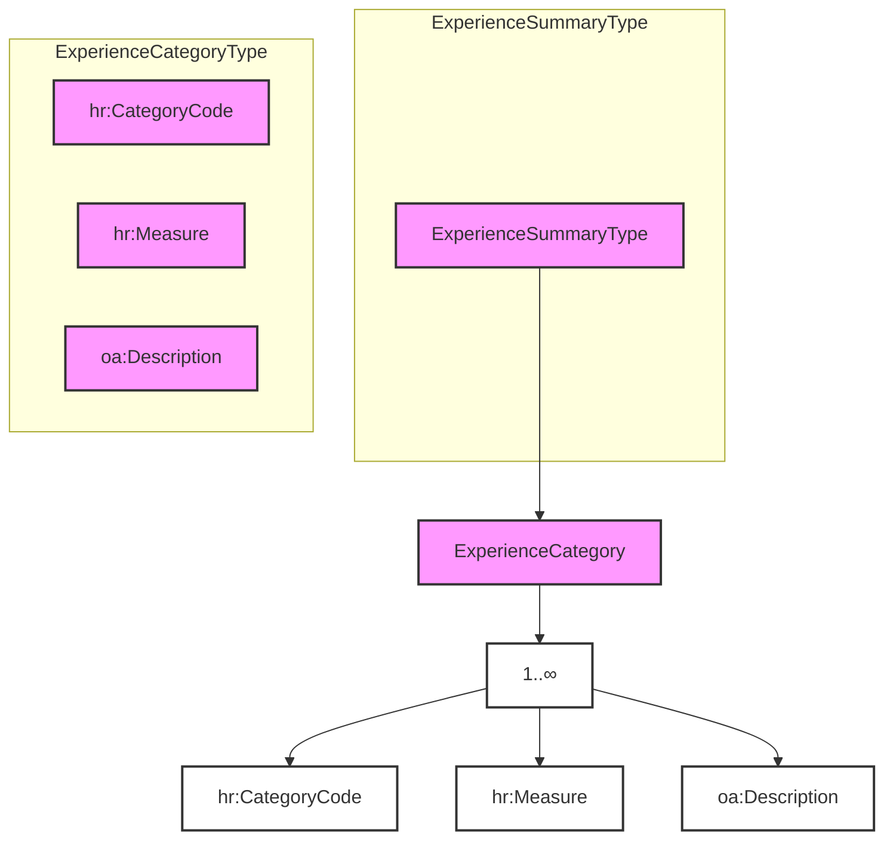

## 3.13 /CandidateProfile/ExperienceSummary (level 2)

### 3.13.1 ExperienceSummary Element Description

&lt;img&gt;Diagram showing eures:ExperienceSummary with ExperienceSummaryType, 1..∞ ExperienceCategory, and a note "It
contains categorisation of the candidate's experience."&lt;/img&gt;

<table>
  <thead>
    <tr>
      <th>Element</th>
      <th>Description</th>
      <th>Cardinality</th>
      <th>Rule</th>
      <th>Examples</th>
    </tr>
  </thead>
  <tbody>
    <tr>
      <td><strong>ExperienceSummary</strong></td>
      <td>Narrative summary of the person and of his/her competencies, normally used as the CV presentation</td>
      <td>0..1</td>
      <td>N/A</td>
      <td>N/A</td>
    </tr>
  </tbody>
</table>

**Sub-elements**

<table>
  <thead>
    <tr>
      <th>Element</th>
      <th>Description</th>
      <th>Cardinality</th>
      <th>Rule</th>
      <th>Examples</th>
    </tr>
  </thead>
  <tbody>
    <tr>
      <td><strong>ExperienceCategory</strong></td>
      <td>This is intended as a fielded summary of qualifications. It can be used as a "roll-up" of data within the
        candidate history and experience components. See section CandidateProfile/ExperieceSummary/ExperienceCategory
        for more information</td>
      <td>1..n</td>
      <td>N/A</td>
      <td>N/A</td>
    </tr>
  </tbody>
</table>

### 3.13.2 ExperienceSummary Attributes

<table>
  <thead>
    <tr>
      <th>Attributes</th>
      <th>Description</th>
      <th>Card.</th>
      <th>Rule</th>
    </tr>
  </thead>
  <tbody>
    <!-- No specific attributes listed for ExperienceSummary -->
  </tbody>
</table>

This element has no attributes.

**ExperienceCategory attributes**

<table>
  <thead>
    <tr>
      <th>Attributes</th>
      <th>Description</th>
      <th>Card.</th>
      <th>Rule</th>
    </tr>
  </thead>
  <tbody>
    <tr>
      <td colspan="4">See section CandidateProfile/ExperieceSummary/ExperienceCategory for more information</td>
    </tr>
  </tbody>
</table>

### 3.13.3 Sub-element: /CandidateProfile/ExperienceSummary/ExperienceCategory (level 3)

#### 3.13.3.1 *ExperienceCategory Element Description*

This is intended as fielded summary of qualifications. It can be used as a "roll-up" of data within of Candidate...

<table>
  <thead>
    <tr>
      <th>Element</th>
      <th>Description</th>
      <th>Cardinality</th>
      <th>Rule</th>
      <th>Examples</th>
    </tr>
  </thead>
  <tbody>
    <tr>
      <td>ExperienceCategory</td>
      <td>This is intended as a fielded summary of qualifications. It can be used as a "roll-up" of data within the
        candidate history and experience components.</td>
      <td>1..n</td>
      <td>N/A</td>
      <td>N/A</td>
    </tr>
  </tbody>
</table>

**Sub-elements**

<table>
  <thead>
    <tr>
      <th>Element</th>
      <th>Description</th>
      <th>Cardinality</th>
      <th>Rule</th>
      <th>Examples</th>
    </tr>
  </thead>
  <tbody>
    <tr>
      <td>CategoryCode</td>
      <td>A code classifying the job type or category. This may be used for occupational classification of the job. The
        JobCategoryCode will usually be repeatable so that a single job can be classified across multiple dimensions.
        The JobCategoryCode can be used to classify the job by industry, but note that an explicit IndustryCode is
        available in contexts such as PositionOrganizationDetails  "1" – Managers, "12" – Administrative, etc.
      </td>
      <td>0..1</td>
      <td>Use “ISCO2008-CodeList.gc” list defined by EURES and based on ISCO-08. Alternatively, use of ESCO
        Occupations  BR-COM-29: Compulsory use of the “ISCO2008-CodeList.gc” list defined by EURES and based on
        ISCO-08. Alternatively, use of ESCO Occupations – version 1.0.  BR-COM-55: Compulsory use of the
        attributes “listVersionID”, “listName” and “listURI”.</td>
      <td>"1" – Managers, "12" – Administrative, etc.  Full code list: “HR-Open/EURES: ISCO2008 [CL20]
        HR-Open/EURES: ESCO_Occupations [CL20]”</td>
    </tr>
    <tr>
      <td>Measure</td>
      <td>Code indicating the period of time, measured in years or months of experience</td>
      <td>0..1</td>
      <td>N/A</td>
      <td>N/A</td>
    </tr>
    <tr>
      <td>Description</td>
      <td>Description of the category</td>
      <td>0..1</td>
      <td>N/A</td>
      <td>"Years of Financial Industry Management Experience", etc.</td>
    </tr>
  </tbody>
</table>

#### 3.13.3.2 *ExperienceCategory Attributes*

<table>
  <thead>
    <tr>
      <th>Attributes</th>
      <th>Description</th>
      <th>Card.</th>
      <th>Rule</th>
    </tr>
  </thead>
  <tbody>
    <tr>
      <td colspan="4">This element as no attributes.</td>
    </tr>
  </tbody>
</table>

**CategoryCode attributes**

<table>
  <thead>
    <tr>
      <th>Attributes</th>
      <th>Description</th>
      <th>Card.</th>
      <th>Rule</th>
    </tr>
  </thead>
  <tbody>
    <tr>
      <td colspan="4">Refer to CodeType Attributes section for additional attributes.</td>
    </tr>
  </tbody>
</table>

**Measure attributes**

<table>
  <thead>
    <tr>
      <th>Attributes</th>
      <th>Description</th>
      <th>Card.</th>
      <th>Rule</th>
    </tr>
  </thead>
  <tbody>
    <tr>
      <td colspan="4"></td>
    </tr>
  </tbody>
</table>

Refer to MeasureType Attributes section for additional attributes.

**Description attributes**

<table>
  <thead>
    <tr>
      <th>Attributes</th>
      <th>Description</th>
      <th>Card.</th>
      <th>Rule</th>
    </tr>
  </thead>
  <tbody>
    <tr>
      <td colspan="4">Refer to DescriptionType Attributes section for additional attributes.</td>
    </tr>
  </tbody>
</table>

