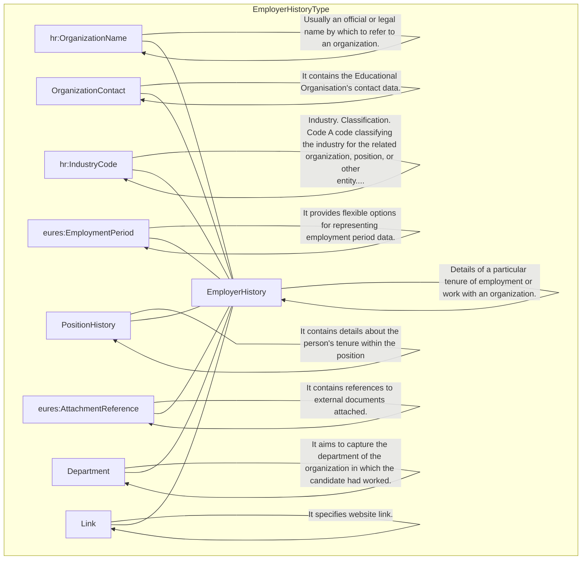
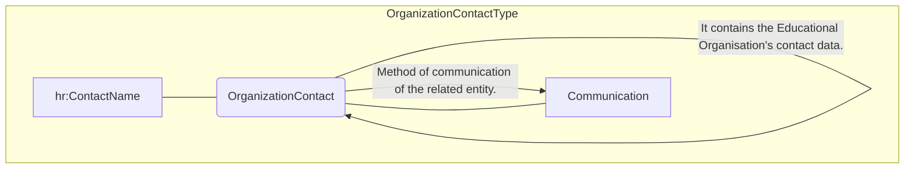
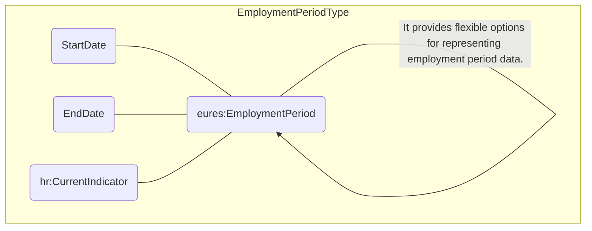
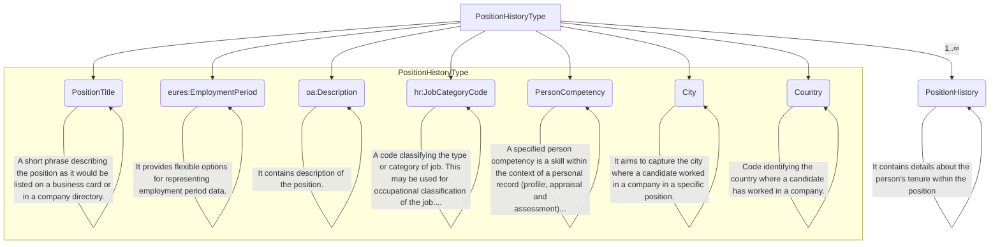

## 3.14 /CandidateProfile/EmploymentHistory (level 2)

### 3.14.1 EmploymentHistory Element Description

&lt;img&gt;A diagram showing "EmploymentHistoryType" with an "Attributes" group containing "@ validFrom", "@ validTo",
and "hr:EffectiveDateAttributeGroup". It also shows "EmploymentHistory" with a description "Employment History records.
Details of a particular tenure of employment or work with an organization." and "EmployerHistory" with a description
"Details of a particular tenure of employment or work with an organization." The "EmploymentHistory" element has a
cardinality of 0..1.&lt;/img&gt;

<table>
  <thead>
    <tr>
      <th>Element</th>
      <th>Description</th>
      <th>Cardinality</th>
      <th>Rule</th>
      <th>Examples</th>
    </tr>
  </thead>
  <tbody>
    <tr>
      <td><strong>EmploymentHistory</strong></td>
      <td>The prior and current details of a person's employment, work, or relevant experience as they would be reported
        in a professional profile, CV, resume, employment application, or similar document</td>
      <td>0..1</td>
      <td>N/A</td>
      <td>N/A</td>
    </tr>
  </tbody>
</table>

**Sub-elements**

<table>
  <thead>
    <tr>
      <th></th>
      <th></th>
      <th></th>
      <th></th>
    </tr>
  </thead>
  <tbody>
    <tr>
      <td><strong>Employer History</strong></td>
      <td>Details regarding a person's tenure while working for an employer See section
        /CandidateProfile/EmploymentHistory/EmployerHistory for more information</td>
      <td>0..n</td>
      <td>N/A</td>
      <td>N/A</td>
    </tr>
  </tbody>
</table>

### 3.14.2 EmploymentHistory Attributes

&lt;img&gt;A diagram showing "EmploymentHistoryType" with an "Attributes" group containing "@ validFrom", "@ validTo",
and "hr:EffectiveDateAttributeGroup". It also shows "EmploymentHistory" with a description "Employment History records.
Details of a particular tenure of employment or work with an organization." The "EmploymentHistory" element has a
cardinality of 0..1.&lt;/img&gt;

<table>
  <thead>
    <tr>
      <th>Attributes</th>
      <th>Description</th>
      <th>Card.</th>
      <th>Rule</th>
    </tr>
  </thead>
  <tbody>
    <tr>
      <td><strong>validFrom</strong></td>
      <td>Validity start date for this entity's information</td>
      <td>0..1</td>
      <td>BR-COM-06: Compulsory Date Format is: YYYY-MM-DD, YYYY-MM, YYYY or YYYY-MM-DDThh:mm:ss.</td>
    </tr>
    <tr>
      <td><strong>validTo</strong></td>
      <td>Validity end date for this entity's information</td>
      <td>0..1</td>
      <td>BR-COM-06: Compulsory Date Format is: YYYY-MM-DD, YYYY-MM, YYYY or YYYY-MM-DDThh:mm:ss.</td>
    </tr>
  </tbody>
</table>

#### EmployerHistory attributes

<table>
  <thead>
    <tr>
      <th>Attributes</th>
      <th>Description</th>
      <th>Card.</th>
      <th>Rule</th>
    </tr>
  </thead>
  <tbody>
    <tr>
      <td colspan="4">See section “EmployerHistory Attributes” for more information</td>
    </tr>
  </tbody>
</table>

### 3.14.3 Sub-element: /CandidateProfile/EmploymentHistory/EmployerHistory (level 3)

#### 3.14.3.1 EmployerHistory Element Description

<table>
  <thead>
    <tr>
      <th>Element</th>
      <th>Description</th>
      <th>Cardinality</th>
      <th>Rule</th>
      <th>Examples</th>
    </tr>
  </thead>
  <tbody>
    <tr>
      <td><strong>EmployerHistory</strong></td>
      <td>Details about a person's tenure while working for an employer. This element is optional as there could be
        candidates without work experience. If it is not filled out, it means that the candidate does not have work
        experience, or he/she does not want to fill it out.</td>
      <td>0..n</td>
      <td>N/A</td>
      <td>N/A</td>
    </tr>
    <tr>
      <td colspan="5"><strong>Sub-elements</strong></td>
    </tr>
    <tr>
      <td><strong>OrganizationName</strong></td>
      <td>Usually an official or legal name by which to refer to an organisation</td>
      <td>0..1</td>
      <td>N/A</td>
      <td>"Wellness Healthcare", "Police Department", etc.</td>
    </tr>
    <tr>
      <td><strong>OrganizationContact</strong></td>
      <td>An Organisation's contact information See section
        /CandidateProfile/EmploymentHistory/EmployerHistory/OrganizationContact for more information</td>
      <td>0..1</td>
      <td>N/A</td>
      <td>N/A</td>
    </tr>
    <tr>
      <td><strong>IndustryCode</strong></td>
      <td>A code classifying the industry of the related organisation, position, or other entity.</td>
      <td>0..1</td>
      <td><strong>BR-COM-20:</strong> Compulsory use of the "NACE-CodeList.gc" list defined by EURES. This is based on
        EU NACE.</td>
      <td>"01" = Agriculture, "02" = Forestry, etc.</td>
    </tr>
  </tbody>
</table>

<table>
  <thead>
    <tr>
      <th></th>
      <th></th>
      <th></th>
      <th></th>
      <th>Full code list: "Open/EURES: NACE [CL31]"</th>
    </tr>
  </thead>
  <tbody>
    <tr>
      <td>EmploymentPeriod</td>
      <td>Provides flexible options for representing employment period data See section
        /CandidateProfile/EmploymentHistory/EmployerHistory/EmploymentPeriod for more information</td>
      <td>0..1</td>
      <td>N/A</td>
      <td>N/A</td>
    </tr>
    <tr>
      <td>PositionHistory</td>
      <td>Details about the person's tenure within the position See section
        /CandidateProfile/EmploymentHistory/EmployerHistory/PositionHistory for more information</td>
      <td>1..n</td>
      <td>N/A</td>
      <td>N/A</td>
    </tr>
    <tr>
      <td>AttachmentReference</td>
      <td>Reference to external documents attached See section
        /CandidateProfile/EmploymentHistory/EmployerHistory/AttachmentReference for more information</td>
      <td>0..n</td>
      <td>N/A</td>
      <td>N/A</td>
    </tr>
    <tr>
      <td>Department</td>
      <td>It aims to capture the department of the organization in which the candidate had worked.</td>
      <td>0..1</td>
      <td></td>
      <td></td>
    </tr>
    <tr>
      <td>Link</td>
      <td>It specifies website link.</td>
      <td>0..n</td>
      <td></td>
      <td></td>
    </tr>
  </tbody>
</table>

#### 3.14.3.2 EmployerHistory Attributes

<table>
  <thead>
    <tr>
      <th>Attributes</th>
      <th>Description</th>
      <th>Card.</th>
      <th>Rule</th>
    </tr>
  </thead>
  <tbody>
    <tr>
      <td colspan="4">This element has no attributes.</td>
    </tr>
    <tr>
      <td colspan="4"><strong>OrganizationName attributes</strong></td>
    </tr>
    <tr>
      <td><strong>Attributes</strong></td>
      <td><strong>Description</strong></td>
      <td><strong>Card.</strong></td>
      <td><strong>Rule</strong></td>
    </tr>
    <tr>
      <td>validFrom</td>
      <td>Validity start date for this entity's information</td>
      <td>0..1</td>
      <td>BR-COM-06: Compulsory Date Format is: YYYY-MM-DD, YYYY-MM, YYYY or YYYY-MM-DDThh:mm:ss.</td>
    </tr>
    <tr>
      <td>validTo</td>
      <td>Validity end date for this entity's information</td>
      <td>0..1</td>
      <td>BR-COM-06: Compulsory Date Format is: YYYY-MM-DD, YYYY-MM, YYYY or YYYY-MM-DDThh:mm:ss.</td>
    </tr>
    <tr>
      <td>languageID</td>
      <td>Identifier of the language used in the organisation name</td>
      <td>0..1</td>
      <td></td>
    </tr>
    <tr>
      <td colspan="4"><strong>OrganizationContact attributes</strong></td>
    </tr>
    <tr>
      <td><strong>Attributes</strong></td>
      <td><strong>Description</strong></td>
      <td><strong>Card.</strong></td>
      <td><strong>Rule</strong></td>
    </tr>
    <tr>
      <td colspan="4">See section /CandidateProfile/EmploymentHistory/EmployerHistory/OrganizationContact for more
        information</td>
    </tr>
    <tr>
      <td colspan="4"><strong>IndustryCode attributes</strong></td>
    </tr>
    <tr>
      <td><strong>Attributes</strong></td>
      <td><strong>Description</strong></td>
      <td><strong>Card.</strong></td>
      <td><strong>Rule</strong></td>
    </tr>
    <tr>
      <td colspan="4">Refer to CodeType Attributes section for additional attributes.</td>
    </tr>
    <tr>
      <td colspan="4"><strong>EmploymentPeriod attributes</strong></td>
    </tr>
    <tr>
      <td><strong>Attributes</strong></td>
      <td><strong>Description</strong></td>
      <td><strong>Card.</strong></td>
      <td><strong>Rule</strong></td>
    </tr>
    <tr>
      <td colspan="4">See section /CandidateProfile/EmploymentHistory/EmployerHistory/EmploymentPeriod for more
        information</td>
    </tr>
    <tr>
      <td colspan="4"><strong>PositionHistory attributes</strong></td>
    </tr>
    <tr>
      <td><strong>Attributes</strong></td>
      <td><strong>Description</strong></td>
      <td><strong>Card.</strong></td>
      <td><strong>Rule</strong></td>
    </tr>
    <tr>
      <td colspan="4">See section /CandidateProfile/EmploymentHistory/EmployerHistory/PositionHistory for more
        information</td>
    </tr>
    <tr>
      <td colspan="4"><strong>AttachmentReference attributes</strong></td>
    </tr>
    <tr>
      <td><strong>Attributes</strong></td>
      <td><strong>Description</strong></td>
      <td><strong>Card.</strong></td>
      <td><strong>Rule</strong></td>
    </tr>
    <tr>
      <td colspan="4">See section /CandidateProfile/EmploymentHistory/EmployerHistory/AttachmentReference for more
        information</td>
    </tr>
    <tr>
      <td colspan="4"><strong>Department attributes</strong></td>
    </tr>
    <tr>
      <td><strong>Attributes</strong></td>
      <td><strong>Description</strong></td>
      <td><strong>Card.</strong></td>
      <td><strong>Rule</strong></td>
    </tr>
    <tr>
      <td colspan="4">Refer to TextType Attributes section for additional attributes.</td>
    </tr>
    <tr>
      <td colspan="4"><strong>Link attributes</strong></td>
    </tr>
    <tr>
      <td><strong>Attributes</strong></td>
      <td><strong>Description</strong></td>
      <td><strong>Card.</strong></td>
      <td><strong>Rule</strong></td>
    </tr>
    <tr>
      <td colspan="4">It has no attributes.</td>
    </tr>
  </tbody>
</table>

### 3.14.4 Sub-element: /CandidateProfile/EmploymentHistory/EmployerHistory/OrganizationContact (level 4)

#### 3.14.4.1 OrganizationContact Element Description

<table>
  <thead>
    <tr>
      <th>Element</th>
      <th>Description</th>
      <th>Cardinality</th>
      <th>Rule</th>
      <th>Examples</th>
    </tr>
  </thead>
  <tbody>
    <tr>
      <td><strong>OrganizationContact</strong></td>
      <td>Contact information for the organization</td>
      <td>0..1</td>
      <td>N/A</td>
      <td>N/A</td>
    </tr>
    <tr>
      <td colspan="5"><strong>Sub-elements</strong></td>
    </tr>
    <tr>
      <td><strong>ContactName</strong></td>
      <td>Name of the organization's contact person</td>
      <td>1</td>
      <td>N/A</td>
      <td>"Lidia Smith"</td>
    </tr>
    <tr>
      <td><strong>Communication</strong></td>
      <td>Contact data/information of the contact person: ChannelCode, Address, URI –for email, for instance—,
        etc See section /CandidatePerson/Communication for more information</td>
      <td>0..n</td>
      <td>N/A</td>
      <td>N/A</td>
    </tr>
  </tbody>
</table>

#### 3.14.4.2 OrganizationContact Attributes

<table>
  <thead>
    <tr>
      <th>Attributes</th>
      <th>Description</th>
      <th>Card.</th>
      <th>Rule</th>
    </tr>
  </thead>
  <tbody>
    <tr>
      <td colspan="4">This element has no attributes.</td>
    </tr>
    <tr>
      <td colspan="4"><strong>ContactName attributes</strong></td>
    </tr>
    <tr>
      <td><strong>Attributes</strong></td>
      <td><strong>Description</strong></td>
      <td><strong>Card.</strong></td>
      <td><strong>Rule</strong></td>
    </tr>
    <tr>
      <td colspan="4">Refer to TextType Attributes section for additional attributes.</td>
    </tr>
    <tr>
      <td colspan="4"><strong>Communication attributes</strong></td>
    </tr>
    <tr>
      <td><strong>Attributes</strong></td>
      <td><strong>Description</strong></td>
      <td><strong>Card.</strong></td>
      <td><strong>Rule</strong></td>
    </tr>
    <tr>
      <td colspan="4">See section /CandidatePerson/Communication for more information</td>
    </tr>
  </tbody>
</table>

### 3.14.5 Sub-element: /CandidateProfile/EmploymentHistory/EmployerHistory/EmploymentPeriod (level 4)

#### 3.14.5.1 EmploymentPeriod Element Description

<table>
  <thead>
    <tr>
      <th>Element</th>
      <th>Description</th>
      <th>Cardinality</th>
      <th>Rule</th>
      <th>Examples</th>
    </tr>
  </thead>
  <tbody>
    <tr>
      <td><strong>EmploymentPeriod</strong></td>
      <td>Provides flexible options for representing employment period data</td>
      <td>1</td>
      <td>N/A</td>
      <td>N/A</td>
    </tr>
    <tr>
      <td colspan="5"><strong>Sub-elements</strong></td>
    </tr>
    <tr>
      <td><strong>StartDate</strong></td>
      <td>A timestamp marking the beginning of employment period data</td>
      <td>1</td>
      <td>N/A</td>
      <td>N/A</td>
    </tr>
  </tbody>
</table>

See section /CandidatePofile/EmploymentHistory/EmployerHistory/EmploymentPeriod/StartDate for more information

<table>
  <thead>
    <tr>
      <th>Attributes</th>
      <th>Description</th>
      <th>Card.</th>
      <th>Rule</th>
      <th>Examples</th>
    </tr>
  </thead>
  <tbody>
    <tr>
      <td>EndDate</td>
      <td>A timestamp marking the end of employment period data</td>
      <td>0..1</td>
      <td>N/A</td>
      <td>N/A</td>
    </tr>
    <tr>
      <td>CurrentIndicator</td>
      <td>Indicates whether the position is currently held or if employment or other status was current when reported
      </td>
      <td>0..1</td>
      <td>N/A</td>
      <td>"true" = The position is currently held "false" = The position is not currently held</td>
    </tr>
  </tbody>
</table>

#### 3.14.5.2 EmploymentPeriod Attributes

<table>
  <thead>
    <tr>
      <th>Attributes</th>
      <th>Description</th>
      <th>Card.</th>
      <th>Rule</th>
    </tr>
  </thead>
  <tbody>
    <tr>
      <td colspan="4">This element has no attributes</td>
    </tr>
    <tr>
      <td colspan="4"><b>StartDate attributes</b></td>
    </tr>
    <tr>
      <td colspan="4"><b>Attributes</b></td>
    </tr>
    <tr>
      <td colspan="4">See section /CandidatePofile/EmploymentHistory/EmployerHistory/EmploymentPeriod/StartDate for more
        information</td>
    </tr>
    <tr>
      <td colspan="4"><b>EndDate attributes</b></td>
    </tr>
    <tr>
      <td colspan="4"><b>Attributes</b></td>
    </tr>
    <tr>
      <td colspan="4">See section /CandidatePofile/EmploymentHistor/EmployerHistory/EmploymentPeriod/EndDate for more
        information</td>
    </tr>
    <tr>
      <td colspan="4"><b>CurrentIndicator attributes</b></td>
    </tr>
    <tr>
      <td colspan="4"><b>Attributes</b></td>
    </tr>
    <tr>
      <td>validFrom</td>
      <td>Validity start date for this entity's information.</td>
      <td>0..1</td>
      <td>BR-COM-06: Compulsory Date Format is: YYYY-MM-DD, YYYY-MM, YYYY or YYYY-MM-DDThh:mm:ss.</td>
    </tr>
    <tr>
      <td>validTo</td>
      <td>Validity end date for this entity's information.</td>
      <td>0..1</td>
      <td>BR-COM-06: Compulsory Date Format is: YYYY-MM-DD, YYYY-MM, YYYY or YYYY-MM-DDThh:mm:ss.</td>
    </tr>
  </tbody>
</table>

### 3.14.6 Sub-element: /CandidateProfile/EmploymentHistory/EmployerHistory/EmploymentPeriod/StartDate (level 5)

#### 3.14.6.1 StartDate Element Description

<table>
  <thead>
    <tr>
      <th>Element</th>
      <th>Description</th>
      <th>Cardinality</th>
      <th>Rule</th>
      <th>Examples</th>
    </tr>
  </thead>
  <tbody>
    <tr>
      <td>StartDate</td>
      <td>A timestamp marking the beginning of the employment period data</td>
      <td>1</td>
      <td>BR-COM-16: At least one of its sub-elements must be provided.</td>
      <td>N/A</td>
    </tr>
  </tbody>
</table>

Sub-elements

The same as /CandidateProfile/EducationHistory/EducationOrganizationAttendance/AttendancePeriod/StartDate

#### 3.14.6.2 StartDate Attributes

<table>
  <thead>
    <tr>
      <th>Attributes</th>
      <th>Description</th>
      <th>Card.</th>
      <th>Rule</th>
    </tr>
  </thead>
  <tbody>
    <tr>
      <td>The same as /CandidateProfile/EducationHistory/EducationOrganizationAttendance/AttendancePeriod/StartDate</td>
      <td></td>
      <td></td>
      <td></td>
    </tr>
  </tbody>
</table>

### 3.14.7 Sub-element: /CandidateProfile/EmploymentHistory/EmployerHistory/EmploymentPeriod/EndDate (level 5)

#### 3.14.7.1 EndDate Element Description

<table>
  <thead>
    <tr>
      <th>Element</th>
      <th>Description</th>
      <th>Cardinality</th>
      <th>Rule</th>
      <th>Examples</th>
    </tr>
  </thead>
  <tbody>
    <tr>
      <td>EndDate</td>
      <td>A timestamp marking the end of the employment period data</td>
      <td>0..1</td>
      <td>BR-COM-16: At least one of its sub-elements</td>
      <td>N/A</td>
    </tr>
  </tbody>
</table>

must be provided.

Sub-elements

The same as /CandidateProfile/EducationHistory/EducationOrganizationAttendance/AttendancePeriod/EndDate

#### 3.14.7.2 EndDate Attributes

<table>
  <thead>
    <tr>
      <th>Attributes</th>
      <th>Description</th>
      <th>Card.</th>
      <th>Rule</th>
    </tr>
  </thead>
  <tbody>
    <tr>
      <td>The same as /CandidateProfile/EducationHistory/EducationOrganizationAttendance/AttendancePeriod/EndDate</td>
      <td></td>
      <td></td>
      <td></td>
    </tr>
  </tbody>
</table>

### 3.14.8 Sub-element: /CandidateProfile/EmploymentHistory/EmployerHistory/PositionHistory (level 4)

#### 3.14.8.1 PositionHistory Element Description

The details about a persons tenure within position.

<table>
  <thead>
    <tr>
      <th>Element</th>
      <th>Description</th>
      <th>Cardinality</th>
      <th>Rule</th>
      <th>Examples</th>
    </tr>
  </thead>
  <tbody>
    <tr>
      <td>PositionHistory</td>
      <td>The details about the person's tenure within the position</td>
      <td>1..n</td>
      <td>N/A</td>
      <td>N/A</td>
    </tr>
  </tbody>
</table>

Sub-elements

<table>
  <thead>
    <tr>
      <th></th>
      <th></th>
      <th></th>
      <th></th>
      <th></th>
    </tr>
  </thead>
  <tbody>
    <tr>
      <td>PositionTitle</td>
      <td>A short phrase describing the position as it would be listed on a business card or in a company directory.
        OED: An appellation attached to a position in virtue of rank, function or office.</td>
      <td>0..1</td>
      <td>Use CL20-ESCO_Occupations</td>
      <td>HR-Open/EURES: ESCO_Occupations [CL20].</td>
    </tr>
    <tr>
      <td>EmploymentPeriod</td>
      <td>Provides flexible options for representing employment period data</td>
      <td>0..1</td>
      <td>N/A</td>
      <td>N/A</td>
    </tr>
  </tbody>
</table>

See section /CandidateProfile/EducationHistory/EmployerHistory/PositionHistory/EmploymentPeriod for more information

<table>
  <thead>
    <tr>
      <th>Description</th>
      <th>Description of the position</th>
      <th>Card.</th>
      <th>N/A</th>
      <th>"Description of the position", etc.</th>
    </tr>
  </thead>
  <tbody>
    <tr>
      <td>JobCategoryCode</td>
      <td>A code classifying the job type or category. This may be used for occupational classification of the job. The
        JobCategoryCode will usually be repeatable so that a single job can be classified across multiple
        dimensions. The JobCategoryCode can be used to classify the job by industry but note that an explicit
        IndustryCode is available in contexts such as PositionOrganizationDetails.</td>
      <td>0..n</td>
      <td>BR-COM-29: Compulsory use of the "ISCO2008-CodeList.gc" list defined by EURES and based on
        ISCO-08. Alternatively, use of ESCO Occupations – version 1.0.</td>
      <td>"1" – Managers, "12" – Administrative, etc.  Full code list: "HR-Open/EURES: ISCO2008
        [CL20] HR-Open/EURES: ESCO_Occupations [CL20]"</td>
    </tr>
    <tr>
      <td>PersonCompetency</td>
      <td>A specified person competency is a skill within the context of a personal record (profile, appraisal and
        assessment) that is assessed or asserted at specified level of proficiency.  See section
        /CandidateProfile/EducationHistory/EmployerHistory/PositionHistory/PersonCompetency for more information</td>
      <td>0..n</td>
      <td>N/A</td>
      <td>N/A</td>
    </tr>
    <tr>
      <td>City</td>
      <td>It aims to capture the city where a candidate worked in a company in a specific position.</td>
      <td>0..1</td>
      <td></td>
      <td></td>
    </tr>
    <tr>
      <td>Country</td>
      <td>Code identifying the country where a candidate has worked in a company.</td>
      <td>0..1</td>
      <td>ECV02: Compulsory use of codelist defined by Europass CountriesAndNationalities</td>
      <td>Europass2: CountriesAndNationalities [ECV02]</td>
    </tr>
  </tbody>
</table>

#### 3.14.8.2 *PositionHistory Attributes*

<table>
  <thead>
    <tr>
      <th>Attributes</th>
      <th>Description</th>
      <th>Card.</th>
      <th>Rule</th>
    </tr>
  </thead>
  <tbody>
    <tr>
      <td>This element has no attributes</td>
      <td></td>
      <td></td>
      <td></td>
    </tr>
    <tr>
      <td colspan="4">**PositionTitle attributes**</td>
    </tr>
    <tr>
      <td>Attributes</td>
      <td>Description</td>
      <td>Card.</td>
      <td>Rule</td>
    </tr>
    <tr>
      <td colspan="4">Refer to PositionTitleType Attributes section for additional attributes.</td>
    </tr>
    <tr>
      <td colspan="4">**EmploymentPeriod attributes**</td>
    </tr>
    <tr>
      <td>Attributes</td>
      <td>Description</td>
      <td>Card.</td>
      <td>Rule</td>
    </tr>
    <tr>
      <td colspan="4">See section /CandidateProfile/EducationHistory/EmployerHistory/PositionHistory/EmploymentPeriod
        for more information</td>
    </tr>
    <tr>
      <td colspan="4">**Description attributes**</td>
    </tr>
    <tr>
      <td>Attributes</td>
      <td>Description</td>
      <td>Card.</td>
      <td>Rule</td>
    </tr>
    <tr>
      <td colspan="4">Refer to DescriptionType Attributes section for additional attributes.</td>
    </tr>
    <tr>
      <td colspan="4">**JobCategoryCode attributes**</td>
    </tr>
    <tr>
      <td>Attributes</td>
      <td>Description</td>
      <td>Card.</td>
      <td>Rule</td>
    </tr>
    <tr>
      <td colspan="4">Refer to CodeType Attributes section for additional attributes.</td>
    </tr>
    <tr>
      <td colspan="4">**PersonCompetency attributes**</td>
    </tr>
    <tr>
      <td>Attributes</td>
      <td>Description</td>
      <td>Card.</td>
      <td>Rule</td>
    </tr>
    <tr>
      <td colspan="4">See section /CandidateProfile/EducationHistory/EmployerHistory/PositionHistory/PersonCompetency
        for more information</td>
    </tr>
    <tr>
      <td colspan="4">**City attributes**</td>
    </tr>
    <tr>
      <td>Attributes</td>
      <td>Description</td>
      <td>Card.</td>
      <td>Rule</td>
    </tr>
    <tr>
      <td colspan="4">Refer to TextType Attributes section for additional attributes.</td>
    </tr>
    <tr>
      <td colspan="4">**Country attributes**</td>
    </tr>
    <tr>
      <td>Attributes</td>
      <td>Description</td>
      <td>Card.</td>
      <td>Rule</td>
    </tr>
    <tr>
      <td colspan="4">Refer to CodeListAttributeGroup Attributes section for additional attributes.</td>
    </tr>
  </tbody>
</table>

### 3.14.9 Sub-element: /CandidateProfile/EmploymentHistory/EmployerHistory/PositionHistory/EmploymentPeriod (level 5)

#### 3.14.9.1 EmploymentPeriod Element Description

<table>
  <thead>
    <tr>
      <th>Element</th>
      <th>Description</th>
      <th>Cardinality</th>
      <th>Rule</th>
      <th>Examples</th>
    </tr>
  </thead>
  <tbody>
    <tr>
      <td>EmploymentPeriod</td>
      <td>Provides flexible options for representing employment period data</td>
      <td>0..1</td>
      <td>N/A</td>
      <td>N/A</td>
    </tr>
  </tbody>
</table>

Sub-elements

The same as /CandidateProfile/EducationHistory/EmployerHistory/EmploymentPeriod

#### 3.14.9.2 EmploymentPeriod Attributes

<table>
  <thead>
    <tr>
      <th>Attributes</th>
      <th>Description</th>
      <th>Card.</th>
      <th>Rule</th>
    </tr>
  </thead>
  <tbody>
    <tr>
      <td>The same as /CandidateProfile/EducationHistory/EmployerHistory/EmploymentPeriod</td>
      <td></td>
      <td></td>
      <td></td>
    </tr>
  </tbody>
</table>

### 3.14.10 Sub-element: /CandidateProfile/EmploymentHistory/EmployerHistory/PositionHistory/PersonCompetency (level 5)

#### 3.14.10.1 PersonCompetency Description

<table>
  <thead>
    <tr>
      <th>Element</th>
      <th>Description</th>
      <th>Cardinality</th>
      <th>Rule</th>
      <th>Examples</th>
    </tr>
  </thead>
  <tbody>
    <tr>
      <td>Person Competency</td>
      <td>A specified person competency is a skill within the context of a personal record (profile, appraisal and
        assessment) that is assessed or asserted at specified level of proficiency.</td>
      <td>0..n</td>
      <td>N/A</td>
      <td>N/A</td>
    </tr>
  </tbody>
</table>

Sub-elements

The same as /CandidateProfile/PersonQualifications/PersonCompetency

#### 3.14.10.2 PersonCompetency Attributes

<table>
  <thead>
    <tr>
      <th>Attributes</th>
      <th>Description</th>
      <th>Card.</th>
      <th>Rule</th>
    </tr>
  </thead>
  <tbody>
    <tr>
      <td>The same as /CandidateProfile/PersonQualifications/PersonCompetency</td>
      <td></td>
      <td></td>
      <td></td>
    </tr>
  </tbody>
</table>

### 3.14.11 Sub-element: /CandidateProfile/EmploymentHistory/EmployerHistory/AttachmentReference (level 4)

#### 3.14.11.1 AttachmentReference Element Description

&lt;img&gt;Diagram showing eures:AttachmentReference with cardinality 0..∞, connected to AttachmentReferenceType with
cardinality 1..∞, which has attributes oa:Description (cardinality 1..∞) and hr:XPath (cardinality 1..∞). A note says
"It contains references to external documents attached."&lt;/img&gt;

<table>
  <thead>
    <tr>
      <th>Element</th>
      <th>Description</th>
      <th>Cardinality</th>
      <th>Rule</th>
      <th>Examples</th>
    </tr>
  </thead>
  <tbody>
    <tr>
      <td>AttachmentReference</td>
      <td>Reference to the external documents attached</td>
      <td>0..n</td>
      <td>N/A</td>
      <td>N/A</td>
    </tr>
  </tbody>
</table>

<table>
  <thead>
    <tr>
      <th colspan="5">Sub-elements</th>
    </tr>
  </thead>
  <tbody>
    <tr>
      <td><b>XPath</b></td>
      <td>Reference to an embedded document located in another element of the schema</td>
      <td>1..n</td>
      <td>N/A</td>
      <td></td>
    </tr>
    <tr>
      <td><b>Description</b></td>
      <td>Narrative details of the external document attached</td>
      <td>1..n</td>
      <td>N/A</td>
      <td>"Education History"</td>
    </tr>
  </tbody>
</table>

#### 3.14.11.2 AttachmentReference Attributes

<table>
  <thead>
    <tr>
      <th>Attributes</th>
      <th>Description</th>
      <th>Card.</th>
      <th>Rule</th>
    </tr>
  </thead>
  <tbody>
    <tr>
      <td>This element has no attributes.</td>
      <td></td>
      <td></td>
      <td></td>
    </tr>
  </tbody>
</table>

XPath attributes

<table>
  <thead>
    <tr>
      <th>Attributes</th>
      <th>Description</th>
      <th>Card.</th>
      <th>Rule</th>
    </tr>
  </thead>
  <tbody>
    <tr>
      <td>This sub-element has no attributes.</td>
      <td></td>
      <td></td>
      <td></td>
    </tr>
  </tbody>
</table>

Description attributes

<table>
  <thead>
    <tr>
      <th>Attributes</th>
      <th>Description</th>
      <th>Card.</th>
      <th>Rule</th>
    </tr>
  </thead>
  <tbody>
    <tr>
      <td>Refer to DescriptionType Attribute section for additional attributes.</td>
      <td></td>
      <td></td>
      <td></td>
    </tr>
  </tbody>
</table>

