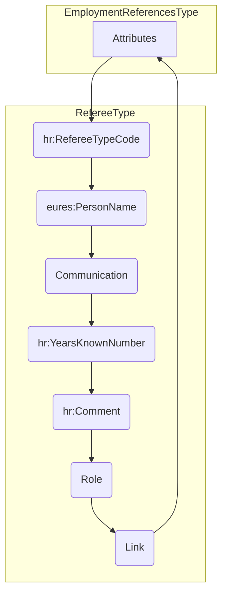

## 3.15 /CandidateProfile/EmploymentReferences (level 2)

### 3.15.1 EmploymentReferences Element Description

&lt;img&gt;A diagram showing the structure of the EmploymentReferences element. It contains a root element
"EmploymentReferences" with a cardinality of 0..1. This element has a child element "@Attributes" with a cardinality of
0..1. The "EmploymentReferences" element also has a child element "Referee" with a cardinality of 0..*.&lt;/img&gt;

<table>
  <thead>
    <tr>
      <th>Element</th>
      <th>Description</th>
      <th>Cardinality</th>
      <th>Rule</th>
      <th>Examples</th>
    </tr>
  </thead>
  <tbody>
    <tr>
      <td>EmploymentReferences</td>
      <td>Contains information on one or more people who are or may be a source of information about a person's skills,
        prior employment, character, or suitability for employment</td>
      <td>0..1</td>
      <td>N/A</td>
      <td>N/A</td>
    </tr>
  </tbody>
</table>

Sub-elements

<table>
  <thead>
    <tr>
      <th>Element</th>
      <th>Description</th>
      <th>Cardinality</th>
      <th>Rule</th>
      <th>Examples</th>
    </tr>
  </thead>
  <tbody>
    <tr>
      <td>Referee</td>
      <td>A person who may be referred to for information or guidance on a person's character or other qualities,
        specifically an applicant for employment, for an academic or other award, or the like.  See section
        /CandidateProfile/EmploymentReference/Referee for information</td>
      <td>0..n</td>
      <td>N/A</td>
      <td>N/A</td>
    </tr>
  </tbody>
</table>

### 3.15.2 EmploymentReferences Attributes

&lt;img&gt;A diagram showing "EmploymentReferencesType" with attributes "hr:EffectiveDateAttributeGroup", "@ validFrom",
"@ validTo". It also shows "EmploymentReferences" which contains information on one or more people who may be a source
of information about a person's skills, prior...&lt;/img&gt;

<table>
  <thead>
    <tr>
      <th>Attributes</th>
      <th>Description</th>
      <th>Card.</th>
      <th>Rule</th>
    </tr>
  </thead>
  <tbody>
    <tr>
      <td>validFrom</td>
      <td>Validity start date for this entity's information.</td>
      <td>0..1</td>
      <td>BR-COM-06: Compulsory Date Format is: YYYY-MM-DD, YYYY-MM, YYYY or YYYY-MM-DDThh:mm:ss.</td>
    </tr>
    <tr>
      <td>validTo</td>
      <td>Validity end date for this entity's information.</td>
      <td>0..1</td>
      <td>BR-COM-06: Compulsory Date Format is: YYYY-MM-DD, YYYY-MM, YYYY or YYYY-MM-DDThh:mm:ss.</td>
    </tr>
  </tbody>
</table>

Referee sub-element

<table>
  <thead>
    <tr>
      <th>Attributes</th>
      <th>Description</th>
      <th>Card.</th>
      <th>Rule</th>
    </tr>
  </thead>
  <tbody>
    <tr>
      <td colspan="4">See section /CandidateProfile/EmploymentReference/Referee for information</td>
    </tr>
  </tbody>
</table>

### 3.15.3 Sub-element: /CandidateProfile/EmploymentReferences/Referee (level 3)

#### 3.15.3.1 RefereeElement Description

OED: A person who may be referred to for information or guidance on the character or other qualities of someone, spec...

Contains information on one or more person who is or may be a source of information about a person's skills, prior...

<table>
  <thead>
    <tr>
      <th>Element</th>
      <th>Description</th>
      <th>Cardinality</th>
      <th>Rule</th>
      <th>Examples</th>
    </tr>
  </thead>
  <tbody>
    <tr>
      <td><strong>Referee</strong></td>
      <td>A person who may be referred to for information or guidance on a person's character or other qualities,
        specifically of an applicant for employment, for an academic or other award, or the like.</td>
      <td>0..n</td>
      <td>N/A</td>
      <td>N/A</td>
    </tr>
    <tr>
      <td colspan="5"><strong>Sub-elements</strong></td>
    </tr>
    <tr>
      <td><strong>PersonName</strong></td>
      <td>A component for capturing summary or fine-grain data that makes up a person's name</td>
      <td>0..1</td>
      <td>N/A</td>
      <td>"Mr. John L Smith III, Phd", "Dr. Martin White", etc.</td>
    </tr>
    <tr>
      <td colspan="5">The same as section /CandidatePerson/PersonName</td>
    </tr>
    <tr>
      <td><strong>RefereeTypeCode</strong></td>
      <td>A code classifying the reference type (e.g. "Professional", "Personal", "Verification")</td>
      <td>0..1</td>
      <td>BR-CV-22: The HR-Open Standards Code List "RefereeTypeCode".</td>
      <td>"Professional", "Personal", "Verification"  Full code list: "HR-Open/EURES: RefereeTypeCode [CL46]"</td>
    </tr>
    <tr>
      <td><strong>Communication</strong></td>
      <td>Communication of the referee</td>
      <td>0..n</td>
      <td>N/A</td>
      <td>N/A</td>
    </tr>
    <tr>
      <td colspan="5">The same as section /CandidateSupplier/PersonContact/Communication</td>
    </tr>
    <tr>
      <td><strong>Years Known Number</strong></td>
      <td>Number of years known</td>
      <td>0..1</td>
      <td>N/A</td>
      <td>"1", "2", "3", etc.</td>
    </tr>
  </tbody>
</table>

<table>
  <tr>
    <td><strong>Comment</strong></td>
    <td>Comment given by a Referee.</td>
    <td>0..1</td>
    <td>N/A</td>
    <td>"Comment about the referee"</td>
  </tr>
  <tr>
    <td><strong>Role</strong></td>
    <td>Specifies a role of referee in regards with a candidate.</td>
    <td>0..1</td>
    <td></td>
    <td></td>
  </tr>
  <tr>
    <td><strong>Link</strong></td>
    <td>It specifies url link.</td>
    <td>0..1</td>
    <td></td>
    <td></td>
  </tr>
</table>

#### 3.15.3.2 <em>RefereeAttributes</em>

<table>
  <thead>
    <tr>
      <th>Attributes</th>
      <th>Description</th>
      <th>Card.</th>
      <th>Rule</th>
    </tr>
  </thead>
  <tbody>
    <tr>
      <td colspan="4">This element has no attributes.</td>
    </tr>
    <tr>
      <td colspan="4"><strong>PersonName attributes</strong></td>
    </tr>
    <tr>
      <td>Attributes</td>
      <td>Description</td>
      <td>Card.</td>
      <td>Rule</td>
    </tr>
    <tr>
      <td colspan="4">The same as section /CandidatePerson/PersonName</td>
    </tr>
    <tr>
      <td colspan="4"><strong>RefereeTypeCode attributes</strong></td>
    </tr>
    <tr>
      <td>Attributes</td>
      <td>Description</td>
      <td>Card.</td>
      <td>Rule</td>
    </tr>
    <tr>
      <td colspan="4">It has no attributes.</td>
    </tr>
    <tr>
      <td colspan="4"><strong>Communication attributes</strong></td>
    </tr>
    <tr>
      <td>Attributes</td>
      <td>Description</td>
      <td>Card.</td>
      <td>Rule</td>
    </tr>
    <tr>
      <td colspan="4">The same as section /CandidateSupplier/PersonContact/Communication</td>
    </tr>
    <tr>
      <td colspan="4"><strong>YearsKnownNumber attributes</strong></td>
    </tr>
    <tr>
      <td>Attributes</td>
      <td>Description</td>
      <td>Card.</td>
      <td>Rule</td>
    </tr>
    <tr>
      <td colspan="4">This sub-element has no attributes.</td>
    </tr>
    <tr>
      <td colspan="4"><strong>Comment attributes</strong></td>
    </tr>
    <tr>
      <td>Attributes</td>
      <td>Description</td>
      <td>Card.</td>
      <td>Rule</td>
    </tr>
    <tr>
      <td colspan="4">Refer to NoteType Attributes section for additional attributes.</td>
    </tr>
    <tr>
      <td colspan="4"><strong>Role attributes</strong></td>
    </tr>
    <tr>
      <td>languageID</td>
      <td>Identifier of the language used in the title.</td>
      <td>0..1</td>
      <td></td>
    </tr>
    <tr>
      <td colspan="4"><strong>Link attributes</strong></td>
    </tr>
    <tr>
      <td>Attributes</td>
      <td>Description</td>
      <td>Card.</td>
      <td>Rule</td>
    </tr>
    <tr>
      <td colspan="4">It has no attributes.</td>
    </tr>
  </tbody>
</table>

