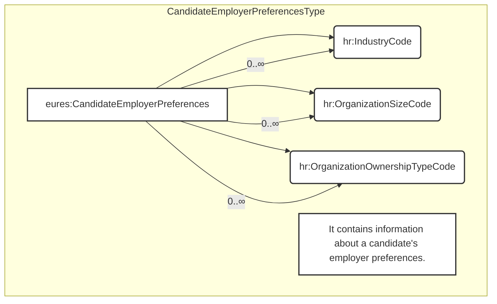

## 3.17 /CandidateProfile/CandidateEmployerPreferences (level 2)

### 3.17.1 CandidateEmployerPreferences Element Description

<table>
  <thead>
    <tr>
      <th>Element</th>
      <th>Description</th>
      <th>Cardinality</th>
      <th>Rule</th>
      <th>Examples</th>
    </tr>
  </thead>
  <tbody>
    <tr>
      <td>CandidateEmployerPreferences</td>
      <td>Information about a candidate's preferences in an employer</td>
      <td>0..1</td>
      <td>N/A</td>
      <td>N/A</td>
    </tr>
    <tr>
      <td colspan="5"><strong>Sub-elements</strong></td>
    </tr>
    <tr>
      <td>IndustryCode</td>
      <td>A code classifying the industry of the related organization, position, or other entity</td>
      <td>0..n</td>
      <td>
        BR-COM-20: Compulsory use of the “NACE-CodeList.gc” list defined by EURES. This is based on EU NACE.  
        BR-COM-43: Multiple entries of this code list are allowed.
      </td>
      <td>
        “01” = Agriculture, 
        “02” = Forestry, etc.  
        Full code list: “HR-Open/EURES: NACE [CL31]”
      </td>
    </tr>
    <tr>
      <td>OrganizationSizeCode</td>
      <td>Contains a code classifying an organization’s size or</td>
      <td>0..n</td>
      <td>
        BR-COM-26: Compulsory use of the “EURES_OrganizationSize-CodeList.gc” list defined by EURES. This is based on EU
        – C (2003) 1422, including Large enterprises.
      </td>
      <td>
        “MicroEnterprise”, 
        “SmallEnterprise”, 
        etc.
      </td>
    </tr>
  </tbody>
</table>

<table>
  <tr>
    <td></td>
    <td>business scope</td>
    <td></td>
    <td>BR-COM-43: Multiple entries of this code list are allowed.</td>
    <td>Full code list: "HR-Open/EURES: OrganizationSizeCode [CL35]"</td>
  </tr>
  <tr>
    <td><b>OrganizationOwnershipCode</b></td>
    <td>Code of the ownership organisation This is an HR-Open Standards open list.</td>
    <td>0..1</td>
    <td>BR-COM-27: Compulsory use of the "OrganizationOwnershipTypeCodeContentType" list.</td>
    <td>"Public", "Private", "Non-profit", "Government"  Full code list: "4.28.23 Organization Ownership Codes
      [CL34]"</td>
  </tr>
</table>

## 3.17.2 CandidateEmployerPreferences Attributes

<table>
  <thead>
    <tr>
      <th>Attributes</th>
      <th>Description</th>
      <th>Card.</th>
      <th>Rule</th>
    </tr>
  </thead>
  <tbody>
    <tr>
      <td colspan="4">This element has no attributes.</td>
    </tr>
    <tr>
      <td colspan="4"><b>IndustryCode attributes</b></td>
    </tr>
    <tr>
      <td><b>Attributes</b></td>
      <td><b>Description</b></td>
      <td><b>Card.</b></td>
      <td><b>Rule</b></td>
    </tr>
    <tr>
      <td colspan="4">Refer to CodeType Attributes section for additional attributes.</td>
    </tr>
    <tr>
      <td colspan="4"><b>OrganizationSizeCode attributes</b></td>
    </tr>
    <tr>
      <td><b>Attributes</b></td>
      <td><b>Description</b></td>
      <td><b>Card.</b></td>
      <td><b>Rule</b></td>
    </tr>
    <tr>
      <td colspan="4">Refer to CodeListAttributeGroup Attributes section for additional attributes.</td>
    </tr>
    <tr>
      <td colspan="4"><b>OrganizationOwnershipTypeCode attributes</b></td>
    </tr>
    <tr>
      <td><b>Attributes</b></td>
      <td><b>Description</b></td>
      <td><b>Card.</b></td>
      <td><b>Rule</b></td>
    </tr>
    <tr>
      <td colspan="4">Refer to CodeListAttributeGroup Attributes section for additional attributes.</td>
    </tr>
  </tbody>
</table>


