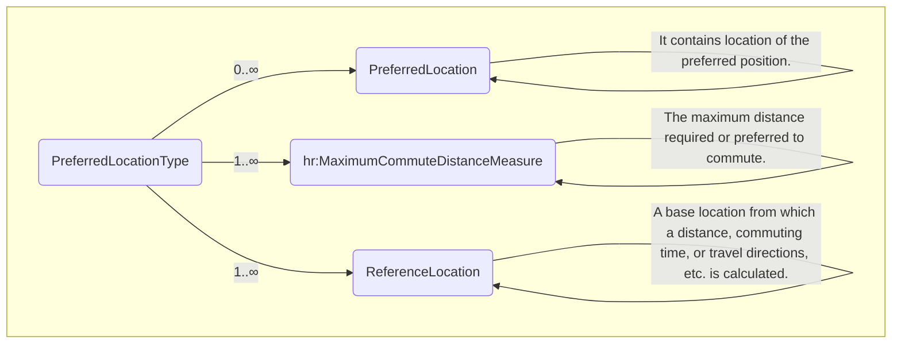
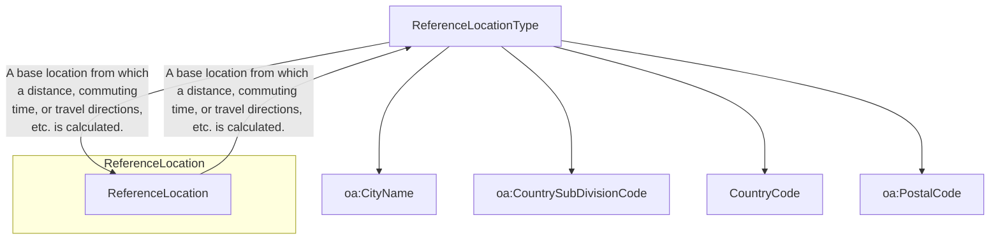
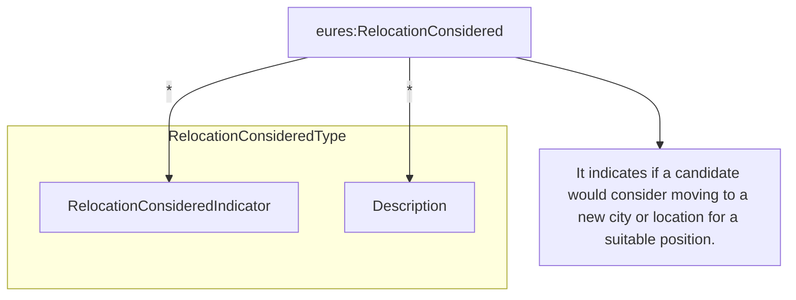

## 3.18 /CandidateProfile/CandidatePositionPreferences (level 2)

### 3.18.1 CandidatePositionPreferences Element Description

```mermaid
graph TD
A[PreferenceMatchingType] --> B(CandidatePositionPreferences)
B --> C(PreferredLocation)
B --> D(eures:JobCategory)
B --> E(hr:PositionTitle)
B --> F(hr:PositionOfferingTypeCode)
B --> G(hr:PositionScheduleTypeCode)
B --> H(hr:ShiftDescription)
B --> I(OfferedRemunerationPackage)
B --> J(eures:TravelPreference)
B --> K(eures:RelocationConsidered)
B --> L(WorkingLanguageCode)
B --> M(oa:Description)

subgraph CandidatePositionPreferences
direction LR
B -- "It contains a collection of information about a candidate's preferences in an position." --> B
C -- "It contains location of the preferred position." --> C
D -- "It contains the type or category of the job. May be used for occupational classification of the job." --> D
E -- "A short phrase describing the position as it would be listed on a business card or in a company directory. OED:
An..." --> E
F -- "These are values that are descriptive in classifying a position within advertising or communications of a
position..." --> F
G -- "Describes a position's general schedule." --> G
H -- "Descriptive information about a work shift. \"Shift\" refers to a portion or division of time during which
employees or..." --> H
I -- "It contains the remuneration offered." --> I
J -- "It contains travel preference details." --> J
K -- "It indicates if a candidate would consider moving to a new city or location for a suitable position." --> K
L -- "A code classifying the language or languages used within the workplace or associated with work. This is intended
to..." --> L
M -- "It contains a description of position preferences." --> M
end
```

<table>
  <thead>
    <tr>
      <th>Element</th>
      <th>Description</th>
      <th>Cardinalit y</th>
      <th>Rule</th>
      <th>Examples</th>
    </tr>
  </thead>
  <tbody>
    <tr>
      <td>CandidatePositionPreference s</td>
      <td>Information about a candidate's preferences in a position</td>
      <td>0..1</td>
      <td>N/A</td>
      <td>N/A</td>
    </tr>
    <tr>
      <td colspan="5"><strong>Sub-elements</strong></td>
    </tr>
    <tr>
      <td>PreferredLocation</td>
      <td>Location of the preferred position</td>
      <td>0..n</td>
      <td>N/A</td>
      <td>N/A</td>
    </tr>
  </tbody>
</table>


See section /CandidateProfile/CandidatePositionPreferences/PreferredLocation for more information

<table>
  <tr>
    <td><b>JobCategory</b></td>
    <td>The type or category of the job. May be used for occupational classification of the job.</td>
    <td>1..n</td>
    <td>N/A</td>
    <td>N/A</td>
  </tr>
  <tr>
    <td></td>
    <td colspan="4">See section /CandidateProfile/CandidatePositionPreferences/JobCategory for more information</td>
  </tr>
  <tr>
    <td><b>PositionTitle</b></td>
    <td>A short phrase describing the position as it would be listed on a business card or in a company directory</td>
    <td>0..1</td>
    <td>N/A</td>
    <td>“President”, “Chief Executive Officer”, etc.</td>
  </tr>
  <tr>
    <td><b>PositionOfferingTypeCode</b></td>
    <td>These values are descriptive in classifying a position opportunity<br>This is an HR-Open Standards open list.
    </td>
    <td>0..n</td>
    <td>BR-COM-38: Compulsory use of the “PositionOfferingCodeContentType” list.<br><br>BR-COM-43: Multiple entries of
      this code list are allowed.</td>
    <td>“DirectorHire”,<br>“Temporary”,<br>“TemporaryToHire”,<br>“ContractToHire”,<br>Etc.<br><br>Full code list:
      “HR-Open/EURES: PositionOfferingCodeContentType [CL37]”</td>
  </tr>
  <tr>
    <td><b>PositionScheduleTypeCode</b></td>
    <td>Describes a position’s general schedule<br>This is an HR-Open Standards open list.</td>
    <td>0..n</td>
    <td>BR-COM-39: Compulsory use of the “PositionScheduleCodeContentType” list.<br><br>BR-COM-43: Multiple entries of
      this code list are allowed.</td>
    <td>“FullTime”,<br>“PartTime”,<br>“FlexTime”,<br>“Any”<br><br>Full code list: “HR-Open/EURES:
      PositionScheduleCodeContentType [CL38]”</td>
  </tr>
  <tr>
    <td><b>ShiftDescription</b></td>
    <td>Descriptive information about a work shift. “Shift” refers to a portion or division of time during which
      employees or resources are scheduled to be engaged or on-duty.</td>
    <td>0..1</td>
    <td>N/A</td>
    <td>“Description about a work shift”, etc.</td>
  </tr>
  <tr>
    <td><b>OfferedRemunerationPackage</b></td>
    <td>Remuneration offered</td>
    <td>0..1</td>
    <td>N/A</td>
    <td>N/A</td>
  </tr>
  <tr>
    <td></td>
    <td colspan="4">See section /CandidateProfile/CandidatePositionPreferences/OfferedRemunerationPackage for more
      information</td>
  </tr>
  <tr>
    <td><b>TravelPreference</b></td>
    <td>Travel Preference details</td>
    <td>0..1</td>
    <td>N/A</td>
    <td>N/A</td>
  </tr>
  <tr>
    <td></td>
    <td colspan="4">See section /CandidateProfile/CandidatePositionPreferences/TravelPreference for more information
    </td>
  </tr>
  <tr>
    <td><b>RelocationConsidered</b></td>
    <td>Indicates if a candidate would consider moving to a new city or location for a suitable position</td>
    <td>0..1</td>
    <td>N/A</td>
    <td>N/A</td>
  </tr>
  <tr>
    <td></td>
    <td colspan="4">See section /CandidateProfile/CandidatePositionPreferences/RelocationConsidered for more information
    </td>
  </tr>
  <tr>
    <td><b>WorkingLanguageCode</b></td>
    <td>A code classifying the language or languages used within the workplace or associated with work. This is intended
      to communicate general information about the language(s) used within the work</td>
    <td>0..n</td>
    <td>Compulsory use of Languages [ECV06] code list.<br><br>BR-COM-43: Multiple entries of this code list are allowed.
    </td>
    <td>Europass2: Languages [ECV06]</td>
  </tr>
</table>


<table>
  <tr>
    <td></td>
    <td>environment or general information about a candidate's specific language preferences. This component might be
      offered as descriptive "pre-qualification" information on a position announcement. It might appear within the
      context of a Candidate Profile as a general statement of a candidate's general language capabilities or
      preferences. WorkingLanguageCode is not intended as a statement of language proficiency or specific requirement
      relating to language proficiency. Specific information regarding language proficiency should be covered either
      within PersonCompetency or as may be appropriate.</td>
    <td></td>
    <td></td>
    <td></td>
  </tr>
  <tr>
    <td>Description</td>
    <td>Description of position preferences</td>
    <td>0..1</td>
    <td>N/A</td>
    <td>"Description of the position preferences", etc.</td>
  </tr>
</table>

## 3.18.2 CandidatePositionPreferences Attributes

<table>
  <thead>
    <tr>
      <th>Attributes</th>
      <th>Description</th>
      <th>Card.</th>
      <th>Rule</th>
    </tr>
  </thead>
  <tbody>
    <tr>
      <td colspan="4">This element has no attributes.</td>
    </tr>
    <tr>
      <td colspan="4"><strong>OfferedRemunerationPackage attributes</strong></td>
    </tr>
    <tr>
      <td><strong>Attributes</strong></td>
      <td><strong>Description</strong></td>
      <td><strong>Card.</strong></td>
      <td><strong>Rule</strong></td>
    </tr>
    <tr>
      <td colspan="4">See section /CandidateProfile/CandidatePositionPreferences/OfferedRemunerationPackage for more
        information</td>
    </tr>
    <tr>
      <td colspan="4"><strong>PositionTitle attributes</strong></td>
    </tr>
    <tr>
      <td><strong>Attributes</strong></td>
      <td><strong>Description</strong></td>
      <td><strong>Card.</strong></td>
      <td><strong>Rule</strong></td>
    </tr>
    <tr>
      <td colspan="4">Refer to PositionTitleType Attributes section for additional attributes.</td>
    </tr>
    <tr>
      <td colspan="4"><strong>ShiftDescription attributes</strong></td>
    </tr>
    <tr>
      <td><strong>Attributes</strong></td>
      <td><strong>Description</strong></td>
      <td><strong>Card.</strong></td>
      <td><strong>Rule</strong></td>
    </tr>
    <tr>
      <td colspan="4">Refer to DescriptionType Attributes section for additional attributes.</td>
    </tr>
    <tr>
      <td colspan="4"><strong>Description attributes</strong></td>
    </tr>
    <tr>
      <td><strong>Attributes</strong></td>
      <td><strong>Description</strong></td>
      <td><strong>Card.</strong></td>
      <td><strong>Rule</strong></td>
    </tr>
    <tr>
      <td colspan="4">Refer to DescriptionType Attributes section for additional attributes.</td>
    </tr>
    <tr>
      <td colspan="4"><strong>PositionOfferingTypeCode attributes</strong></td>
    </tr>
    <tr>
      <td><strong>Attributes</strong></td>
      <td><strong>Description</strong></td>
      <td><strong>Card.</strong></td>
      <td><strong>Rule</strong></td>
    </tr>
    <tr>
      <td colspan="4">Refer to CodeListAttributeGroup Attributes section for additional attributes.</td>
    </tr>
    <tr>
      <td colspan="4"><strong>PositionScheduleTypeCode attributes</strong></td>
    </tr>
    <tr>
      <td><strong>Attributes</strong></td>
      <td><strong>Description</strong></td>
      <td><strong>Card.</strong></td>
      <td><strong>Rule</strong></td>
    </tr>
    <tr>
      <td colspan="4">Refer to CodeListAttributeGroup Attributes section for additional attributes.</td>
    </tr>
    <tr>
      <td colspan="4"><strong>WorkingLanguageCode attributes</strong></td>
    </tr>
    <tr>
      <td><strong>Attributes</strong></td>
      <td><strong>Description</strong></td>
      <td><strong>Card.</strong></td>
      <td><strong>Rule</strong></td>
    </tr>
    <tr>
      <td>typeCode</td>
      <td>It specifies type of the selected language: NORMAL, SIGN, CLASSSIC or FREETEXT</td>
      <td>0..1</td>
      <td>Values must be: NORMAL, SIGN, CLASSSIC or FREETEXT</td>
    </tr>
    <tr>
      <td colspan="4">Refer to CodeListAttributeGroup Attributes section for additional attributes.</td>
    </tr>
    <tr>
      <td colspan="4"><strong>PreferredLocation attributes</strong></td>
    </tr>
    <tr>
      <td><strong>Attributes</strong></td>
      <td><strong>Description</strong></td>
      <td><strong>Card.</strong></td>
      <td><strong>Rule</strong></td>
    </tr>
  </tbody>
</table>


See section /CandidateProfile/CandidatePositionPreferences/PreferredLocation for more information

**RelocationConsidered attributes**

<table>
  <thead>
    <tr>
      <th>Attributes</th>
      <th>Description</th>
      <th>Card.</th>
      <th>Rule</th>
    </tr>
  </thead>
  <tbody>
    <tr>
      <td colspan="4">See section /CandidateProfile/CandidatePositionPreferences/RelocationConsidered for more
        information</td>
    </tr>
  </tbody>
</table>

**TravelPreference attributes**

<table>
  <thead>
    <tr>
      <th>Attributes</th>
      <th>Description</th>
      <th>Card.</th>
      <th>Rule</th>
    </tr>
  </thead>
  <tbody>
    <tr>
      <td colspan="4">See section /CandidateProfile/CandidatePositionPreferences/TravelPreference for more information
      </td>
    </tr>
  </tbody>
</table>

**JobCategory attributes**

<table>
  <thead>
    <tr>
      <th>Attributes</th>
      <th>Description</th>
      <th>Card.</th>
      <th>Rule</th>
    </tr>
  </thead>
  <tbody>
    <tr>
      <td colspan="4">See section /CandidateProfile/CandidatePositionPreferences/OfferedRemunerationPackage/JobCategory
        for more information</td>
    </tr>
  </tbody>
</table>

### 3.18.3 Sub-element: /CandidateProfile/CandidatePositionPreference/PreferredLocation (level 3)

#### 3.18.3.1 PreferredLocation Element Description



<table>
  <thead>
    <tr>
      <th>Element</th>
      <th>Description</th>
      <th>Cardinality</th>
      <th>Rule</th>
      <th>Examples</th>
    </tr>
  </thead>
  <tbody>
    <tr>
      <td>PreferredLocation</td>
      <td>Location of the preferred position</td>
      <td>0..n</td>
      <td>N/A</td>
      <td>N/A</td>
    </tr>
  </tbody>
</table>

**Sub-elements**

<table>
  <thead>
    <tr>
      <th></th>
      <th></th>
      <th></th>
      <th></th>
    </tr>
  </thead>
  <tbody>
    <tr>
      <td>MaximumCommuteDistance</td>
      <td>The maximum distance required or preferred to commute</td>
      <td>0..1</td>
      <td>N/A</td>
      <td>N/A</td>
    </tr>
    <tr>
      <td>ReferenceLocation</td>
      <td>A base location from which a distance, commuting time, or travel directions, etc. is calculated<br><br>See
        section /CandidateProfile/CandidatePositionPreference/PreferredLocation/ReferenceLocation for more information
      </td>
      <td>1..n</td>
      <td></td>
      <td>N/A</td>
    </tr>
  </tbody>
</table>

#### 3.18.3.2 PreferredLocation Attributes

<table>
  <thead>
    <tr>
      <th>Attributes</th>
      <th>Description</th>
      <th>Card.</th>
      <th>Rule</th>
    </tr>
  </thead>
  <tbody>
    <tr>
      <td colspan="4">This element has no attributes.</td>
    </tr>
  </tbody>
</table>

**MaximumCommuteDistanceMeasure attributes**

<table>
  <thead>
    <tr>
      <th>Attributes</th>
      <th>Description</th>
      <th>Card.</th>
      <th>Rule</th>
    </tr>
  </thead>
  <tbody>
    <tr>
      <td colspan="4">Refer to MeasureType Attributes section for additional attributes.</td>
    </tr>
  </tbody>
</table>

**ReferenceLocation attributes**

<table>
  <thead>
    <tr>
      <th>Attributes</th>
      <th>Description</th>
      <th>Card.</th>
      <th>Rule</th>
    </tr>
  </thead>
  <tbody>
    <tr>
      <td colspan="4">See section /CandidateProfile/CandidatePositionPreference/PreferredLocation/ReferenceLocation for
        more information</td>
    </tr>
  </tbody>
</table>


### 3.18.4 Sub-element: /CandidateProfile/CandidatePositionPreference/PreferredLocation/ReferenceLocation (level 4)

#### 3.18.4.1 ReferenceLocation Element Description



<table>
  <thead>
    <tr>
      <th>Element</th>
      <th>Description</th>
      <th>Cardinality</th>
      <th>Rule</th>
      <th>Examples</th>
    </tr>
  </thead>
  <tbody>
    <tr>
      <td><strong>ReferenceLocation</strong></td>
      <td>A base location from which a distance, commuting time, or travel directions, etc. is calculated</td>
      <td>1..n</td>
      <td></td>
      <td>N/A</td>
    </tr>
    <tr>
      <td colspan="5"><strong>Sub-elements</strong></td>
    </tr>
    <tr>
      <td><strong>CityName</strong></td>
      <td>Identifies the town or the city</td>
      <td>0..1</td>
      <td>N/A</td>
      <td>"Brussels", "Barcelona", "London", etc.</td>
    </tr>
    <tr>
      <td><strong>CountrySubdivisionCode</strong></td>
      <td>Qualifies the further division of the Member States of Europe, which can be Districts, Regions, States,
        Provinces etc.</td>
      <td>0..1</td>
      <td>BR-COM-21: Compulsory use of the "EURES_CountrySubdivisionCodes-CodeList.gc" list defined by EURES. This is
        based on NUTS 2013 – Level 3.<br><br>BR-COM-53: If CountryCode is specified, CountrySubDivisionCode value must
        correspond to CountryCode value.</td>
      <td>"BE07", "CS01", etc.<br><br>Full code list: "HR-Open/EURES: CountrySubdivisionCodes [CL08]"</td>
    </tr>
    <tr>
      <td><strong>CountryCode</strong></td>
      <td>Code of the country</td>
      <td>0..1</td>
      <td>Compulsory use of CountriesAndNationalities [ECV02], AuxCountriesAndNationalities [ECV10]</td>
      <td>Europass2: CountriesAndNationalities [ECV02],<br>Europass2: AuxCountriesAndNationalities [ECV10]</td>
    </tr>
    <tr>
      <td><strong>PostalCode</strong></td>
      <td>The Address' Postal Code.</td>
      <td>0..1</td>
      <td></td>
      <td></td>
    </tr>
  </tbody>
</table>


#### 3.18.4.2 *ReferenceLocation Attributes*

<table>
  <thead>
    <tr>
      <th>Attributes</th>
      <th>Description</th>
      <th>Card.</th>
      <th>Rule</th>
    </tr>
  </thead>
  <tbody>
    <tr>
      <td colspan="4">This element has no attributes</td>
    </tr>
    <tr>
      <td colspan="4"><strong>CityName attributes</strong></td>
    </tr>
  </tbody>
</table>

<table>
  <thead>
    <tr>
      <th>Attributes</th>
      <th>Description</th>
      <th>Card.</th>
      <th>Rule</th>
    </tr>
  </thead>
  <tbody>
    <tr>
      <td colspan="4">Refer to NameType Attributes section for additional attributes</td>
    </tr>
    <tr>
      <td colspan="4"><strong>PostalCode attributes</strong></td>
    </tr>
  </tbody>
</table>

<table>
  <thead>
    <tr>
      <th>Attributes</th>
      <th>Description</th>
      <th>Card.</th>
      <th>Rule</th>
    </tr>
  </thead>
  <tbody>
    <tr>
      <td colspan="4">Refer to CodeType Attribute section for additional attributes</td>
    </tr>
    <tr>
      <td colspan="4"><strong>CountrySubdivision attributes</strong></td>
    </tr>
  </tbody>
</table>

<table>
  <thead>
    <tr>
      <th>Attributes</th>
      <th>Description</th>
      <th>Card.</th>
      <th>Rule</th>
    </tr>
  </thead>
  <tbody>
    <tr>
      <td colspan="4">Refer to CodeListAttributeGroup section for additional attributes</td>
    </tr>
    <tr>
      <td colspan="4"><strong>CountryCode attributes</strong></td>
    </tr>
  </tbody>
</table>

<table>
  <thead>
    <tr>
      <th>Attributes</th>
      <th>Description</th>
      <th>Card.</th>
      <th>Rule</th>
    </tr>
  </thead>
  <tbody>
    <tr>
      <td><strong>validFrom</strong></td>
      <td>Validity start date as a resident of the country</td>
      <td>0..1</td>
      <td>BR-COM-06: Compulsory Date Format is: YYYY-MM-DD, YYYY-MM, YYYY or YYYY-MM-DDThh:mm:ss.</td>
    </tr>
    <tr>
      <td><strong>validTo</strong></td>
      <td>Validity end date as a resident of the country</td>
      <td>0..1</td>
      <td>BR-COM-06: Compulsory Date Format is: YYYY-MM-DD, YYYY-MM, YYYY or YYYY-MM-DDThh:mm:ss.</td>
    </tr>
    <tr>
      <td colspan="4">Refer to CodeListAttributeGroup Attributes for additional attributes.</td>
    </tr>
  </tbody>
</table>

### 3.18.5 Sub-element: /CandidateProfile/CandidatePositionPreference/JobCategory (level 3)

#### 3.18.5.1 *JobCategory Element Description*

&lt;img&gt;Diagram showing "JobCategoryType" with "hr:JobCategoryCode" and "oa:Description"&lt;/img&gt;

<table>
  <thead>
    <tr>
      <th>Element</th>
      <th>Description</th>
      <th>Cardinality</th>
      <th>Rule</th>
      <th>Examples</th>
    </tr>
  </thead>
  <tbody>
    <tr>
      <td><strong>JobCategory</strong></td>
      <td>Category of the job</td>
      <td>1..n</td>
      <td>N/A</td>
      <td>N/A</td>
    </tr>
    <tr>
      <td colspan="5"><strong>Sub-elements</strong></td>
    </tr>
    <tr>
      <td><strong>JobCategoryCode</strong></td>
      <td>A code classifying the type or category of a job. This may be used for its occupational classification. The
        JobCategoryCode will usually be repeatable so that a single job could be classified across multiple
        dimensions.<br>The JobCategoryCode could be used to classify the job by industry but note that an explicit
        IndustryCode is available in contexts such as PositionOrganizationDetails.</td>
      <td>1</td>
      <td>BR-COM-29: Compulsory use of the “ISCO2008-CodeList.gc” list defined by EURES and based on
        ISCO-08.<br>Alternatively, use of ESCO Occupations – version 1.0.<br><br>BR-COM-55: Compulsory use of the
        attributes “listVersionID”, “listName” and “listURI”.</td>
      <td>“1” – Managers,<br>“12” – Administrative,<br>etc.<br><br>Full code list: “HR-Open/EURES:<br>ISCO2008
        [CL20]<br>HR-Open/EURES:<br>ESCO_Occupations<br>[CL20]</td>
    </tr>
    <tr>
      <td><strong>Description</strong></td>
      <td>Job category Description</td>
      <td>0..1</td>
      <td>N/A</td>
      <td>“Description of job category”, etc.</td>
    </tr>
  </tbody>
</table>

#### 3.18.5.2 *JobCategory Attributes*

<table>
  <thead>
    <tr>
      <th>Attributes</th>
      <th>Description</th>
      <th>Card.</th>
      <th>Rule</th>
    </tr>
  </thead>
  <tbody>
    <tr>
      <td colspan="4">This element has no attributes.</td>
    </tr>
    <tr>
      <td colspan="4"><strong>JobCategoryCode attributes</strong></td>
    </tr>
    <tr>
      <td><strong>Attributes</strong></td>
      <td><strong>Description</strong></td>
      <td><strong>Card.</strong></td>
      <td><strong>Rule</strong></td>
    </tr>
    <tr>
      <td colspan="4">Refer to CodeType Attributes section for additional attributes.</td>
    </tr>
    <tr>
      <td colspan="4"><strong>Description attributes</strong></td>
    </tr>
  </tbody>
</table>


<table>
  <thead>
    <tr>
      <th>Attributes</th>
      <th>Description</th>
      <th>Card.</th>
      <th>Rule</th>
    </tr>
  </thead>
  <tbody>
    <tr>
      <td colspan="4">Refer to DescriptionType Attributes section for additional attributes.</td>
    </tr>
  </tbody>
</table>

### 3.18.6 Sub-element: /CandidateProfile/CandidatePositionPreference/OfferedRemunerationPackage (level 3)

#### 3.18.6.1 OfferedRemunerationPackage Element Description

```mermaid
graph TD
subgraph OfferedRemunerationPackageType
OfferedRemunerationPackage --> @Attributes
OfferedRemunerationPackage --> hr:RemunerationBasisCode
OfferedRemunerationPackage --> RemunerationRange
OfferedRemunerationPackage --> eures:BenefitsSummary
OfferedRemunerationPackage --> oa:Description
end

@Attributes --> OfferedRemunerationPackage
hr:RemunerationBasisCode --> OfferedRemunerationPackage
RemunerationRange --> OfferedRemunerationPackage
eures:BenefitsSummary --> OfferedRemunerationPackage
oa:Description --> OfferedRemunerationPackage

OfferedRemunerationPackage -- "It contains the remuneration offered." --> OfferedRemunerationPackage
hr:RemunerationBasisCode -- "Position Remuneration Basis. Code A code classifying the primary method of payment for the
associated position or..." --> hr:RemunerationBasisCode
RemunerationRange -- "It contains remuneration range details." --> RemunerationRange
eures:BenefitsSummary -- "It contains summary of the benefits." --> eures:BenefitsSummary
oa:Description -- "It contains description of the remuneration offered." --> oa:Description

OfferedRemunerationPackage -- "Terms offered or agreed regarding remuneration for a position. May include pay as well as
benefits in-kind." --> OfferedRemunerationPackage
```

<table>
  <thead>
    <tr>
      <th>Element</th>
      <th>Description</th>
      <th>Cardinalit</th>
      <th>Rule</th>
      <th>Examples</th>
    </tr>
  </thead>
  <tbody>
    <tr>
      <td>OfferedRemunerationPackage</td>
      <td>Remuneration offered</td>
      <td>0..1</td>
      <td>N/A</td>
      <td>N/A</td>
    </tr>
  </tbody>
</table>

Sub-elements

<table>
  <thead>
    <tr>
      <th></th>
      <th></th>
      <th></th>
      <th></th>
      <th></th>
    </tr>
  </thead>
  <tbody>
    <tr>
      <td>RemunerationBasisCode</td>
      <td>A code classifying the primary method of payment for the associated position or employment. This classifies
        the method by which remuneration for a position is provided or calculated.<br><br>This is an HR-Open Standards
        open list.</td>
      <td>0..1</td>
      <td>BR-COM-30: Compulsory use of the "RemunerationBasisCodeContentType" list.<br><br>Full code list:
        "HR-Open/EURES: RemunerationBasisCodeContentType [CL48]"</td>
      <td>"Hourly", "Salaried", "SalariedPlusComission", "ComissionOnly"</td>
    </tr>
    <tr>
      <td>RemunerationRange</td>
      <td>Remuneration range details</td>
      <td>0..n</td>
      <td>BR-COM-31: All its sub elements must be expressed using the same currency.</td>
      <td>N/A</td>
    </tr>
  </tbody>
</table>


```mermaid
erDiagram
OfferedRemunerationPackageType ||--o{ OfferedRemunerationPackage : "It contains the remuneration offered."
OfferedRemunerationPackage {
@Attributes
hr:EffectiveDateAttributeGroup
@ validFrom
@ validTo
}
```

See section
/CandidateProfile/CandidatePositionPreference/OfferedRemunerationPackage/RemunerationRange for more information

<table>
  <tr>
    <td><b>BenefitsSummary</b></td>
    <td>Summary of benefits</td>
    <td>0..n</td>
    <td>N/A</td>
    <td>N/A</td>
  </tr>
  <tr>
    <td colspan="5">See
      section:<br>/CandidateProfile/CandidatePositionPreference/OfferedRemunerationPackage/BenefitsSummary for more
      information</td>
  </tr>
  <tr>
    <td><b>Description</b></td>
    <td>Description of the remuneration offered</td>
    <td>0..1</td>
    <td>N/A</td>
    <td>N/A</td>
  </tr>
</table>

#### 3.18.6.2 *OfferedRemunerationPackage Attributes*

<table>
  <thead>
    <tr>
      <th>Attributes</th>
      <th>Description</th>
      <th>Card.</th>
      <th>Rule</th>
    </tr>
  </thead>
  <tbody>
    <tr>
      <td><b>validFrom</b></td>
      <td>Validity start date for this entity's information</td>
      <td>0..1</td>
      <td>BR-COM-06: Compulsory Date Format is: YYYY-MM-DD, YYYY-MM, YYYY or YYYY-MM-DDThh:mm:ss.</td>
    </tr>
    <tr>
      <td><b>validTo</b></td>
      <td>Validity end date for this entity's information</td>
      <td>0..1</td>
      <td>BR-COM-06: Compulsory Date Format is: YYYY-MM-DD, YYYY-MM, YYYY or YYYY-MM-DDThh:mm:ss.</td>
    </tr>
  </tbody>
</table>

**BenefitsSummary attributes**

<table>
  <thead>
    <tr>
      <th>Attributes</th>
      <th>Description</th>
      <th>Card.</th>
      <th>Rule</th>
    </tr>
  </thead>
  <tbody>
    <tr>
      <td colspan="4">See section:
        /CandidateProfile/CandidatePositionPreference/OfferedRemunerationPackage/BenefitsSummary for more information
      </td>
    </tr>
  </tbody>
</table>

**RemunerationRange attributes**

<table>
  <thead>
    <tr>
      <th>Attributes</th>
      <th>Description</th>
      <th>Card.</th>
      <th>Rule</th>
    </tr>
  </thead>
  <tbody>
    <tr>
      <td colspan="4">See section
        /CandidateProfile/CandidatePositionPreference/OfferedRemunerationPackage/RemunerationRange for more information
      </td>
    </tr>
  </tbody>
</table>

**RemnuerationBasisCode attributes**

<table>
  <thead>
    <tr>
      <th>Attributes</th>
      <th>Description</th>
      <th>Card.</th>
      <th>Rule</th>
    </tr>
  </thead>
  <tbody>
    <tr>
      <td colspan="4">Refer to CodeListAttributeGroup Attributes section for additional attributes.</td>
    </tr>
  </tbody>
</table>

**Description attributes**

<table>
  <thead>
    <tr>
      <th>Attributes</th>
      <th>Description</th>
      <th>Card.</th>
      <th>Rule</th>
    </tr>
  </thead>
  <tbody>
    <tr>
      <td colspan="4">Refer to DescriptionType Attributes section for additional attributes.</td>
    </tr>
  </tbody>
</table>


### 3.18.7 Sub-element: /CandidateProfile/CandidatePositionPreference/OfferedRemunerationPackage/RemunerationRange (level 4)

#### 3.18.7.1 RemunerationRange Element Description

```mermaid
graph TD
subgraph RemunerationRangeType
A[RemunerationRange] --> B[hr:RemunerationTypeCode]
A --> C[RemunerationReferenceAmount]
A --> D[RemunerationMinimumAmount]
A --> E[RemunerationMaximumAmount]
A --> F[hr:RemunerationRateIntervalCode]
end

B -- "Remuneration Type Code The type of remuneration (e.g. BasePay, Bonus). CodeList: RemunerationTypeCodeType" -->
B_desc
C -- "A reference to an associated monetary amount. A monetary quantity. An attribute is available to express the
currency in..." --> C_desc
D -- "The minimum amount a person is willing to accept or an organization is willing to pay for a position." --> D_desc
E -- "The maximum amount a person is willing to accept or an organization is willing to pay for a position." --> E_desc
F -- "Remuneration Rate Interval Code A code identifying at what rate the remuneration is made. CodeList:..." --> F_desc

style B fill:#fff,stroke:#333,stroke-width:2px
style C fill:#fff,stroke:#333,stroke-width:2px
style D fill:#fff,stroke:#333,stroke-width:2px
style E fill:#fff,stroke:#333,stroke-width:2px
style F fill:#fff,stroke:#333,stroke-width:2px

B_desc: It contains remuneration range details.
C_desc: The minimum and maximum range of work compensation. OED: Range n, A series or scale extending between certain
limits.
```

<table>
  <thead>
    <tr>
      <th>Element</th>
      <th>Description</th>
      <th>Cardinality</th>
      <th>Rule</th>
      <th>Examples</th>
    </tr>
  </thead>
  <tbody>
    <tr>
      <td><strong>RemunerationRange</strong></td>
      <td>Remuneration range details</td>
      <td>0..n</td>
      <td><strong>BR-COM-31:</strong> All its sub elements must be expressed using the same currency.</td>
      <td>N/A</td>
    </tr>
    <tr>
      <td colspan="5"><strong>Sub-elements</strong></td>
    </tr>
    <tr>
      <td><strong>RemunerationTypCode</strong></td>
      <td>A code classifying the type of pay or remuneration being described<br>This is an HR-Open Standards open list.
      </td>
      <td>0..1</td>
      <td><strong>BR-COM-32:</strong> Compulsory use of the “RemunerationCodeContentType” list.</td>
      <td>“BasePay”, “Commission”, “Bonus”, “ShortTermIncentive”, “ShiftPremium”<br>Full code list: “HR-Open/EURES:
        RemunerationCodeContentType [CL49]”</td>
    </tr>
    <tr>
      <td><strong>RemunerationReferenceAmount</strong></td>
      <td>A reference to an associated monetary quantity. An attribute is available to express the currency in which the
        amount is expressed.</td>
      <td>0..1</td>
      <td>N/A</td>
      <td>“20000”, “35000”, etc.</td>
    </tr>
  </tbody>
</table>


<table>
  <thead>
    <tr>
      <th>RemunerationMinimumAmount</th>
      <th>Description</th>
      <th>Card.</th>
      <th>Rule</th>
    </tr>
  </thead>
  <tbody>
    <tr>
      <td>0.1</td>
      <td>The minimum amount a person is willing to accept, or an organization is willing to pay for a position.</td>
      <td>N/A</td>
      <td>"20000", "35000", etc.</td>
    </tr>
    <tr>
      <td>RemunerationMaximumAmount</td>
      <td>The maximum amount a person is willing to accept, or an organization is willing to pay for a position.</td>
      <td>0.1</td>
      <td>N/A</td>
    </tr>
    <tr>
      <td>RemunerationRateIntervalCode</td>
      <td>An interval of time or other basis used to express a rate of pay or remuneration</td>
      <td>0.1</td>
      <td>BR-COM-33: Compulsory use of the "RemunerationRateIntervalCodeContent Type" list.<br><br>This is an HR-Open
        Standards open list.</td>
    </tr>
  </tbody>
</table>

Figure 139: Name Attributes Schema

#### 3.18.7.2 RemunerationRange Attributes

<table>
  <thead>
    <tr>
      <th>Attributes</th>
      <th>Description</th>
      <th>Card.</th>
      <th>Rule</th>
    </tr>
  </thead>
  <tbody>
    <tr>
      <td colspan="4">This element has no attributes.</td>
    </tr>
    <tr>
      <td colspan="4">RemunerationMinimumAmount attributes</td>
    </tr>
    <tr>
      <td>currencyID</td>
      <td>The currency in which the maximal and minimal salary are indicated.</td>
      <td>1</td>
      <td>Compulsory use of the Europass2: Currency [ECV08]</td>
    </tr>
    <tr>
      <td colspan="4">RemunerationMaximumAmount attributes</td>
    </tr>
    <tr>
      <td colspan="4">The same as "RemunerationMinimumAmount"</td>
    </tr>
    <tr>
      <td colspan="4">RemunerationReferenceAmount attributes</td>
    </tr>
    <tr>
      <td colspan="4">The same as "RemunerationMinimumAmount"</td>
    </tr>
    <tr>
      <td colspan="4">RemunerationRateIntervalCode attributes</td>
    </tr>
    <tr>
      <td colspan="4">Refer to CodeListAttributeGroup Attributes for additional attributes.</td>
    </tr>
    <tr>
      <td colspan="4">RemunerationTypeCode attributes</td>
    </tr>
    <tr>
      <td colspan="4">Refer to CodeListAttributeGroup Attributes for additional attributes.</td>
    </tr>
  </tbody>
</table>


### 3.18.8 Sub-element: /CandidateProfile/CandidatePositionPreference/OfferedRemunerationPackage/BenefitsSummary (level 4)

#### 3.18.8.1 BenefitsSummary Element Description

```mermaid
graph TD
A[BenefitsSummaryType] --> B(eures:BenefitsSummary)
B -- "It contains summary of the benefits." --> C
A --> D(OtherBenefits)
D -- "ABIE Benefits Summary. Details A summary of employee benefits ("fringe benefits," health, pension, etc.)
associated..." --> E
```

<table>
  <thead>
    <tr>
      <th>Element</th>
      <th>Description</th>
      <th>Cardinality</th>
      <th>Rule</th>
      <th>Examples</th>
    </tr>
  </thead>
  <tbody>
    <tr>
      <td><strong>BenefitsSummary</strong></td>
      <td>Summary of benefits</td>
      <td>0..n</td>
      <td>N/A</td>
      <td>N/A</td>
    </tr>
    <tr>
      <td colspan="5"><strong>Sub-elements</strong></td>
    </tr>
    <tr>
      <td><strong>OtherBenefits</strong></td>
      <td>Details of benefits<br>See section
        /CandidateProfile/CandidatePositionPreference/OfferedRemunerationPackage/BenefitsSummary/OtherBenefits for more
        information</td>
      <td>0..1</td>
      <td>N/A</td>
      <td>N/A</td>
    </tr>
  </tbody>
</table>

#### 3.18.8.2 BenefitsSummary Attributes

<table>
  <thead>
    <tr>
      <th>Attributes</th>
      <th>Description</th>
      <th>Card.</th>
      <th>Rule</th>
    </tr>
  </thead>
  <tbody>
    <tr>
      <td colspan="4">This element has no attributes.</td>
    </tr>
    <tr>
      <td colspan="4"><strong>OtherBenefits attributes</strong></td>
    </tr>
  </tbody>
</table>

### 3.18.9 Sub-element: /CandidateProfile/CandidatePositionPreference/OfferedRemunerationPackage/BenefitsSummary/OtherBenefits (level 5)

#### 3.18.9.1 OtherBenefits Element Description

```mermaid
graph TD
A[BenefitsSummaryType] --> B(OtherBenefitsType)
B --> C(OtherBenefits)
C -- "ABIE Benefits Summary. Details A summary of employee benefits ("fringe benefits," health, pension, etc.)
associated..." --> D
B --> E(hr:OtherBenefitsTypeCode)
B --> F(oa:Description)
E -- "BR-COM-40: Compulsory use of the \"EURES_SocialBenefitsCodes-CodeList.gc\" list defined by EURES." --> G
```

<table>
  <thead>
    <tr>
      <th>Element</th>
      <th>Description</th>
      <th>Cardinality</th>
      <th>Rule</th>
      <th>Examples</th>
    </tr>
  </thead>
  <tbody>
    <tr>
      <td><strong>OtherBenefits</strong></td>
      <td>Details of the other benefits</td>
      <td>0..1</td>
      <td>N/A</td>
      <td>N/A</td>
    </tr>
    <tr>
      <td colspan="5"><strong>Sub-elements</strong></td>
    </tr>
    <tr>
      <td><strong>OtherBenefitsTypeCode</strong></td>
      <td>Code of benefits that the candidate would like</td>
      <td>0..n</td>
      <td>BR-COM-40: Compulsory use of the "EURES_SocialBenefitsCodes-CodeList.gc" list defined by EURES.</td>
      <td>"0" = Accommodation included,<br>"1" = Meals included,<br>etc.</td>
    </tr>
  </tbody>
</table>


<table>
  <tr>
    <td>Description</td>
    <td>Narrative details of benefits</td>
    <td>0..1</td>
    <td>N/A</td>
    <td>BR-COM-43: Multiple entries of this code list are allowed.<br>Full code list: "HR-Open/EURES:
      SocialBenefitsCodes [CL52]"<br>"Description of other benefits", etc.</td>
  </tr>
</table>


#### 3.18.9.2 OtherBenefits Attributes

<table>
  <thead>
    <tr>
      <th>Attributes</th>
      <th>Description</th>
      <th>Card.</th>
      <th>Rule</th>
    </tr>
  </thead>
  <tbody>
    <tr>
      <td colspan="4">This element has no attributes.</td>
    </tr>
    <tr>
      <td colspan="4"><b>OtherBenefitsTypeCode attributes</b></td>
    </tr>
    <tr>
      <td><b>Attributes</b></td>
      <td><b>Description</b></td>
      <td><b>Card.</b></td>
      <td><b>Rule</b></td>
    </tr>
    <tr>
      <td colspan="4">Refer to CodeType Attributes section for additional attributes</td>
    </tr>
    <tr>
      <td colspan="4"><b>Description attributes</b></td>
    </tr>
    <tr>
      <td><b>Attributes</b></td>
      <td><b>Description</b></td>
      <td><b>Card.</b></td>
      <td><b>Rule</b></td>
    </tr>
    <tr>
      <td colspan="4">Refer to DescriptionType Attributes section for additional attributes</td>
    </tr>
  </tbody>
</table>

### 3.18.10 Sub-element: /CandidateProfile/CandidatePositionPreference/TravelPreference (level 3)

#### 3.18.10.1 TravelPreference Element Description

&lt;img&gt;Diagram showing TravelPreferenceType with sub-elements WillingToTravelIndicator, TravelPercentage, and
Description.&lt;/img&gt;

<table>
  <thead>
    <tr>
      <th>Element</th>
      <th>Description</th>
      <th>Cardinality</th>
      <th>Rule</th>
      <th>Examples</th>
    </tr>
  </thead>
  <tbody>
    <tr>
      <td>TravelPreference</td>
      <td>Travel Preference Details</td>
      <td>0..1</td>
      <td>N/A</td>
      <td>N/A</td>
    </tr>
    <tr>
      <td colspan="5"><b>Sub-elements</b></td>
    </tr>
    <tr>
      <td>WillingToTravelIndicator</td>
      <td>Indicates that a person is willing to travel within the capacity of his or her position</td>
      <td>0..1</td>
      <td>N/A</td>
      <td>"True" or "False"</td>
    </tr>
    <tr>
      <td>TravelPercentage</td>
      <td>A rate, number or proportion per hundred. The percentage of time required for a position or the percentage of
        time a person is willing to travel for a particular position</td>
      <td>0..1</td>
      <td>N/A</td>
      <td>"25", "35", etc.</td>
    </tr>
    <tr>
      <td>Description</td>
      <td>Description of the travel preference</td>
      <td>0..1</td>
      <td>N/A</td>
      <td>N/A</td>
    </tr>
  </tbody>
</table>

#### 3.18.10.2 TravelPreference Attributes

<table>
  <thead>
    <tr>
      <th>Attributes</th>
      <th>Description</th>
      <th>Card.</th>
      <th>Rule</th>
    </tr>
  </thead>
  <tbody>
    <tr>
      <td colspan="4">This element has no attributes.</td>
    </tr>
    <tr>
      <td colspan="4"><b>Description attributes</b></td>
    </tr>
    <tr>
      <td><b>Attributes</b></td>
      <td><b>Description</b></td>
      <td><b>Card.</b></td>
      <td><b>Rule</b></td>
    </tr>
    <tr>
      <td colspan="4">Refer to DescriptionType Attributes section for additional attributes.</td>
    </tr>
    <tr>
      <td colspan="4"><b>WillingToTravelIndicator attributes</b></td>
    </tr>
    <tr>
      <td><b>Attributes</b></td>
      <td><b>Description</b></td>
      <td><b>Card.</b></td>
      <td><b>Rule</b></td>
    </tr>
    <tr>
      <td colspan="4">This sub-element has no attributes.</td>
    </tr>
    <tr>
      <td colspan="4"><b>TravelPercentage attributes</b></td>
    </tr>
    <tr>
      <td><b>Attributes</b></td>
      <td><b>Description</b></td>
      <td><b>Card.</b></td>
      <td><b>Rule</b></td>
    </tr>
    <tr>
      <td colspan="4">This sub-element has no attributes.</td>
    </tr>
  </tbody>
</table>


### 3.18.11 Sub-element: /CandidateProfile/CandidatePositionPreference/RelocationConsidered (level 3)

#### 3.18.11.1 RelocationConsidered Element Description



<table>
  <thead>
    <tr>
      <th>Element</th>
      <th>Description</th>
      <th>Cardinality</th>
      <th>Rule</th>
      <th>Examples</th>
    </tr>
  </thead>
  <tbody>
    <tr>
      <td>RelocationConsidered</td>
      <td>Indicates if a candidate would consider moving to a new city or location for a suitable position</td>
      <td>0..1</td>
      <td>N/A</td>
      <td>N/A</td>
    </tr>
  </tbody>
</table>

Sub-elements

<table>
  <thead>
    <tr>
      <th>Element</th>
      <th>Description</th>
      <th>Cardinality</th>
      <th>Rule</th>
      <th>Examples</th>
    </tr>
  </thead>
  <tbody>
    <tr>
      <td>RelocationConsideredIndicator</td>
      <td>Indicates whether relocation is an option for the candidate or considered by the hiring company</td>
      <td>0..1</td>
      <td>N/A</td>
      <td>"True" or "False"</td>
    </tr>
    <tr>
      <td>Description</td>
      <td>Description of the relocation considered</td>
      <td>0..1</td>
      <td>N/A</td>
      <td>N/A.</td>
    </tr>
  </tbody>
</table>

#### 3.18.11.2 RelocationConsidered Attributes

<table>
  <thead>
    <tr>
      <th>Attributes</th>
      <th>Description</th>
      <th>Card.</th>
      <th>Rule</th>
    </tr>
  </thead>
  <tbody>
    <tr>
      <td colspan="4">This element has no attributes.</td>
    </tr>
  </tbody>
</table>

Description sub-element

<table>
  <thead>
    <tr>
      <th>Attributes</th>
      <th>Description</th>
      <th>Card.</th>
      <th>Rule</th>
    </tr>
  </thead>
  <tbody>
    <tr>
      <td colspan="4">Refer to DescriptionType Attributes section for additional attributes.</td>
    </tr>
  </tbody>
</table>

RelocationConsidered sub-element

<table>
  <thead>
    <tr>
      <th>Attributes</th>
      <th>Description</th>
      <th>Card.</th>
      <th>Rule</th>
    </tr>
  </thead>
  <tbody>
    <tr>
      <td colspan="4">This sub-element has no attributes.</td>
    </tr>
  </tbody>
</table>

