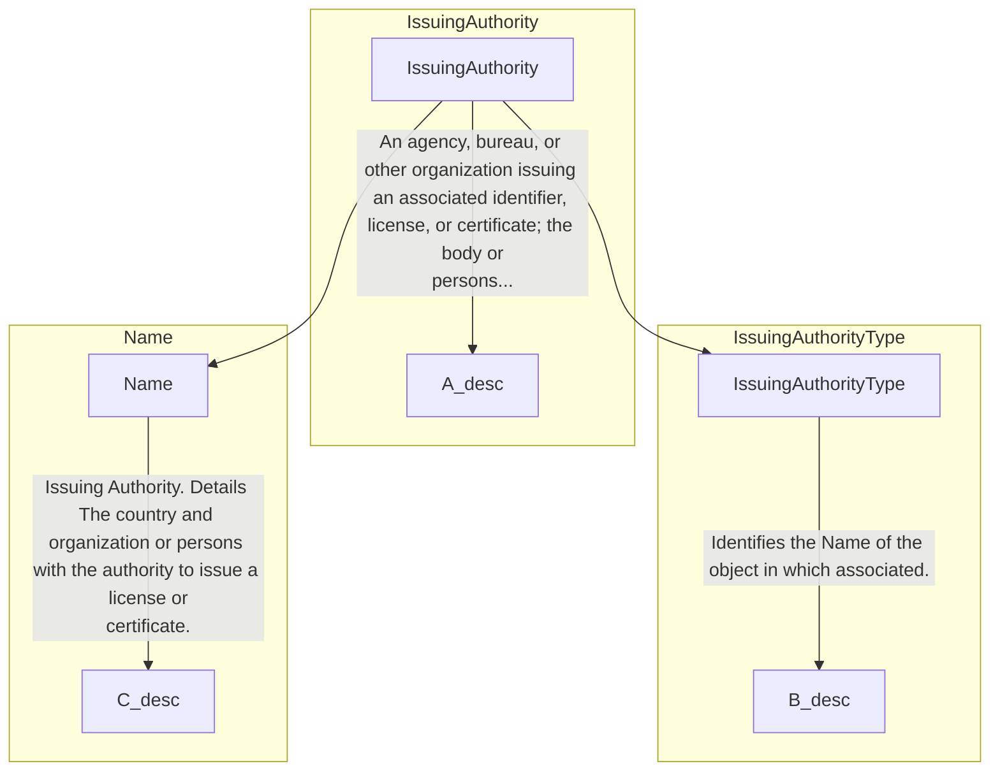

## 3.21 /CandidateProfile/PatentHistory (level 2)

### 3.21.1 PatentHistory Element Description

&lt;img&gt;Diagram showing eures:PatentHistory with attributes, PatentHistoryType, and sub-elements hr:PatentHistoryID
and Patent.&lt;/img&gt;

<table>
  <thead>
    <tr>
      <th>Element</th>
      <th>Description</th>
      <th>Cardinality</th>
      <th>Rule</th>
      <th>Examples</th>
    </tr>
  </thead>
  <tbody>
    <tr>
      <td>PatentHistory</td>
      <td>Information about the Patents owned by the Person</td>
      <td>0..1</td>
      <td>N/A</td>
      <td>N/A</td>
    </tr>
  </tbody>
</table>

### Sub-elements

<table>
  <thead>
    <tr>
      <th>PatentHistoryID</th>
      <th>Description</th>
      <th>Card.</th>
      <th>Rule</th>
      <th>Examples</th>
    </tr>
  </thead>
  <tbody>
    <tr>
      <td>PatentHistoryID</td>
      <td>Identifier of the patent history</td>
      <td>0..n</td>
      <td>N/A</td>
      <td>"PT-1234", "344", etc.</td>
    </tr>
    <tr>
      <td>Patent</td>
      <td>A licence from a government conferring for a set period the sole right to make, use, or sell some process or
        invention<br>See section /CandidateProfile/PatentHistory/Patent for more information</td>
      <td>0..n</td>
      <td>N/A</td>
      <td>N/A</td>
    </tr>
  </tbody>
</table>


### 3.21.2 Patent History Attributes

```mermaid
graph TD
subgraph "PatentHistoryType"
direction LR
A(( )) -- Attributes --> B(@ Attributes)
B -- hr:EffectiveDateAttributeGroup --> C(hr:EffectiveDateAttributeGroup)
C -- @ validFrom --> D[@ validFrom]
C -- @ validTo --> E[@ validTo]
F[HR-XML's 3.0 architecture makes a distinction between effective-date meta data and effective dating that is an
integral...]
G(eures:PatentHistory)
H[It contains information about the patents owned by the candidate.]

A --- B
B --- C
C --- D
C --- E
D --- F
E --- F
G --- H
G --- A
end
```

<table>
  <thead>
    <tr>
      <th>Attributes</th>
      <th>Description</th>
      <th>Card.</th>
      <th>Rule</th>
    </tr>
  </thead>
  <tbody>
    <tr>
      <td>validFrom</td>
      <td>Validity start date for this entity's information</td>
      <td>0..1</td>
      <td>BR-COM-06: Compulsory Date Format is: YYYY-MM-DD, YYYY-MM, YYYY or YYYY-MM-DDThh:mm:ss.</td>
    </tr>
    <tr>
      <td>validTo</td>
      <td>Validity end date for this entity's information</td>
      <td>0..1</td>
      <td>BR-COM-06: Compulsory Date Format is: YYYY-MM-DD, YYYY-MM, YYYY or YYYY-MM-DDThh:mm:ss.</td>
    </tr>
  </tbody>
</table>

**PatentHistoryID attributes**

<table>
  <thead>
    <tr>
      <th>Attributes</th>
      <th>Description</th>
      <th>Card.</th>
      <th>Rule</th>
    </tr>
  </thead>
  <tbody>
    <tr>
      <td colspan="4">Refer to IdentifierType Attributes section for additional attributes.</td>
    </tr>
  </tbody>
</table>

**Patent attributes**

<table>
  <thead>
    <tr>
      <th>Attributes</th>
      <th>Description</th>
      <th>Card.</th>
      <th>Rule</th>
    </tr>
  </thead>
  <tbody>
    <tr>
      <td colspan="4">See section /CandidateProfile/PatentHistory/Patent for more information</td>
    </tr>
  </tbody>
</table>

### 3.21.3 Sub-element: /CandidateProfile/PatentHistory/Patent (level 3)

#### 3.21.3.1 Patent Element Description

```mermaid
graph TD
subgraph "PatentType"
direction LR
A(( )) -- Attributes --> B(@ Attributes)
B -- hr:PatentID --> C(hr:PatentID)
B -- hr:PatentTitle --> D(hr:PatentTitle)
D -- The name of the patent. --> E
B -- oa:Description --> F(oa:Description)
F -- 0..∞ --> G(hr:InventorName)
G -- The person or corporate body that applies for the patent and intends to make, use, or sell some process or
invention. --> H
B -- IssuingAuthority --> I(IssuingAuthority)
I -- An agency, bureau, or other organization issuing an associated identifier, license, or certificate; the body or
persons... --> J
B -- PatentStatus --> K(PatentStatus)
B -- AttachmentReference --> L(AttachmentReference)
L -- ABIE Patent. Details A licence from a government conferring for a set period the sole right to make, use, or sell
some... --> M
end
```


<table>
  <thead>
    <tr>
      <th>Element</th>
      <th>Description</th>
      <th>Cardinality</th>
      <th>Rule</th>
      <th>Examples</th>
    </tr>
  </thead>
  <tbody>
    <tr>
      <td><strong>Patent</strong></td>
      <td>A licence from a government conferring for a set period the sole right to make, use, or sell some process or
        invention</td>
      <td>0..n</td>
      <td>N/A</td>
      <td>N/A</td>
    </tr>
    <tr>
      <td colspan="5"><strong>Sub-elements</strong></td>
    </tr>
    <tr>
      <td><strong>PatentID</strong></td>
      <td>Identifier of the patent</td>
      <td>0..1</td>
      <td>N/A</td>
      <td>"PT-1234", "344", etc.</td>
    </tr>
    <tr>
      <td><strong>PatentTitle</strong></td>
      <td>The name of the patent</td>
      <td>0..1</td>
      <td>N/A</td>
      <td>"Tray Device", "Carton", etc.</td>
    </tr>
    <tr>
      <td><strong>Description</strong></td>
      <td>Description of the patent</td>
      <td>0..1</td>
      <td>N/A</td>
      <td>"A tray device applied in a server is provided. The server includes a housing.", etc.</td>
    </tr>
    <tr>
      <td><strong>InventorName</strong></td>
      <td>The name of the person who devised or produced the patented item</td>
      <td>0..n</td>
      <td>N/A</td>
      <td>"John K., Sarah H.", etc.</td>
    </tr>
    <tr>
      <td><strong>IssuingAuthority</strong></td>
      <td>An agency, bureau, or other organization issuing an associated identifier, license, or certificate; the body
        or people exercising power or command. An issuing authority is often a government agency or official authority
        but can sometimes be a private organization.<br><br>See section
        /CandidateProfile/PatentHistory/Patent/IssuingAuthority for more information</td>
      <td>0..1</td>
      <td>N/A</td>
      <td>N/A</td>
    </tr>
    <tr>
      <td><strong>PatentStatus</strong></td>
      <td>The status of the patent. This stages or steps would generally be set by the government agency administering
        patent applications, for example, "patent pending".<br><br>See section
        /CandidateProfile/PatentHistory/Patent/PatentStatus for more information</td>
      <td>0..n</td>
      <td>N/A</td>
      <td>N/A</td>
    </tr>
    <tr>
      <td><strong>AttachmentReference</strong></td>
      <td>Reference to external documents attached<br><br>See section
        /CandidateProfile/PatentHistory/Patent/AttachmentReference for more information</td>
      <td>0..n</td>
      <td>N/A</td>
      <td>N/A</td>
    </tr>
  </tbody>
</table>

### 3.21.3.2 Patent Attributes

<table>
  <thead>
    <tr>
      <th>Attributes</th>
      <th>Description</th>
      <th>Card.</th>
      <th>Rule</th>
    </tr>
  </thead>
  <tbody>
    <tr>
      <td colspan="4">This element has no attributes.</td>
    </tr>
    <tr>
      <td colspan="4"><strong>PatentID sub-element</strong></td>
    </tr>
    <tr>
      <td><strong>Attributes</strong></td>
      <td><strong>Description</strong></td>
      <td><strong>Card.</strong></td>
      <td><strong>Rule</strong></td>
    </tr>
    <tr>
      <td colspan="4">Refer to IdentifierType Attributes section for additional attributes.</td>
    </tr>
    <tr>
      <td colspan="4"><strong>PatentTitle sub-element</strong></td>
    </tr>
    <tr>
      <td><strong>Attributes</strong></td>
      <td><strong>Description</strong></td>
      <td><strong>Card.</strong></td>
      <td><strong>Rule</strong></td>
    </tr>
    <tr>
      <td colspan="4">This sub-element has no attributes.</td>
    </tr>
    <tr>
      <td colspan="4"><strong>IssuingAuthority sub-element</strong></td>
    </tr>
    <tr>
      <td><strong>Attributes</strong></td>
      <td><strong>Description</strong></td>
      <td><strong>Card.</strong></td>
      <td><strong>Rule</strong></td>
    </tr>
    <tr>
      <td colspan="4">See section /CandidateProfile/PatentHistory/Patent/IssuingAuthority for more information</td>
    </tr>
    <tr>
      <td colspan="4"><strong>AttachmentReference sub-element</strong></td>
    </tr>
    <tr>
      <td><strong>Attributes</strong></td>
      <td><strong>Description</strong></td>
      <td><strong>Card.</strong></td>
      <td><strong>Rule</strong></td>
    </tr>
    <tr>
      <td colspan="4">See section /CandidateProfile/PatentHistory/Patent/AttachmentReference for more information</td>
    </tr>
    <tr>
      <td colspan="4"><strong>Description sub-element</strong></td>
    </tr>
    <tr>
      <td><strong>Attributes</strong></td>
      <td><strong>Description</strong></td>
      <td><strong>Card.</strong></td>
      <td><strong>Rule</strong></td>
    </tr>
    <tr>
      <td colspan="4">Refer to DescriptionType Attributes section for additional attributes.</td>
    </tr>
    <tr>
      <td colspan="4"><strong>PatentStatus sub-element</strong></td>
    </tr>
    <tr>
      <td><strong>Attributes</strong></td>
      <td><strong>Description</strong></td>
      <td><strong>Card.</strong></td>
      <td><strong>Rule</strong></td>
    </tr>
    <tr>
      <td colspan="4">See section /CandidateProfile/PatentHistory/Patent/PatentStatus for more information</td>
    </tr>
    <tr>
      <td colspan="4"><strong>InventorName attributes</strong></td>
    </tr>
    <tr>
      <td><strong>Attributes</strong></td>
      <td><strong>Description</strong></td>
      <td><strong>Card.</strong></td>
      <td><strong>Rule</strong></td>
    </tr>
    <tr>
      <td>languageID</td>
      <td>Identifier of the language used in inventor's name</td>
      <td>0..1</td>
      <td></td>
    </tr>
  </tbody>
</table>


### 3.21.4 Sub-element: /CandidateProfile/PatentHistory/Patent/IssuingAuthority (level 4)

#### 3.21.4.1 IssuingAuthority Element Description



<table>
  <thead>
    <tr>
      <th>Element</th>
      <th>Description</th>
      <th>Cardinality</th>
      <th>Rule</th>
      <th>Examples</th>
    </tr>
  </thead>
  <tbody>
    <tr>
      <td><strong>IssuingAuthority</strong></td>
      <td>An agency, bureau, or other organization issuing an associated identifier, license, or certificate; the body
        or people exercising power or command. An issuing authority is often a government agency or official authority,
        but sometimes might be a private organization.</td>
      <td>0..1</td>
      <td>N/A</td>
      <td>N/A</td>
    </tr>
    <tr>
      <td colspan="5"><strong>Sub-elements</strong></td>
    </tr>
    <tr>
      <td><strong>Name</strong></td>
      <td>Identifies the Name of the associated object</td>
      <td>0..1</td>
      <td>N/A</td>
      <td>"Organization", etc.</td>
    </tr>
  </tbody>
</table>

#### 3.21.4.2 IssuingAuthority Attributes

<table>
  <thead>
    <tr>
      <th>Attributes</th>
      <th>Description</th>
      <th>Card.</th>
      <th>Rule</th>
    </tr>
  </thead>
  <tbody>
    <tr>
      <td colspan="4">This element has no attributes.</td>
    </tr>
    <tr>
      <td colspan="4"><strong>Name attributes</strong></td>
    </tr>
    <tr>
      <td><strong>Attributes</strong></td>
      <td><strong>Description</strong></td>
      <td><strong>Card.</strong></td>
      <td><strong>Rule</strong></td>
    </tr>
    <tr>
      <td colspan="4">Refer to NameType Attribute section for additional attributes.</td>
    </tr>
  </tbody>
</table>

### 3.21.5 Sub-element: /CandidateProfile/PatentHistory/Patent/PatentStatus (level 4)

#### 3.21.5.1 PatentStatus Element Description

```mermaid
graph TD
A[PatentStatus] --> B[PatentStatusID]
A --> C[PatentStatusCode]
subgraph PatentStatus
direction LR
A -- "The status of the patent. These stages or steps would generally be set by the government agency administering
patent applications, for example, \"patent pending\"." --> A_desc
end
subgraph PatentStatusID
direction LR
B -- "The identifier of the patent status." --> B_desc
end
subgraph PatentStatusCode
direction LR
C -- "A code classifying the current or reported status of the associated patent. This is an HR-XML Open List." -->
C_desc
end
```

<table>
  <thead>
    <tr>
      <th>Element</th>
      <th>Description</th>
      <th>Cardinality</th>
      <th>Rule</th>
      <th>Examples</th>
    </tr>
  </thead>
  <tbody>
    <tr>
      <td><strong>PatentStatus</strong></td>
      <td>The status of the patent. These stages or steps would generally be set by the government agency administering
        patent applications, for example, "patent pending".</td>
      <td>0..n</td>
      <td>N/A</td>
      <td>N/A</td>
    </tr>
    <tr>
      <td colspan="5"><strong>Sub-elements</strong></td>
    </tr>
    <tr>
      <td><strong>PatentStatusID</strong></td>
      <td>The identifier of the patent status</td>
      <td>0..1</td>
      <td>N/A</td>
      <td>"PS-1234", "344", etc.</td>
    </tr>
  </tbody>
</table>


```mermaid
erDiagram
PublicationHistory ||--o{ Publication : It contains information about one or more publications text by the person.
PublicationHistory {
@attributes
PublicationHistoryType
Attributes
}
Publication {
@attributes
A book, map, engraving, photograph, piece of music, or other work
}
```

<table>
  <thead>
    <tr>
      <th>PatentStatusCode</th>
      <th>Description</th>
      <th>Card.</th>
      <th>Rule</th>
      <th>Examples</th>
    </tr>
  </thead>
  <tbody>
    <tr>
      <td>PatentStatusCode</td>
      <td>A code classifying the current or reported status of the associated patent<br><br>This is an HR-Open Standards
        open list.</td>
      <td>0..1</td>
      <td>BR-CV-26: Compulsory use of the "PatentStatusCode" list.<br><br>"PatentIssued", "PatentPending",
        "PatentFiled"<br><br>Full code list: "HR-Open/EURES: PatentStatusCode [CL36]."</td>
      <td></td>
    </tr>
  </tbody>
</table>

#### 3.21.5.2 PatentStatus Attributes

<table>
  <thead>
    <tr>
      <th>Attributes</th>
      <th>Description</th>
      <th>Card.</th>
      <th>Rule</th>
    </tr>
  </thead>
  <tbody>
    <tr>
      <td colspan="4">This element has no attributes.</td>
    </tr>
    <tr>
      <td colspan="4"><b>PatentStatusID attributes</b></td>
    </tr>
    <tr>
      <td>Attributes</td>
      <td>Description</td>
      <td>Card.</td>
      <td>Rule</td>
    </tr>
    <tr>
      <td colspan="4">Refer to IdentifierType Attributes section for additional attributes</td>
    </tr>
    <tr>
      <td colspan="4"><b>PatentStatusCode attributes</b></td>
    </tr>
    <tr>
      <td>Attributes</td>
      <td>Description</td>
      <td>Card.</td>
      <td>Rule</td>
    </tr>
    <tr>
      <td colspan="4">Refer to CodeListAttributeGroup Attributes section for additional attributes</td>
    </tr>
  </tbody>
</table>

### 3.21.6 Sub-element: /CandidateProfile/PatentHistory/Patent/AttachmentReference (level 4)

#### 3.21.6.1 AttachmentReference Element Description

<table>
  <thead>
    <tr>
      <th>Element</th>
      <th>Description</th>
      <th>Cardinality</th>
      <th>Rule</th>
      <th>Examples</th>
    </tr>
  </thead>
  <tbody>
    <tr>
      <td>AttachmentReference</td>
      <td>Reference to the external documents attached</td>
      <td>0..n</td>
      <td>N/A</td>
      <td>N/A</td>
    </tr>
  </tbody>
</table>

**Sub-elements**

The same as /CandidateProfile/EmploymentHistory/AttachmentReference

#### 3.21.6.2 AttachmentReference Attributes

<table>
  <thead>
    <tr>
      <th>Attributes</th>
      <th>Description</th>
      <th>Card.</th>
      <th>Rule</th>
    </tr>
  </thead>
  <tbody>
    <tr>
      <td colspan="4">The same as /CandidateProfile/EmploymentHistory/AttachmentReference</td>
    </tr>
  </tbody>
</table>

