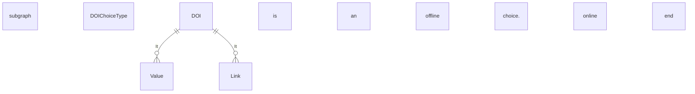

## 3.22 /CandidateProfile/PublicationHistory (level 2)

### 3.22.1 PublicationHistory Element Description

<table>
  <thead>
    <tr>
      <th>Element</th>
      <th>Description</th>
      <th>Cardinality</th>
      <th>Rule</th>
      <th>Examples</th>
    </tr>
  </thead>
  <tbody>
    <tr>
      <td>PublicationHistory</td>
      <td>A collection of information about one or more text publications by the Candidate</td>
      <td>0..1</td>
      <td>N/A</td>
      <td>N/A</td>
    </tr>
  </tbody>
</table>

**Sub-elements**

<table>
  <thead>
    <tr>
      <th>Element</th>
      <th>Description</th>
      <th>Cardinality</th>
      <th>Rule</th>
      <th>Examples</th>
    </tr>
  </thead>
  <tbody>
    <tr>
      <td>Publication</td>
      <td>A book, map, engraving, photograph, piece of music, or other work<br><br>See section
        /CandidateProfile/PublicationHistory/Publication for more information</td>
      <td>0..n</td>
      <td>N/A</td>
      <td>N/A</td>
    </tr>
  </tbody>
</table>

### 3.22.2 PublicationHistory Attributes

&lt;img&gt;Diagram showing PublicationHistoryType with attributes validFrom and validTo, and a note about HR-XML's 3.0
architecture making a distinction between effective-date meta data and effective dating that is an integral part of the
entity.&lt;/img&gt;

<table>
  <thead>
    <tr>
      <th>Attributes</th>
      <th>Description</th>
      <th>Card.</th>
      <th>Rule</th>
    </tr>
  </thead>
  <tbody>
    <tr>
      <td><strong>validFrom</strong></td>
      <td>Validity start date for this entity's information</td>
      <td>0..1</td>
      <td><strong>BR-COM-06:</strong> Compulsory Date Format is: YYYY-MM-DD, YYYY-MM, YYYY or YYYY-MM-DDThh:mm:ss.</td>
    </tr>
    <tr>
      <td><strong>validTo</strong></td>
      <td>Validity end date for this entity's information</td>
      <td>0..1</td>
      <td><strong>BR-COM-06:</strong> Compulsory Date Format is: YYYY-MM-DD, YYYY-MM, YYYY or YYYY-MM-DDThh:mm:ss.</td>
    </tr>
  </tbody>
</table>

**Publication attributes**

<table>
  <thead>
    <tr>
      <th>Attributes</th>
      <th>Description</th>
      <th>Card.</th>
      <th>Rule</th>
    </tr>
  </thead>
  <tbody>
    <tr>
      <td colspan="4">See section /CandidateProfile/PublicationHistory/Publication for more information</td>
    </tr>
  </tbody>
</table>


### 3.22.3 Sub-element: /CandidateProfile/PublicationHistory/Publication (level 3)

#### 3.22.3.1 Publication Element Description

```mermaid
graph TD
A[PublicationHistoryType] --> B[Attributes]
B --> C[PublicationType]
C --> D[eures:PublicationType (extension base)]
D --> E[hr:FormattedPublicationDescription]
E --> F[Title]
E --> G[Year]
E --> H[Reference]
E --> I[Link]
E --> J[DOI]

subgraph PublicationType
direction LR
D -- "ABIE Publication. Details A book, map, engraving, photograph, piece of music, or other work." --> E
E --> F
E --> G
E --> H
E --> I
E --> J
end

style A fill:#fff,stroke:#333,stroke-width:2px
style B fill:#fff,stroke:#333,stroke-width:2px
style C fill:#fff,stroke:#333,stroke-width:2px
style D fill:#fff,stroke:#333,stroke-width:2px
style E fill:#fff,stroke:#333,stroke-width:2px
style F fill:#fff,stroke:#333,stroke-width:2px
style G fill:#fff,stroke:#333,stroke-width:2px
style H fill:#fff,stroke:#333,stroke-width:2px
style I fill:#fff,stroke:#333,stroke-width:2px
style J fill:#fff,stroke:#333,stroke-width:2px
```

<table>
  <thead>
    <tr>
      <th>Element</th>
      <th>Description</th>
      <th>Cardinality</th>
      <th>Rule</th>
      <th>Examples</th>
    </tr>
  </thead>
  <tbody>
    <tr>
      <td><strong>Publication</strong></td>
      <td>A book, map, engraving, photograph, piece of music, or other work</td>
      <td>0..n</td>
      <td>N/A</td>
      <td>N/A</td>
    </tr>
    <tr>
      <td colspan="5"><strong>Sub-elements</strong></td>
    </tr>
    <tr>
      <td><strong>FormattedPublicationDescription</strong></td>
      <td>An unfiled or formatted description of a publication</td>
      <td>0..n</td>
      <td>N/A</td>
      <td>“Article about Machine Learning in the Weekend Magazine”</td>
    </tr>
    <tr>
      <td><strong>Title</strong></td>
      <td>Specifies Title of the publication.</td>
      <td>0..1</td>
      <td></td>
      <td></td>
    </tr>
    <tr>
      <td><strong>Year</strong></td>
      <td>Specifies the year of publication.</td>
      <td>0..1</td>
      <td></td>
      <td></td>
    </tr>
    <tr>
      <td><strong>Reference</strong></td>
      <td>Specifies reference used in the publication.</td>
      <td>0..1</td>
      <td></td>
      <td></td>
    </tr>
    <tr>
      <td><strong>Link</strong></td>
      <td>Specifies website link for the publication.</td>
      <td>0..n</td>
      <td></td>
      <td></td>
    </tr>
    <tr>
      <td><strong>DOI</strong></td>
      <td>A Digital Object Identifier (DOI), a unique alphanumeric string to permanently identify a
        publication.<br>Refer to section /CandidateProfile/PublicationHistory/Publication/DOIChoice for more information
      </td>
      <td>0..1</td>
      <td></td>
      <td></td>
    </tr>
  </tbody>
</table>

#### 3.22.3.2 Publication Attributes

<table>
  <thead>
    <tr>
      <th>Attributes</th>
      <th>Description</th>
      <th>Card.</th>
      <th>Rule</th>
    </tr>
  </thead>
  <tbody>
    <tr>
      <td>This element has no attributes.</td>
      <td></td>
      <td></td>
      <td></td>
    </tr>
    <tr>
      <td colspan="4"><strong>FormattedPublicationDescription attributes</strong></td>
    </tr>
  </tbody>
</table>




### 3.22.4 Sub-element: /CandidateProfile/PublicationHistory/Publication/DOIChoice

<table>
  <thead>
    <tr>
      <th>Element</th>
      <th>Description</th>
      <th>Cardinality</th>
      <th>Rule</th>
      <th>Examples</th>
    </tr>
  </thead>
  <tbody>
    <tr>
      <td>DOI Choice</td>
      <td>A Digital Object Identifier (DOI), a unique alphanumeric string to permanently identify a publication.</td>
      <td>0..1</td>
      <td>N/A</td>
      <td>N/A</td>
    </tr>
    <tr>
      <td colspan="5"><b>Sub-elements</b></td>
    </tr>
    <tr>
      <td colspan="5"><b>Choice 1</b></td>
    </tr>
    <tr>
      <td>Value</td>
      <td>Offline DOI: alphanumeric string to identify the publication offline ().</td>
      <td>1</td>
      <td>N/A</td>
      <td>"Article about Machine Learning in the Weekend Magazine"</td>
    </tr>
    <tr>
      <td colspan="5"><b>Choice 2</b></td>
    </tr>
    <tr>
      <td>Link</td>
      <td>Online DOI: Link to identify the publication online</td>
      <td>1</td>
      <td></td>
      <td>N/A</td>
    </tr>
  </tbody>
</table>


