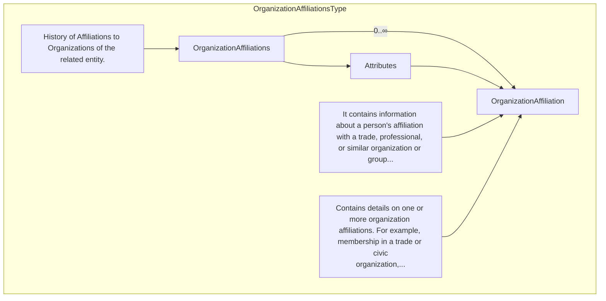
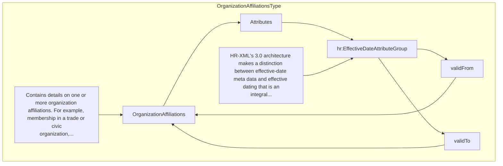
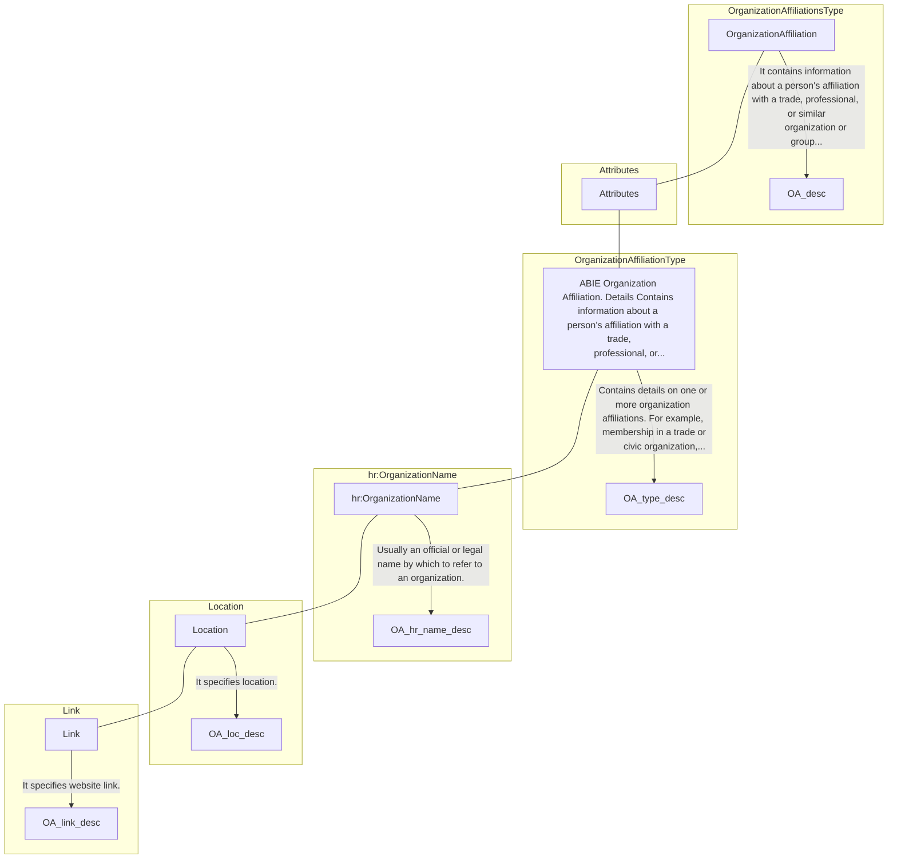

## 3.23 /CandidateProfile/OrganizationAffiliations (level 2)

### 3.23.1 OrganizationAffiliations Element Description

<table>
  <thead>
    <tr>
      <th>Element</th>
      <th>Description</th>
      <th>Cardinality</th>
      <th>Rule</th>
      <th>Examples</th>
    </tr>
  </thead>
  <tbody>
    <tr>
      <td><strong>OrganizationAffiliations</strong></td>
      <td>Contains details on one or more organization affiliations. For example, membership in a trade or civic
        organization, seat on an organization’s board of directors, membership in a union, etc.</td>
      <td>0..1</td>
      <td>N/A</td>
      <td>N/A</td>
    </tr>
  </tbody>
</table>

Sub-elements

<table>
  <thead>
    <tr>
      <th>OrganizationAffiliation</th>
      <th>Description</th>
      <th>Card.</th>
      <th>Rule</th>
      <th>Examples</th>
    </tr>
  </thead>
  <tbody>
    <tr>
      <td></td>
      <td>Contains information about a person's affiliation with a trade, professional, or similar organization or group
        formed around a common purpose or cause See section
        /CandidateProfile/OrganizationAffiliations/OrganizationAffiliation for more information</td>
      <td>0..n</td>
      <td>N/A</td>
      <td>N/A</td>
    </tr>
  </tbody>
</table>

### 3.23.2 OrganizationAffiliations Attributes

<table>
  <thead>
    <tr>
      <th>Attributes</th>
      <th>Description</th>
      <th>Card.</th>
      <th>Rule</th>
    </tr>
  </thead>
  <tbody>
    <tr>
      <td><strong>validFrom</strong></td>
      <td>Validity start date for this entity's information</td>
      <td>0..1</td>
      <td>BR-COM-06: Compulsory Date Format is: YYYY-MM-DD, YYYY-MM, YYYY or YYYY-MM-DDThh:mm:ss.</td>
    </tr>
    <tr>
      <td><strong>validTo</strong></td>
      <td>Validity end date for this entity's information</td>
      <td>0..1</td>
      <td>BR-COM-06: Compulsory Date Format is: YYYY-MM-DD, YYYY-MM, YYYY or YYYY-MM-DDThh:mm:ss.</td>
    </tr>
  </tbody>
</table>

OrganizationAffiliations attributes

<table>
  <thead>
    <tr>
      <th>Attributes</th>
      <th>Description</th>
      <th>Card.</th>
      <th>Rule</th>
    </tr>
  </thead>
  <tbody>
    <tr>
      <td colspan="4"> more information</td>
  <td>See section /CandidateProfile/OrganizationAffiliations/OrganizationAffiliation for more information</td>
  <td></td>
  <td></td>
</tr>
</tbody>
</table>

### 3.23.3 Sub-element: /CandidateProfile/OrganizationAffiliations/OrganizationAffiliation (level 3)

#### 3.23.3.1 OrganizationAffiliation Element Description

        <table>
          <thead>
            <tr>
              <th>Element</th>
              <th>Description</th>
              <th>Cardinality</th>
              <th>Rule</th>
              <th>Examples</th>
            </tr>
          </thead>
          <tbody>
            <tr>
              <td><strong>OrganizationAffiliation</strong></td>
              <td>Contains information about a person's affiliation with a trade, professional, or similar organization
                or group formed around a common purpose or cause</td>
              <td>0..n</td>
              <td>N/A</td>
              <td>N/A</td>
            </tr>
          </tbody>
        </table>

        Sub-elements

        <table>
          <thead>
            <tr>
              <th></th>
              <th></th>
              <th></th>
              <th></th>
            </tr>
          </thead>
          <tbody>
            <tr>
              <td><strong>OrganizationName</strong></td>
              <td>Usually an official or legal name by which to refer to an organization</td>
              <td>0..1</td>
              <td>N/A</td>
              <td>"Name", etc.</td>
            </tr>
            <tr>
              <td><strong>Location</strong></td>
              <td>Location of the Organisation</td>
              <td>0..1</td>
              <td></td>
              <td>N/A</td>
            </tr>
            <tr>
              <td><strong>Link</strong></td>
              <td>Link to the organisation's related websites.</td>
              <td>0..n</td>
              <td></td>
              <td>N/A</td>
            </tr>
          </tbody>
        </table>

        3.23.3.2 OrganizationAffiliation Attributes

        <table>
          <thead>
            <tr>
              <th>Attributes</th>
              <th>Description</th>
              <th>Card.</th>
              <th>Rule</th>
            </tr>
          </thead>
          <tbody>
            <tr>
              <td colspan="4">This element has no attributes.</td>
            </tr>
          </tbody>
        </table>

        OrganizationName attributes

        <table>
          <thead>
            <tr>
              <th>Attributes</th>
              <th>Description</th>
              <th>Card.</th>
              <th>Rule</th>
            </tr>
          </thead>
          <tbody>
            <tr>
              <td><strong>validFrom</strong></td>
              <td>Validity start date for this entity's information</td>
              <td>0..1</td>
              <td>BR-COM-06: Compulsory Date Format is: YYYY-MM-DD, YYYY-MM, YYYY or YYYY-MM-DDThh:mm:ss.</td>
            </tr>
            <tr>
              <td><strong>validTo</strong></td>
              <td>Validity end date for this entity's information</td>
              <td>0..1</td>
              <td>BR-COM-06: Compulsory Date Format is: YYYY-MM-DD, YYYY-MM, YYYY or YYYY-MM-DDThh:mm:ss.</td>
            </tr>
            <tr>
              <td><strong>languageID</strong></td>
              <td>Identifier of the language used in the organisation name</td>
              <td>0..1</td>
              <td></td>
            </tr>
          </tbody>
        </table>

        Location attributes

        <table>
          <thead>
            <tr>
              <th>languageID</th>
              <th>Identifier of the language used in the location name</th>
              <th>0..1</th>
              <th></th>
            </tr>
          </thead>
          <tbody>
            <tr>
              <td></td>
              <td></td>
              <td></td>
              <td></td>
            </tr>
          </tbody>
        </table>

        Link attributes

        <table>
          <thead>
            <tr>
              <th></th>
              <th></th>
              <th></th>
              <th></th>
            </tr>
          </thead>
          <tbody>
            <tr>
              <td colspan="4">This element has no attributes.</td>
              <td></td>
              <td></td>
              <td></td>
            </tr>
          </tbody>
        </table>


