## 3.24 /CandidateProfile/SpeakingHistory (level 2)

### 3.24.1 SpeakingHistory Element Description

```mermaid
graph TD
subgraph "eures:SpeakingHistory"
direction LR
A(SpeakingHistoryType) --> B(Attributes)
B --> C(SpeakingEvent)
end
subgraph "It contains information about one or more events in which the person has spoken (as keynote speaker,
for example)."
direction LR
D(eures:SpeakingHistory) -- "0..∞" --> C
end
```

<table>
  <thead>
    <tr>
      <th>Element</th>
      <th>Description</th>
      <th>Cardinality</th>
      <th>Rule</th>
      <th>Examples</th>
    </tr>
  </thead>
  <tbody>
    <tr>
      <td><strong>SpeakingHistory</strong></td>
      <td>A collection of information about one or more speaking events (as keynotes, for example) given by the
        person</td>
      <td>0..1</td>
      <td>N/A</td>
      <td>N/A</td>
    </tr>
    <tr>
      <td colspan="5"><strong>Sub-elements</strong></td>
    </tr>
    <tr>
      <td><strong>SpeakingEvent</strong></td>
      <td>Contains a set of details about an event in which the person was a lecturer or presenter See
        section /CandidateProfile/SpeakingHistory/SpeakingEvent for more information</td>
      <td>0..n</td>
      <td>N/A</td>
      <td>N/A</td>
    </tr>
  </tbody>
</table>

### 3.24.2 SpeakingHistory Attributes

<table>
  <thead>
    <tr>
      <th>Attributes</th>
      <th>Description</th>
      <th>Card.</th>
      <th>Rule</th>
    </tr>
  </thead>
  <tbody>
    <tr>
      <td><strong>validFrom</strong></td>
      <td>Validity start date for this entity's information</td>
      <td>0..1</td>
      <td>BR-COM-06: Compulsory Date Format is: YYYY-MM-DD, YYYY-MM, YYYY or YYYY-MM-DDThh:mm:ss.</td>
    </tr>
    <tr>
      <td><strong>validTo</strong></td>
      <td>Validity end date for this entity's information</td>
      <td>0..1</td>
      <td>BR-COM-06: Compulsory Date Format is: YYYY-MM-DD, YYYY-MM, YYYY or YYYY-MM-DDThh:mm:ss.</td>
    </tr>
    <tr>
      <td colspan="4"><strong>SpeakingEvent attributes</strong></td>
    </tr>
    <tr>
      <td><strong>Attributes</strong></td>
      <td><strong>Description</strong></td>
      <td><strong>Card.</strong></td>
      <td><strong>Rule</strong></td>
    </tr>
    <tr>
      <td colspan="4">See section /CandidateProfile/SpeakingHistory/SpeakingEvent for more information</td>
    </tr>
  </tbody>
</table>

### 3.24.3 Sub-element: /CandidateProfile/SpeakingHistory/SpeakingEvent (level 3)

#### 3.24.3.1 SpeakingEvent Element Description

<table>
  <thead>
    <tr>
      <th>Element</th>
      <th>Description</th>
      <th>Cardinality</th>
      <th>Rule</th>
      <th>Examples</th>
    </tr>
  </thead>
  <tbody>
    <tr>
      <td><strong>SpeakingEvent</strong></td>
      <td>Contains a set of details about an event in which the associated person was a lecturer or presenter.
      </td>
      <td>0..n</td>
      <td>N/A</td>
      <td>N/A</td>
    </tr>
    <tr>
      <td colspan="5"><strong>Sub-elements</strong></td>
    </tr>
    <tr>
      <td><strong>EventName</strong></td>
      <td>The name of the speaking event</td>
      <td>1</td>
      <td>N/A</td>
      <td>N/A</td>
    </tr>
    <tr>
      <td><strong>Description</strong></td>
      <td>Description of the speaking event</td>
      <td>0..1</td>
      <td>N/A</td>
      <td>N/A</td>
    </tr>
  </tbody>
</table>

#### 3.24.3.2 SpeakingEvent Attributes

<table>
  <thead>
    <tr>
      <th>Attributes</th>
      <th>Description</th>
      <th>Card.</th>
      <th>Rule</th>
    </tr>
  </thead>
  <tbody>
    <tr>
      <td colspan="4">This element has no attributes.</td>
    </tr>
    <tr>
      <td colspan="4"><strong>Description attributes</strong></td>
    </tr>
    <tr>
      <td><strong>Attributes</strong></td>
      <td><strong>Description</strong></td>
      <td><strong>Card.</strong></td>
      <td><strong>Rule</strong></td>
    </tr>
    <tr>
      <td colspan="4">Refer to DescriptionType Attributes section for additional attributes.</td>
    </tr>
    <tr>
      <td colspan="4"><strong>EventName attributes</strong></td>
    </tr>
    <tr>
      <td><strong>Attributes</strong></td>
      <td><strong>Description</strong></td>
      <td><strong>Card.</strong></td>
      <td><strong>Rule</strong></td>
    </tr>
    <tr>
      <td>languageID</td>
      <td>Identifier of the language used in the code name</td>
      <td>0..1</td>
      <td></td>
    </tr>
  </tbody>
</table>

