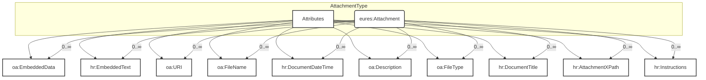

## 3.25 /CandidateProfile/Attachment (level 2)

### 3.25.1 Attachment Element Description

<table>
  <thead>
    <tr>
      <th>Element</th>
      <th>Description</th>
      <th>Cardinality</th>
      <th>Rule</th>
      <th>Examples</th>
    </tr>
  </thead>
  <tbody>
    <tr>
      <td><strong>Attachment</strong></td>
      <td>Allows for embedding or referencing external documents or digital objects</td>
      <td>0..n</td>
      <td>BR-COM-42: An Attachment shall not embed and simultaneously refer to an URI that contains the same
        document. External references to documents, using the URI element, are the recommended method (when
        possible) for attaching documents.</td>
      <td>N/A</td>
    </tr>
    <tr>
      <td colspan="5"><strong>Sub-elements</strong></td>
    </tr>
    <tr>
      <td><strong>EmbeddedData</strong></td>
      <td>Allows the data to be embedded directly into the BOD instance</td>
      <td>0..1</td>
      <td>N/A</td>
      <td>-</td>
    </tr>
    <tr>
      <td><strong>EmbeddedText</strong></td>
      <td>Embedded text</td>
      <td>0..1</td>
      <td>N/A</td>
      <td>"Embedded text"</td>
    </tr>
    <tr>
      <td><strong>URI</strong></td>
      <td>Represents a Uniform Resource Identifier Reference (URI). An URI value can be absolute or relative,
        and may have an optional</td>
      <td>0..1</td>
      <td>N/A</td>
      <td>"http://uri.org", etc.</td>
    </tr>
  </tbody>
</table>

<table>
  <thead>
    <tr>
      <td></td>
      <td></td>
      <td></td>
      <td></td>
      <td></td>
    </tr>
  </thead>
  <tbody>
    <tr>
      <td>fragment identifier (i.e., it may be a URI Reference). This type should be used to specify the
        intention that the value fulfils the role of a URI, as defined by [RFC 2396] and as amended by [RFC
        2732].</td>
      <td></td>
      <td></td>
      <td></td>
      <td></td>
    </tr>
    <tr>
      <td><b>FileName</b></td>
      <td>Indicates the name of the File being referenced</td>
      <td>0..1</td>
      <td>N/A</td>
      <td>"File Name"</td>
    </tr>
    <tr>
      <td><b>DocumentDateTime</b></td>
      <td>The date and/or time associated with the current or referenced version of a document</td>
      <td>0..1</td>
      <td>N/A</td>
      <td>"2012/12/23", etc.</td>
    </tr>
    <tr>
      <td><b>Description</b></td>
      <td>Description of the attachment</td>
      <td>0..1</td>
      <td>N/A</td>
      <td>"Description of the attachment"</td>
    </tr>
    <tr>
      <td><b>FileType</b></td>
      <td>Identifies the type of the file type of the attachment</td>
      <td>1</td>
      <td>BR-COM-35: Compulsory use of the "EURES_FileTypeCode-CodeList.gc" list defined by EURES.</td>
      <td>"PDF", "DOC", etc. Full code list: "HR-Open/EURES: FileTypeCode [CL17]"</td>
    </tr>
    <tr>
      <td><b>DocumentTitle</b></td>
      <td>The name of the associated document</td>
      <td>0..1</td>
      <td>N/A</td>
      <td>"Photo", "Europass CV", etc.</td>
    </tr>
    <tr>
      <td><b>AttachmentPath</b></td>
      <td>Path to the external documents attached</td>
      <td>0..n</td>
      <td>N/A</td>
      <td>"/Candidate/CandidatePerson", etc.</td>
    </tr>
    <tr>
      <td><b>Instructions</b></td>
      <td>Identifies the type of attachment uploaded</td>
      <td>1</td>
      <td>BR-CV-29: Compulsory use of the "EURES_AttachmentInstructionCVCode" list defined by EURES.</td>
      <td>"CV", "ProfilePicture", "Other", etc. Full code list: "HR-Open/EURES: AttachmentInstructionCVCode
        [CL61]"</td>
    </tr>
  </tbody>
</table>

### 3.25.2 Attachment Attributes

&lt;img&gt;Diagram showing AttachmentType with attributes validFrom, validTo, eures:Attachment, and a note about
effective-date meta data and effective dating.&lt;/img&gt;

<table>
  <thead>
    <tr>
      <th>Attributes</th>
      <th>Description</th>
      <th>Card.</th>
      <th>Rule</th>
    </tr>
  </thead>
  <tbody>
    <tr>
      <td>validFrom</td>
      <td>Validity start date for this entity's information</td>
      <td>0..1</td>
      <td>BR-COM-06: Compulsory Date Format is: YYYY-MM-DD, YYYY-MM, YYYY or YYYY-MM-DDThh:mm:ss.</td>
    </tr>
    <tr>
      <td>validTo</td>
      <td>Validity end date for this entity's information</td>
      <td>0..1</td>
      <td>BR-COM-06: Compulsory Date Format is: YYYY-MM-DD, YYYY-MM, YYYY or YYYY-MM-DDThh:mm:ss.</td>
    </tr>
  </tbody>
</table>

### 3.25.3 EmbeddedData attributes

<table>
  <thead>
    <tr>
      <th>Attributes</th>
      <th>Description</th>
      <th>Card.</th>
      <th>Rule</th>
    </tr>
  </thead>
  <tbody>
    <tr>
      <td>mimeCode</td>
      <td>Codes that specify the data MIME code.</td>
      <td>1</td>
      <td>BR-COM-50: Compulsory use of Mime Codes [CL56]. HR-Open/EURES: MimeCodes [CL56]</td>
    </tr>
    <tr>
      <td>encodingCode</td>
      <td>The data encoding type</td>
      <td>1</td>
      <td>BR-COM-51: Only ‘base64Binary’ is allowed. If not present it is considered as encoded in base64Binary.
      </td>
    </tr>
    <tr>
      <td>uri</td>
      <td>The URI of the file.</td>
      <td>0..1</td>
      <td>N/A</td>
    </tr>
    <tr>
      <td>filename</td>
      <td>The name of the file.</td>
      <td>0..1</td>
      <td>N/A</td>
    </tr>
    <tr>
      <td>format</td>
      <td>The format of the binary content</td>
      <td>0..1</td>
      <td></td>
    </tr>
    <tr>
      <td>characterSetCode</td>
      <td>The character set of the binary object if the mime type is text</td>
      <td>0..1</td>
      <td></td>
    </tr>
  </tbody>
</table>

### URI attributes

<table>
  <thead>
    <tr>
      <th>Attributes</th>
      <th>Description</th>
      <th>Card.</th>
      <th>Rule</th>
    </tr>
  </thead>
  <tbody>
    <tr>
      <td colspan="4">This sub-element has no attributes.</td>
    </tr>
  </tbody>
</table>

### FileName attributes

<table>
  <thead>
    <tr>
      <th>Attributes</th>
      <th>Description</th>
      <th>Card.</th>
      <th>Rule</th>
    </tr>
  </thead>
  <tbody>
    <tr>
      <td colspan="4">Refer to NameType Attributes section for additional attributes</td>
    </tr>
  </tbody>
</table>

### DocumentDateTime attributes

<table>
  <thead>
    <tr>
      <th>Attributes</th>
      <th>Description</th>
      <th>Card.</th>
      <th>Rule</th>
    </tr>
  </thead>
  <tbody>
    <tr>
      <td colspan="4">This sub-element has no attributes.</td>
    </tr>
  </tbody>
</table>

### Description attributes

<table>
  <thead>
    <tr>
      <th>Attributes</th>
      <th>Description</th>
      <th>Card.</th>
      <th>Rule</th>
    </tr>
  </thead>
  <tbody>
    <tr>
      <td colspan="4">Refer to DescriptionType Attributes section for additional attributes</td>
    </tr>
  </tbody>
</table>

### FileType attributes

<table>
  <thead>
    <tr>
      <th>Attributes</th>
      <th>Description</th>
      <th>Card.</th>
      <th>Rule</th>
    </tr>
  </thead>
  <tbody>
    <tr>
      <td colspan="4">Refer to CodeType Attributes section for additional attributes</td>
    </tr>
  </tbody>
</table>

### Instructions attributes

<table>
  <thead>
    <tr>
      <th>Attributes</th>
      <th>Description</th>
      <th>Card.</th>
      <th>Rule</th>
    </tr>
  </thead>
  <tbody>
    <tr>
      <td colspan="4">Refer to DescriptionType Attributes section for additional attributes</td>
    </tr>
  </tbody>
</table>

