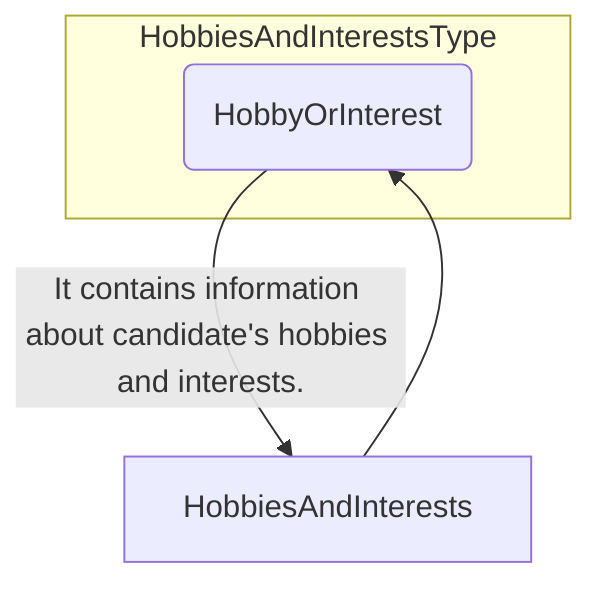
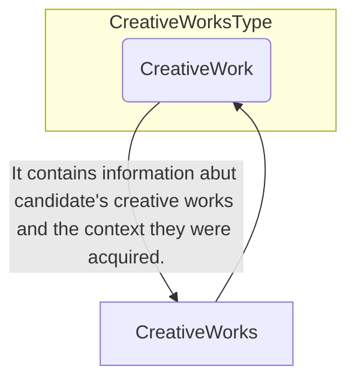

## 3.26 /CandidateProfile/HobbiesAndInterests

### 3.26.1 HobbiesAndInterests Element Description

<table>
  <thead>
    <tr>
      <th>Element</th>
      <th>Description</th>
      <th>Cardinality</th>
      <th>Rule</th>
      <th>Examples</th>
    </tr>
  </thead>
  <tbody>
    <tr>
      <td>HobbiesAndInterests</td>
      <td>Information about candidate's Hobbies & Interests</td>
      <td>0..1</td>
      <td>N/A</td>
      <td>N/A</td>
    </tr>
    <tr>
      <td colspan="5"><b>Sub-elements</b></td>
    </tr>
    <tr>
      <td>HobbyOrInterest</td>
      <td>Information about candidate's Hobbies & Interests</td>
      <td>0..n</td>
      <td>N/A</td>
      <td>N/A</td>
    </tr>
    <tr>
      <td></td>
      <td>Refer to ActivityType Elements for sub-elements</td>
      <td></td>
      <td></td>
      <td></td>
    </tr>
  </tbody>
</table>

### 3.26.2 HobbiesAndInterests Attributes

<table>
  <thead>
    <tr>
      <th>Attributes</th>
      <th>Description</th>
      <th>Card.</th>
      <th>Rule</th>
    </tr>
  </thead>
  <tbody>
    <tr>
      <td colspan="4">This element has no attributes.</td>
    </tr>
    <tr>
      <td colspan="4"><b>HobbyOrInterest attributes</b></td>
    </tr>
    <tr>
      <td>Attributes</td>
      <td>Description</td>
      <td>Card.</td>
      <td>Rule</td>
    </tr>
    <tr>
      <td colspan="4">Refer to ActivityType Attributes for attributes</td>
    </tr>
  </tbody>
</table>

### 3.27 /CandidateProfile/CreativeWorks

#### 3.27.1 CreativeWorks Element Description

<table>
  <thead>
    <tr>
      <th>Element</th>
      <th>Description</th>
      <th>Cardinality</th>
      <th>Rule</th>
      <th>Examples</th>
    </tr>
  </thead>
  <tbody>
    <tr>
      <td>CreativeWorks</td>
      <td>Information about candidate's creative works and the context they were acquired.</td>
      <td>0..1</td>
      <td>N/A</td>
      <td>N/A</td>
    </tr>
    <tr>
      <td colspan="5"><b>Sub-elements</b></td>
    </tr>
    <tr>
      <td>CreativeWork</td>
      <td>Information about candidate's creative works.</td>
      <td>0..n</td>
      <td>N/A</td>
      <td>N/A</td>
    </tr>
    <tr>
      <td></td>
      <td>Refer to ActivityType Elements for sub-elements</td>
      <td></td>
      <td></td>
      <td></td>
    </tr>
  </tbody>
</table>

### 3.27.2 CreativeWorks Attributes

<table>
  <thead>
    <tr>
      <th>Attributes</th>
      <th>Description</th>
      <th>Card.</th>
      <th>Rule</th>
    </tr>
  </thead>
  <tbody>
    <tr>
      <td colspan="4">This element has no attributes.</td>
    </tr>
    <tr>
      <td colspan="4"><b>CreativeWork attributes</b></td>
    </tr>
    <tr>
      <td>Attributes</td>
      <td>Description</td>
      <td>Card.</td>
      <td>Rule</td>
    </tr>
    <tr>
      <td colspan="4">Refer to ActivityType Attributes for attributes</td>
    </tr>
  </tbody>
</table>