## 3.30 /CandidateProfile/ManagementAndLeadershipSkills

### 3.30.1 ManagementAndLeadershipSkills Element Description

```mermaid
graph TD
subgraph "ManagementAndLeadershipSkillsType"
A[ManagementAndLeadershipSkills]
B[ManagementAndLeadershipSkill]
end
A -- 0..∞ --> B
style A fill:#f9f,stroke:#333,stroke-width:2px
style B fill:#f9f,stroke:#333,stroke-width:2px
```

It contains information about candidate's management and leadership skills and the context they were acquired.

<table>
  <thead>
    <tr>
      <th>Element</th>
      <th>Description</th>
      <th>Cardinality</th>
      <th>Rule</th>
      <th>Examples</th>
    </tr>
  </thead>
  <tbody>
    <tr>
      <td>ManagementAndLeadershipSkills</td>
      <td>Information about candidate's management/leadership skills and the context they were acquired</td>
      <td>0..1</td>
      <td>N/A</td>
      <td>N/A</td>
    </tr>
  </tbody>
</table>

Sub-elements

<table>
  <thead>
    <tr>
      <th>ManagementAndLeadershipSkill</th>
      <th>Description</th>
      <th>Card.</th>
      <th>Rule</th>
      <th>Examples</th>
    </tr>
  </thead>
  <tbody>
    <tr>
      <td></td>
      <td>Information about candidate's management/leadership skills. Refer to SkillsType Elements for
        sub-elements</td>
      <td>0..n</td>
      <td>N/A</td>
      <td>N/A</td>
    </tr>
  </tbody>
</table>

### 3.30.2 ManagementAndLeadershipSkills Attributes

<table>
  <thead>
    <tr>
      <th>Attributes</th>
      <th>Description</th>
      <th>Card.</th>
      <th>Rule</th>
    </tr>
  </thead>
  <tbody>
    <tr>
      <td colspan="4">This element has no attributes.</td>
    </tr>
  </tbody>
</table>

ManagementAndLeadershipSkill attributes

<table>
  <thead>
    <tr>
      <th>Attributes</th>
      <th>Description</th>
      <th>Card.</th>
      <th>Rule</th>
    </tr>
  </thead>
  <tbody>
    <tr>
      <td colspan="4">Refer to SkillsType Attributes for attributes</td>
    </tr>
  </tbody>
</table>

