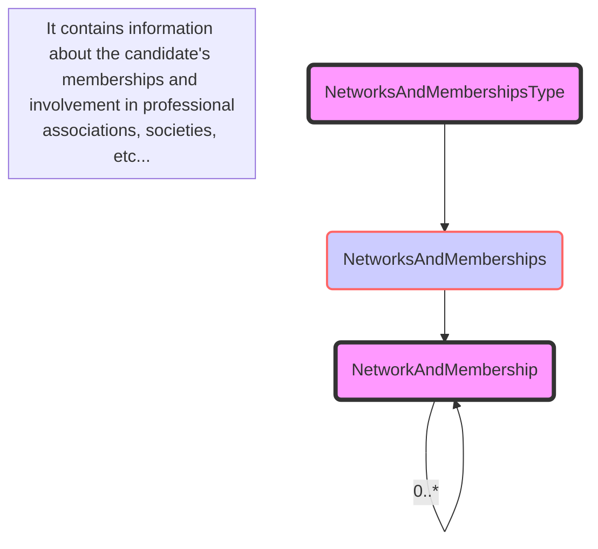

## 3.33 /CandidateProfile/NetworksAndMemberships

### 3.33.1 NetworksAndMemberships Element Description

<table>
  <thead>
    <tr>
      <th>Element</th>
      <th>Description</th>
      <th>Cardinality</th>
      <th>Rule</th>
      <th>Examples</th>
    </tr>
  </thead>
  <tbody>
    <tr>
      <td>NetworksAndMemberships</td>
      <td>Specify candidate’s memberships/involvement in professional associations, societies, political
        parties, sports clubs, etc.</td>
      <td>0..1</td>
      <td>N/A</td>
      <td>N/A</td>
    </tr>
  </tbody>
</table>

**Sub-elements**

<table>
  <thead>
    <tr>
      <th>Element</th>
      <th>Description</th>
      <th>Cardinality</th>
      <th>Rule</th>
      <th>Examples</th>
    </tr>
  </thead>
  <tbody>
    <tr>
      <td>NetworkAndMembership</td>
      <td>candidate’s memberships/involvement in professional associations, societies, political parties, sports
        clubs, etc.</td>
      <td>0..n</td>
      <td>N/A</td>
      <td>N/A</td>
    </tr>
  </tbody>
</table>

Refer to SocialAndNetworkingActivityType for more information about the sub-elements of sub-element
NetworkAndMembership.

### 3.33.2 NetworksAndMemberships Attributes

<table>
  <thead>
    <tr>
      <th>Attributes</th>
      <th>Description</th>
      <th>Card.</th>
      <th>Rule</th>
    </tr>
  </thead>
  <tbody>
    <tr>
      <td colspan="4">This element has no attributes.</td>
    </tr>
    <tr>
      <td colspan="4"><strong>NetworkAndMembership attributes</strong></td>
    </tr>
  </tbody>
</table>

<table>
  <thead>
    <tr>
      <th>Attributes</th>
      <th>Description</th>
      <th>Card.</th>
      <th>Rule</th>
    </tr>
  </thead>
  <tbody>
    <tr>
      <td colspan="4">Refer to SocialAndNetworkingActivityType for more information</td>
    </tr>
  </tbody>
</table>

