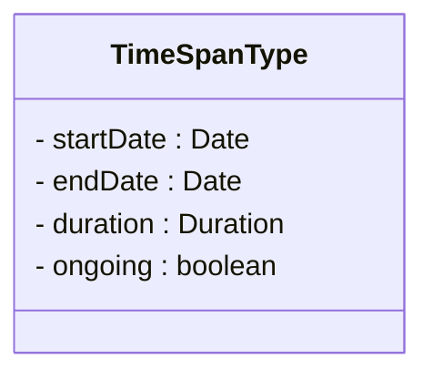
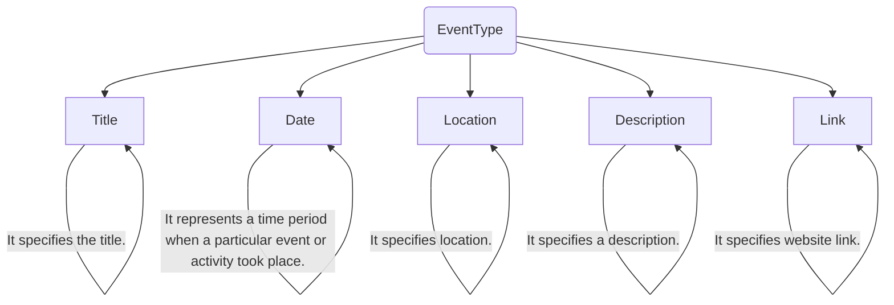
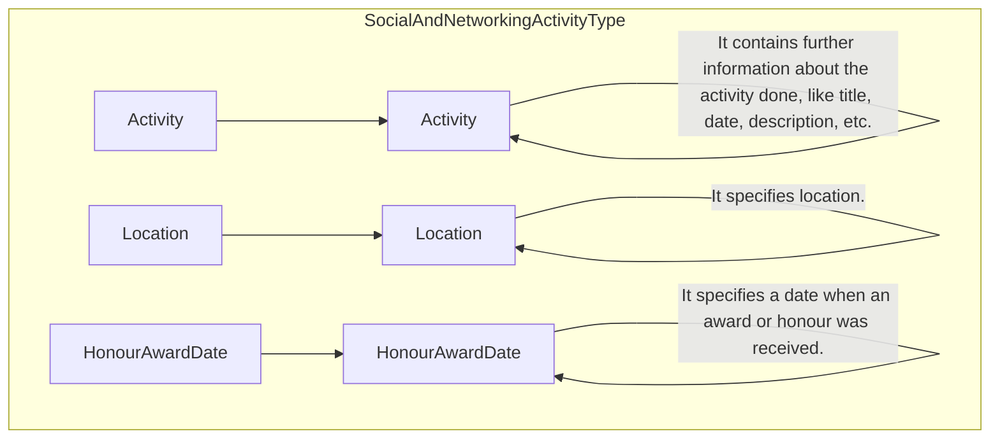

## 3.38 <span style="color:#8B4513;">Common DataType Elements with Attributes</span>

### 3.38.1 <span style="color:#8B4513;">ActivityType</span>

#### 3.38.1.1 <span style="color:#8B4513;">ActivityType Elements</span>

&lt;img&gt;Diagram showing ActivityType with Title, Date, Description, Link elements&lt;/img&gt;

<table>
  <thead>
    <tr>
      <th>Element</th>
      <th>Description</th>
      <th>Cardinality</th>
      <th>Rule</th>
      <th>Examples</th>
    </tr>
  </thead>
  <tbody>
    <tr>
      <td colspan="5"><strong>Sub-elements</strong></td>
    </tr>
    <tr>
      <td>Title</td>
      <td>Specifies title of the the activity.</td>
      <td>1</td>
      <td>N/A</td>
      <td>N/A</td>
    </tr>
    <tr>
      <td>Date</td>
      <td>Specifies a time period when an activity took place.</td>
      <td>0..n</td>
      <td>N/A</td>
      <td>N/A</td>
    </tr>
    <tr>
      <td>Description</td>
      <td>Specifies description of the activity.</td>
      <td>0..1</td>
      <td>N/A</td>
      <td>N/A</td>
    </tr>
    <tr>
      <td>Link</td>
      <td>Specifies URI link related to the activity.</td>
      <td>0..n</td>
      <td>N/A</td>
      <td>N/A</td>
    </tr>
  </tbody>
</table>

#### 3.38.1.2 <span style="color:#8B4513;">ActivityType Attributes</span>




### 3.38.2 TimeSpanType

#### 3.38.2.1 TimeSpanType Elements

**Sub-elements**

<table>
<thead>
<tr>
<th>Element</th>
<th>Description</th>
<th>Cardinality</th>
<th>Rule</th>
<th>Examples</th>
</tr>
</thead>
<tbody>
<tr>
<td><strong>StartDate</strong></td>
<td>Specifies the start date.</td>
<td>1</td>
<td>BR-COM-16: At least one of its sub-elements must be provided.</td>
<td>N/A</td>
</tr>
<tr>
<td><strong>EndDate</strong></td>
<td>Specifies the end date</td>
<td>0..1</td>
<td>BR-COM-16: At least one of its sub-elements must be provided</td>
<td>N/A</td>
</tr>
<tr>
<td><strong>Duration</strong></td>
<td>Specifies the duration</td>
<td>0..1</td>
<td>N/A</td>
<td>N/A</td>
</tr>
<tr>
<td><strong>Ongoing</strong></td>
<td>Specifies if the duration is ongoing</td>
<td>0..1</td>
<td>N/A</td>
<td>N/A</td>
</tr>
</tbody>
</table>

#### 3.38.2.2 TimeSpanType Attributes

**StartDate attributes**

Refer to /EducationOrganizationAttendance/EducationDegree/DegreeDate attributes.

**EndDate attributes**

Refer to /EducationOrganizationAttendance/EducationDegree/DegreeDate attributes.

**Duration attributes**

<table>
<thead>
<tr>
<th>Attributes</th>
<th>Description</th>
<th>Card.</th>
<th>Rule</th>
</tr>
</thead>
<tbody>
<tr>
<td>It has no attributes.</td>
<td></td>
<td></td>
<td></td>
</tr>
</tbody>
</table>

**Ongoing attributes**

<table>
<thead>
<tr>
<th>Attributes</th>
<th>Description</th>
<th>Card.</th>
<th>Rule</th>
</tr>
</thead>
<tbody>
<tr>
<td>It has no attributes.</td>
<td></td>
<td></td>
<td></td>
</tr>
</tbody>
</table>


### 3.38.3 SkillsType

#### 3.38.3.1 SkillsType Elements


```mermaid
graph TD
    A(SkillsType) --> B(TitleAndDescriptionType (extension base))
    B --> C[Title]
    B --> D[Description]
    B --> E[Link]
    C -- "It specifies the title." --> C
    D -- "It specifies a description." --> D
    E -- "It specifies website link." --> E
```

<table>
  <thead>
    <tr>
      <th>Element</th>
      <th>Description</th>
      <th>Cardinality</th>
      <th>Rule</th>
      <th>Examples</th>
    </tr>
  </thead>
  <tbody>
    <tr>
      <td colspan="5"><b>Sub-elements</b></td>
    </tr>
    <tr>
      <td>Title</td>
      <td>Specifies title of the activity.</td>
      <td>1</td>
      <td>N/A</td>
      <td>N/A</td>
    </tr>
    <tr>
      <td>Description</td>
      <td>Specifies description of the activity.</td>
      <td>0..1</td>
      <td>N/A</td>
      <td>N/A</td>
    </tr>
    <tr>
      <td>Link</td>
      <td>Specifies URI link related to the activity.</td>
      <td>0..n</td>
      <td>N/A</td>
      <td>N/A</td>
    </tr>
  </tbody>
</table>

#### 3.38.3.2 SkillsType Attributes

<table>
  <thead>
    <tr>
      <th colspan="4"><b>Title attributes</b></th>
    </tr>
    <tr>
      <th>Attributes</th>
      <th>Description</th>
      <th>Card.</th>
      <th>Rule</th>
    </tr>
  </thead>
  <tbody>
    <tr>
      <td>languageID</td>
      <td>Identifier of the language used in the title</td>
      <td>0..1</td>
      <td>N/A</td>
    </tr>
  </tbody>
</table>

<table>
  <thead>
    <tr>
      <th colspan="4"><b>Description attributes</b></th>
    </tr>
    <tr>
      <th>Attributes</th>
      <th>Description</th>
      <th>Card.</th>
      <th>Rule</th>
    </tr>
  </thead>
  <tbody>
    <tr>
      <td colspan="4">Refer to DescriptionType Attributes section for additional attributes.</td>
    </tr>
  </tbody>
</table>

<table>
  <thead>
    <tr>
      <th colspan="4"><b>Link attributes</b></th>
    </tr>
    <tr>
      <th>Attributes</th>
      <th>Description</th>
      <th>Card.</th>
      <th>Rule</th>
    </tr>
  </thead>
  <tbody>
    <tr>
      <td colspan="4">It has no attributes.</td>
    </tr>
  </tbody>
</table>

### 3.38.4 EventType

#### 3.38.4.1 EventType Elements



<table>
  <thead>
    <tr>
      <th>Element</th>
      <th>Description</th>
      <th>Cardinality</th>
      <th>Rule</th>
      <th>Examples</th>
    </tr>
  </thead>
  <tbody>
    <!-- No specific elements listed under EventType -->
  </tbody>
</table>


```mermaid
erDiagram
    Event {
        Title
        Date
        Description
        Location
        Link
    }
```

<table>
  <thead>
    <tr>
      <th colspan="5">Sub-elements</th>
    </tr>
  </thead>
  <tbody>
    <tr>
      <td>Title</td>
      <td>Specifies title of the event.</td>
      <td>1</td>
      <td>N/A</td>
      <td>N/A</td>
    </tr>
    <tr>
      <td>Date</td>
      <td>Specifies a time period when a particular event took place.</td>
      <td>0..1</td>
      <td>N/A</td>
      <td>N/A</td>
    </tr>
    <tr>
      <td>Description</td>
      <td>It specifies description of the event.</td>
      <td>0..1</td>
      <td>N/A</td>
      <td>N/A</td>
    </tr>
    <tr>
      <td>Location</td>
      <td>Specifies the location where the event took place</td>
      <td>0..1</td>
      <td>N/A</td>
      <td>N/A</td>
    </tr>
    <tr>
      <td>Link</td>
      <td>It specifies website link.</td>
      <td>0..n</td>
      <td>N/A</td>
      <td>N/A</td>
    </tr>
  </tbody>
</table>

#### 3.38.4.2 EventType Attributes

<table>
  <thead>
    <tr>
      <th colspan="4">Title attributes</th>
    </tr>
    <tr>
      <th>Attributes</th>
      <th>Description</th>
      <th>Card.</th>
      <th>Rule</th>
    </tr>
  </thead>
  <tbody>
    <tr>
      <td>languageID</td>
      <td>Identifier of the language used in title</td>
      <td>0..1</td>
      <td>N/A</td>
    </tr>
  </tbody>
</table>

Refer to TimeSpanType Attributes for additional information

<table>
  <thead>
    <tr>
      <th colspan="4">Date attributes</th>
    </tr>
    <tr>
      <th>Attributes</th>
      <th>Description</th>
      <th>Card.</th>
      <th>Rule</th>
    </tr>
  </thead>
  <tbody>
    <tr>
      <td></td>
      <td></td>
      <td></td>
      <td></td>
    </tr>
  </tbody>
</table>

Refer to DescriptionType Attributes section for additional attributes.

<table>
  <thead>
    <tr>
      <th colspan="4">Description attributes</th>
    </tr>
    <tr>
      <th>Attributes</th>
      <th>Description</th>
      <th>Card.</th>
      <th>Rule</th>
    </tr>
  </thead>
  <tbody>
    <tr>
      <td></td>
      <td></td>
      <td></td>
      <td></td>
    </tr>
  </tbody>
</table>

<table>
  <thead>
    <tr>
      <th colspan="4">Location attributes</th>
    </tr>
    <tr>
      <th>Attributes</th>
      <th>Description</th>
      <th>Card.</th>
      <th>Rule</th>
    </tr>
  </thead>
  <tbody>
    <tr>
      <td>languageID</td>
      <td>Identifier of the language used to specify location</td>
      <td>0..1</td>
      <td>N/A</td>
    </tr>
  </tbody>
</table>

<table>
  <thead>
    <tr>
      <th colspan="4">Link attributes</th>
    </tr>
    <tr>
      <th>Attributes</th>
      <th>Description</th>
      <th>Card.</th>
      <th>Rule</th>
    </tr>
  </thead>
  <tbody>
    <tr>
      <td></td>
      <td></td>
      <td></td>
      <td></td>
    </tr>
  </tbody>
</table>

It has no attributes.

### 3.38.5 SocialAndNetworkingActivityType

##### 3.36.5.1 SocialAndNetworkingActivityType Element Description



<table>
  <thead>
    <tr>
      <th>Element</th>
      <th>Description</th>
      <th>Cardinality</th>
      <th>Rule</th>
      <th>Examples</th>
    </tr>
  </thead>
  <tbody>
    <tr>
      <td colspan="5">Sub-elements</td>
    </tr>
    <tr>
      <td>Activity</td>
      <td>Specifies further information about the activity done, like title, date, description, etc.<br>Refer to ActivityType Elements for sub-elements</td>
      <td>0..1</td>
      <td>N/A</td>
      <td>N/A</td>
    </tr>
    <tr>
      <td>Location</td>
      <td>Specifies location where the activity took place.</td>
      <td>0..n</td>
      <td>N/A</td>
      <td>N/A</td>
    </tr>
    <tr>
      <td>HonourAwardDate</td>
      <td>Specifies a date when an award or honour was received for a selected activity.</td>
      <td>0..1</td>
      <td>BR-COM-16: At least one of its sub-elements</td>
      <td>N/A</td>
    </tr>
  </tbody>
</table>


must be provided.

#### 3.36.5.2 SocialAndNetworkingActivityType Attributes

<table>
<thead>
<tr>
<th>Attributes</th>
<th>Description</th>
<th>Card.</th>
<th>Rule</th>
</tr>
</thead>
<tbody>
<tr>
<td colspan="4"><strong>Activity attributes</strong></td>
</tr>
<tr>
<td colspan="4"><strong>Location attributes</strong></td>
</tr>
<tr>
<td>languageID</td>
<td>Identifier of the language used in the location description.</td>
<td>0..1</td>
<td></td>
</tr>
<tr>
<td colspan="4"><strong>HonourAwardDate attributes</strong></td>
</tr>
<tr>
<td colspan="4">The same as /CandidateProfile/EducationHistory/EducationOrganizationAttendance/EducationDegree/DegreeDate</td>
</tr>
</tbody>
</table>

### 3.38.6 OtherType

#### 3.38.6.1 OtherType Elements

```mermaid
graph TD
    A[OtherType] --> B[ActivityType (restriction base)]
    B --> C[Title]
    B --> D[Date]
    B --> E[Description]
    B --> F[Link]

    C -- "It specifies the title." --> C
    D -- "It represents a time period when a particular event or activity took place." --> D
    E -- "It specifies a description." --> E
    F -- "It specifies website link." --> F
```

<table>
<thead>
<tr>
<th>Element</th>
<th>Description</th>
<th>Cardinality</th>
<th>Rule</th>
<th>Examples</th>
</tr>
</thead>
<tbody>
<tr>
<td colspan="5"><strong>Sub-elements</strong></td>
</tr>
<tr>
<td><strong>Title</strong></td>
<td>Specifies title of the the activity.</td>
<td>1</td>
<td>N/A</td>
<td>N/A</td>
</tr>
<tr>
<td><strong>Date</strong></td>
<td>Specifies a time period when an activity took place.</td>
<td>0..1</td>
<td>N/A</td>
<td>N/A</td>
</tr>
<tr>
<td><strong>Description</strong></td>
<td>Specifies description of the activity.</td>
<td>0..1</td>
<td>N/A</td>
<td>N/A</td>
</tr>
<tr>
<td><strong>Link</strong></td>
<td>Specifies URI link related to the activity.</td>
<td>0..n</td>
<td>N/A</td>
<td>N/A</td>
</tr>
</tbody>
</table>

#### 3.38.6.2 OtherType Attributes

<table>
<thead>
<tr>
<th>Attributes</th>
<th>Description</th>
<th>Card.</th>
<th>Rule</th>
</tr>
</thead>
<tbody>
<tr>
<td colspan="4"><strong>Title attributes</strong></td>
</tr>
<tr>
<td>languageID</td>
<td>Identifier of the language used in the title</td>
<td>0..1</td>
<td>N/A</td>
</tr>
</tbody>
</table>

<table>
  <thead>
    <tr>
      <th colspan="5">Date attributes</th>
    </tr>
  </thead>
  <tbody>
    <tr>
      <td colspan="5">Refer to TimeSpanType Attributes for additional information</td>
    </tr>
  </tbody>
</table>

<table>
  <thead>
    <tr>
      <th colspan="5">Description attributes</th>
    </tr>
  </thead>
  <tbody>
    <tr>
      <th>Attributes</th>
      <th>Description</th>
      <th>Card.</th>
      <th colspan="2">Rule</th>
    </tr>
    <tr>
      <td colspan="5">Refer to DescriptionType Attributes section for additional attributes.</td>
    </tr>
  </tbody>
</table>

<table>
  <thead>
    <tr>
      <th colspan="5">Link attributes</th>
    </tr>
  </thead>
  <tbody>
    <tr>
      <th>Attributes</th>
      <th>Description</th>
      <th>Card.</th>
      <th colspan="2">Rule</th>
    </tr>
    <tr>
      <td colspan="5">It has no attributes.</td>
    </tr>
  </tbody>
</table>
